# 【グランドサークル】1日目　羽田 〜 Sedonaへ 
###### 2026年4月26日（日）晴れ

## 出発！羽田空港
13:15頃に羽田空港 第3ターミナル 出発ロビーC/D付近に集合だったけど、11:40頃に到着してしまう。  
菅野さんも到着しているみたいだよとスミーから連絡があったので、  
菅野さんに連絡して2階到着ロビーのタリーズコーヒーで落ち合い、お茶をする。  

2017年にスミーと田角さんと一緒に行ったSedonaの旅の話をしたり、会社の近況を話したり。  

13:15頃にスミーが到着。  
出発ロビーのC／D付近で合流。  
チェックインとセキュリティチェックを通過して出国。  

スミーは一人でルーチンのお蕎麦を食べにラウンジへ。  
菅野さんと私は、カフェでお昼のサンドをいただく。  
菅野さんはチキンサンド。  

サンフランシスコ行き UA876に搭乗。  
菅野さんと私は通路側の席。  
私の隣の外国人男性が、フライト中ずっとライトをつけて本をものすごい集中力で読みまくっていた。  

すぐに食事が来て、スミーの指導の通りにチキンを頼む。  
 

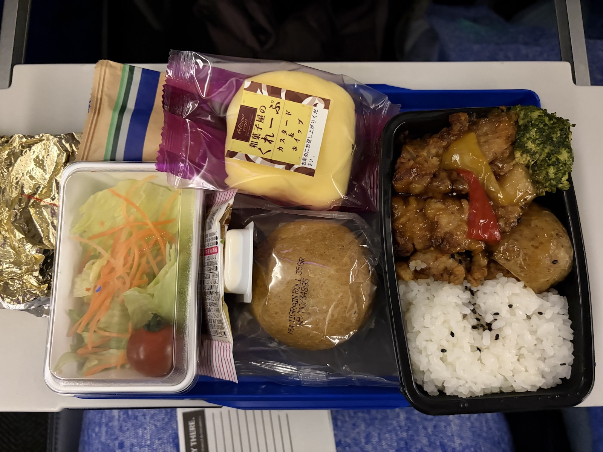
*飛行機の中・夕食のチキン*  
 

私の斜め前の席のカップルの態度があまりよろしくなく、  
ずっと笑ったり、前の壁に足をあげたりしててうるさかった。  

そして朝食。  
今度は鶏そぼろご飯・・・・  
結局ずっとチキン。  
 

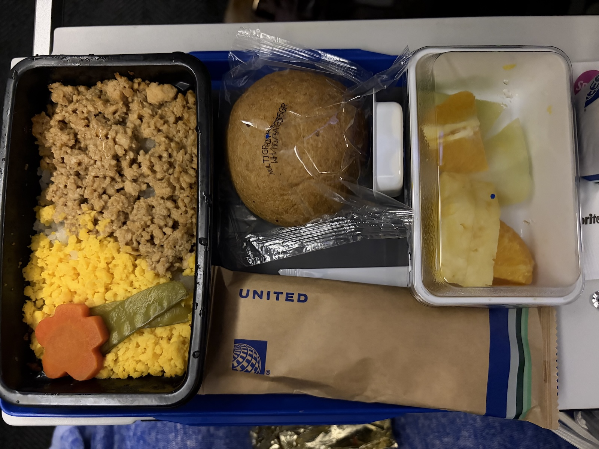
*飛行機の中・朝食の鶏そぼろご飯*  
 

飛行機の中が激寒の11時間のフライトだった。  
 
 
## サンフランシスコで乗り継ぎ
サンフランシスコ国際空港に到着。 

まずはアメリカへの入国審査。 
前に並んでいる人たちがかなり手こずっているので、若干心配。 
斜め前に座っていたうるさいカップルも、彼女の方に彼氏が呼ばれたりなんだりして時間がかかってる。 

スミーはするっと通過。 
私が入国審査している時に、スミーが近寄り過ぎて怒られる。 
菅野さんが一番時間がかかって、ものすごく入国審査官の態度が悪かったと話していた。 

国内線の出発ロビーへ移動。 
空港内で売っている水の値段が尋常じゃない！！と菅野さんと2人で驚く。 

フェニックス行き UA1147に搭乗。 
約1時間の飛行。 
 
 
## フェニックスに到着
フェニックス・スカイハーバー国際空港に到着。 
スカイトレインで終点のRental Car Stationへ。 
 

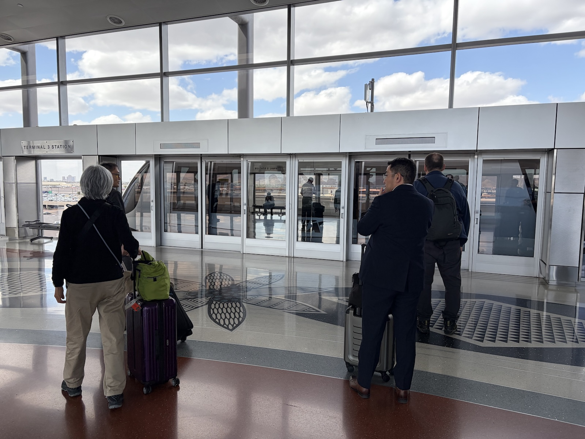
*Terminal 3 Station・ スカイトレインに乗り込むところ* 
 

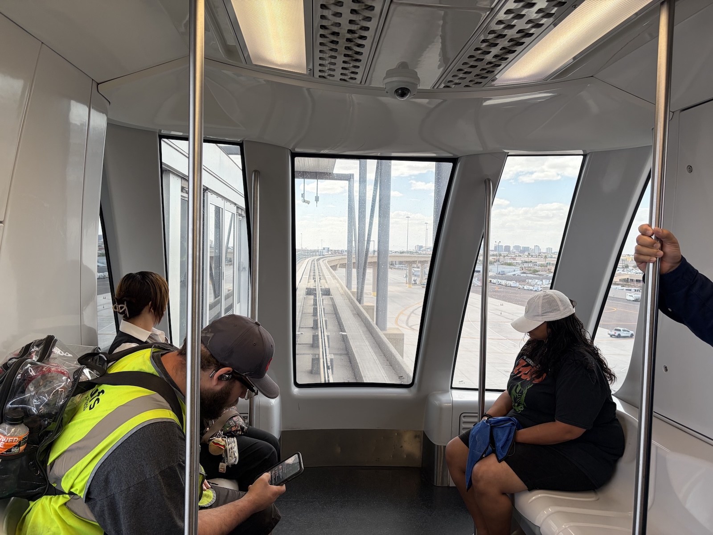
*スカイトレインの中・前方が見渡せる* 
 

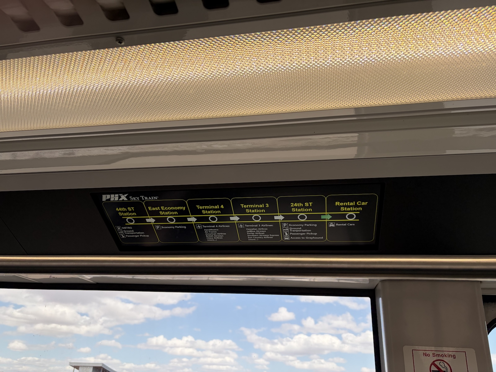
*スカイトレインの中・行き先表示板* 
 

Hertzのレンタカーセンターで、Buick Enclave　大型３列シート フルサイズ・プレミアムSUVをレンタル。 
 

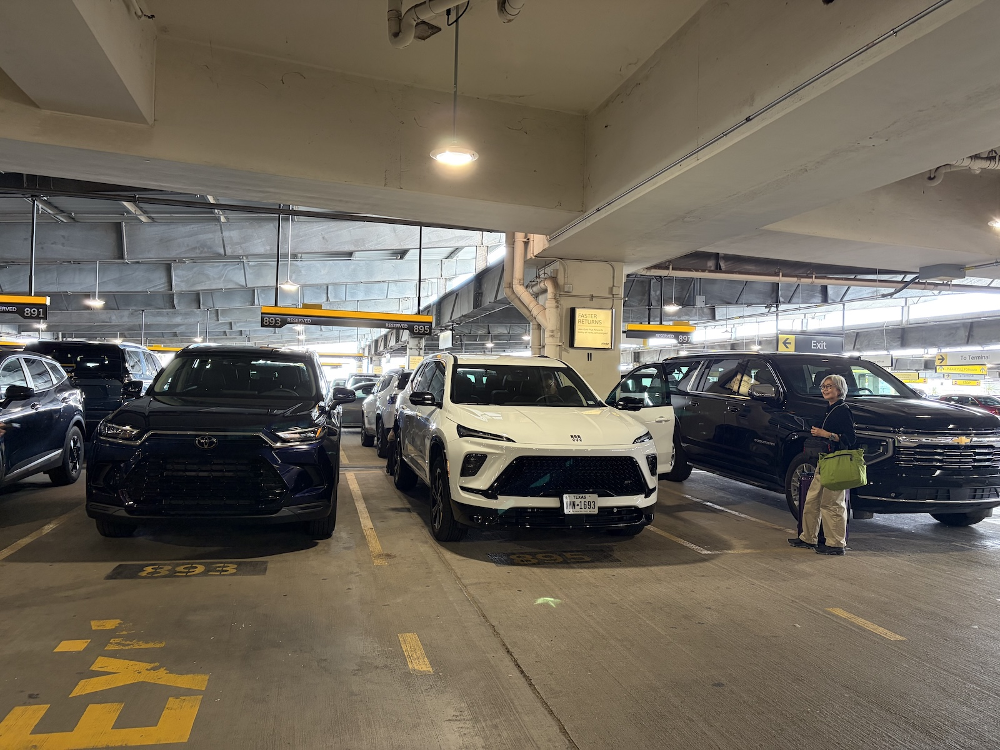
*Hertzのレンタカーセンター・これから10日間お世話になるBuick Enclave* 
 

荷物も多いので、少しゆったりめの贅沢な車を選択。 
荷物を後ろに積もうとして、３列目の座席を倒そうとしたけど、倒し方がわからずに3人で四苦八苦。 

どうにもわからなくてHertzの人を呼びに行って見てもらったら、あっけなくシートが倒れた。 

2人目のドライバー登録をしに行って、スミーと私の関係を聞かれる。 
どういうご関係？（笑） 
Friend！ 

担当してくれた人が優秀だったのか？意外と早めに登録が完了。 
いよいよ街へ！ 
 

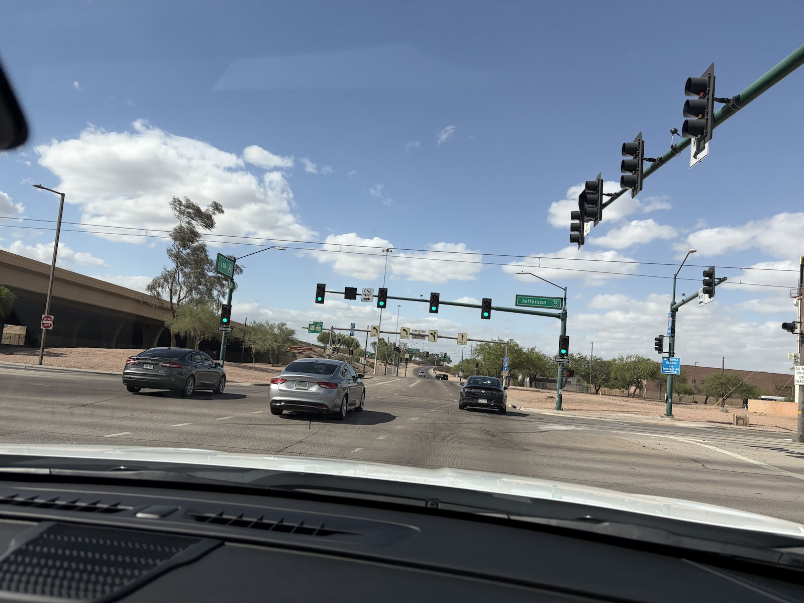
*Hertzのレンタカーセンターを出てフェニックスの街へ！* 
 
 
## 初めてのBuick Enclave
Buick Enclaveを走らせると、スミーが突然、運転席のシートがブルブル振動すると言い出す。 

なんで？なんで？となり、私のクロコちゃん（Claude）に聞いてみたら、 
中央線や右側の車線を越えそうになると警告として座席シートが振動すると教えてくれた。 
 

--- 

 

**📖 コラム｜Buick Enclaveってどんな車？**  

GMが製造するアメリカのプレミアムブランド 
「Buick（ビュイック）」の大型３列シート フルサイズ・プレミアムSUV。 

全長約5m超のゆったりしたボディに7〜8人乗りの3列シートを備え、 
アメリカ的な「大家族でゆったり」というニーズに応える。 

Buickはゼネラルモーターズのなかでキャデラックに次ぐプレミアム位置づけで、 
Enclaveも静粛性と上質な内装を重視している。 
本革シート、パノラマサンルーフ、先進の運転支援システムなどが充実。 

V6ガソリンエンジンが主力で、燃費よりも滑らかな走りと余裕の動力性能を優先した設計。 

日本市場では正規販売されていないため、見かける機会はほとんどない。 

 

--- 
 

運転席のシートの振動警告機能もその先進装備の一つらしい。 
 
 
## アズビルノースアメリカを見に行く
せっかく近くまで来たからと、アズビルノースアメリカのオフィスを見に行く。 
日曜日で休日だったため、誰もいない。 
 

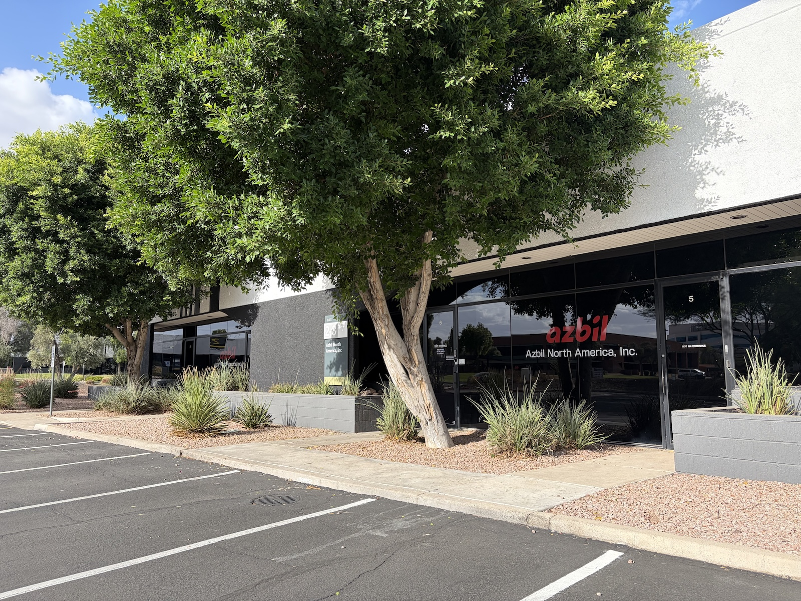
*フェニックス・アズビルノースアメリカ外観* 
 

<iframe src="https://www.google.com/maps/embed?pb=!4v1781442097627!6m8!1m7!1s4PYNA3j65soP3jnRYgltyA!2m2!1d33.56898981712865!2d-112.1099529218533!3f88.56941708954807!4f-3.5322178043643646!5f0.7820865974627469" width="100%" height="450" style="border:0;" allowfullscreen="" loading="lazy" referrerpolicy="no-referrer-when-downgrade"></iframe>
 
 

## まずはスミーのお目当てのHariboを探しにWalmartへ
いつもアズビルノースアメリカへ来た時に買いに行くという、 
スミーの大好物　Hariboサワー味 ファミリーパックを探しにWalmartへ。 

小さいサイズはあったけど、ファミリーパックは見つからず。 

小さいクーラーボックスを買う。 
お土産も物色。 
旅行前からお土産に買おうと思っていたナッツを買う。 

Walmartの建物を出たら、駐車場の向こう側に小さい遊園地がある。 
やっぱりアメリカはスケールが違う。 
 

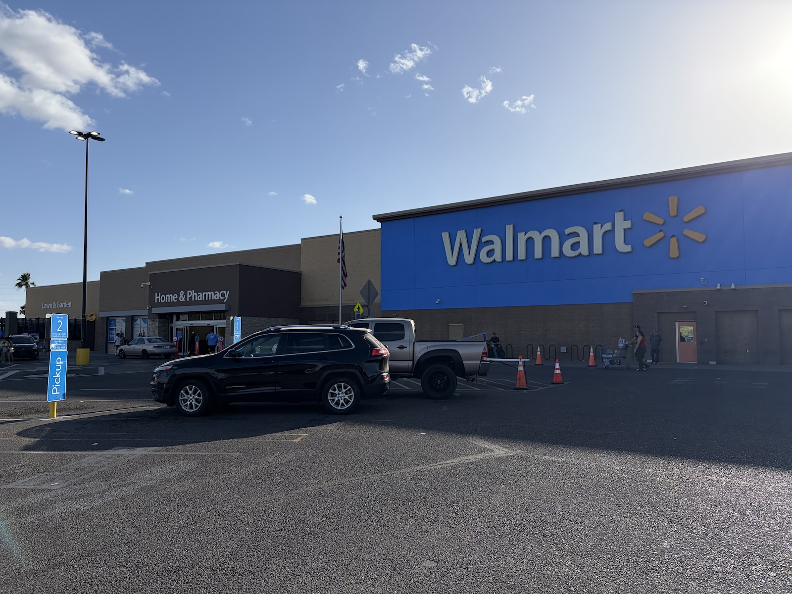
*Walmart・さすがアメリカサイズの巨大スーパー* 
 

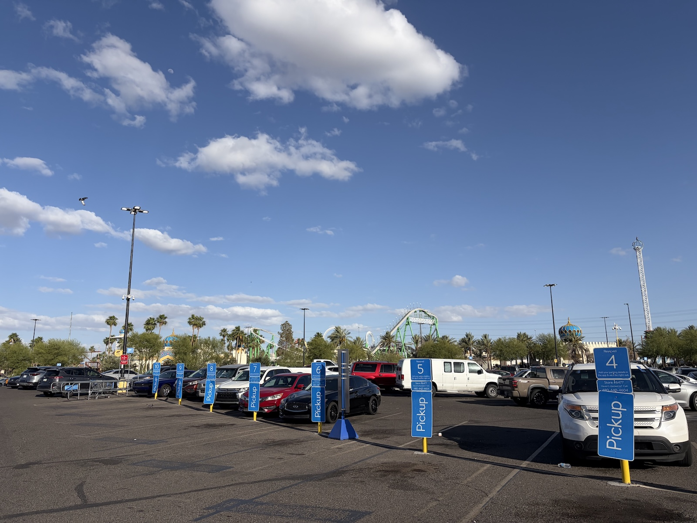
*Walmart・駐車場の向こうにジェットコースターが見える* 
 

<iframe src="https://www.google.com/maps/embed?pb=!4v1781442324969!6m8!1m7!1sYZ7hcYr7umii16kGAf2BtQ!2m2!1d33.57286131841744!2d-112.1210113480229!3f90.15546104554957!4f0.9902659956057818!5f0.7820865974627469" width="100%" height="450" style="border:0;" allowfullscreen="" loading="lazy" referrerpolicy="no-referrer-when-downgrade"></iframe>
 
 

## National Park Passを買いにREIへ
次に向かったのが、アウトドア用品のブランドREIのお店。 
National Park Passを買いに行ったが売り切れていた。 

REIって日本にもあったよね？最近見ないけど？という話になり、 
クロコちゃんに聞いてみたら、南町田グランベリーパークにもREIがあったけど、 
今は日本から撤退したそう。 
 

<iframe src="https://www.google.com/maps/embed?pb=!4v1781443567766!6m8!1m7!1svlxM4NjevPwsWOZpvHTZSA!2m2!1d33.60178729443522!2d-111.9891430922273!3f356.92926!4f0!5f0.7820865974627469" width="100%" height="450" style="border:0;" allowfullscreen="" loading="lazy" referrerpolicy="no-referrer-when-downgrade"></iframe>
 
 

## まずはサボテンを見に行こう！
フェニックスからすぐ近くのサボテンの丘へ。 
サボテンと聞くと必ずIMDをやっていた松田さんが、 
サボテンの花粉症だったことを思い出す。 
サボテンの花で花粉症になんてなるの？と思っていた。 
アメリカから帰ってくるといつもサボテンの花の話をしていた。 
 

<iframe src="https://www.google.com/maps/embed?pb=!4v1781443386331!6m8!1m7!1sCAoSFkNJSE0wb2dLRUlDQWdJREMxT0xSR1E.!2m2!1d33.74117281323092!2d-112.0971527236591!3f152.2983599360307!4f0.8057220485380299!5f0.7820865974627469" width="100%" height="450" style="border:0;" allowfullscreen="" loading="lazy" referrerpolicy="no-referrer-when-downgrade"></iframe>
 
 
Desert Vista Trailheadから丘をゆっくり登っていく。 
 

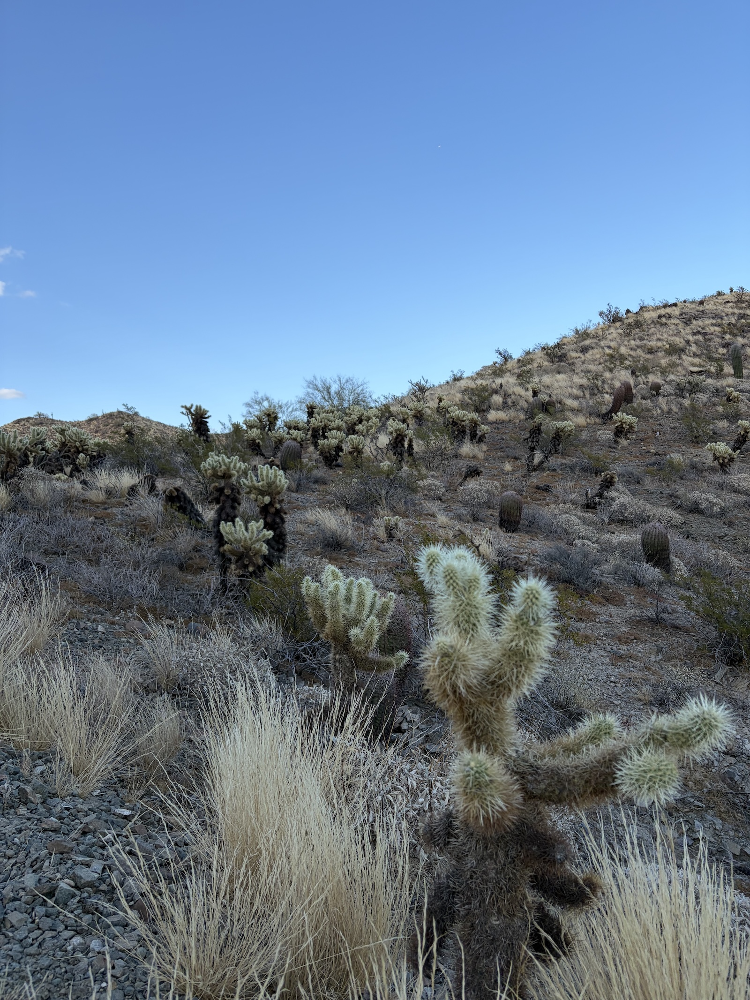
*Desert Vista Trail・大きいサボテンも小さいサボテンもある* 
 

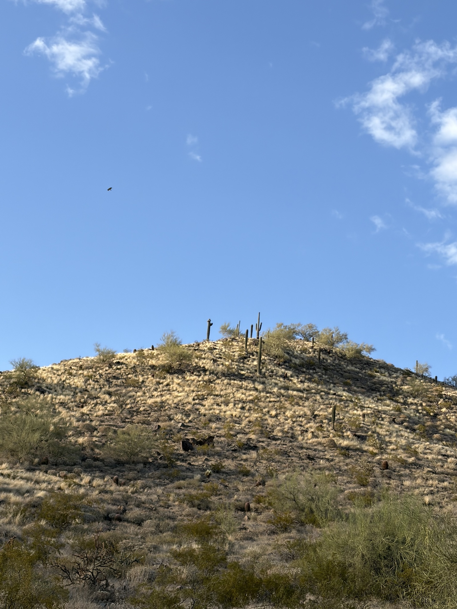
*Desert Vista Trail・サボテンの丘の上を飛ぶコンドル* 
 

<iframe src="https://www.google.com/maps/embed?pb=!1m18!1m12!1m3!1d683.2477128134084!2d-112.09252378414375!3d33.7457741236296!2m3!1f0!2f0!3f0!3m2!1i1024!2i768!4f13.1!3m3!1m2!1s0x872b65003faeb883%3A0x8ff1cd49cbf2d6bd!2sthe%20Super%20Cute%20Cactus!5e0!3m2!1sja!2sjp!4v1781442844095!5m2!1sja!2sjp" width="100%" height="450" style="border:0;" allowfullscreen="" loading="lazy" referrerpolicy="no-referrer-when-downgrade"></iframe>
 
 
丘の向こうを見渡せるところで、夕日を見る。 
 

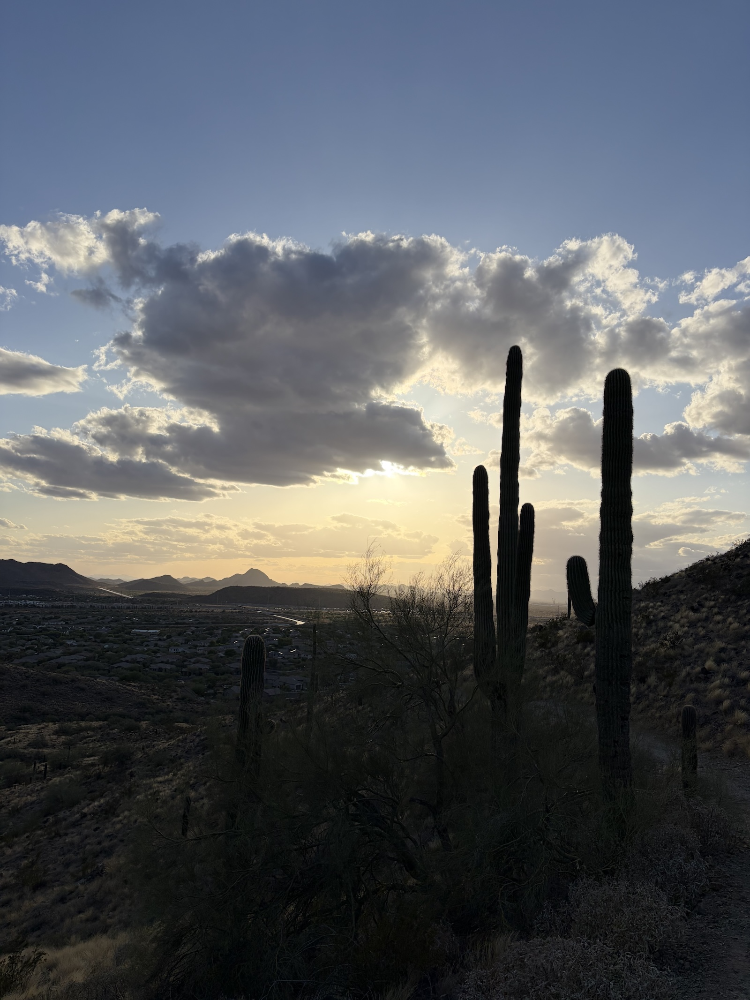
*Desert Vista Trail・サボテンの丘から見る夕日* 
 

帰りの道でトカゲが踏まれてぺっちゃんこに干からびているのを見つけた。 

アメリカの公園の駐車場は、出口専用レーンには逆走防止のスパイクがあって、 
入ろうとするとパンクする。 
駐車場から出る分には釘が逆目になるので大丈夫。 
 
 
## 一路Sedonaへ
I-17（アリゾナ州の州間高速道路）でSedonaへ向かう。 
すっかり日が落ちて、あたりは真っ暗。 

テールランプが消えたまま走っている車がいて、その車に気を取られ、 
降りるはずのインターチェンジで降りるのを忘れて通り過ぎてしまう。 
一つ先のインターチェンジでHwyを降りる。 

道を間違えたので山道走行。 
途中で右折してSouth Page Springs Roadに入る。 
 
 
## Robbers Roost Sports Grill (1160 S Page Springs Road)
South Page Springs Roadに入ったところの右側に 
夕食が食べられそうなお店があったので寄ってみる。 
 

<iframe src="https://www.google.com/maps/embed?pb=!4v1781443278212!6m8!1m7!1s_YhDmK9fMe3VfPEZ-MN_0A!2m2!1d34.7183280121865!2d-111.9036332633698!3f266.32173167095243!4f0.6764236593013777!5f0.7820865974627469" width="100%" height="450" style="border:0;" allowfullscreen="" loading="lazy" referrerpolicy="no-referrer-when-downgrade"></iframe>
 
 
駐車場で隣に停めていた車の中に犬が数匹いて、ものすごい吠えられてびっくりした。 
 

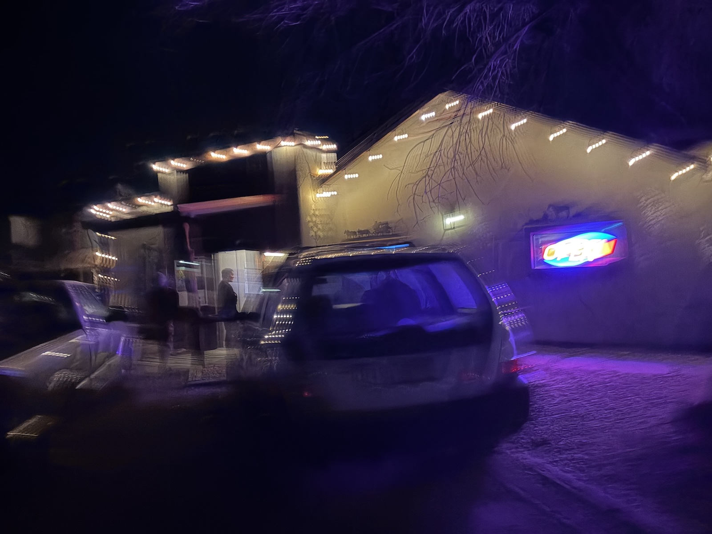
*Robbers Roost Sports Grill ・ブレちゃったけどお店の外観* 
 

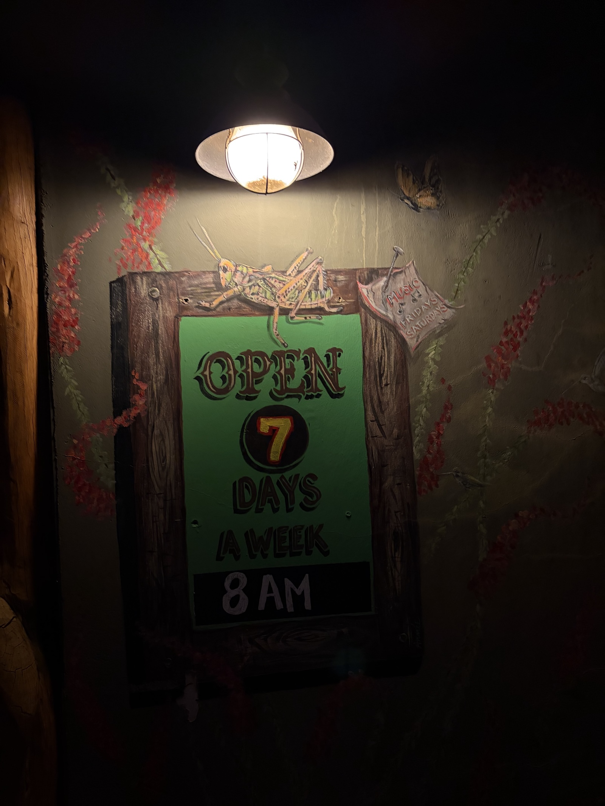
*Robbers Roost Sports Grill ・お店の看板* 
 

地元民に愛される高評価のお店でファミリー経営のスポーツバー＆レストランらしい。 
ところがこの日はBar営業のみで食事はできず、また犬に吠えられてお店を出る。 
 
 
## Sedonaに到着
Greentree Inn Sedonaにチェックイン。 

Sedonaで夕食が食べられそうなお店を探したけど、時間が遅くて見つからず。 
前回来た時に行ったお店「Family Restaurant」をかなり探したけど見つからず。 
さすがに9年も経っているとお店は無くなってるよね・・・・ 

仕方ないので夕食を買いにSAFEWAYへ。 
 

<iframe src="https://www.google.com/maps/embed?pb=!4v1781443058390!6m8!1m7!1sDV8NV9pSjg7Tmi07ldMKEQ!2m2!1d34.86445111807659!2d-111.8006107783685!3f66.07345698232392!4f0.163147730149106!5f0.7820865974627469" width="100%" height="450" style="border:0;" allowfullscreen="" loading="lazy" referrerpolicy="no-referrer-when-downgrade"></iframe>
 
 
サラダ、チキン、プチトマト、キウイ、ビール、オレンジジュースを購入して、ホテルで部屋飲み。 
 

*Greentree Inn Sedona ・結構満足のSAFEWAY部屋食* 
 

SAFEWAYのチキンもサラダも意外とおいしくて、それなりに満足。 
 
 
## 今夜の宿・Greentree Inn Sedona 
この日は3人とも別々の2階のお部屋。 
 

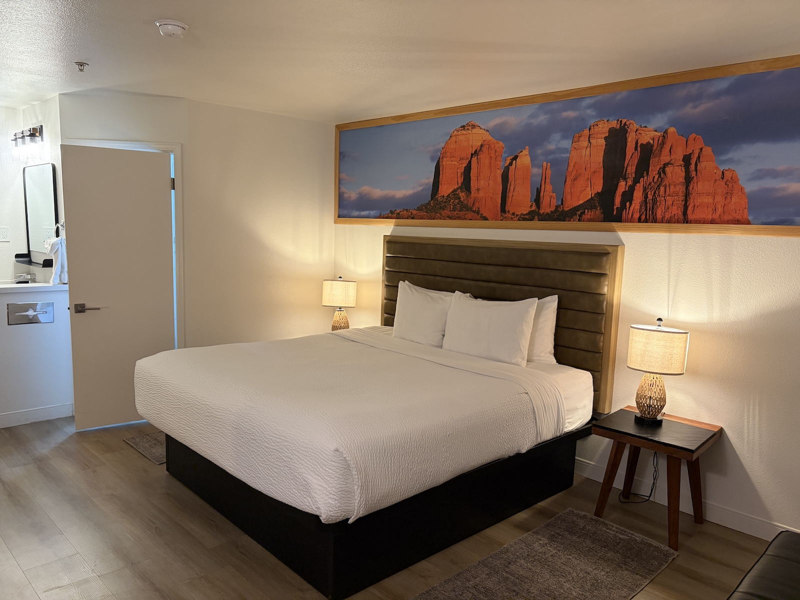
*Greentree Inn Sedona ・広いお部屋！* 
 

<iframe src="https://www.google.com/maps/embed?pb=!4v1781443179503!6m8!1m7!1sC5eIG_2FZOY1abN93prq2w!2m2!1d34.86210208091013!2d-111.8123733678733!3f221.14401!4f0!5f0.7820865974627469" width="100%" height="450" style="border:0;" allowfullscreen="" loading="lazy" referrerpolicy="no-referrer-when-downgrade"></iframe>
 
 
 --- 
📍 **本日の移動**  
羽田 → サンフランシスコ → フェニックス → アズビルノースアメリカ → Walmart 
→ REI → Desert Vista → Robbers Roost → Sedona / SAFEWAY → Greentree Inn Sedona
