# 【グランドサークル】2日目　Sedona 〜 Vortex
###### 2026年4月27日（月）晴れ

## まずは人気急上昇のDevil’s Bridgeへ
朝食を食べずに6:00集合でホテルを出発。 
 

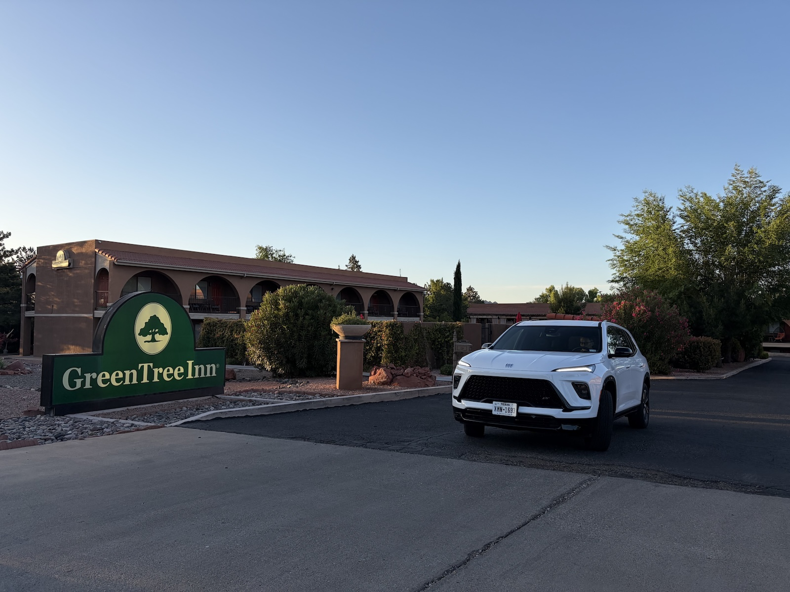
*Greentree Inn Sedona ・早朝のホテルを出* 
 

Devil’s Bridgeは、前回来た時よりもかなり人気が出てしまって混む上に 
駐車場が狭いので、早く行かないと車が停められない。 
最近はSedona中心部からバスが出ているようだけど 
私たちが行ったタイミングは運休だった。 

早めにホテルを出て来たので、無事に駐車場を確保できた。 
それでもかなり埋まってた！ 
 

<iframe src="https://www.google.com/maps/embed?pb=!4v1781443811821!6m8!1m7!1sOz5M_SHEhpfWk_e5-zpv2g!2m2!1d34.89006678322311!2d-111.8201163754234!3f270.9988412436894!4f0!5f0.7820865974627469" width="100%" height="450" style="border:0;" allowfullscreen="" loading="lazy" referrerpolicy="no-referrer-when-downgrade"></iframe>
 
 
 
パーキングチケットを駐車料金機で購入しようとしたがカードを受け付けず、 
カードを色々変えてやってみても受け付けず… 
現金が利用できない、カードオンリーの駐車料金機なので、 
カードが使えないとお手上げ。 
 

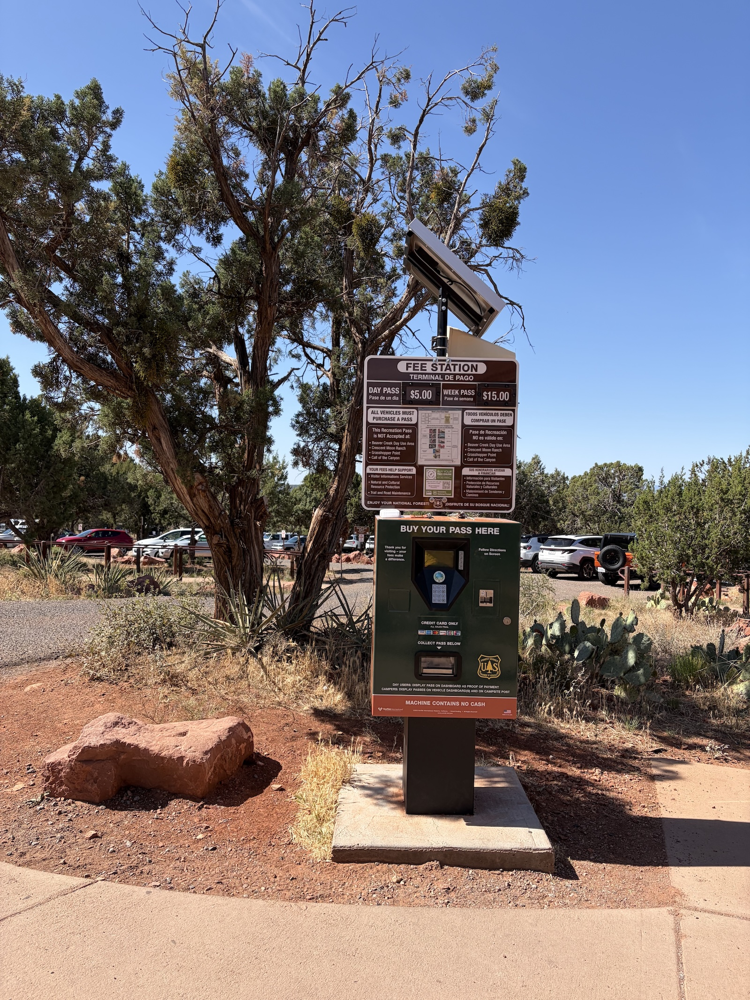
*Devil’s Bridge駐車場 ・まったく受け付けてくれない駐車料金機* 
 

他の人が同じ駐車料金機を使っているのを見ていたら 
普通にカードでパーキングチケットを購入している。 
なんで？？ 

通りかかったアメリカ人の夫婦が、カードが使えない様子を動画に撮っておいて 
後から文句言われたら、それを見せたらどうだ？とアドバイスしてくれて 
動画を撮影する。 

アメリカ人夫婦を巻き込んで、散々なんでー？とやっていたら 
アメリカ人夫婦のおじさんのカードで決済してくれた。 
なんて優しい。 
現金 $5.00を支払おうとしたが、受け取ってくれなかった。 

菅野さんが、アメリカ人って、みんな優しいんだよね〜と言ってた。 

--- 

 

**📖 コラム｜Devil’s Bridge 駐車場の料金機**  
 
アメリカの国立公園の駐車料金機（Pay Station）が海外カード非対応というケースはあるが、 
公式ポリシーとして「国内カードのみ」と定めているわけではなく、 
いくつかの理由で使えないことがある。 
 
＜よくある原因＞ 
- 古い機械：国立公園の駐車料金機は老朽化しているものも多く、国際カードのチップ読み取りやICカード処理に対応していない機種がある
- オフライン処理：電波の届きにくい僻地では機械がオフラインで動作していて、リアルタイム認証が必要な海外カードを弾くことがある
- ZIP Code要求：アメリカのカードシステムは郵便番号（ZIP Code）を入力させる機械があり、日本のカードには対応する番号がないため弾かれる
 
＜実際の対応策＞ 
- 現金（紙幣・コイン）が使える機械も多い
- America the Beautiful Pass（年間パス）を持っていれば、そもそも駐車料金が免除される公園も多い
- レンジャーステーションや入場ゲートでクレジットカード払いできることも
 
旅行者はアメリカのプリペイドカード（Wiseなど）を持参するか、 
現地で対応策を確認しておくことがおすすめ。 
 
Wiseのトラベルカードはアメリカ国内発行扱いになるケースがあり、 
こういう場面で役立つことがあるが要確認。 
 
 

--- 
 
 
## Devil’s Bridge
駐車場問題がクリアできたので、いよいよDevil’s Bridgeへ。 
ダート道を歩いて、トレイルコースに入る。 

早朝出発で、まだ朝日が登りきっていないので寒い。 
でも小鳥がさえずり、空気もスッキリきもちいい。 
 

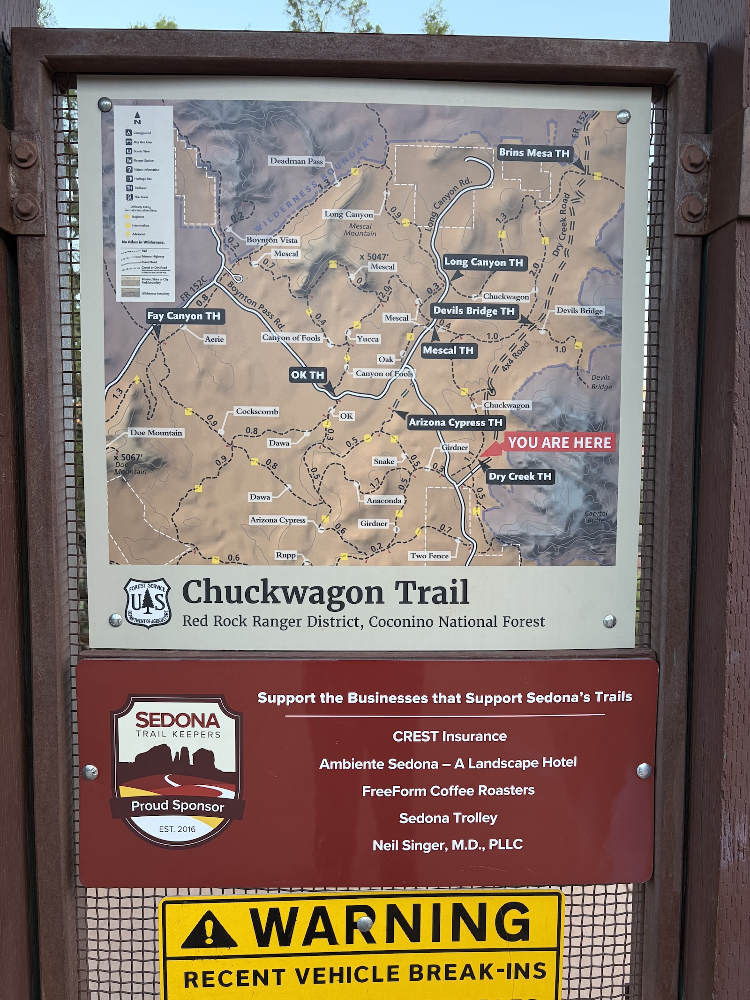
*Devil’s Bridge Trail ・トレイルの地図* 
 

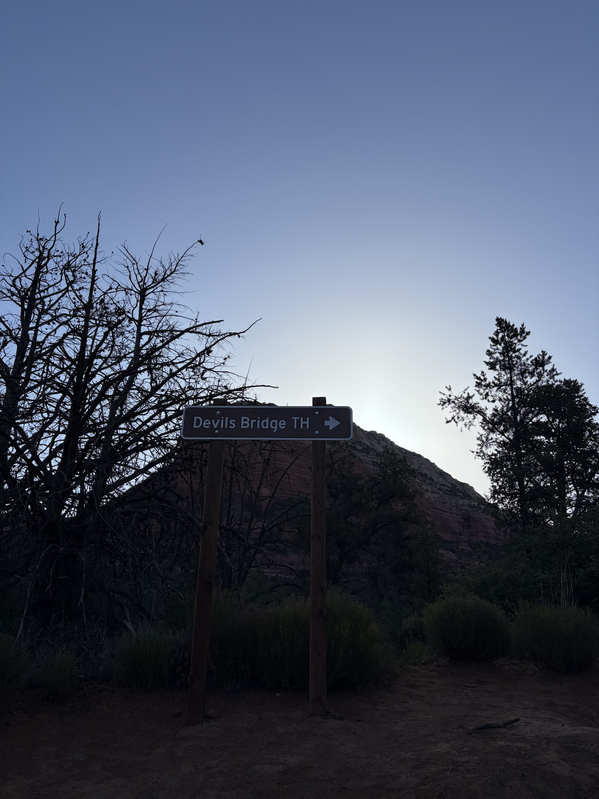
*Devil’s Bridge Trail ・朝早くて寒いトレイル* 
 

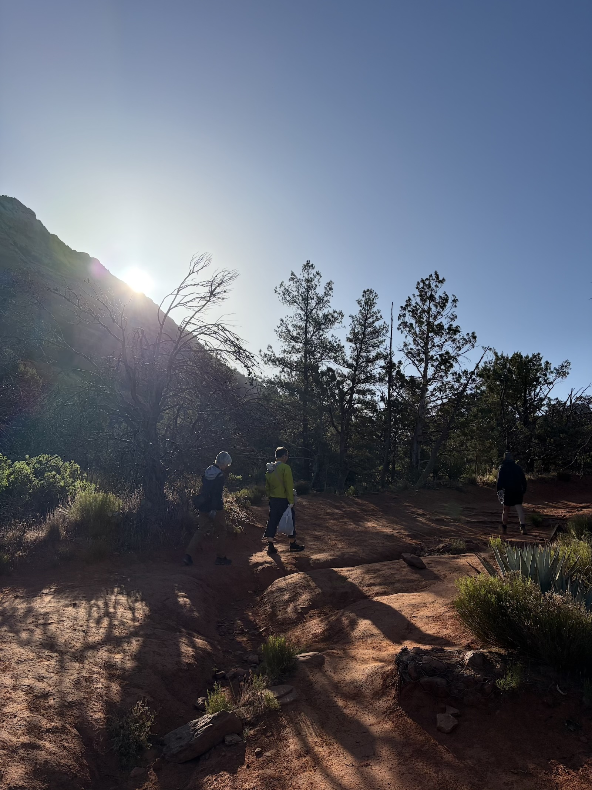
*Devil’s Bridge Trail ・やっと朝日が昇ってくる* 
 

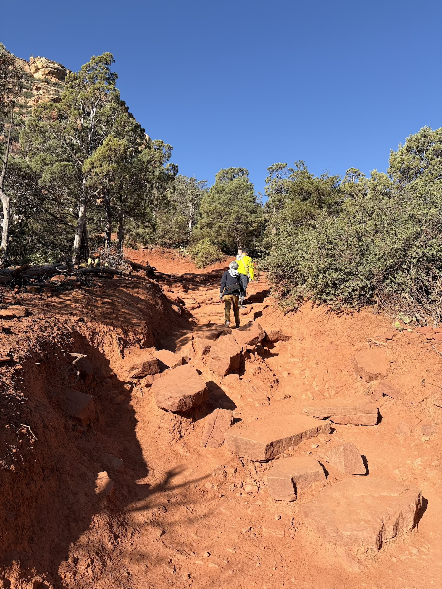
*Devil’s Bridge Trail ・かなりな岩道* 
 

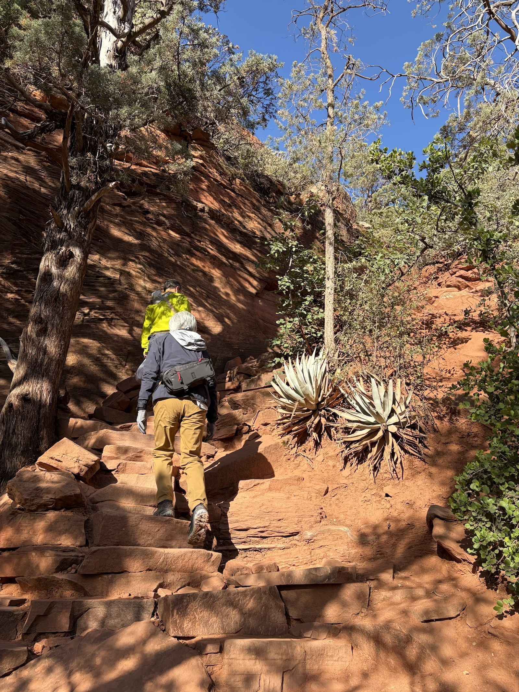
*Devil’s Bridge Trail ・階段を登ると・・・* 
 

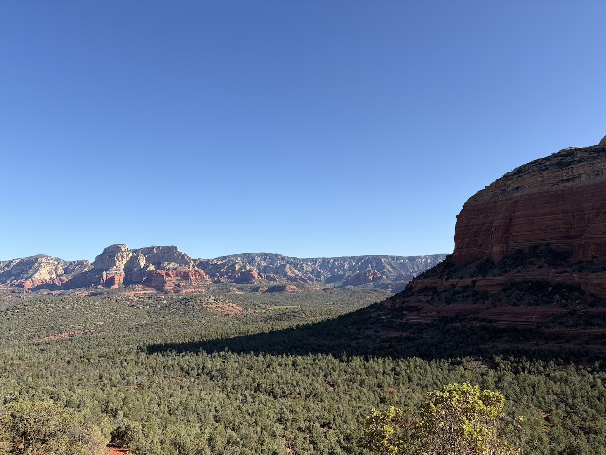
*Devil’s Bridge Trail ・素晴らしい景色！* 
 

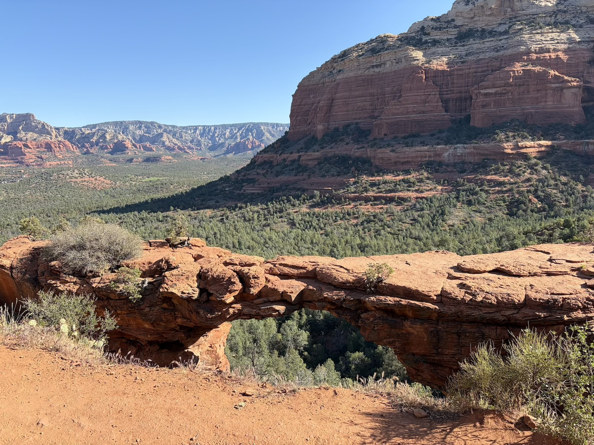
*Devil’s Bridge Trail ・そしてDevil’s Bridge* 
 

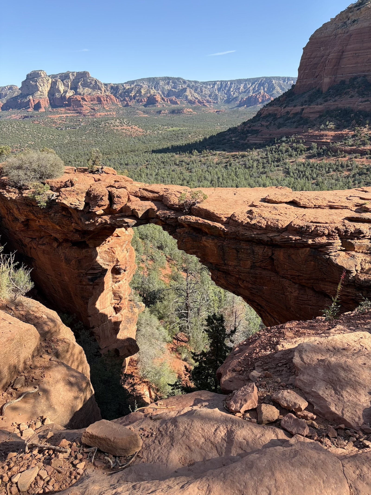
*Devil’s Bridge Trail ・橋の下が抜けていて今にも崩れ落ちそう* 
 
 

<iframe src="https://www.google.com/maps/embed?pb=!4v1781444033826!6m8!1m7!1sCAoSF0NJSE0wb2dLRUlDQWdJQy1scUNpMXdF!2m2!1d34.89762711256792!2d-111.8076984287867!3f136.3343539547822!4f-0.0904201691228792!5f0.7820865974627469" width="100%" height="450" style="border:0;" allowfullscreen="" loading="lazy" referrerpolicy="no-referrer-when-downgrade"></iframe>
 
 
Devil’s Bridgeに到着したら、写真撮影待ちの長い行列。 
9年前に来たときには、こんなことあり得なかったのに。 
やはり急にDevil’s Bridgeは有名になってしまったのかしら。 
前回は、写真撮影のために順番に1人ずつ行くなんてことはせず、 
みんなどんどん橋の上に行っていたが、今回は１組ずつが順番に橋の上に行って写真撮影していた。 
これもSNSの普及で、映えが重視される世の中になったからかも。 

行列に並んで順番を待ちながら、スミーお手製のサンドイッチを食べる。 
まさかスミーがサンドイッチを作ってくるとは思わなかった（笑） 
そして、スミーのサンドイッチに挟まっていたプチトマトが落ちて転がる。 

私たちの前にお誕生日だった人がいて、しかも人数多くて、 
なかなか時間がかかって順番が回ってこない。 
やっと順番が回って来て、菅野さんと写真撮影。 
 

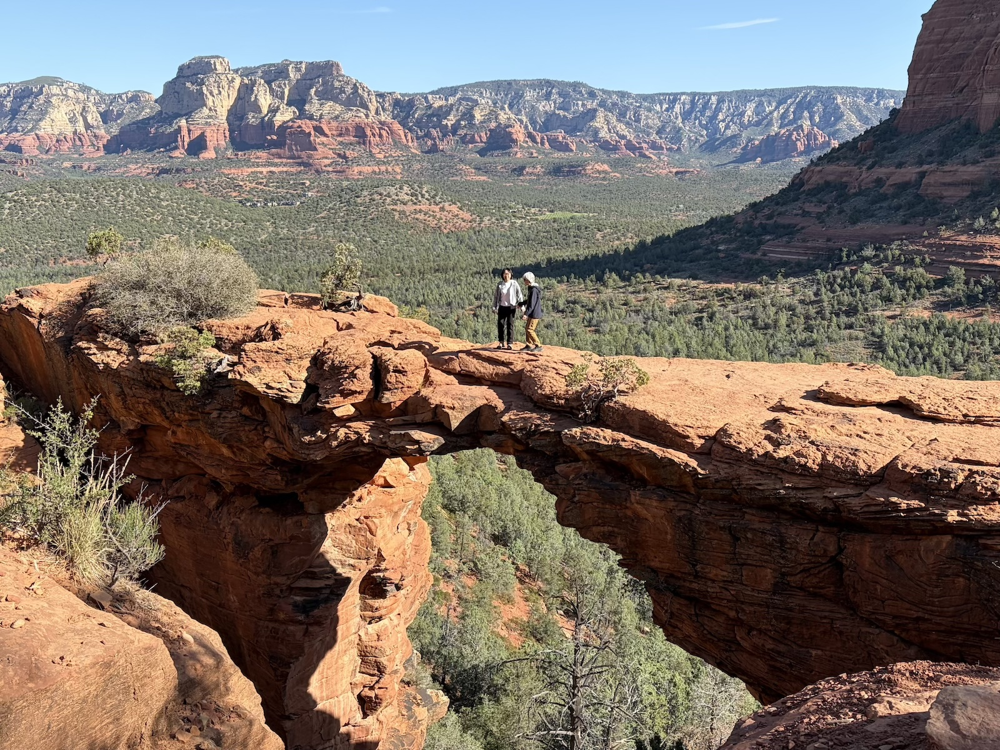
*Devil’s Bridge Trail ・遠くから見ていると橋の幅が狭くて怖そうだけど、歩いてみると全然平気* 
 

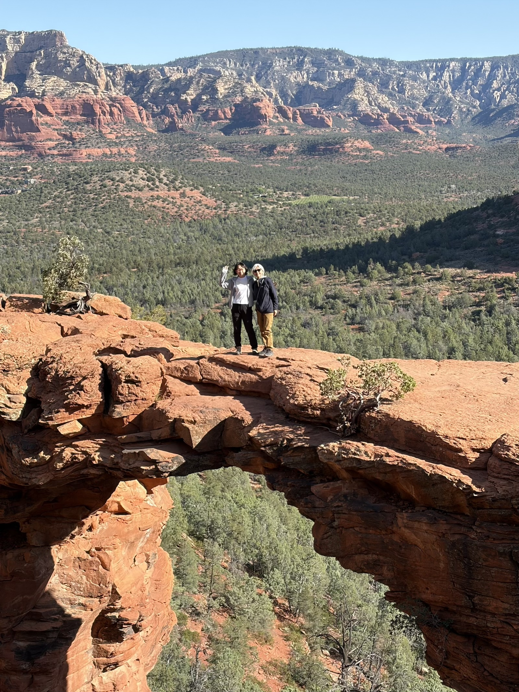
*Devil’s Bridge Trail ・こっちから見てる方が怖そうに見える* 
 

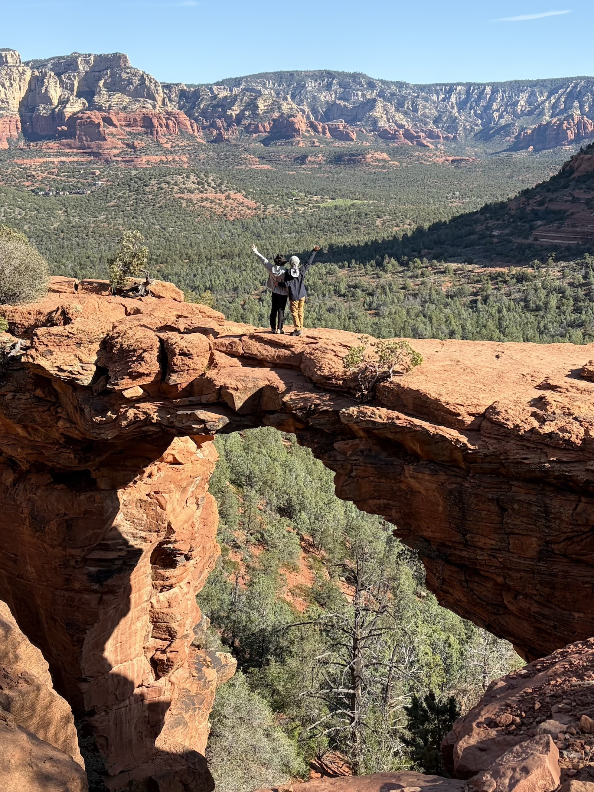
*Devil’s Bridge Trail ・せっかくだから向こう側の景色も堪能* 
 

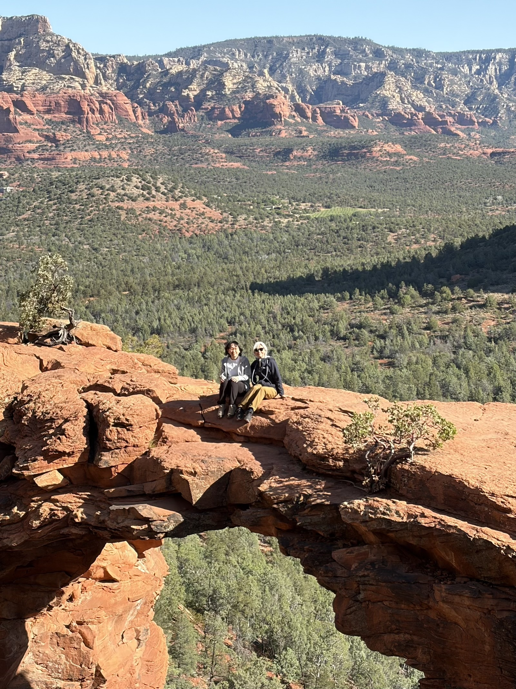
*Devil’s Bridge Trail ・そして座ってみたりする* 
 

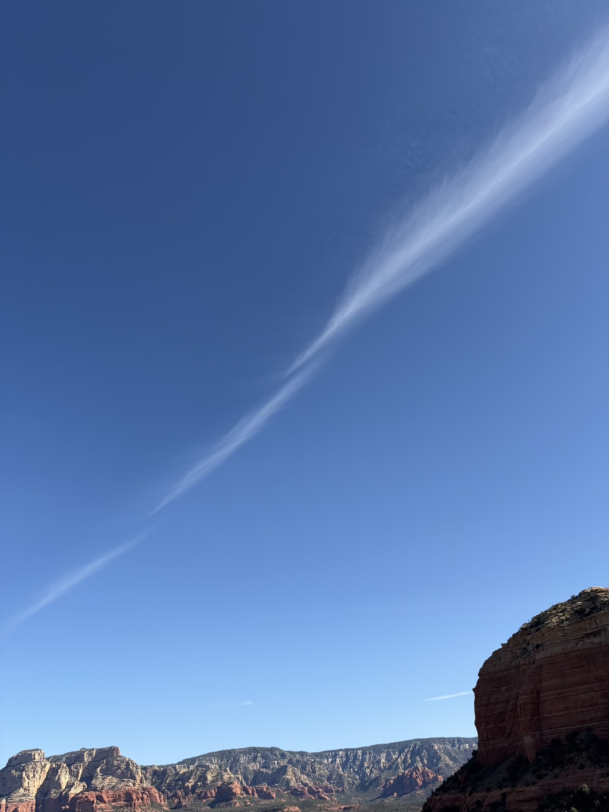
*Devil’s Bridge Trail ・飛行機雲がキレイ。龍が登っているみたい* 
 

写真も撮り終わって、帰ろうとしたところで、 
駐車場で助けてくれた夫婦が行列に並んでいて再会できた！ 

お礼に日本から持参した「とらや」の一口羊羹を３つプレゼント。 
スミーが、甘いよ！と言って渡していた。 
お礼ができてよかった。 
 
 

## 次も停められるか？Boynton Canyonの駐車場
一番の難関のDevil’s Bridge をクリアして、次に向かうのはBoynton Canyon。 
Boynton Canyon の駐車場も狭くて、停められるか少し待っていたけど停められず。 
多くの人たちが路上駐車しているので、私たちも路上駐車することにする。 
そういえば、9年前も路上駐車してた。 
 

<iframe src="https://www.google.com/maps/embed?pb=!4v1781444125442!6m8!1m7!1sw-pNu3HpEcOijBM4ve8lPQ!2m2!1d34.90563066089532!2d-111.8514569175553!3f184.54744845108186!4f0!5f0.7820865974627469" width="100%" height="450" style="border:0;" allowfullscreen="" loading="lazy" referrerpolicy="no-referrer-when-downgrade"></iframe>
 
 
 
## Boynton Canyon の奥・・・Subway Caveへ
Boynton Canyonに行くのかと思いきや、Boynton Canyonの脇に回り込んで歩き続ける。 

Boynton Canyonのウォリアー（Warrior Butte / ノール）の頂上に座って笛を吹くおじさん。 
9年前に来た時もノールのてっぺんで笛を吹いているおじさんがいて、 
吹き終わって下に降りて来たら、赤土のハートの石をくれた。 
同じおじさんなのかしら？ 

おじさんの笛の音を聞きながら歩く。 
とにかく長い道をどんどん歩く。 
そのうち笛の音も聞こえなくなる。 

大きなホテルの横の道をずっと歩く。 
自然の中ではなくてホテルの横だから、ちょっと面白くないBoynton Canyon Trail。 
 

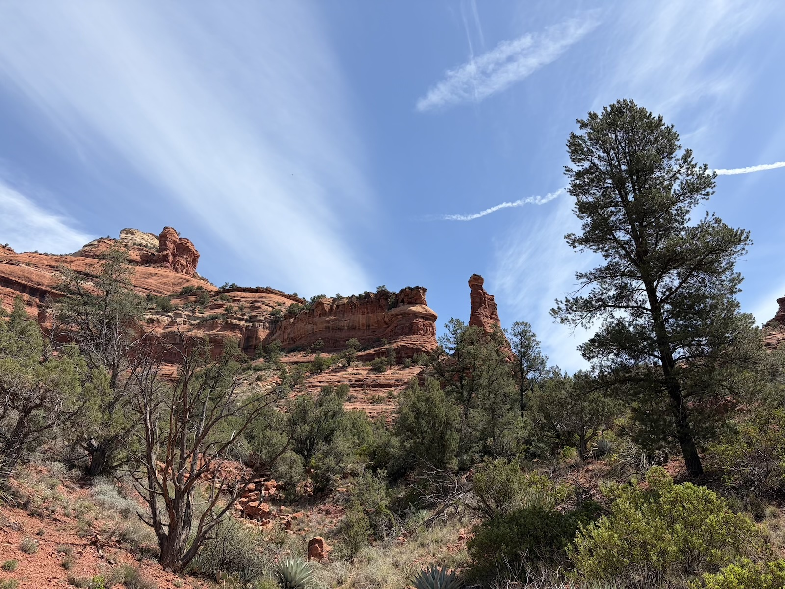
*Boynton Canyon Trail・Boynton Canyonのカチーナウーマンを横目に歩く* 
 

Subway Caveには今回初めて行くので、道が分からず。 
どこかで右折するはずなのだけど、曲がるところがわからない。 
スミーがGoogle Mapを見ながら歩く。 

ちょうどお昼頃に歩いているので、日が高くなってものすごく暑いし、日差しがとにかく強い。 

何人かが右に入って行ったところを私たちも右に入っていく。 

<iframe src="https://www.google.com/maps/embed?pb=!4v1781444271797!6m8!1m7!1sCAoSFkNJSE0wb2dLRUlDQWdJRGgzc2JXYlE.!2m2!1d34.92778363780601!2d-111.8618178741994!3f218.02110974874924!4f0!5f0.7820865974627469" width="100%" height="450" style="border:0;" allowfullscreen="" loading="lazy" referrerpolicy="no-referrer-when-downgrade"></iframe>
 
 
 
すると目の前に大きな岩の壁が出現。 
ツルツルに滑りそうな大きな岩で、 
へばりついて登っているおばさんを娘が上から上り方を指導している。 
その脇を滑るように上から降りてくる人もいる。 

ここ？？？ 
 

*Subway Cave・これ登れる？* 
 

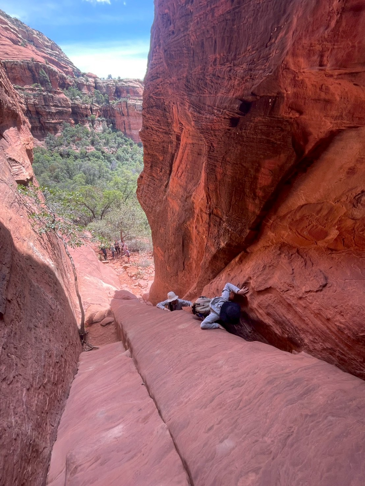
*Subway Cave・菅野さんがんばれ！* 
 

スミーが滑りそうな岩をどんどん登っていく。 
菅野さんと私も、苦労して登っているおばさんの後を追うように登るが 
見ている以上に大変。 
でも、思っていたよりも滑らない石だとわかる。 

スミーが上で、登ってみて初めてSubway Caveという名前がついたのが 
わかると言っている。 
いやいや、そこまでそんな簡単に辿り着けないから。 

やっとの思いで上まで登る。 
確かに！ 
 

*Subway Cave・Subway Caveの上からみた景色* 
 

*Subway Cave・まさにトンネル* 
 

トンネルみたいになっている岩で地下鉄みたいなんだな。 
崖の上の歩ける場所が狭くて、向こう側に渡るのが怖い。 
 

*Subway Cave・道が狭くてすぐ崖で怖い* 
 

*Subway Cave・虹！と指を指すスミー* 
 

*Subway Cave・Subway Caveの上からみた虹！* 
 

菅野さんはこのまま滑って下に降りるというが、 
スミーが一生懸命説得して向こう側に渡る。 
 

*Subway Cave・菅野さんに歩くポイントを教えるスミー* 
 

*Subway Cave・後もう少しで広いところに出るよ！* 
 

崖の上で虹が出ているのを見る。 
Sedonaみたいな乾燥しているところで虹が出る？？？ 
すごいいいものを見た気分。 

崖の上の細い道を抜けて反対側の広い場所に出る。 
ちょっと一仕事した感じで、少し座って休み、 
みんなでとらやの羊羹を食べる。 

下りも岩を滑って降りるよりも、こちらの道の方が楽に降りれた。 
 

<iframe src="https://www.google.com/maps/embed?pb=!1m18!1m12!1m3!1d204.44685308241415!2d-111.8618178741994!3d34.92778363780601!2m3!1f0!2f0!3f0!3m2!1i1024!2i768!4f13.1!3m3!1m2!1s0x872d7527c331384b%3A0xaab7bda7e6608e44!2sTo%20Subway%20Cave!5e0!3m2!1sja!2sjp!4v1781444404361!5m2!1sja!2sjp" width="100%" height="450" style="border:0;" allowfullscreen="" loading="lazy" referrerpolicy="no-referrer-when-downgrade"></iframe>
 
 
 
帰り道、Subway Caveへの右折場所の地面に 
石と枝で矢印が書かれていたことに気づく。 
行きにはまったく気が付かなかった！ 
 

*Boynton Canyon Trail・道に矢印があった！* 
 

もうすでに足がマメだらけで痛い（泣） 
帰りのトレイルで、石から生えているように見えるサボテンを発見。 
 

*Boynton Canyon Trail・石の上に生えるサボテン* 
 

やはり植物の生命力の強さを感じる。 
 
 

--- 

 

**📖 コラム｜Sedonaのボルテックスの意味** 
 
Sedonaのボルテックス（Vortex）とは、 
アリゾナ州Sedonaにあるとされる強力なエネルギーの渦のこと。 
地球から放出される特別なエネルギーが集中している 
「エネルギースポット」と考えられている。 
スピリチュアルな世界では、このような場所を訪れると瞑想が深まったり、 
心身の癒しが得られたり、精神的な気づきが生まれやすいと言われている。 
 

＜Sedonaの代表的な4つのボルテックス＞ 
- Bell Rock（ベルロック）：力強さ、上昇のエネルギー
- Cathedral Rock（カセドラルロック）：受容、女性性、癒し
- Airport Mesa（エアポートメサ）：バランス、中立的なエネルギー
- Boynton Canyon（ボイントンキャニオン）：男性性と女性性の融合
 
＜ボルテックスのサイン＞ 
現地ではジュニパー（ビャクシン）の木が 
渦を巻くようにねじれて生長しているのをよく見かけるが、 
これがエネルギーの影響だという説もある。 
 

*Bell Rock・ねじれる木* 
 

 

--- 
 
 

## そしてBoynton Canyonに戻る
帰り道のトレイルも、とにかくすごい日差しで、すごい暑さだった。 
Boynton Canyonのカチーナウーマンとノールの麓まで登る。 
長いトレイルの後で灼熱地獄だったので、結構きつい。 

カチーナウーマンとサボテンを一緒に熱心に撮影している女の人がいた。 
 

*Boynton Canyon・カチーナウーマン* 
 

すでにノールの上で笛を吹くおじさんはいなくなっていた。 
残念・・・・ 
 

*Boynton Canyon・ノール* 
 

<iframe src="https://www.google.com/maps/embed?pb=!4v1781444598844!6m8!1m7!1sCAoSFkNJSE0wb2dLRUlDQWdJRHFoYjJQU2c.!2m2!1d34.9117343755853!2d-111.8481168550496!3f190.31780468872526!4f0!5f0.7820865974627469" width="100%" height="450" style="border:0;" allowfullscreen="" loading="lazy" referrerpolicy="no-referrer-when-downgrade"></iframe>
 
 
 
--- 

 

**📖 コラム｜「カチーナウーマン」と「ウォリアー（ノール）」**  
 
＜カチーナウーマン（Kachina Woman Rock）＞ 
カチーナという名前はホピ族に由来しており、 
守護者・護り手を意味するとされている。 
 
カチーナ（Kachina / Katsina）はホピやズニなどの 
プエブロ系先住民族の信仰において、 
自然や祖先の霊が宿る精霊的な存在。 
 
岩の裏側には「ウォム（子宮）」と呼ばれる小さな洞窟があり、 
訪れるハイカーの中にはそこまで分け入る人もいるらしい。 
 
＜ウォリアー（Warrior Butte / ノール）＞ 
カチーナウーマンの向かい側にある、 
やや低めの岩の丘（ノール）が「ウォリアーマン（Warrior Man）」。 
 
カチーナウーマンが女性的なエネルギー（神聖な女性性）を、 
ウォリアーが男性的なエネルギー（神聖な男性性）を象徴するとされている。 

ウォリアービュートの頂上に登ると、ポンデローサ松の森と周囲の山々を一望できる。 
 
＜2つの間に宿るボルテックス＞ 
2つの岩の間は「バランスのボルテックス」とされており、 
陰と陽・男性性と女性性のエネルギーが交わる場所と言われている。 
 
関係性・誠実さ・親密さ・開放性などのバランスをもたらすとされ、 
両者の中間地点に立つとエネルギーの交点を感じられると言われている。 
 
ボルテックスの正確な位置については諸説あり、 
カチーナウーマンとノールの間の鞍部だとする人もいれば、 
ノールの頂上や麓だとする人もいる。 

 

--- 
 
 
 
## Bell Rockを見に行こう！
予定にはなかったけど、せっかくだからBell Rockを見にいくことにする。 
夕方なので駐車場に車を停められた。 
 

*Bell Rock・その名の通りベルの形。Bell Rockの上の雲が渦を巻いてる？！* 
 

Bell Rockには登らずに、麓から眺める。 
 

<iframe src="https://www.google.com/maps/embed?pb=!4v1781444711910!6m8!1m7!1sCAoSFkNJSE0wb2dLRUlDQWdJQ2s1SnpMRlE.!2m2!1d34.80029660727284!2d-111.7645987318289!3f105.55016!4f0!5f0.7820865974627469" width="100%" height="450" style="border:0;" allowfullscreen="" loading="lazy" referrerpolicy="no-referrer-when-downgrade"></iframe>
 
 
 
Bell Rockは、前から見るのと後ろから見るので形が全然違うと思う。 
車で移動して両側からBell Rockを見る。 
私は最初に見た姿より、後から見た反対側の姿の方が好き。 
 

*Bell Rock・反対側から見たBell Rock* 
 

実は車に乗っているときが一番Bell Rockに近づけるので、 
車の車窓からBell Rockの写真を撮ってみる。 
 

*Bell Rock・車から見たBell Rock* 
 

前回はBell Rockにも登ったのよね。 
田角さんと私が置き去りにされて、 
スミーだけどっかの団体ツアーにくっついて登って行って、 
戻ってこなかったのはここかしら？ 
 
 

## Bell Rockのお隣がCourthouse Butte
Bell Rockの隣に大きなビュートがあって、 
これなんだっけ？とずっと思っていた。 
地図を見てみたら、Courthouse Butteだとわかる。 
 

*Courthouse Butte・Bell Rockと並ぶCourthouse Butte* 
 

Bell Rockの奥に位置していて大きいビュート。 
Bell Rock同様に登らずに下から眺める。 
 

*Courthouse Butte・Courthouse Butteの上の雲も渦が巻いてる？！* 
 

<iframe src="https://www.google.com/maps/embed?pb=!1m18!1m12!1m3!1d2879.5366473187787!2d-111.75576533416192!3d34.80192739730294!2m3!1f0!2f0!3f0!3m2!1i1024!2i768!4f13.1!3m3!1m2!1s0x872da5003e98d1e9%3A0x1c0b6f721f6409ec!2sCourthouse%20Butte!5e0!3m2!1sja!2sjp!4v1781444769982!5m2!1sja!2sjp" width="100%" height="450" style="border:0;" allowfullscreen="" loading="lazy" referrerpolicy="no-referrer-when-downgrade"></iframe>
 
 
## 明日登る予定のCathedral Rock
近くに来たので明日登る予定のCathedral Rockにも足を伸ばして、 
明日に備えてどんな駐車場か確認しに行く。 
思っていた通り小さい駐車場なので、明日も早く出発しないと車が停められない。 

駐車場に車を停めて、下からCathedral Rockを眺める。 
 

*Cathedral Rock・駐車場から見上げるCathedral Rock* 
 

仏の手があるのはCathedral Rockなので、やっぱり登りたいよね。 
 
 

## やっと来られたClear Creek Trading Company（儀式屋）！
今回の旅の私の大きな目的の一つ。 
それがこの儀式屋へ来ること！ 
 

*Clear Creek Trading Company・やっと来たぞ！儀式屋！* 
 

*Clear Creek Trading Company・儀式屋の看板* 
 

<iframe src="https://www.google.com/maps/embed?pb=!4v1781444844162!6m8!1m7!1sMjg-Vha7vaMU4OluKM7NlA!2m2!1d34.87236812824086!2d-111.7581091014281!3f308.553981054949!4f0!5f0.7820865974627469" width="100%" height="450" style="border:0;" allowfullscreen="" loading="lazy" referrerpolicy="no-referrer-when-downgrade"></iframe>
 
 
 
9年ぶりに訪れた儀式屋。 
前回はものすごく面白くてSedonaに滞在中に何度も訪れたお店。 
しっぽとヒスイのブックエンドを買って帰った。 
 

*Clear Creek Trading Company・前回購入したものたち* 
 

儀式グッズが豊富で、骨とかカラスの羽とか、 
本当にいろいろ怖いものがたくさん（笑） 
あったんだけど・・・・9年ぶりに訪れた儀式屋は、 
ものすごく変わっていて普通の街のビーズ屋さんみたいになっていた（泣） 

オブシディアンの矢尻とかすごく安くてたくさん売ってたのに。 

スミーがあの後何度かこの儀式屋を訪れていて、 
オブシディアンの矢尻がなくなったと話していたけど、 
ここまで変わっているとは思わなかった。 
本当に悲しい・・・・ 

しっぽはまだ売ってたけど以前のような質の良いものはほとんどなかった。 
石の種類も量も減ってた。質も落ちてた・・・ 

菅野さんはココペリのマグネットを買い占め。 
 

--- 

 

**📖 コラム｜ココペリ（Kokopelli)** 
 
ホピ語の「kokopilau（kok = 木、pilau = こぶ）」に由来し、 
「こぶのある笛吹き男」を意味する。 
 

＜背中のこぶと袋の意味＞ 
「背中のこぶ」は実は袋を背負っているという説が有力。 
 
ホピの神話では赤ちゃんが入っていて若い女性に授けたとされ、 
プエブロ村サン・イルデフォンソの伝説では「歌」が入っており 
旅先で新しい歌と交換したとされている。 
 
ナバホ族の伝承では、雲でできた袋に種と虹が入っていたとされ、 
農業・収穫との結びつきが語られている。 
 
＜笛の意味＞ 
スピリチュアルな・肉体的な癒し、愛、音楽を象徴している。 
ホピの婚礼の儀式では「ラブフルート（恋の笛）」として使われ、 
男性が女性の心を引き寄せるために吹いたとされている。 
 
ふたりが結婚すると、男性はその笛を壊し、 
二度と吹かなかったと伝えられている。 

 

--- 
 
 

スミーはボブキャットのしっぽを購入。 
私はセージの葉の大きなパックを買う。 
セージの葉って検疫で引っかからないよね？と言ったら、 
スミーに「知らん」と言われた・・・ 
 

*Clear Creek Trading Company・セージのお得パック。日本で買ったものよりこんなに多い！* 
 
 

--- 

 

**📖 コラム｜セージ** 
 
浄化・スマッジングに使う。 
煙を部屋や持ち物、自分の体の周りにまとわせて、 
ネガティブなエネルギーを払う儀式（スマッジング）に使う。 
クリスタルストーンの浄化にもよく使われる。 
 
新しい場所・物のお清めをすることもできる。 
新居への引越し時、新しいクリスタルや道具を使い始める前、 
気分が重い時に空間をリセットする目的で焚く。 
 
瞑想やリラックスにも。 
セージの煙の香りには気持ちを落ち着かせる効果があるとされており、 
瞑想前や就寝前のルーティンに取り入れる人も多い。 
 

＜使い方の基本＞ 
葉束（スマッジスティック）の先端に火をつけ、少し燃えたら火を消して煙を出す。 
アワビの貝殻や耐熱皿の上で使い、煙を羽根や手で広げる。 
換気を必ずしながら使うのがポイント。 
 
＜日本への持ち帰り＞ 
乾燥セージは日本へ持ち帰り可能。 
乾燥・加工済みのハーブ類は、植物防疫上「加工品」として扱われ、 
日本への持ち込みが認められている。 
生の植物や土付きのものとは異なる。 
 
ただし、念のため以下をご確認： 
- 市販の密封パッケージであること（未開封が望ましい）
- 税関申告書の「肉類・植物・土など」の欄は乾燥ハーブ類の場合は申告不要が一般的だが、不安なら申告して確認するのが確実
- アメリカ出国時の制限は特になし
 
スーパーやコストコで売っている瓶入り・袋入りの乾燥セージなら問題なく持ち帰れる。 
 

 

--- 
 
 
 
## Sedonaの中心部のマーケットでお土産を物色
Sedonaの中心部にあるマーケットプラザでお土産を見て歩いたけど、 
どこのお店もいかにもお土産屋で欲しいものはなし。 
石も何もかもが信じられないくらい高い値段で、とても買う気持ちになれない。 
 

<iframe src="https://www.google.com/maps/embed?pb=!4v1781444909205!6m8!1m7!1swsL7_HTFDcLDTnWUZyRZrA!2m2!1d34.87137524199422!2d-111.7593828288298!3f128.5126590558771!4f0!5f0.7820865974627469" width="100%" height="450" style="border:0;" allowfullscreen="" loading="lazy" referrerpolicy="no-referrer-when-downgrade"></iframe>
 
 
 
## Chapel of the Holy Crossを外から見よう！
ホーリークロス教会も駐車場が狭くて、9年前に来た時も車を停めるのが大変だった。 
教会の中は大したことないので、外から見られれば十分ということで、 
路上駐車して外から教会を見る。 
 

*Chapel of the Holy Cross・Sedonaの赤い石と一体化したホーリークロス教会* 
 

<iframe src="https://www.google.com/maps/embed?pb=!4v1781445048358!6m8!1m7!1sMwk9lVdTC5r8LOh8p4eMaQ!2m2!1d34.83160781783033!2d-111.7676710130037!3f64.23091716130804!4f15.839939377462457!5f0.7820865974627469" width="100%" height="450" style="border:0;" allowfullscreen="" loading="lazy" referrerpolicy="no-referrer-when-downgrade"></iframe>
 
 
 
## Sedona Airport Scenic Lookoutで日の入りを見る
夕暮れ時になったので、Airport Mesaで日の入りを見ようと移動。 
Airport Mesaの上にある大きな駐車場に車を停める。 
すでにたくさんの人が集まってきている。 

このSedona Airport Scenic Lookoutからは、Sedonaの街を一望できる。 
風が強くて結構寒い。 
 

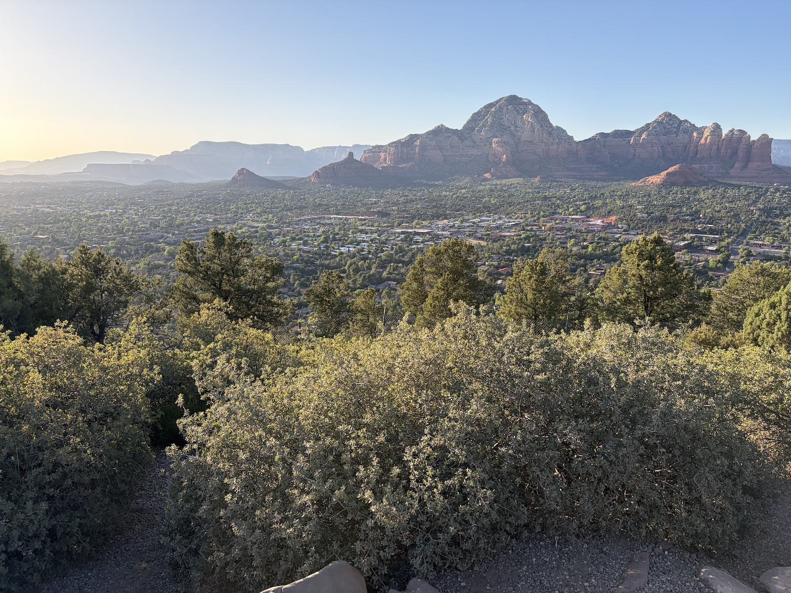
*Sedona Airport Scenic Lookout・夕暮れのSedonaの街を一望できる* 
 

<iframe src="https://www.google.com/maps/embed?pb=!4v1781445165967!6m8!1m7!1sCAoSF0NJSE0wb2dLRUlDQWdJQ0VuN0h0M0FF!2m2!1d34.8558487747475!2d-111.7791174351471!3f277.13333335117915!4f-1.2265250790589022!5f0.7820865974627469" width="100%" height="450" style="border:0;" allowfullscreen="" loading="lazy" referrerpolicy="no-referrer-when-downgrade"></iframe>
 
 
 
前回来た時も思ったけど、ところでAirport Mesaはどこ？とスミーに聞いたら、 
車で通ってきた道の中腹にあると。 

歩いて行かれる？と聞いたら、行かれないことはないというので、 
車道を歩いて下ってAirport Mesaに行く。 

結構車も来るし、歩くのが大変だった。 
 
 

## Airport Mesa
Airport Mesaの麓に来て、実は車道を歩かなくてもトレイルがあることがわかった。 
 

<iframe src="https://www.google.com/maps/embed?pb=!4v1781445207227!6m8!1m7!1ssJdyBvo6vVG94OPjIsuN6w!2m2!1d34.85594200479471!2d-111.7801410721637!3f138.24263185213533!4f3.09711843005347!5f0.7820865974627469" width="100%" height="450" style="border:0;" allowfullscreen="" loading="lazy" referrerpolicy="no-referrer-when-downgrade"></iframe>
 
 
 
車が上の駐車場にあるし、日が暮れたら、みんなが一斉に車で下るので、 
スミーが1人で上のSedona Airport Scenic Lookoutにトレイルで戻る。 
 

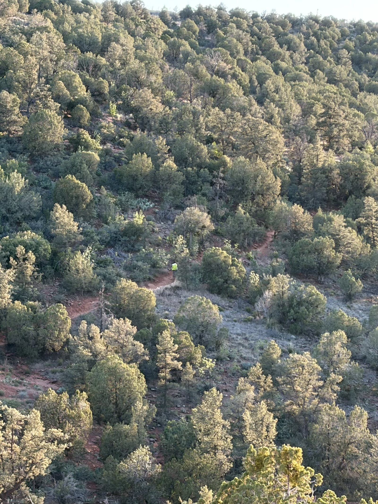
*Airport Mesa・トレイルの道を登ってSedona Airport Scenic Lookoutへ戻るスミー* 
 

菅野さんと私はAirport Mesaの丘の上に上がって、場所を確保。 
夕日が沈むのを見る。 
 

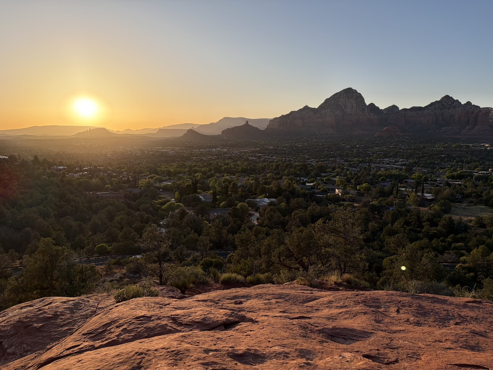
*Airport Mesa・Airport Mesaから見る夕暮れのSedonaの街* 
 

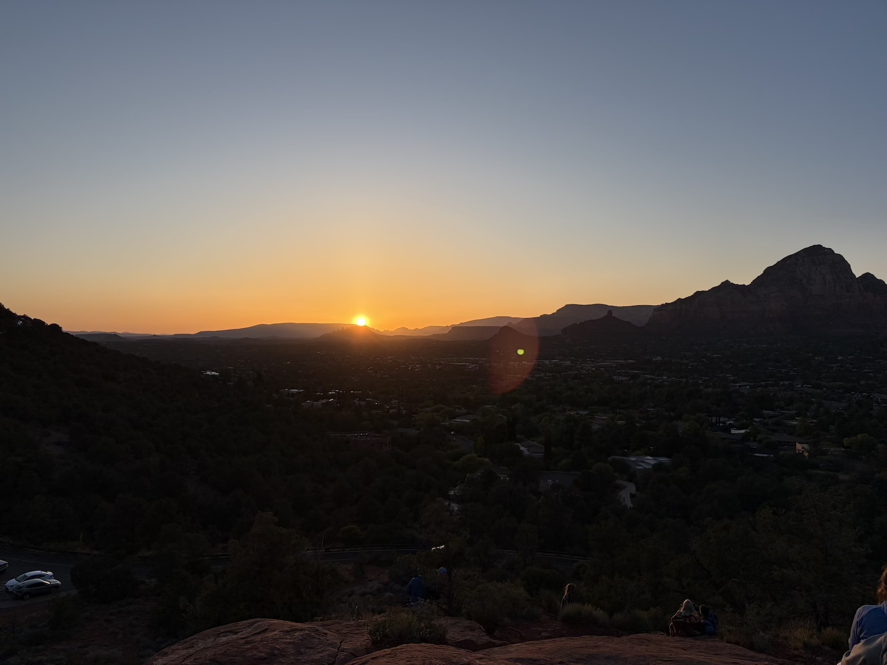
*Airport Mesa・Sedonaの街に日が沈んでいく* 
 

夕日が沈むのを見て、スミーに電話。 
 

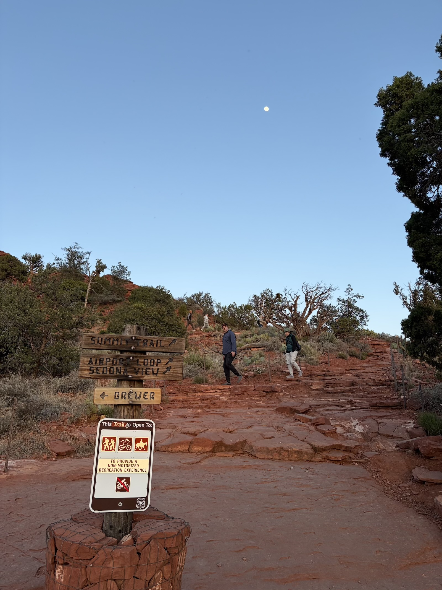
*Airport Mesa・月がAirport Mesaの上に* 
 

スミーはSedona Airport Scenic Lookoutから夕日が沈むのを見てから、 
車を駐車場からだそうと思ったら同じことを考えてる人たちがたくさんいて大渋滞。 

Airport Mesaでピックアップしてもらう。 
 

--- 

 

**📖 コラム｜ビュートとメサの違い** 
 
ビュートとメサは、どちらも同じ侵食プロセスで形成される地形で、サイズが主な違い。 
 

＜メサ（mesa）＞ 
頂上が平らで広く、テーブルのような形をした台地。頂上の面積が広いのが特徴。 
 
＜ビュート（butte）＞ 
メサがさらに侵食されて頂上が狭くなったもの。 
一般的に「頂上の幅よりも高さの方が大きい」ものをビュートと呼ぶ。 
 
つまり、メサ → さらに侵食 → ビュートという進化の関係にある。 
 

 

--- 
 
 
 
## 夕食どうする？
日没が19:20ころなので、そこから夕食がとれる店を探すのが大変。 
お店は早く閉まってしまうので、なかなかよいお店が見つからない。 

どこにでもあるメキシコ料理にしようということになって検索し、お店に向かう。 
最初に入ろうとしたメキシコ料理店が駐車場がいっぱいで 
車が停められなかったので、その向かいにあるお店 Tres Amigosに入る。 
 

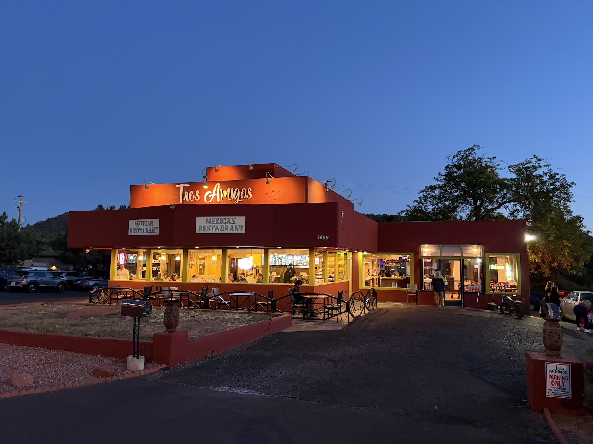
*Tres Amigos・メキシコ料理店 Tres Amigos* 
 

<iframe src="https://www.google.com/maps/embed?pb=!4v1781445296602!6m8!1m7!1szD1w5pV7RDF7dYsXL8YbqA!2m2!1d34.8631359393184!2d-111.7893603487172!3f121.01697!4f0!5f0.7820865974627469" width="100%" height="450" style="border:0;" allowfullscreen="" loading="lazy" referrerpolicy="no-referrer-when-downgrade"></iframe>
 
 
 
メニューを見てもなんだかよくわからず、注文はスミーと菅野さんに任せる。 
注文に散々悩んでタコスなどを頼む。 
 

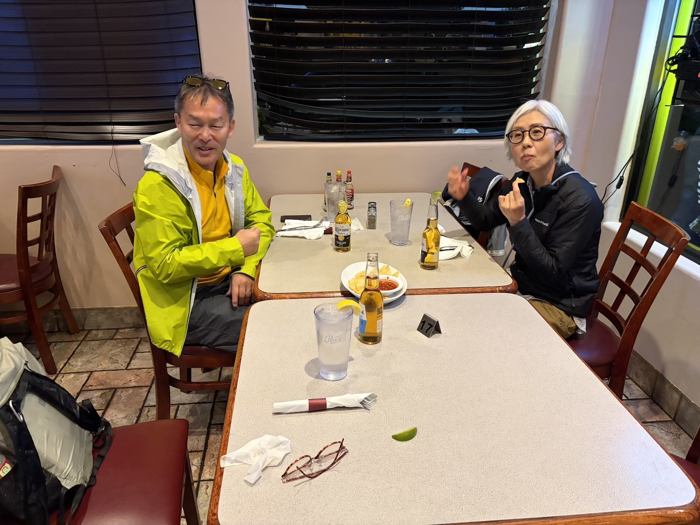
*Tres Amigos・まずはコロナビールで乾杯！* 
 

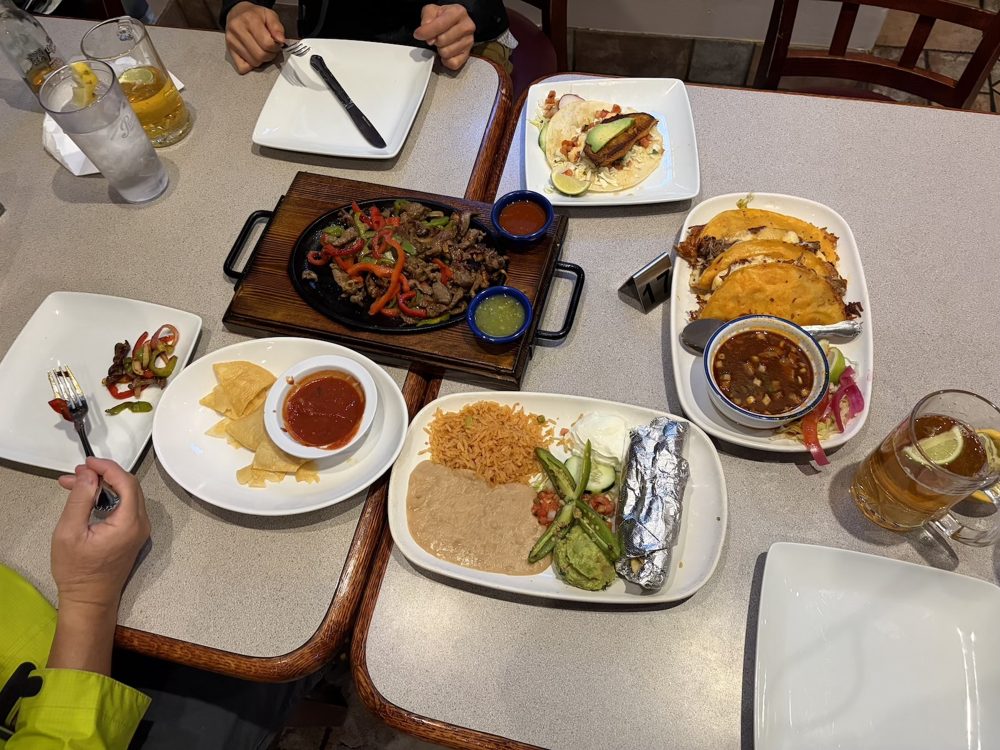
*Tres Amigos・迷いに迷って頼んだ料理たち* 
 

--- 

 

**📖 コラム｜Tres Amigos** 
 
"Tres Amigos"（トレス・アミーゴス）はスペイン語で 「3人の友達」 という意味。 
 
Tres = 3（数字） 
Amigos = 友達・仲間（複数形） 
 
レストラン名、映画タイトル、グループ名などによく使われる。 
1986年のコメディ映画『¡Three Amigos!』が有名。 
 
 

--- 
 
 
私たちもちょうど「3人の友達」（笑） 
 
 

## そして今夜も部屋のみ
ホテルに戻って、昨晩SAFEWAYでゲットしたもので部屋飲み。 

トレイル初日から行動がものすごく詰め込まれていて激しかった！ 
ものすごい距離を歩いて、足がマメだらけになって、とにかく足が痛いよー。 
 
 

## 今夜の宿・Greentree Inn Sedona 
Greentree Inn Sedona に２泊目。 
 

 
📍 **本日の移動**  
Greentree Inn Sedona → Devil’s Bridge → Subway Cave → Boynton Canyon  
→ Bell Rock / Courthouse Butte → Cathedral Rock → Clear Creek Trading Company（儀式屋）  
→ Chapel of the Holy Cross → Sedona Airport Scenic Lookout → Airport Mesa →  
Tres Amigos（メキシコ料理）  → Greentree Inn Sedona
