# 【グランドサークル】4日目　Grand Canyon 〜 Pageへ
###### 2026年4月29日（水）晴れ

## Grand Canyonから昇る朝日を見に
Maswik Lodgeを6:00出発して真っ暗闇の中を、Mather Pointへ移動。 
向かう途中で、真っ暗な横断歩道の付近に人影が… 
ヒッチハイクする人・・・暗くてよく見えないし、怖いよ。 
 
Mather Pointへ行く途中で、スミーがシカがいたと言ってたけど私には見えなかった。 
 

<iframe src="https://www.google.com/maps/embed?pb=!4v1784528349128!6m8!1m7!1sCAoSFkNJSE0wb2dLRUlDQWdJQ2s1Sm03Qmc.!2m2!1d36.06168483235368!2d-112.1076457712694!3f270!4f0!5f0.7820865974627469" width="100%" height="450" style="border:0;" allowfullscreen="" loading="lazy" referrerpolicy="strict-origin-when-cross-origin"></iframe>
 
 
 
朝早く出てきたけど、一番メジャーなMather Pointだけあって、それなりに人がいる。 
日本人の家族連れもいたり、すごい寒いのにすごい薄着の人がいたり。 
 

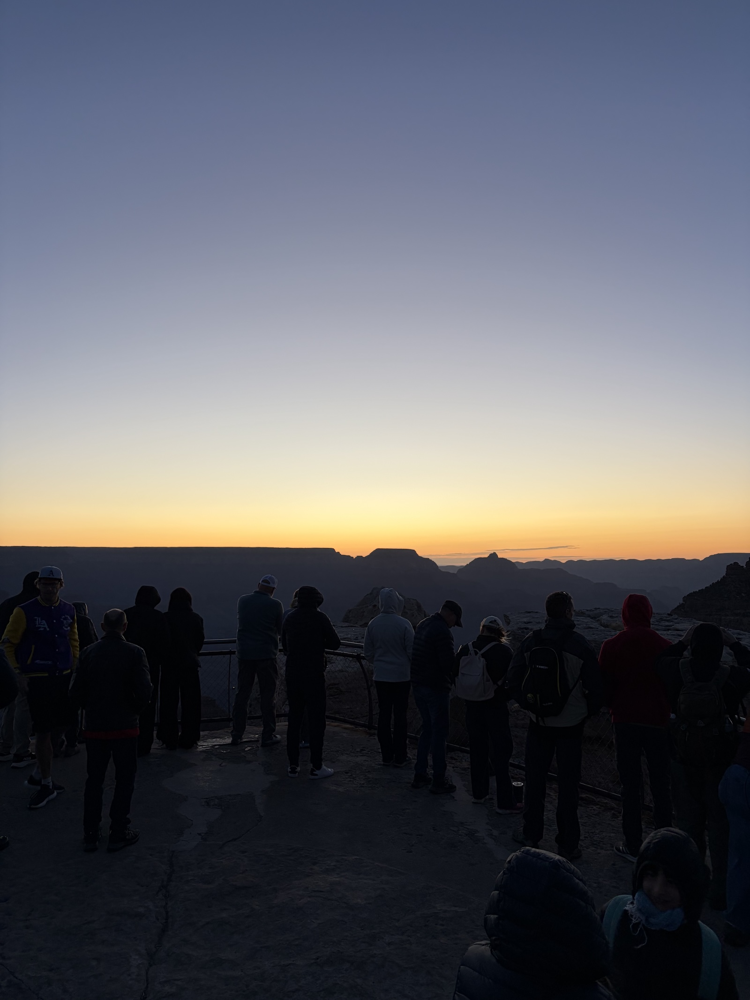
* Grand Canyon ・すでにたくさんの人が日の出を待つMather Point * 
 

突き出した展望デッキのちょっと高くなっている石の上から朝日が昇るのを見る。 
雲ひとつない空、まっすぐな地平線から太陽が上がる。 
 

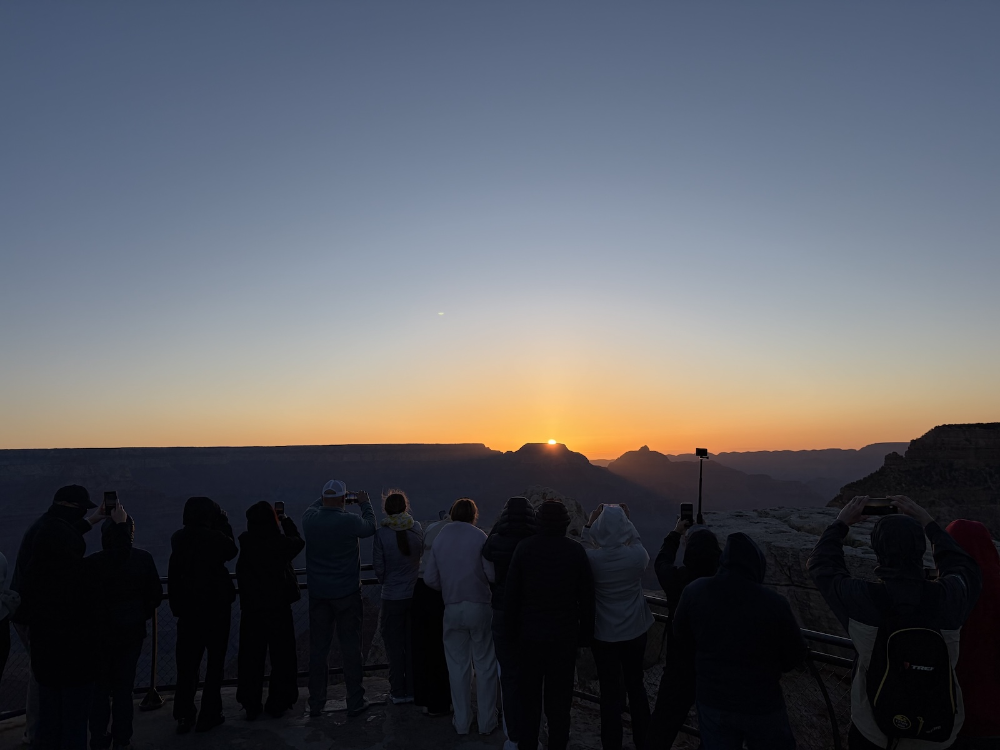
* Grand Canyon ・太陽が上がり始める * 
 

空のグラデーションがなんて美しいのだろう。 
朝日がGrand Canyonの岩肌を徐々に照らしていって、岩々が色を取り戻す。 
自然は完璧。 
なんて美しいのだろう。 
 

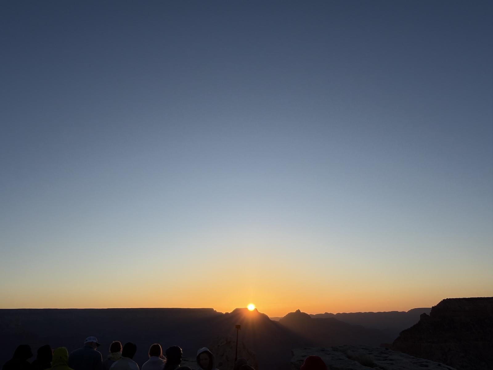
* Grand Canyon ・太陽と空のグラデーション * 
 

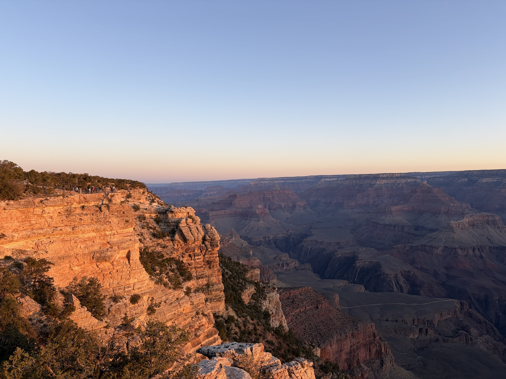
* Grand Canyon ・朝日で赤く染まるGrand Canyon * 
 

駐車場へ戻る途中でシカが現れる。 
やっと見られたシカ。 
 

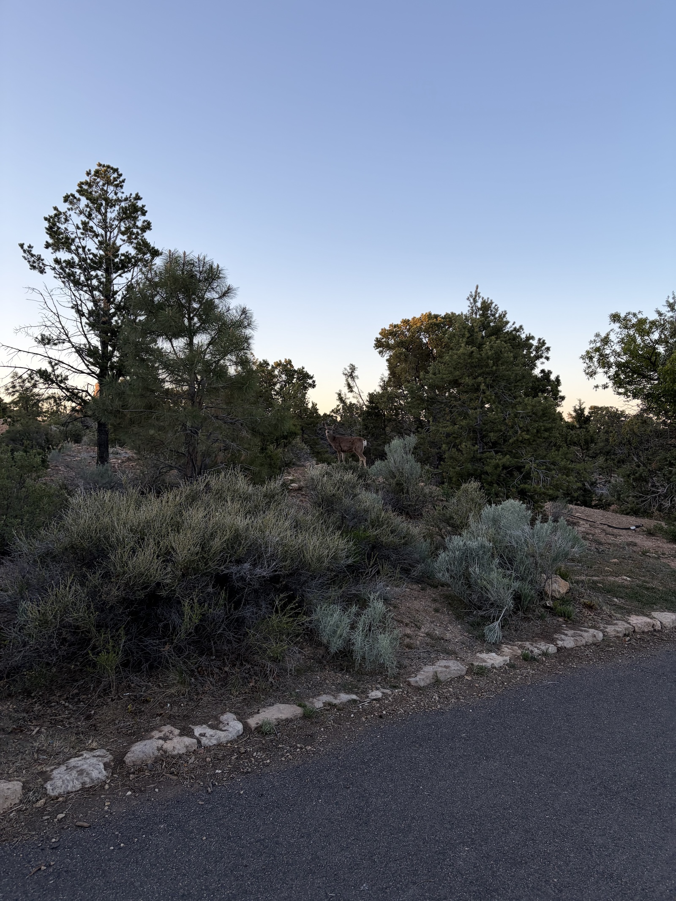
* Grand Canyon ・やっと見られたシカ * 
 

## 朝食を食べて、さぁ、今日も出発！
ロッジの部屋に戻って、お手製サンドイッチとオレンジジュースで朝食。 
荷造りをしてMaswik Lodgeをチェックアウト。 
ステキなロッジだったけど、あっという間に旅立つ。 
 

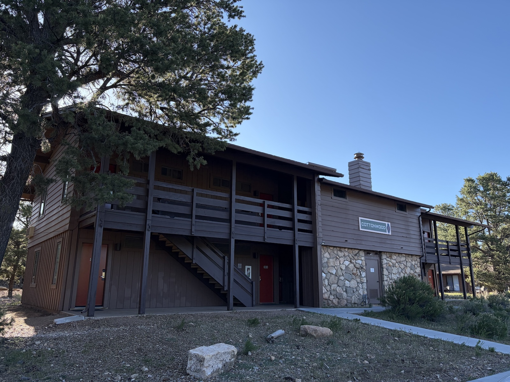
* Grand Canyon ・泊まっていたGrand Canyon Maswik Lodge * 
 

いろんなところをどんどん見られるのは嬉しいけど、宿や宿周辺をゆっくり楽しまないのは、ちょっと残念。 
 
再びGrand Canyonを観にYavapai Pointへ！
ここも人気のあるポイント。 
 

<iframe src="https://www.google.com/maps/embed?pb=!4v1784528403022!6m8!1m7!1sCAoSF0NJSE0wb2dLRUlDQWdJQ2trcU96b1FF!2m2!1d36.06553680135134!2d-112.1166531330679!3f113.46491!4f0!5f0.7820865974627469" width="100%" height="450" style="border:0;" allowfullscreen="" loading="lazy" referrerpolicy="strict-origin-when-cross-origin"></iframe>
 
 
 
菅野さんが若いころに、Grand Canyonに来て具合が悪くてぐったりして座っていたのはここだと思い出す。 
 

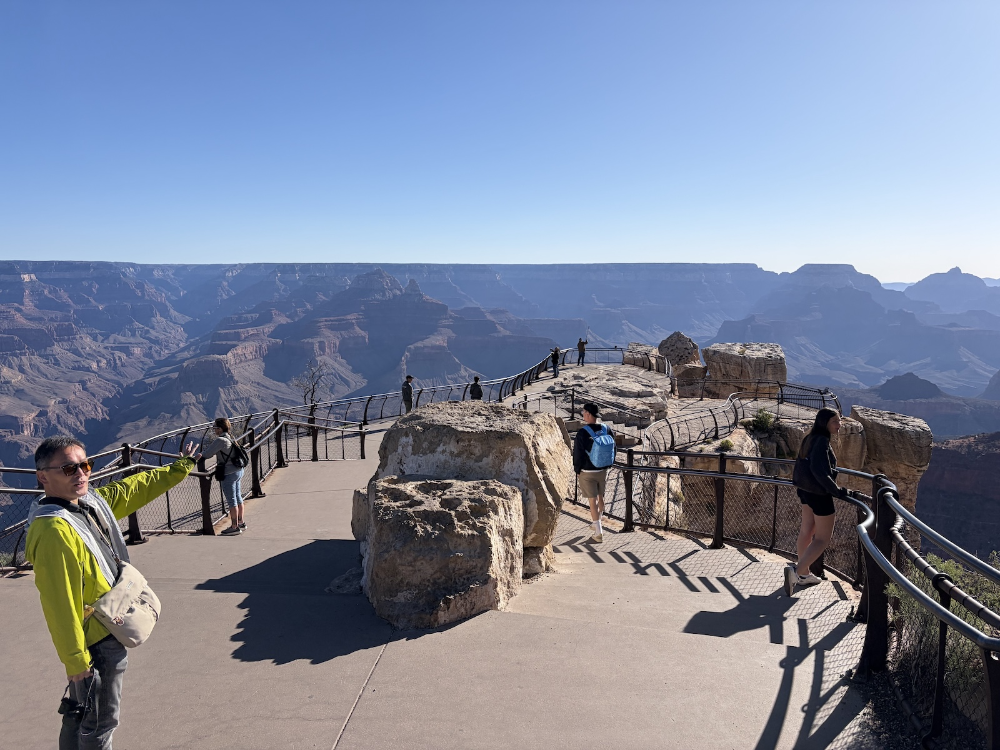
* Grand Canyon ・Yavapai Point * 
 

朝の最高の光線でGrand Canyonを観る。 
夕日、夜、朝日の中のGrand Canyonを観てきたけど、やっぱり最高の光線で観るGrand Canyonの色合いは素晴らしい。 
 

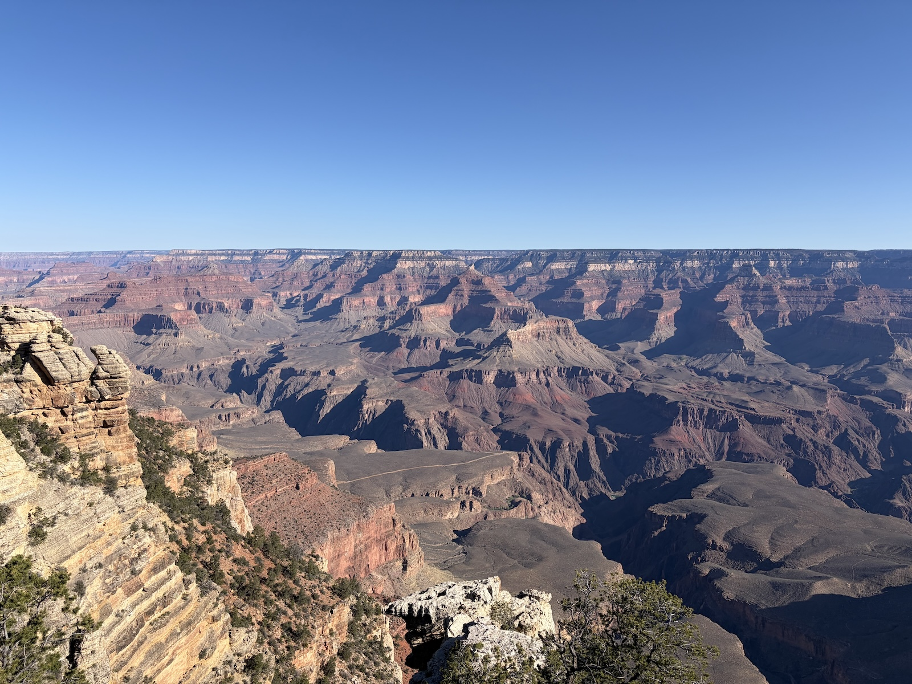
* Grand Canyon ・Yavapai Pointから見たGrand Canyon * 
 

Sedonaとはまた違った大地のすごいエネルギーを感じる。 
散歩して歩いている途中でリスを発見！
かわいい！！ 
 

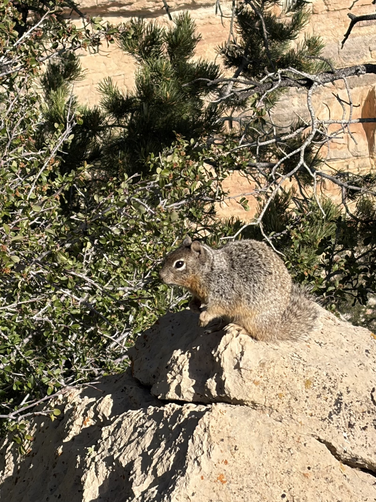
* Grand Canyon ・Yavapai Pointで出合ったリス * 
 

そして大きなシカが3頭どんどん近づいてくる！！ 
花壇の石をペロペロ舐めて塩分補給？ 
 

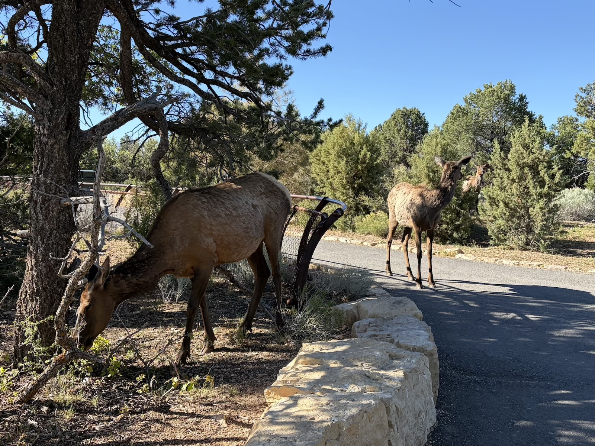
* Grand Canyon ・結構大きなシカがどんどん近づいてくる * 
 

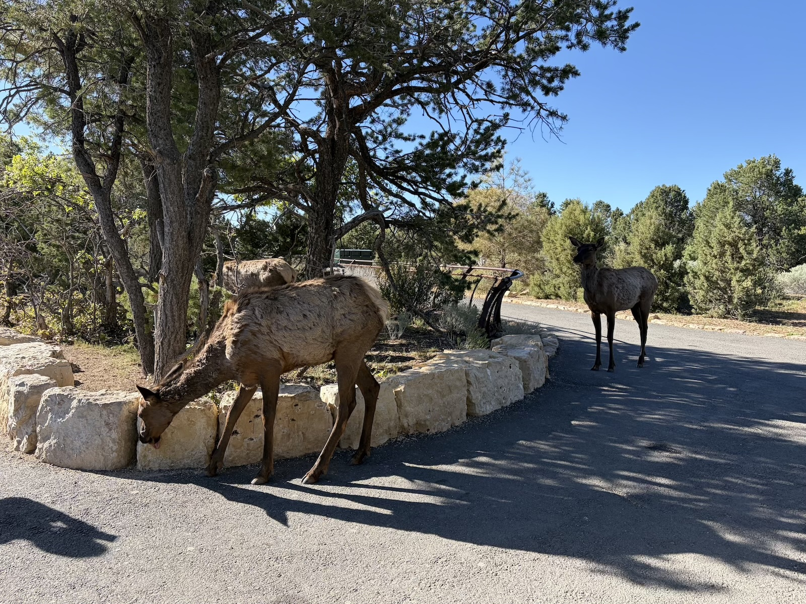
* Grand Canyon ・しかも３頭！ * 
 

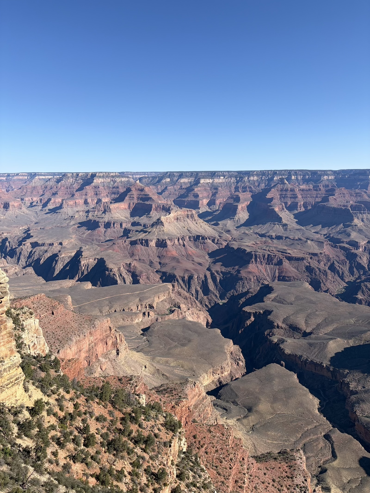
* Grand Canyon ・朝の光線で美しいGrand Canyon * 
 

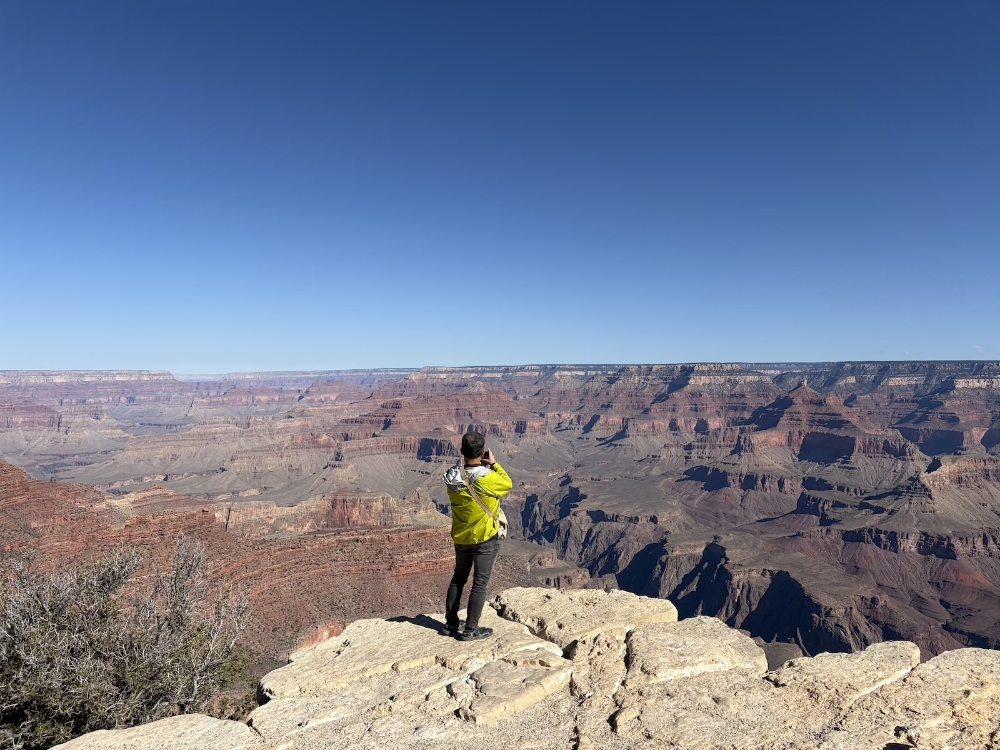
* Grand Canyon ・Grand Canyonを撮影するスミー、カメラマンぽい * 
 

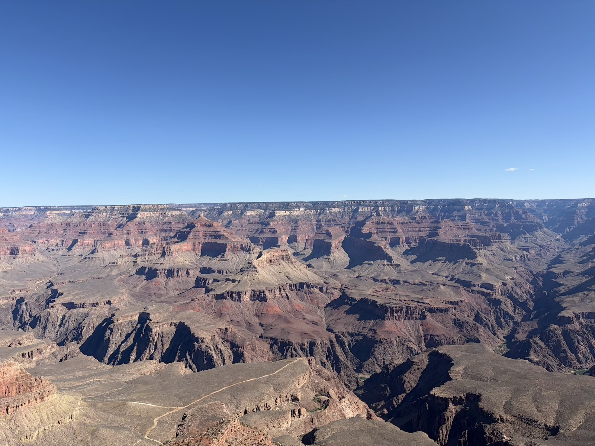
* Grand Canyon ・最高の景色 * 
 

暗い装束の学生の集団がバス2台で来ていた。
修学旅行？ 
 
Yavapai Point近くにあるGeology Museumに立ち寄る。 
Grand Canyonの形成などの展示を見て回る。 
 

<iframe src="https://www.google.com/maps/embed?pb=!1m18!1m12!1m3!1d1612.5706349999084!2d-112.11860578123076!3d36.06565821754198!2m3!1f0!2f0!3f0!3m2!1i1024!2i768!4f13.1!3m3!1m2!1s0x873310ea38863a39%3A0xdbceccddc2f8d022!2z44Ok44OQ44OR44Kk5Zyw6LOq5Y2a54mp6aSo!5e0!3m2!1sja!2sjp!4v1784528469518!5m2!1sja!2sjp" width="100%" height="450" style="border:0;" allowfullscreen="" loading="lazy" referrerpolicy="strict-origin-when-cross-origin"></iframe>
 
 

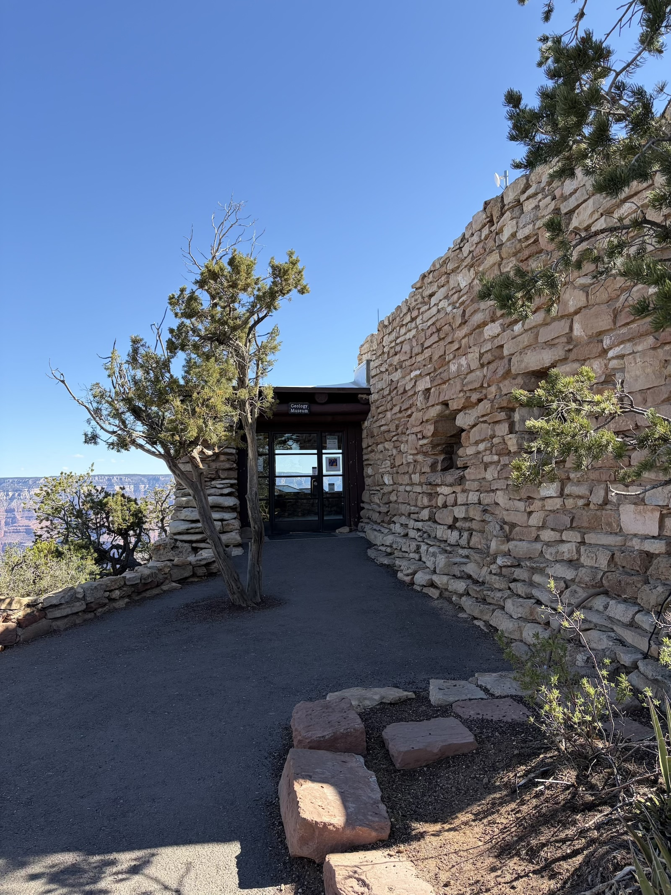
* Grand Canyon ・Geology Museumの入り口 * 
 

Geology Museumを出たところでくしゃみをしたら、外国人にBless youと言われる。 
Thank youと言えばよかったのに、とっさに何を言ったらいいか分からずに固まって、微笑む。 
日本人あるあるだー。 
 
Grand Canyon Visitor Centerでお土産などのグッズを見てお買い物。 
菅野さんはバンダナを、私はステッカーを購入。 
 

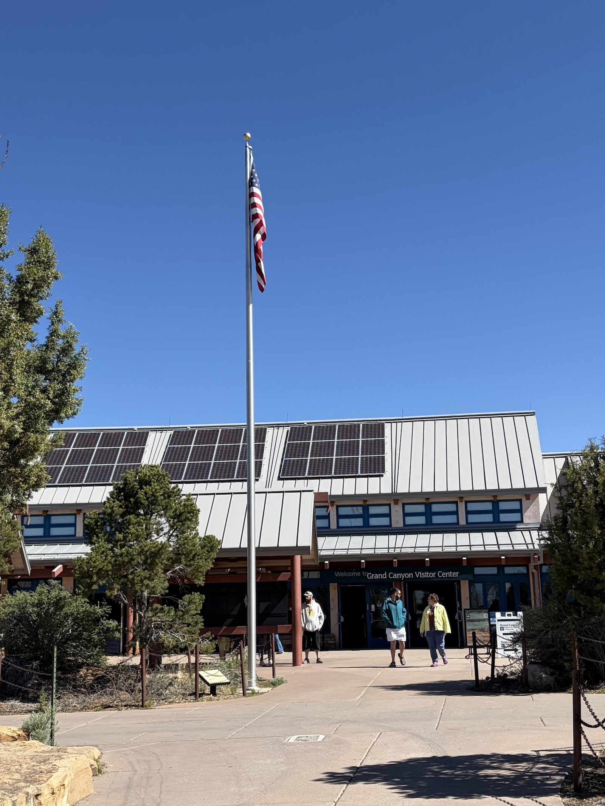
* Grand Canyon ・Grand Canyon Visitor Center * 
 

## 表情がどんどん変わるGrand Canyon
気になったGrand CanyonのView Pointを停まりながらDesert View Driveを移動。 
 
まずはDuck on a Rockに停まる。 
Yavapai Pointで遭遇した黒装束軍団が乗るバスがまたいた！ 
 

<iframe src="https://www.google.com/maps/embed?pb=!1m18!1m12!1m3!1d1613.6283788743438!2d-112.0679981016052!3d36.014023!2m3!1f0!2f0!3f0!3m2!1i1024!2i768!4f13.1!3m3!1m2!1s0x87331adeb36d644d%3A0xa1a2bb8c37ae596a!2sDuck%20on%20a%20Rock%20Viewpoint!5e0!3m2!1sja!2sjp!4v1784528545454!5m2!1sja!2sjp" width="100%" height="450" style="border:0;" allowfullscreen="" loading="lazy" referrerpolicy="strict-origin-when-cross-origin"></iframe>
 
 
 

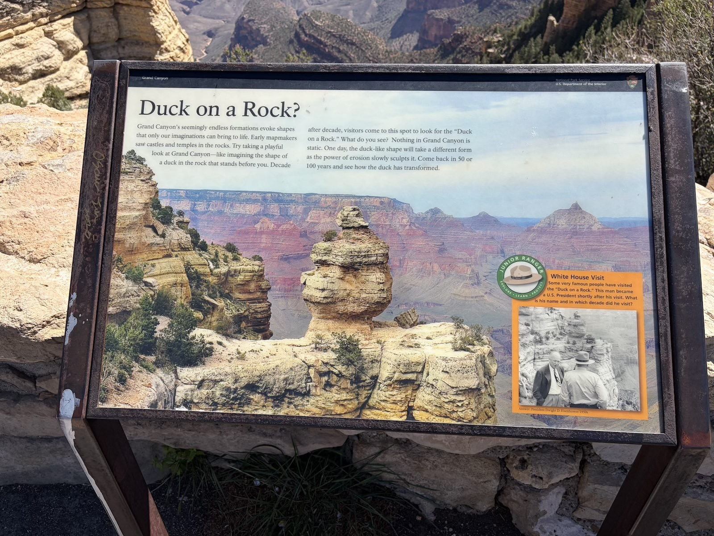
* Grand Canyon ・Duck on a Rockの看板 * 
 

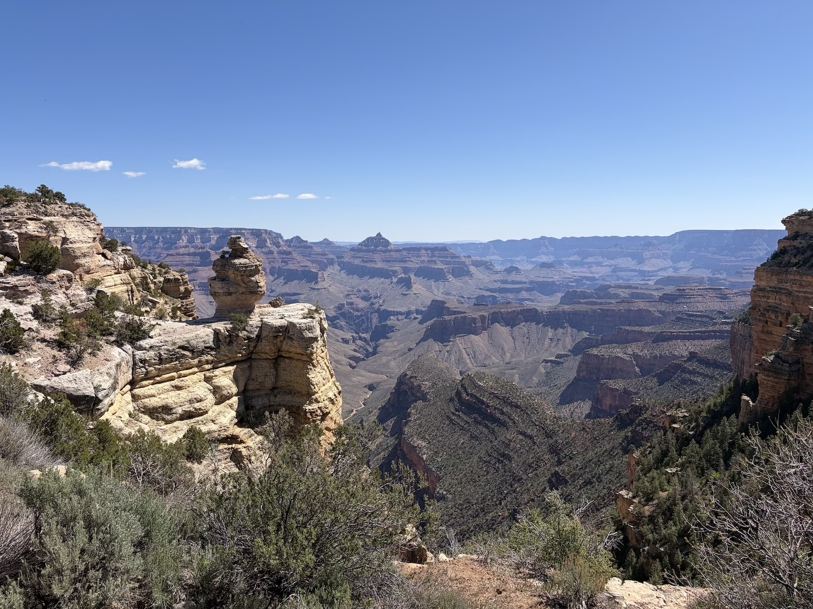
* Grand Canyon ・Duck on a Rock * 
 

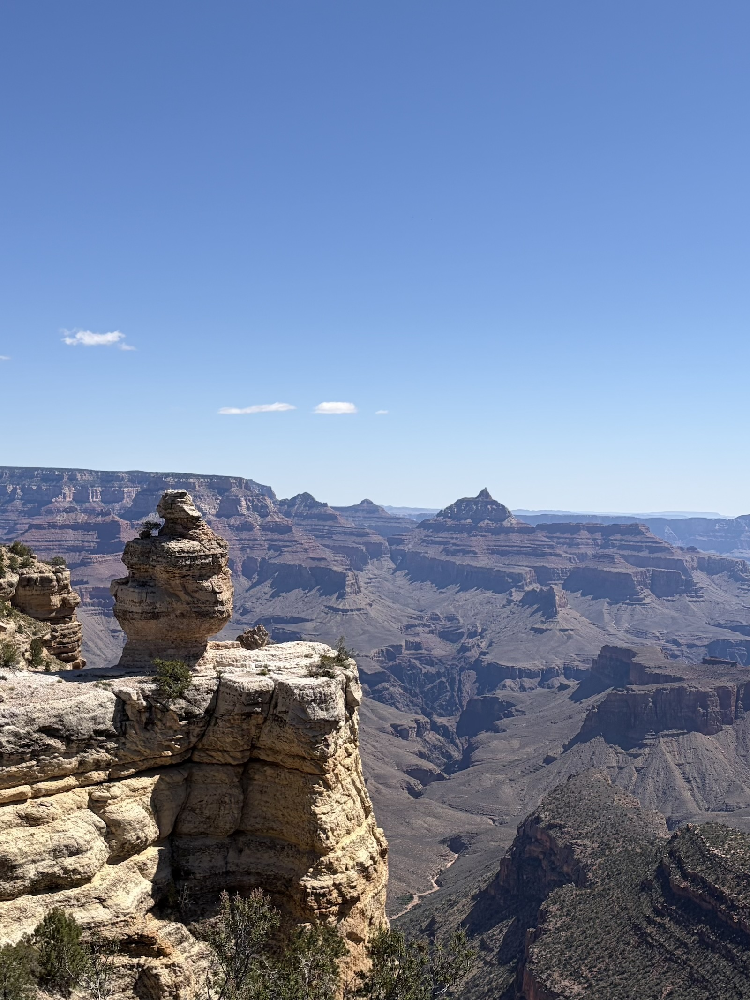
* Grand Canyon ・アヒルに見える？ * 
 

次に停まったのは、Moran Point。 
降りてみて気がついたけど、9年前にも来たことのある場所だった。 
 

<iframe src="https://www.google.com/maps/embed?pb=!1m18!1m12!1m3!1d1613.810247168263!2d-111.92665610160522!3d36.00513840000001!2m3!1f0!2f0!3f0!3m2!1i1024!2i768!4f13.1!3m3!1m2!1s0x873306c8eb46f5bb%3A0x479dae86be02e2fe!2z44Oi44Op44Oz44O744Od44Kk44Oz44OI!5e0!3m2!1sja!2sjp!4v1784528747123!5m2!1sja!2sjp" width="100%" height="450" style="border:0;" allowfullscreen="" loading="lazy" referrerpolicy="strict-origin-when-cross-origin"></iframe>
 
 
 

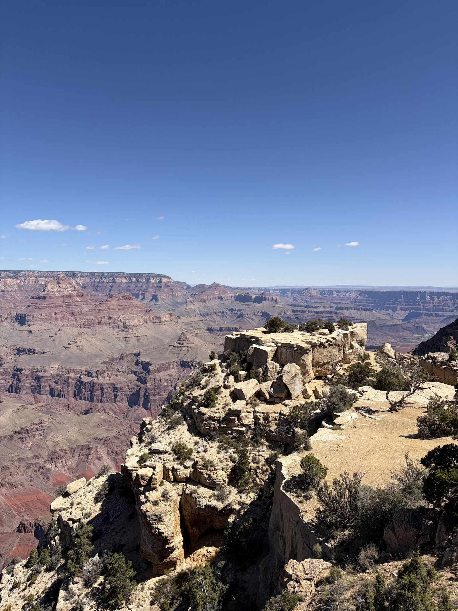
* Grand Canyon ・Moran Pointから見た風景  
 

他のお客さんについていたガイドさんが、お客さんの写真を撮っていた場所で、スミーが菅野さんと私の写真を撮ってくれる。 
 

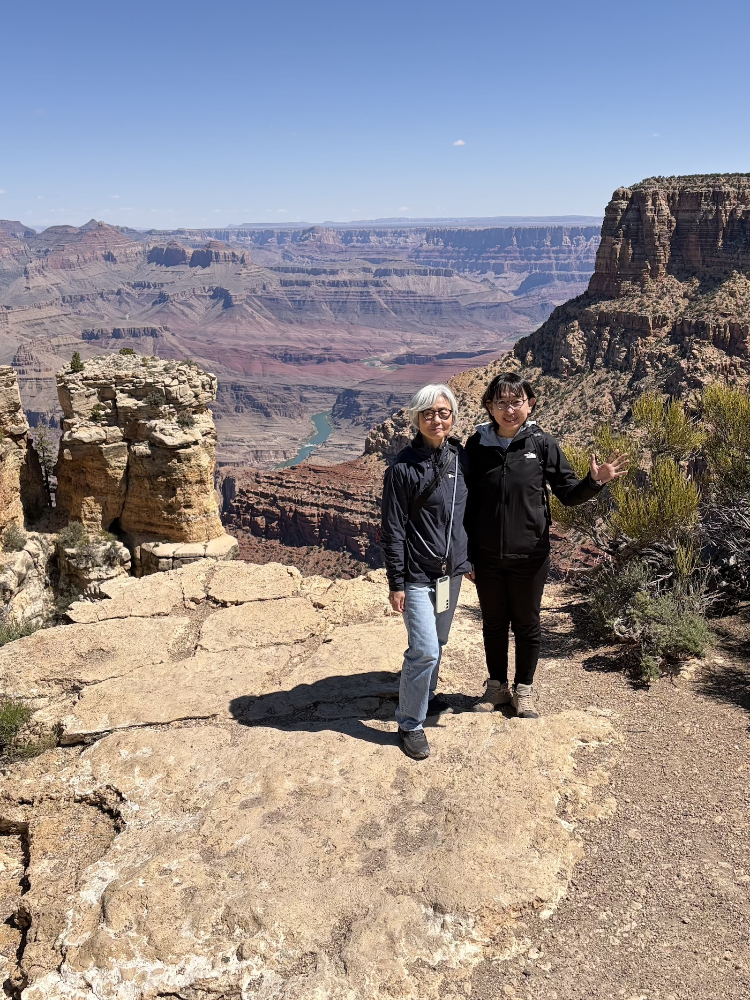
* Grand Canyon ・景色もバッチリ * 
 

それに気がついたガイドさんが、絶好のPhoto Spotで私たち3人の写真を撮ってくれる。 
どんだけ仲良いんだよ（笑） 
 

* Grand Canyon ・最高に仲良し（笑） * 
 

さすがにガイドさんだけあって、コロラド川も入った絶好のView Point。 
午前中の光線でGrand Canyonの渓谷に影がない。 
 
Lipan Point、Navajo Pointと見て回る。 
 

* Grand Canyon ・Lipan Pointの看板 * 
 

* Grand Canyon ・影がないGrand Canyon * 
 

<iframe src="https://www.google.com/maps/embed?pb=!1m17!1m12!1m3!1d1613.1958217369745!2d-111.8540553016052!3d36.035146600000004!2m3!1f0!2f0!3f0!3m2!1i1024!2i768!4f13.1!3m2!1m1!2zMzbCsDAyJzA2LjUiTiAxMTHCsDUxJzA2LjAiVw!5e0!3m2!1sja!2sjp!4v1784528856056!5m2!1sja!2sjp" width="100%" height="450" style="border:0;" allowfullscreen="" loading="lazy" referrerpolicy="strict-origin-when-cross-origin"></iframe>
 
 
 

<iframe src="https://www.google.com/maps/embed?pb=!1m18!1m12!1m3!1d1613.1312498675982!2d-111.8397899016052!3d36.03829899999999!2m3!1f0!2f0!3f0!3m2!1i1024!2i768!4f13.1!3m3!1m2!1s0x8733a9c6b5a07c71%3A0xe3695585d2769758!2z44OK44OQ44Ob44Od44Kk44Oz44OI!5e0!3m2!1sja!2sjp!4v1784528906917!5m2!1sja!2sjp" width="100%" height="450" style="border:0;" allowfullscreen="" loading="lazy" referrerpolicy="strict-origin-when-cross-origin"></iframe>
 
 
 
岬のように出ているところに塔が立っているDesert View Watchtowerに来た。 
すごい日差しで日陰がない。 
 

* Grand Canyon ・Desert View Watchtower * 
 

<iframe src="https://www.google.com/maps/embed?pb=!1m18!1m12!1m3!1d1613.0016120770485!2d-111.82869170160525!3d36.044627199999994!2m3!1f0!2f0!3f0!3m2!1i1024!2i768!4f13.1!3m3!1m2!1s0x8733a9ba161d0431%3A0x9af0f5028f24e21e!2z44OH44K244O844OI44OT44Ol44O85bGV5pyb5aGU!5e0!3m2!1sja!2sjp!4v1784528996722!5m2!1sja!2sjp" width="100%" height="450" style="border:0;" allowfullscreen="" loading="lazy" referrerpolicy="strict-origin-when-cross-origin"></iframe>
 
 
 
ここでもまたYavapai Pointで遭遇した黒装束軍団に会う。 
Grand Canyonの谷に向かって手には小さな聖書のようなものを開き、みんな個人個人でブツブツ言って祈りを捧げているように見える。 
ガラケーで電話してる人もいれば、ベビーカーを押している人もいる。 
いったいなんの集団？ 
 
後で調べたら、ヘブライ語で書かれた本、文字の向きや書体からユダヤ教の聖典、おそらく祈祷書（シドゥール／Siddur）か聖書（タナッハ）ではないかと思われる。 
 

* Grand Canyon ・謎の黒装束軍団のお祈り * 
 

前回も登ったので、今回もタワーに登ろうと思ったら、時間予約制で登ることができなかった。 
最近はなんでも時間予約制になっているらしい。 
 
Informationのおじさんにお昼は食べたか？と聞かれる。 
食べてないと言ったら、Cameronで大きなパイを食べるといいよと勧められる。 
ちょうどお昼だから、行ってみよう！ということになる。 
 

* Grand Canyon ・Informationのところに出ていた気象情報 * 
 

Desert View Trading Post のGift Shop & Snack Barでお土産を見る。 
 

* Grand Canyon ・Desert View Trading Post * 
 

黒装束軍団がお土産を買うのにレジ前で長蛇の列。 
やっぱり、この人たちは修学旅行なのだろうか？ 
 
とてもこの長蛇の列に並んで、何かを買う気持ちになれない…と思っていたら、スミーがさっさと会計を済ませて戻ってくる。 
彼女たちが並んでいたのは現金専用レジで、カード専用レジは空いていたそうだ。 
そういえば、レジで現金を出して数えて払ってる。 
 
Grand Canyonともこれでお別れ。 
Grand Canyon National Parkの標識の写真を撮る。 
 
Grand Canyon National Park South Rimを出るところに大きな看板を発見。 
看板娘としては写真を撮りたい。 
ということで車を停めて写真を撮りに行ったのだけど、大勢のバイク乗りの集団がみんなで看板前で記念撮影。 
 
撮ってあげたかったけど、なんて声をかけたらいいのか分からなくて声がかけられなかった…
とても残念。 
 
バイク乗りの集団の記念撮影が終わってから、看板の写真を撮る。 
 

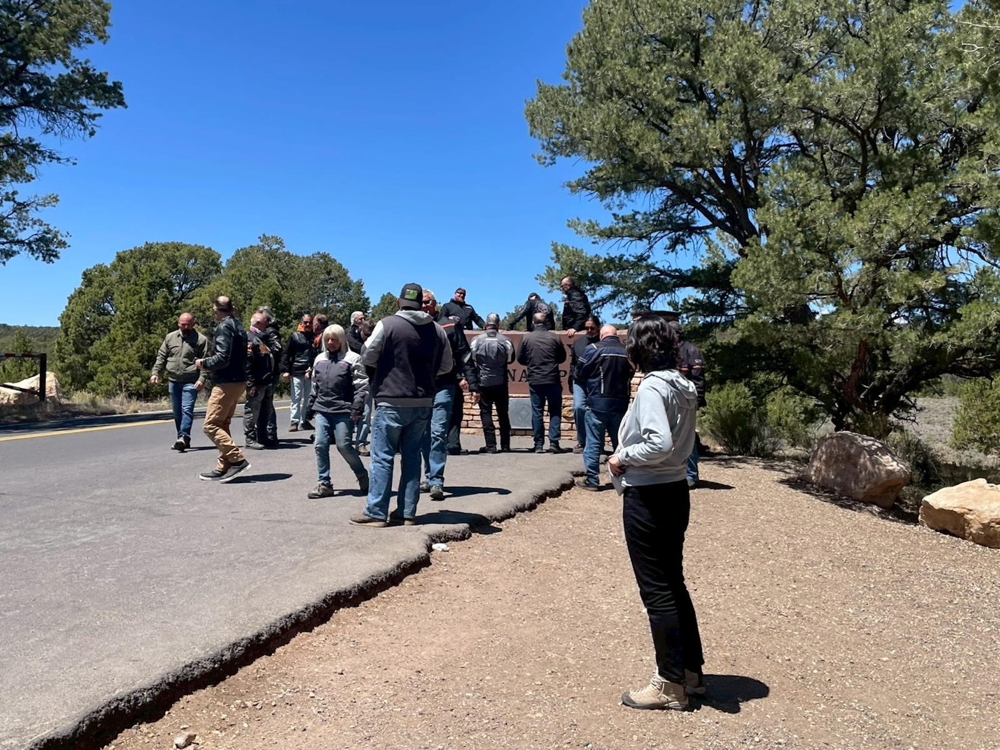
* Grand Canyon ・バイク乗りの集団に声がかけられない私 * 
 

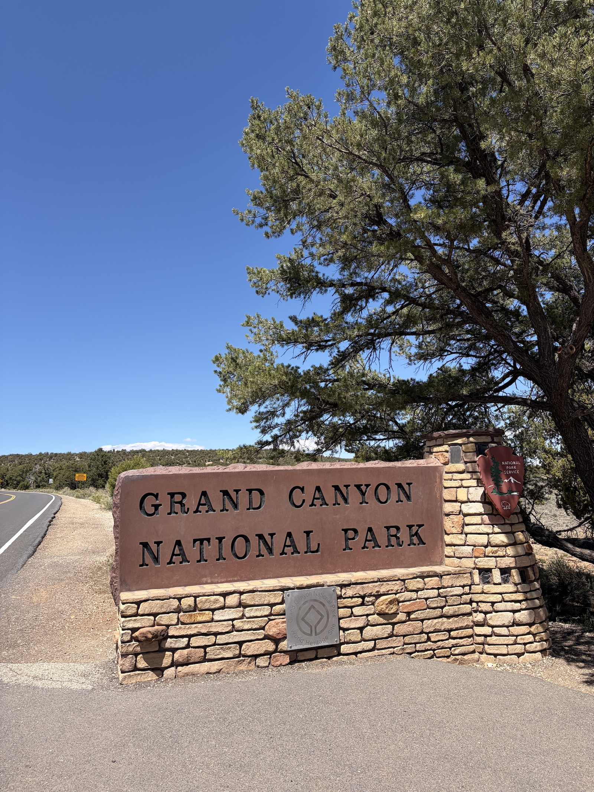
* Grand Canyon ・National Parkの看板 * 
 

しばらく走ると地球の割れ目みたいな景色が現れる。 
 
アメリカ国旗がはためいている道端に車を停める。 
ナバホ族がやっているIndian Jewelry shopらしい。 
この付近は、地球の割れ目がすごい。 
地球が本当に割れてる。 
 

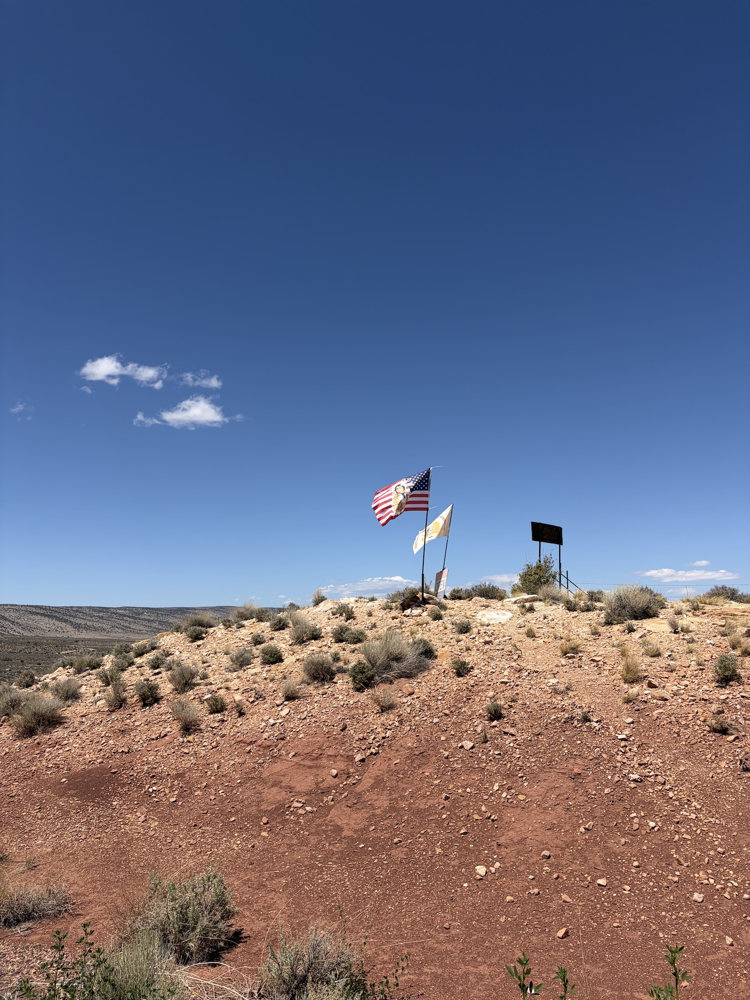
* Grand Canyon ・アメリカ国旗が目印のIndian Jewelry shop * 
 

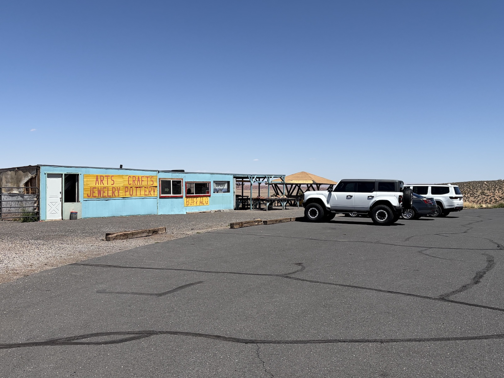
* Grand Canyon ・Indian Jewelry shop * 
 

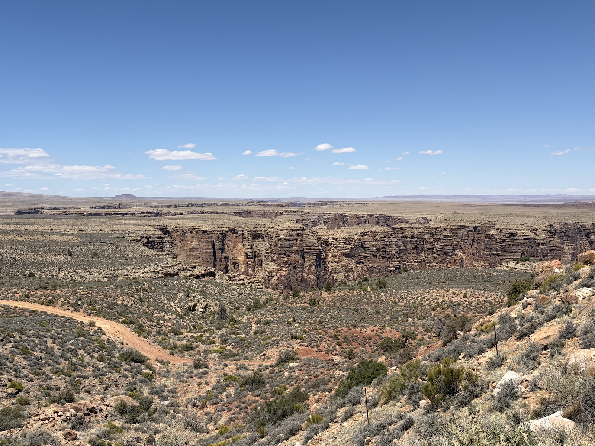
* Grand Canyon ・本当に地球が割れている * 
 

<iframe src="https://www.google.com/maps/embed?pb=!4v1784529064733!6m8!1m7!1sSFFHEXAQ667kF64YZH3i0Q!2m2!1d35.93900698475468!2d-111.6682396587144!3f356.46692!4f0!5f0.7820865974627469" width="100%" height="450" style="border:0;" allowfullscreen="" loading="lazy" referrerpolicy="strict-origin-when-cross-origin"></iframe>
 
 

## 大きなパイはどれ？！
Desert View Trading Post のInformationのおじさんに教えてもらったCameron Trading Postは、ちょうど走る予定の道中にあった。 
T字路の突き当たりを左に曲がって少し行ったところの左側に大きなホテルとレストラン、お土産物屋さんのCameronがあった。 
 

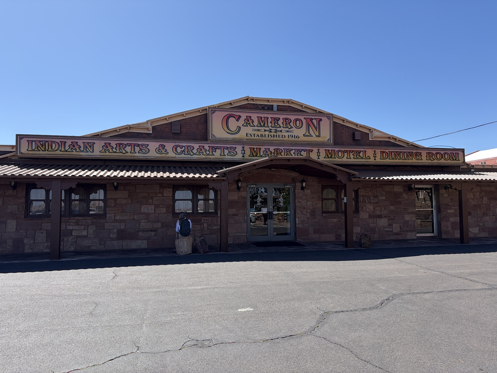
* Cameron Trading Post ・映画の撮影所のようなCameron Trading Post * 
 

<iframe src="https://www.google.com/maps/embed?pb=!1m18!1m12!1m3!1d1616.456816851571!2d-111.41595740160523!3d35.87563330000001!2m3!1f0!2f0!3f0!3m2!1i1024!2i768!4f13.1!3m3!1m2!1s0x873307eb794f285d%3A0x76b9f77f187f60bf!2z44Kt44Oj44Oh44Ot44Oz44O744OI44Os44O844OH44Kj44Oz44Kw44O744Od44K544OI!5e0!3m2!1sja!2sjp!4v1784529122720!5m2!1sja!2sjp" width="100%" height="450" style="border:0;" allowfullscreen="" loading="lazy" referrerpolicy="strict-origin-when-cross-origin"></iframe>
 
 
 
大きなお土産物屋さんの中を通り抜けて、一番奥にあるレストランへ。 
レストランの中も相当広い。 
 

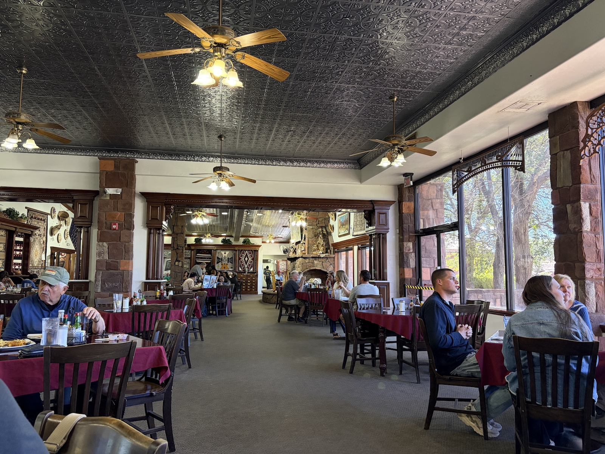
* Cameron Trading Post ・広い店内 * 
 

メニューを一生懸命探したけどパイが見当たらない。 
仕方ないので、サラダとクラブハウスサンドを頼んでみんなでシェア。 
 

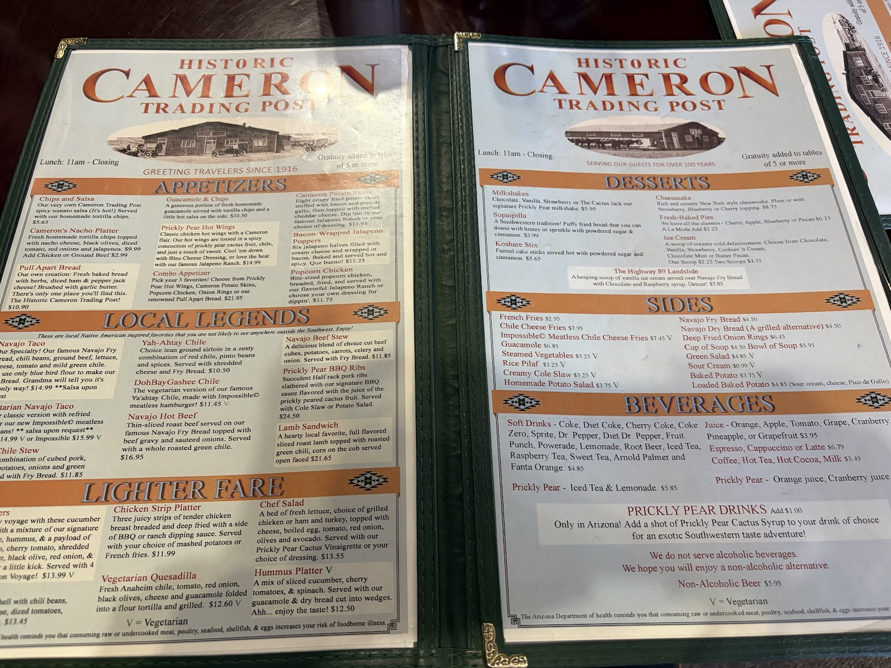
* Cameron Trading Post ・メニューを探してもパイがない！ * 
 

隣のテーブルに日本人のグループがやってきて、デカいパイを頼んでる！ 
1人1個頼んだのか？ 
次々に運ばれてくるデカいパイ。 
あれだ！ 
あれはいったいなんだったのだろう？ 
 

--- 

 

**📖 コラム｜Navajo Fry Bread**  
 
フライブレッドは、小麦粉・塩・ベーキングパウダー・水（またはミルク）だけで作る、ナバホ族伝統の揚げパン。 
大きくて平らで、直径30cm近くになることもあり、「パイみたい」に見える。 
Cameron Trading Postでは、これを使った「Navajo Taco（インディアン・タコ）」が特に有名で、フライブレッドの上にビーンズ、ひき肉、チーズ、レタス、サルサなどをたっぷり乗せた一品。ボリューム満点で名物になっている。 
メニューには「Fry Bread」「Indian Fry Bread」と書かれていることが多い。 
 

 

---

 
 
隣の日本人グループは、1人1個のNavajo Tacoを頼んでいたけど、食べ切れるのだろうか？ 
確かにNavajo Taco以外のものは頼んでいなかったけど。 
Navajo Tacoを頼んでいたら、チーズが入ってるからスミーは食べられなかったね。 
 

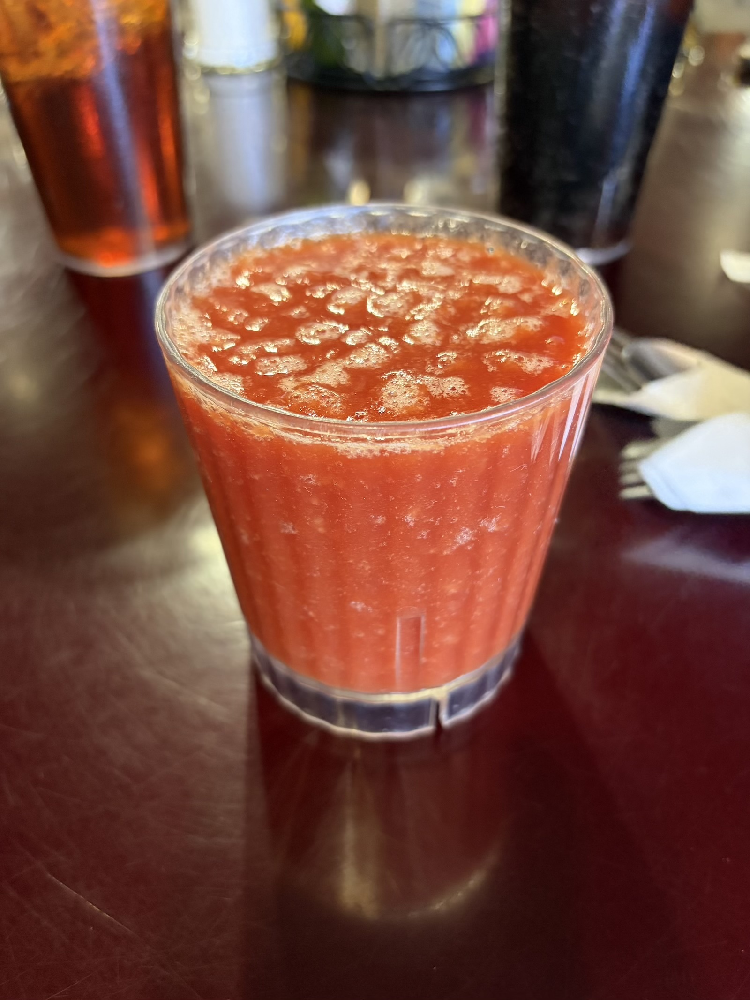
* Cameron Trading Post ・トマトジュース * 
 

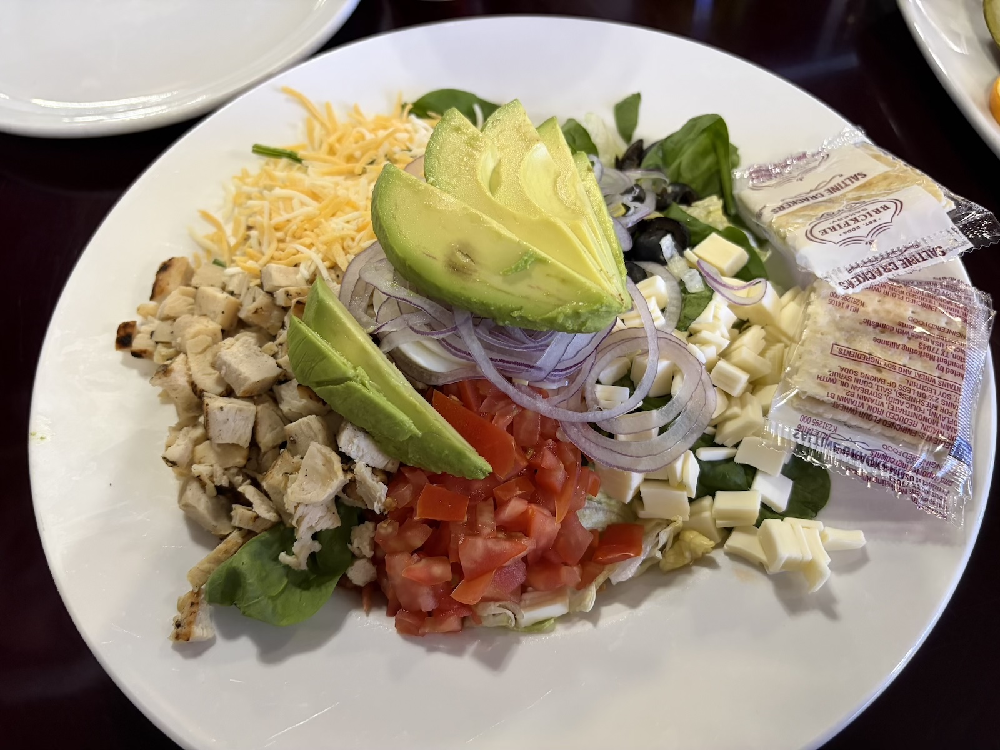
* Cameron Trading Post ・Cobb salad * 
 

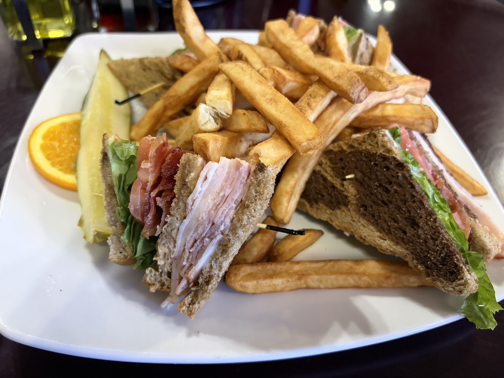
* Cameron Trading Post ・Clubhouse sandwich * 
 

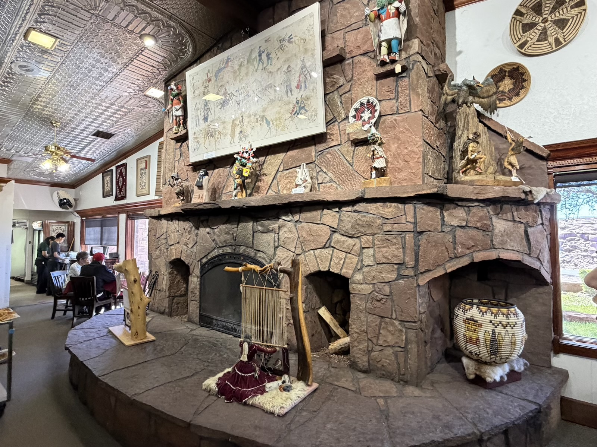
*Cameron Trading Post ・ネイティブアメリカンのグッズがたくさん* 
 

食事を終えて、お土産コーナーへ。 
お土産コーナーが充実。 
スミーはココペリのコースターを購入。 
 

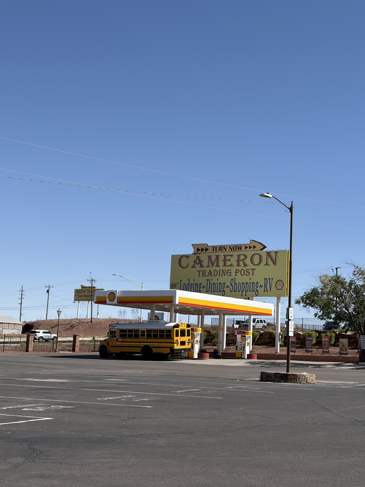
* Cameron Trading Post ・お店の横にあるガソリンスタンド * 
 
 

## ナバホ族の古い橋
この辺り一帯は、ナバホ族の自治区 Navajo Nationとなっている。 
フェニックスの時間と1時間の時差なのだけど、いろんな時計表示がそれに追いつけない。 
車の時刻表示、私のiPhone、スミーのiPhoneそれぞれが違う時間を示して大混乱。 
 
時間が一致してないのって、怖いよね… 
明日のAntelope Canyon のツアーの予約時間を間違えないようにしないと。 
 

--- 

 

**📖 コラム｜Navajo Nation**  
 
ナバホ・ネイション（Navajo Nation）は、ナバホ族（Diné）の居留地で、アメリカ合衆国内で最大の先住民居留地。 
アリゾナ、ニューメキシコ、ユタの3州にまたがり、面積は約7万1,000平方キロメートル（九州とほぼ同じ大きさ）。 
 
単なる「居留地（reservation）」ではなく、独自の政府・議会・法律・警察を持つ「主権を持つ国家的存在」として認められているため、ネイション（nation）と呼ばれる。アメリカ合衆国の中にある、半自治的な政治体。 
 

 

---

 
 
しばらく走るとGrand Canyonを外側から見られる。 
 

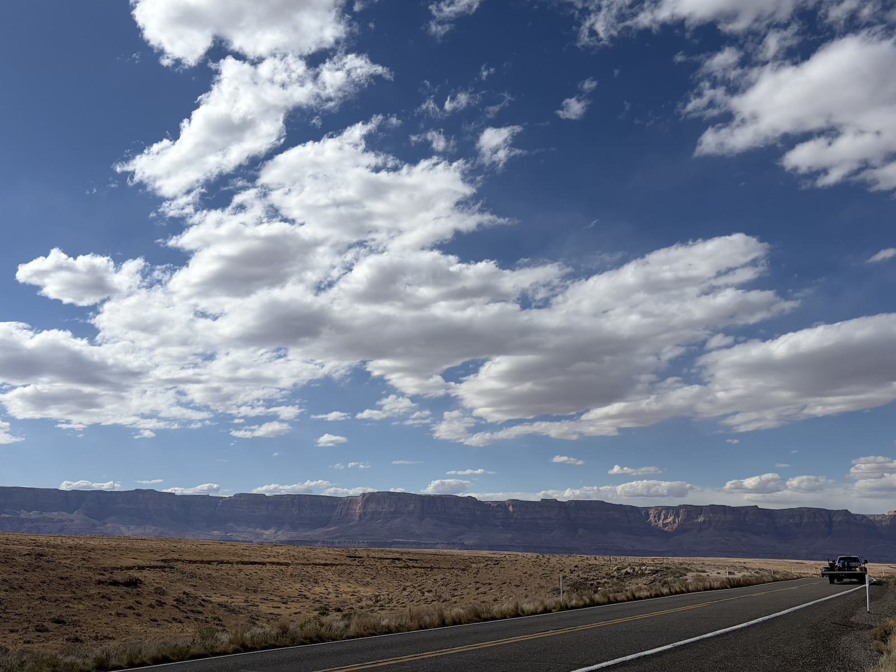 
* Grand Canyon・Grand Canyonを外から見る * 
 

<iframe src="https://www.google.com/maps/embed?pb=!4v1784529756806!6m8!1m7!1sSLwTKR8ItuGycM6fa4X7nQ!2m2!1d36.68151090920828!2d-111.6539458939739!3f331.9791268745665!4f-12.608220721883995!5f0.7820865974627469" width="100%" height="450" style="border:0;" allowfullscreen="" loading="lazy" referrerpolicy="strict-origin-when-cross-origin"></iframe>
 
 

そして少しその先に出てきたのがHistoric Navajo Bridge。 
 

<iframe src="https://www.google.com/maps/embed?pb=!1m18!1m12!1m3!1d1597.0203962892651!2d-111.63358950160521!3d36.817542399999994!2m3!1f0!2f0!3f0!3m2!1i1024!2i768!4f13.1!3m3!1m2!1s0x87346fb39678ced9%3A0x745158d44c6efaab!2sHistoric%20Navajo%20Bridge!5e0!3m2!1sja!2sjp!4v1784529327966!5m2!1sja!2sjp" width="100%" height="450" style="border:0;" allowfullscreen="" loading="lazy" referrerpolicy="strict-origin-when-cross-origin"></iframe>
 
 
 
車を停めて歩いて見に行く。 
ものすごい日差しで灼熱。 
帽子がないととてもいられない。 
 

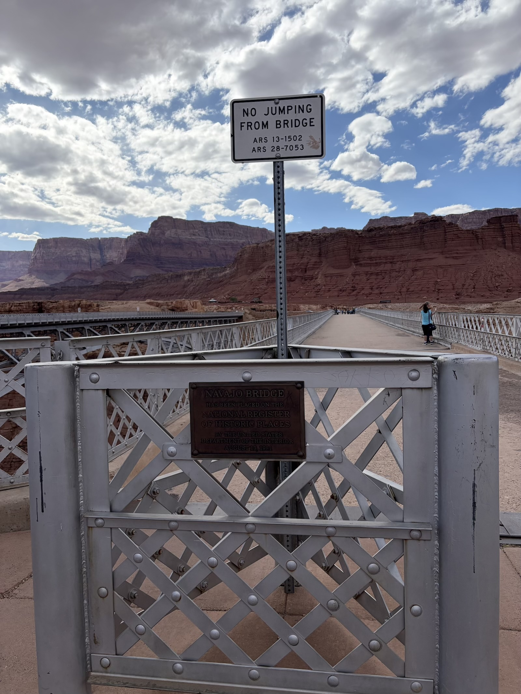
* Historic Navajo Bridge ・橋の入り口 * 
 

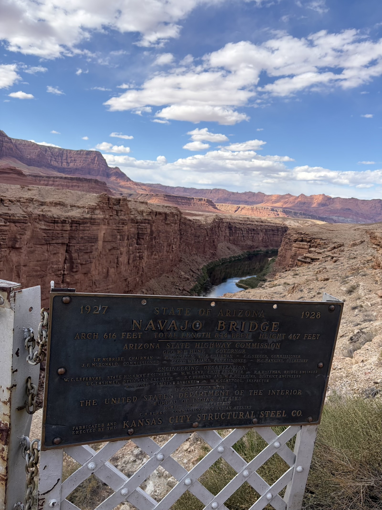
* Historic Navajo Bridge ・橋の銘板 * 
 

橋の上からコロラド川を見る。 
 

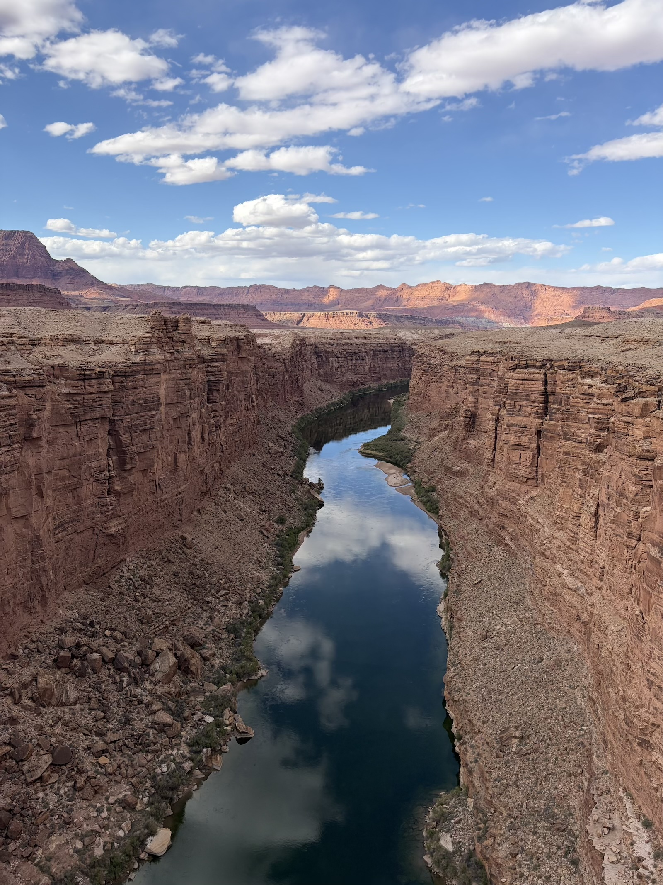
* Historic Navajo Bridge ・Navajo Bridgeの上から見たコロラド川。川面に雲がうつる * 
 

何かのグループでおじさんとおばさんの集団が橋の上で話をしている。 
その中のおじさんに呼び止められ、指を指す方を見たらカラスが死んでた… 
 

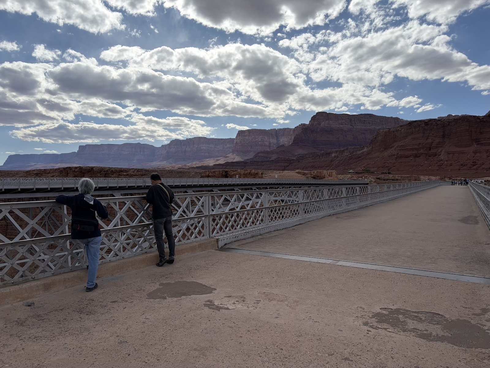
* Historic Navajo Bridge ・橋の上から覗き込むスミーと菅野さん * 
 

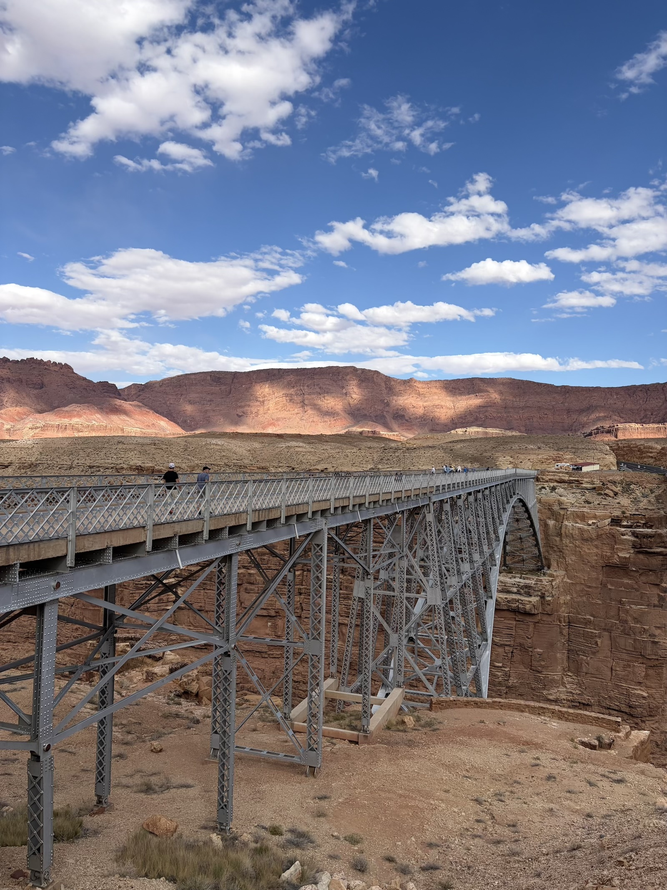
* Historic Navajo Bridge ・Historic Navajo Bridge 全景 * 
 

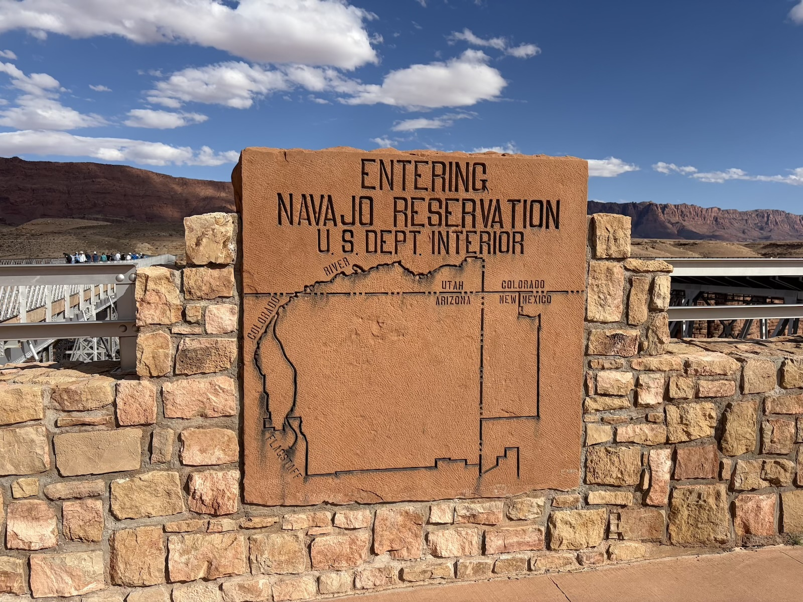 
* Historic Navajo Bridge ・説明看板 * 
 

 
* Historic Navajo Bridge ・なんて空が広いのだろうか * 
 

あんなに遠くから眺めていたコロラド川が、かなり近くまでやってきた。 
地球の割れ目に川が流れている感じ。 
 
Historic Navajo Bridgeを出てすぐの辺りの坂道に車を停めて、また外からのGrand Canyonを見る。 
 

 
* Hwy89 ・Grand Canyonを外から見る * 
 

<iframe src="https://www.google.com/maps/embed?pb=!4v1784555559055!6m8!1m7!1sKGzz8pX97xBLd6gbafVbpg!2m2!1d36.6603316984986!2d-111.6328761416101!3f276.56567!4f0!5f0.7820865974627469" width="100%" height="450" style="border:0;" allowfullscreen="" loading="lazy" referrerpolicy="strict-origin-when-cross-origin"></iframe>
 
 
 
Antelope Passという切り通しを通り抜ける。 
 

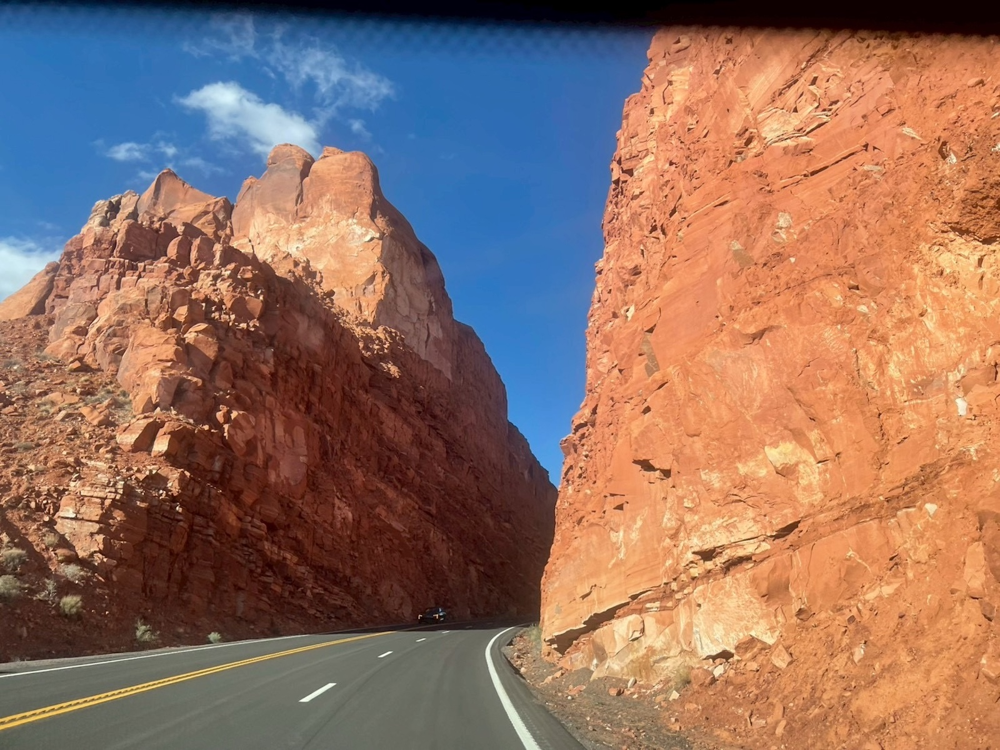 
* Hwy89 ・Antelope Pass * 
 

<iframe src="https://www.google.com/maps/embed?pb=!1m18!1m12!1m3!1d14947.467716352836!2d-111.64361615604938!3d36.65188035775318!2m3!1f0!2f0!3f0!3m2!1i1024!2i768!4f13.1!3m3!1m2!1s0x873477c008ef79e5%3A0xa0bb4eee22383364!2sAntelope%20Pass!5e0!3m2!1sja!2sjp!4v1784555872522!5m2!1sja!2sjp" width="100%" height="450" style="border:0;" allowfullscreen="" loading="lazy" referrerpolicy="strict-origin-when-cross-origin"></iframe>
 
 

## Horseshoe Bendは観光地化が進む
本日最後の観光スポットを目指し、車を走らせる。 
 
Horseshoe Bendは、以前来たときと違って大きな有料駐車場が出来上がってた。 
Horseshoe Bendまでの道も、以前は普通に石ころの道なき丘を一生懸命登って降りたら、目の前にあった！という感じだったけど、迂回する舗装されたきれいな広い道が出来上がっててびっくり。 
 

<iframe src="https://www.google.com/maps/embed?pb=!1m18!1m12!1m3!1d3191.5609619147554!2d-111.51215250072981!3d36.87692639998829!2m3!1f0!2f0!3f0!3m2!1i1024!2i768!4f13.1!3m3!1m2!1s0x87346d006468ced5%3A0x7386dc91989420b8!2sHorseshoe%20Bend%20Overlook!5e0!3m2!1sja!2sjp!4v1784529841527!5m2!1sja!2sjp" width="100%" height="450" style="border:0;" allowfullscreen="" loading="lazy" referrerpolicy="strict-origin-when-cross-origin"></iframe>
 
 
 
そして、もちろんどこにも日陰はなく、灼熱の夕日を浴びながら荒野を歩く。 
この日差しと暑さが体力を奪う。 
日差しが強すぎて暑くてつらい。 
 

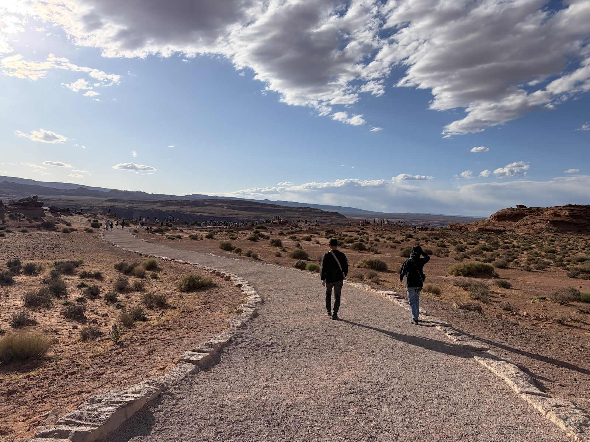 
* Horseshoe Bend・果てしない灼熱の道を歩くスミーと菅野さん * 
 

Horseshoe Bendには展望台ができていて、安全に観られるようになってた。 
 
前回は柵も何もなくて、普通に立っていたらHorseshoe Bend全体は見えないので、崖の上に寝そべって、落ちないように覗き込む感じだった。 
観光客もいたけど、そこまで多い感じではなかった。 
まったく今と比にならない。 
 
今は、ご丁寧にHorseshoe Bendの全体を無理なく見られるように、ちょっと突き出した展望デッキができていた。 
 
夕方の光線の関係で、Horseshoe Bendも陰が多い。 
 

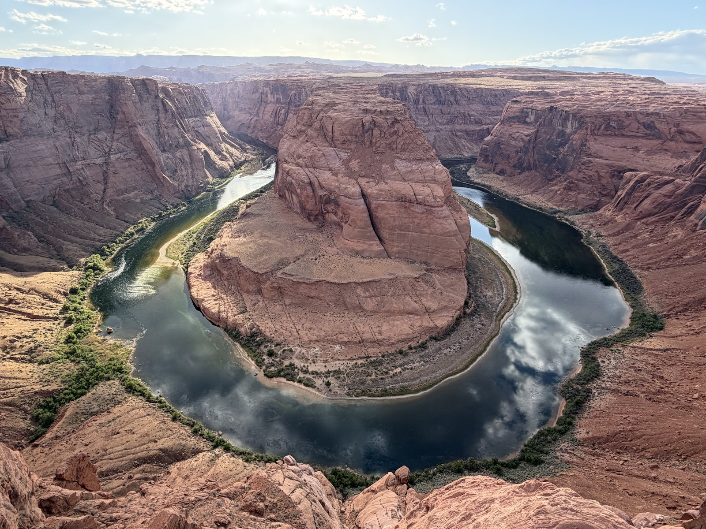 
* Horseshoe Bend・展望台のおかげで全景が無理なく撮れるようになったHorseshoe Bend * 
 

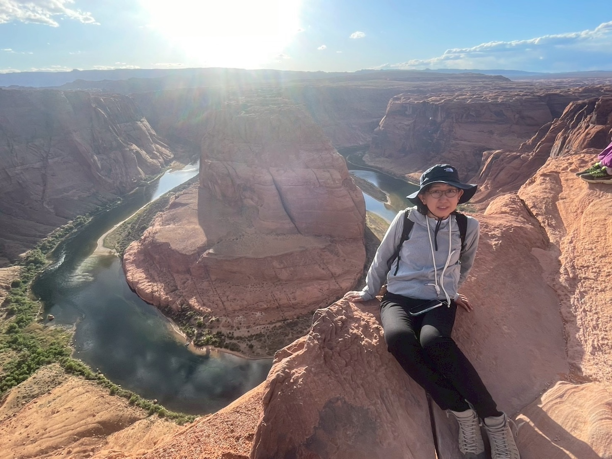 
* Horseshoe Bend・Horseshoe Bendをバックに私のグラビア* 
 

どこを切り取っても観光客が入る（笑） 
岩の上にココペリみたいな人がいた。 
 

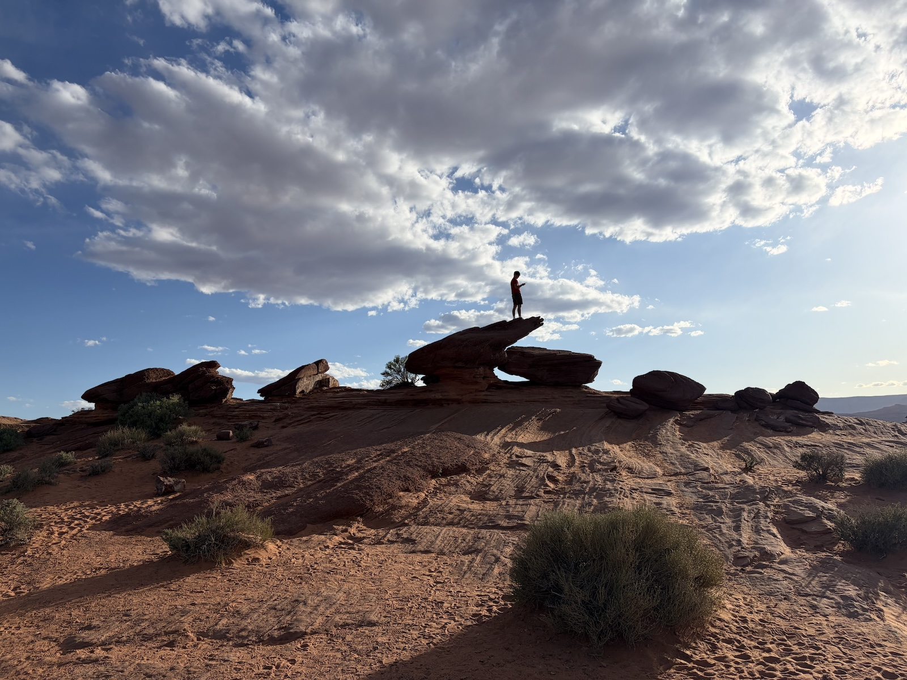 
* Horseshoe Bend・リアル ココペリ * 
 

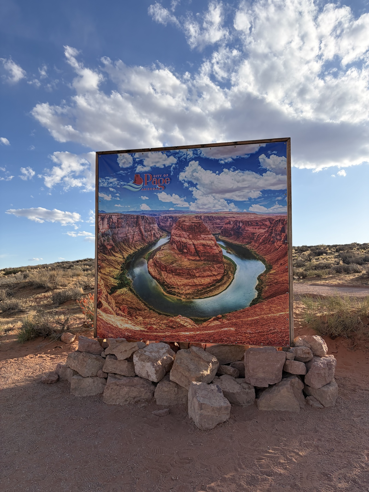 
* Horseshoe Bend・大きくていかにもなHorseshoe Bendの看板 * 
 

行きはよいよい、帰りは怖いで、帰り道はずっと上り坂。 
筋肉痛と足のマメで身体中が痛い… 
灼熱の道を駐車場まで戻る。 
本当に観光地になってしまった。 
環境は整備されたけど、ものすごい人で、ちょっと残念かな。 
 
 

## Pageの街へ
Horseshoe BendからPageの街は目と鼻の先。 
Horseshoe BendとAntelope Canyonを観光資源に、Pageの街がどんどん開発され、ホテルがタケノコのように立ち始めているとスミーが言ってた。 
 
今日の宿であるHampton Inn & Suites Page - Lake Powellも、新しくてすごくきれい。 
 

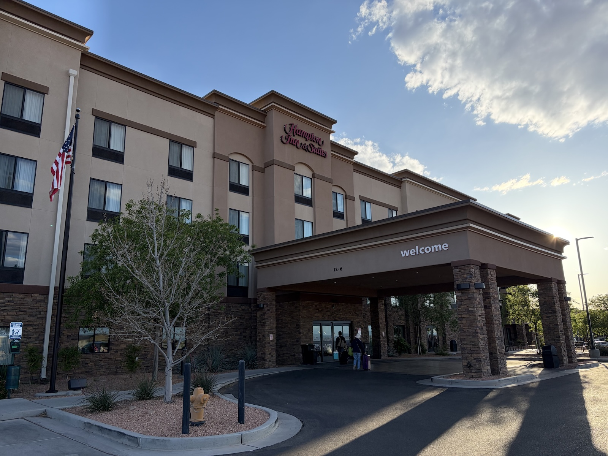 
* Page・Hampton Inn & Suites Page - Lake Powell * 
 

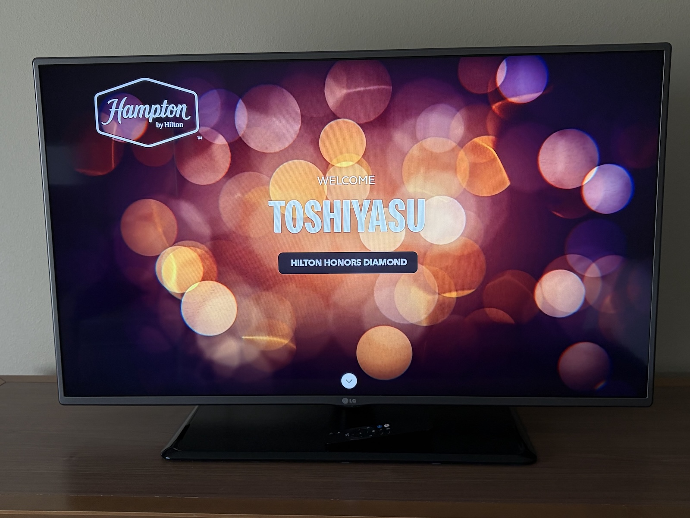 
* Page・Welcomeディスプレイ * 
 

ホテルにチェックインして、定番のSAFEWAYに買い出しに行く。 
 

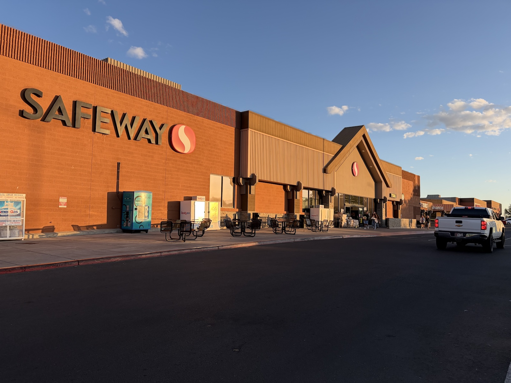 
* Page・お馴染みのSAFEWAY * 
 

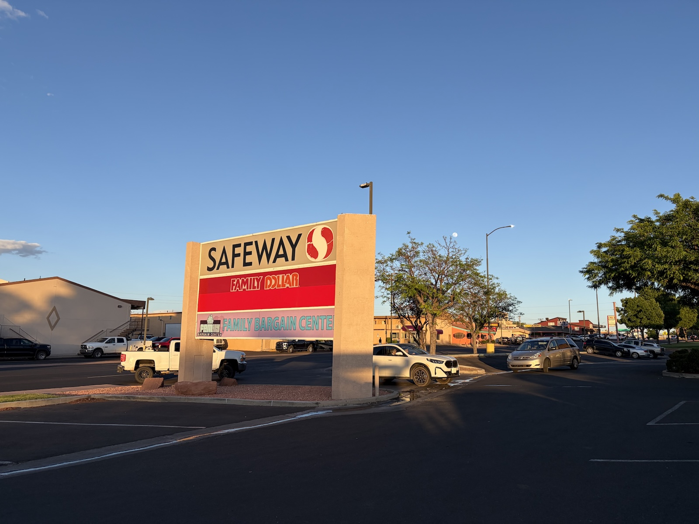 
* Page・SAFEWAYの駐車場 * 
 

<iframe src="https://www.google.com/maps/embed?pb=!1m18!1m12!1m3!1d1594.9612466944438!2d-111.4600735183818!3d36.916117497478375!2m3!1f0!2f0!3f0!3m2!1i1024!2i768!4f13.1!3m3!1m2!1s0x873414a4694e9ecf%3A0x5979a7cea411d575!2z44Oa44O844K444O744OX44Op44K2!5e0!3m2!1sja!2sjp!4v1784530101461!5m2!1sja!2sjp" width="100%" height="450" style="border:0;" allowfullscreen="" loading="lazy" referrerpolicy="strict-origin-when-cross-origin"></iframe>
 
 
 
夕食は、もはや定番となったサラダとチキン。
菅野さんは脚の指のマメ対策で、テーピングなどを購入。 
足がかなりつらい。 
 
スミーは風邪がかなり悪化。 
恐ろしく眠れる魔法の薬（風邪薬）を買うかどうするか悩む。 
 
私はアメリカに来てから、すごい乾燥で鼻血が続く。 
なんか喉もおかしい？と嫌な予感。 
 
SAFEWAYのあとに、お土産探索にWalmartへ。 
 

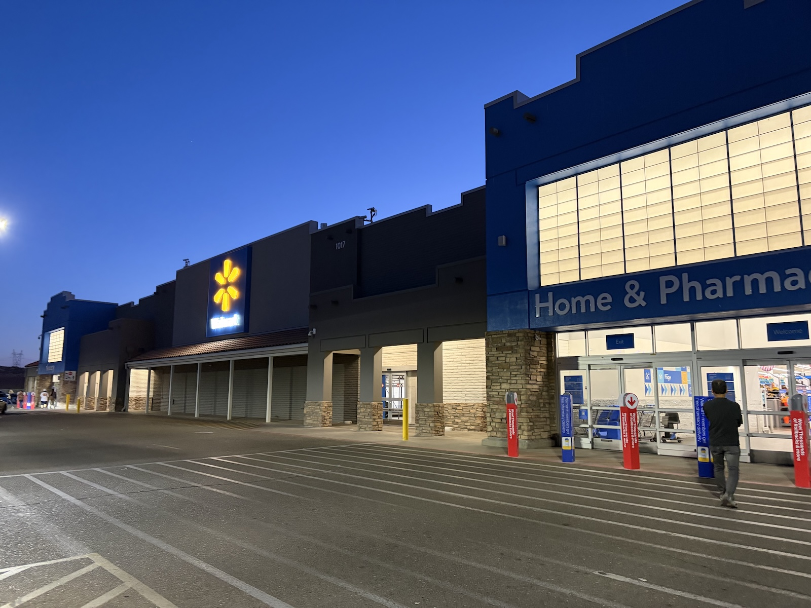 
* Page・こちらもお馴染みのWalmart * 
 

<iframe src="https://www.google.com/maps/embed?pb=!1m18!1m12!1m3!1d3190.3989269045514!2d-111.49106060321044!3d36.90472520000002!2m3!1f0!2f0!3f0!3m2!1i1024!2i768!4f13.1!3m3!1m2!1s0x87346b57e0ffc62b%3A0x17c1b5e3bae332ed!2z44Km44Kp44Or44Oe44O844OIIOOCueODvOODkeODvOOCu-ODs-OCv-ODvA!5e0!3m2!1sja!2sjp!4v1784529961183!5m2!1sja!2sjp" width="100%" height="450" style="border:0;" allowfullscreen="" loading="lazy" referrerpolicy="strict-origin-when-cross-origin"></iframe>
 
 
 
日本から持ってきた紙皿がもうなくなりそうなので紙皿と、お土産を購入。 
ビールも再調達。 
私は、ギネスのノンアルコールビールを買う。 
 
部屋に戻って、まずは洗濯！ 
洗濯物を抱えてランドリーへ。 
 
私の洗濯物が多すぎて、私だけ別の洗濯機で。 
洗濯機もカード決済だけど、スミーのカードが使えず、私のカードが使えたので、お洗濯開始。 
 
スミーの部屋に戻って部屋のみ開始。 
まったく缶を振ってないのに、ギネスを開けたら泡が吹き出る。 
なんで？！ 
 
そしてギネス缶の中から、カタカタと音がする…
なんで？！ 
 

--- 

 

**📖 コラム｜ギネスビール**  
 
泡が出るようにギネス缶の中には、Widgetという小さいプラスチック製の球体が入ってる。 
Widgetは注いだときにクリーミーな泡を作るための窒素入りカプセルで、カタカタ鳴るのは正常。 
泡が吹かないように、とにかくよく冷やすことが大切。 
 

 

---

 
 
途中で、洗濯機から乾燥機に洗濯物を移して、乾燥スタート。 
なかなか時間がかかる。 
乾燥完了時間を見計らって、洗濯物を回収。 
そして、今日は解散。 
今日も一日、お疲れさまでした。 
 
 
## 今夜の宿・Hampton Inn & Suites Page - Lake Powell
とても広い1人部屋 
 

 
* Page・きれいでとても快適なお部屋 * 
 
 

<iframe src="https://www.google.com/maps/embed?pb=!1m18!1m12!1m3!1d1595.250342669199!2d-111.48502730160521!3d36.90229160000001!2m3!1f0!2f0!3f0!3m2!1i1024!2i768!4f13.1!3m3!1m2!1s0x87346ca9742052a1%3A0x5e217a5b478cebd3!2z44OP44Oz44OX44OI44OzIOOCpOODsyDvvIYg44K544Kk44O844OEIOODmuODvOOCuCDjg6zjgqTjgq8g44OR44Km44Ko44Or!5e0!3m2!1sja!2sjp!4v1784530156468!5m2!1sja!2sjp" width="100%" height="450" style="border:0;" allowfullscreen="" loading="lazy" referrerpolicy="strict-origin-when-cross-origin"></iframe>
 
 
 
📍 **本日の移動** 
Grand Canyon Maswik Lodge → Grand Canyon / Mather Point → Yavapai Point → Geology Museum → Grand Canyon Visitor Center → Duck on a Rock → Moran Point → Lipan Point → Navajo Point → Desert View Watchtower → Desert View Trading Post / Gift Shop & Snack Bar → Indian Jewelryショップ → Cameron Trading Post → Historic Navajo Bridge → Horseshoe Bend → Hampton Inn & Suites Page - Lake Powell → SAFEWAY → Walmart → Hampton Inn & Suites Page - Lake Powell
