 # 【グランドサークル】 5日目　 Page 〜 Monument Valleyへ
###### 2026年4月30日（木）　晴れ

## 今日はゆっくりスタート
今日は、Antelope CanyonのLowerとUpperの両方に行く。 
ツアーに乗らないと見学できないので、スミーが一番最適な時間帯のツアーを予約してくれた！ 
 
ツアー時間に合わせて、珍しくゆっくりめのスタート。 
菅野さんと2人でホテルの朝食。 
久しぶりに普通に朝食を食べた。 
 

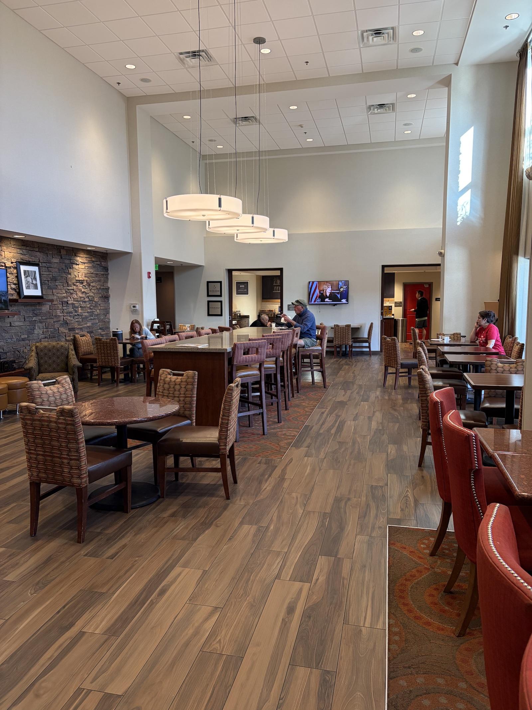
*Page・Hampton Inn & Suites Page - Lake Powellの朝食会場* 
 

薄いトーストを焼いて食べるのが意外に美味しいことを発見。 
菅野さんと日本に帰ってもやってみようと話してた。 
菅野さんはオレンジも食べてた。 
オレンジ美味しそう〜 
 
約束の時間に間に合うようにロビーに降りて、チェックアウト。 
荷物を車に積んで、まずはLower Antelope Canyon へ向かう。 
 
町の走行で朝というのもあってスクールバスが前を走る。 
スミーがスクールバスはいろいろルールがあるから近寄りたくないと。 
 

--- 

 

**📖 コラム｜スクールバス**  
 
スクールバスが赤いランプを点滅させてSTOPサインアームを出したら、前後どちらから来ていても対向車線も含めて全車両が停止しなければならない。 
これがアメリカ独自の厳しいルール。 
 
＜停止が必要なケース＞ 
・ バスの前後両方向の車両 
・ 片側1〜2車線道路では対向車も含む全車 
 
＜停止不要な例外＞ 
・ 中央分離帯がある道路では、対向車線側は停止不要な州もある（州によって異なる） 
・ アリゾナ州・ネバダ州では基本的に中央分離帯がなければ対向車も停止が必要 
 
＜いつ動いていいか＞ 
STOPサインアームが収納され、赤いランプが消えたら発進可能。 
 
＜違反した場合＞ 
罰金が非常に高額で、州によっては数百〜1,000ドル以上、免許停止になるケースも。 
観光客でも容赦なく取り締まられる。 
 

 

--- 

 
 
町中を抜けて砂漠地帯へ。 
 
前回、Antelope Canyon に来た時は、Antelope Canyonに向かう道の曲がり角の目印に大きな発電所があったはずなんだけど…ない… 
あんな巨大な発電所がなくなるなんてある？ 
 
ということでClaudeに聞いてみたら、解体されたと。 
あんな巨大なものを解体するんだ！とびっくり。 
 

--- 

 

**📖 コラム｜ナバホ発電所（Navajo Generating Station）**  
 
2019年11月18日、アリゾナ州PageのNavajo Nationに位置していたナバホ発電所（出力2,250メガワット）が、運営会社のSalt River Project（SRP）によって完全に運転停止された。 
 
停止の理由は環境規制のためではなく、シンプルに経済的な理由。 
天然ガス発電のほうが安価になるという全米的なトレンドにより、主要オーナーたちは2019年以降の運転継続を経済的に見合わないと判断した。 
 
2020年12月、発電所のシンボルだった高さ775フィート（約236m）の煙突3本が爆破解体された。 
「54秒で3本の巨塔が倒れ、大地が揺れ、Lake PowellやAntelope Canyonから見える空の景色が永遠に変わった」と担当者が述べている。 
 
そして2024年3月、約55年間にわたり貸し出されていた土地がNavajo Nationに正式に返還され、解体作業が完了した。 
 

 

--- 

 
 

## Lower Antelope Canyon の砂の迷宮へ
9:30-10:30のツアーをスミーが予約してくれたので、車でKen’s Toursのツアー受付場所まで行く。 
 

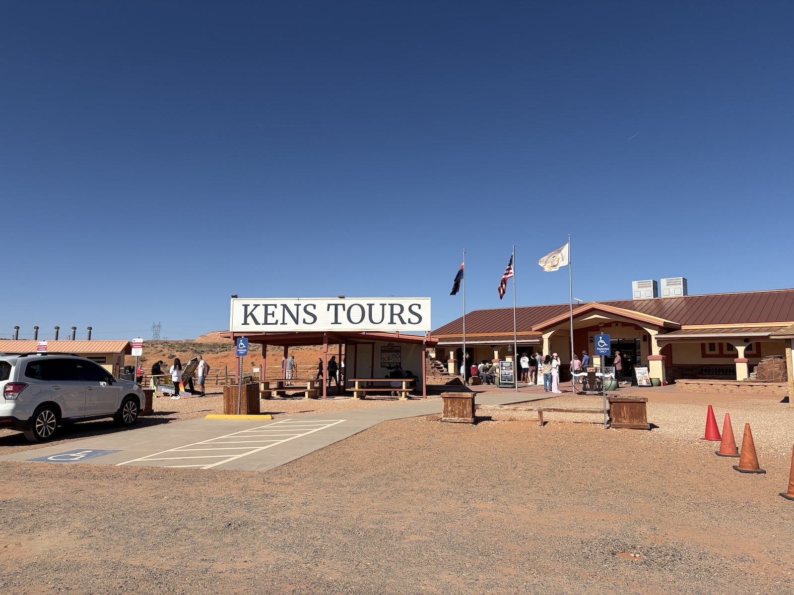
*Lower Antelope Canyon・Ken’s Toursに到着* 
 

<iframe src="https://www.google.com/maps/embed?pb=!4v1784530215549!6m8!1m7!1sCAoSF0NJSE0wb2dLRUlDQWdJQ0V2cFhjdWdF!2m2!1d36.91472217319357!2d-111.4558333172145!3f203.33347!4f0!5f0.7820865974627469" width="100%" height="450" style="border:0;" allowfullscreen="" loading="lazy" referrerpolicy="strict-origin-when-cross-origin"></iframe>
 
 
 
早速、受付をして日陰のベンチで順番を待つ。 
朝からものすごい日差し。 
 

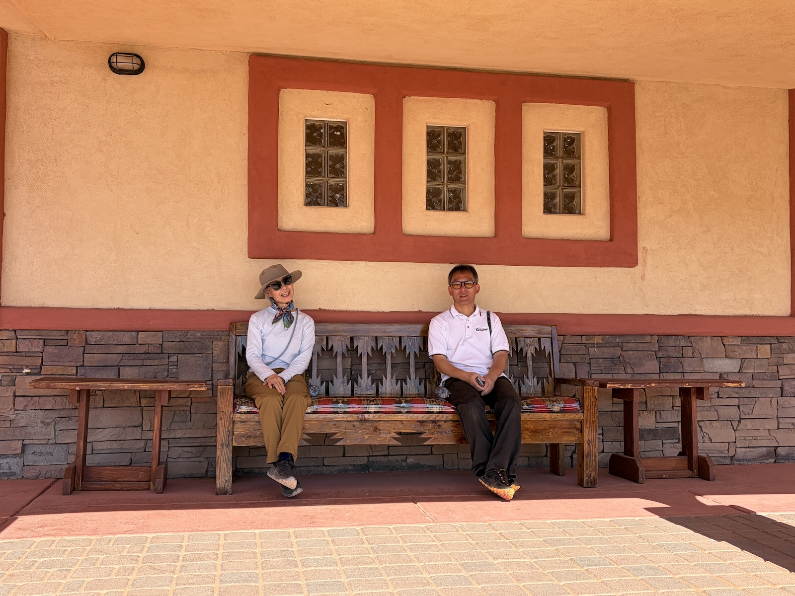
*Lower Antelope Canyon・日陰のベンチでツアーに呼ばれるのを待つ* 
 

日本人の小さい子供連れた家族が来ていて、すでにツアーが終わって戻ってきたようで、子供が「靴の中に砂が入っちゃったー！」と騒いでいた。 
かわいい。 
 
順番が呼ばれたのでエントランスへ。 
ガイドさんから注意事項を聞く。 
 
LowerもUpperも、どちらのAntelope Canyonも荷物の持ち込みは一切禁止。 
9年前に来た時には、荷物を持って入れたのだけど、荷物が砂の壁に当たって傷ついたりと思うと、確かに持ち込み禁止が正解だよねと思う。 
 
持ち込めるのはスマホとペットボトル1本くらいなので、注意が必要。 
パスポートはポケットなどに入れて。 
 

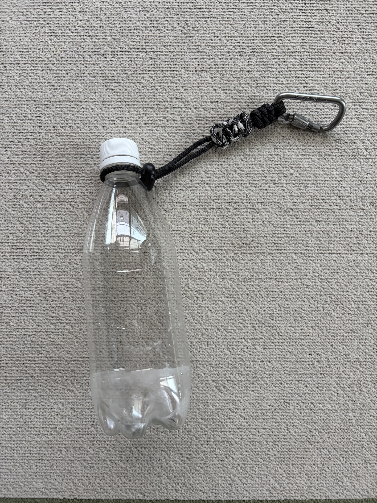
*Lower Antelope Canyon・ペットボトルはこのフォルダーで手ぶらで入場* 
 

iPhoneのカメラはビビッドで撮影するといいよとアドバイスがある。 
iPhoneは万国共通だから説明する方も、聞く方も楽だな〜と思う。 
早速、ビビッドのモードに設定。 
 
全部で10〜15人くらいが一つのグループでまとまって、1人のガイドさんがつく。 
入り口まで歩く。 
前回来た時よりも中が整備されている感じがする。 
 

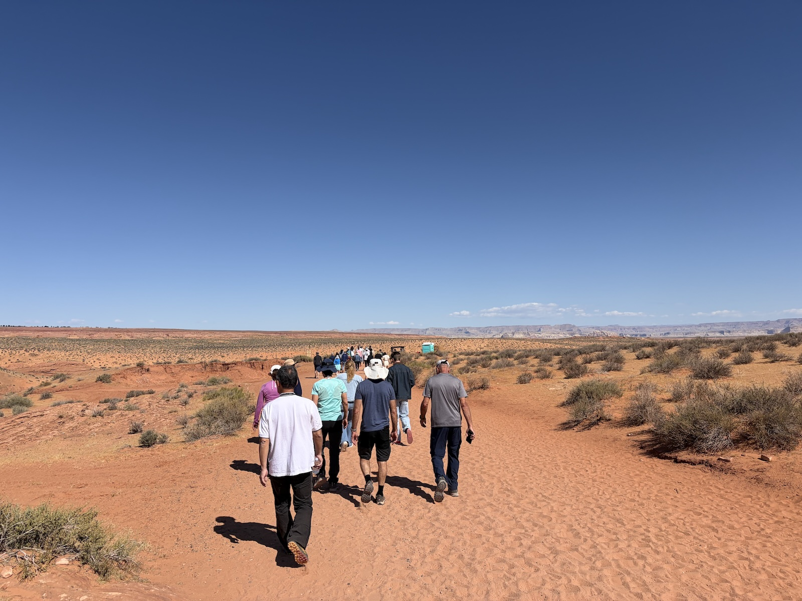
*Lower Antelope Canyon・入り口まで砂漠を歩く* 
  

Antelope Canyon は安定の美しさ。 
ガイドさんのアドバイスの通りに、iPhoneのビビッドで撮影すると、ものすごくキレイに撮れる。 
 
岩の造形が動物の顔に見えるところがあったり、自分の想像次第でいろんなものに見える。 
 

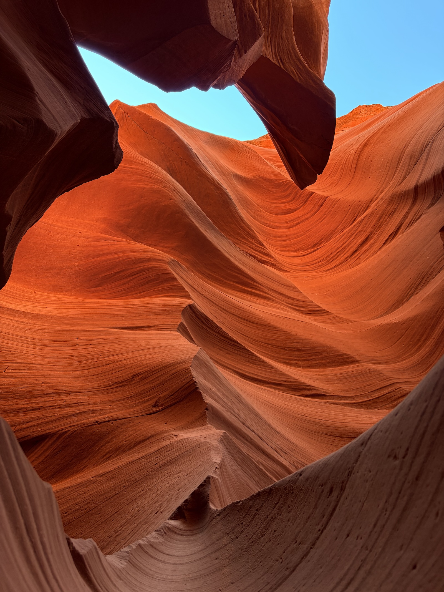
*Lower Antelope Canyon・自然が作り出した芸術* 
 

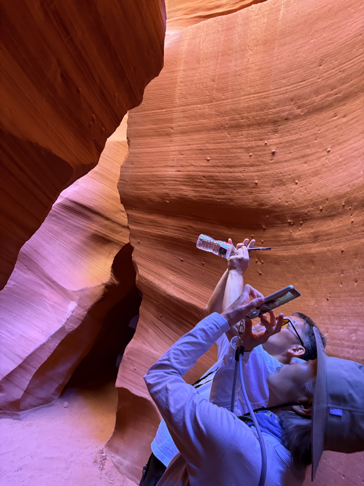
*Lower Antelope Canyon・みんな写真を撮るのに必死* 
 

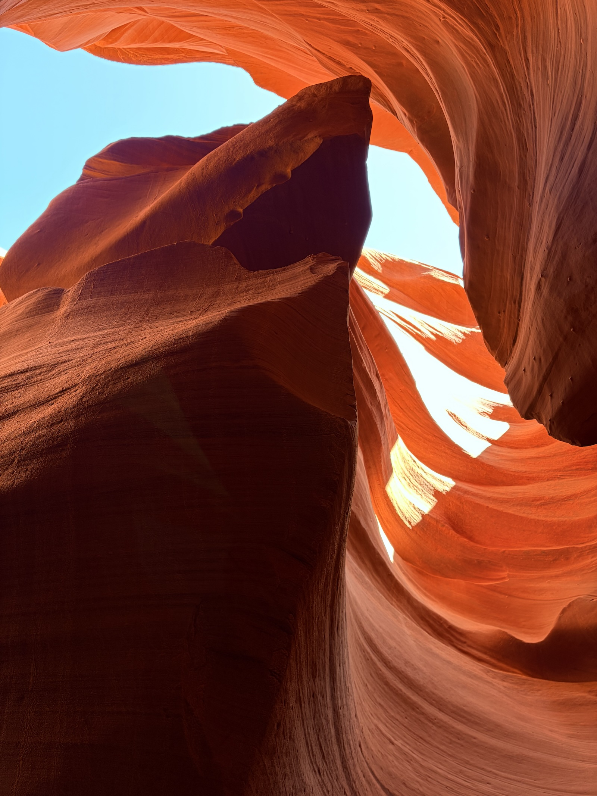
*Lower Antelope Canyon・狼みたいな顔に見える* 
 

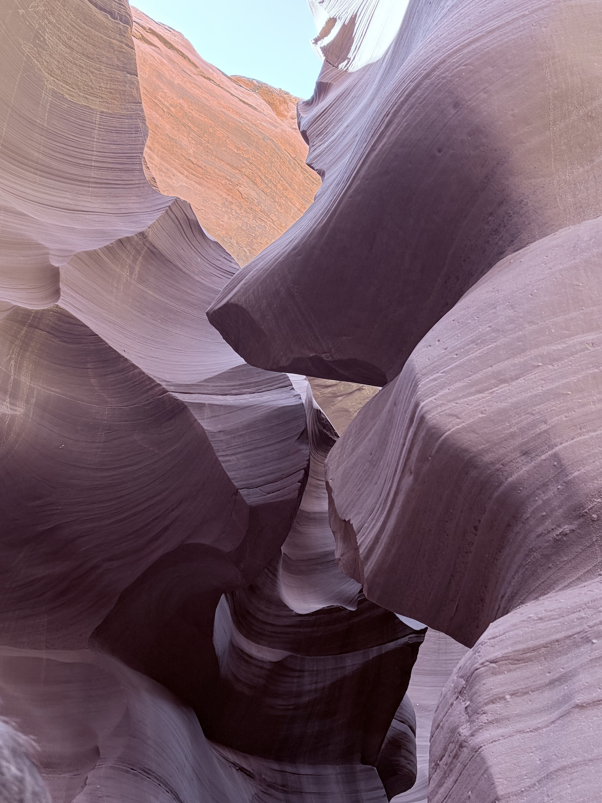
*Lower Antelope Canyon・iPhoneの通常モードで撮るとこんな感じでぜんぜん違う* 
 

ガイドさんに撮影ポイントを教えてもらったり、また特定の撮影ポイントでガイドさんが写真を撮ってくれたりする。 
ツアーに参加しているグループ単位で写真を撮ってくれるので、みんなでいい写真が撮れて嬉しい。 
ナイスなサービスだと思う。 
 

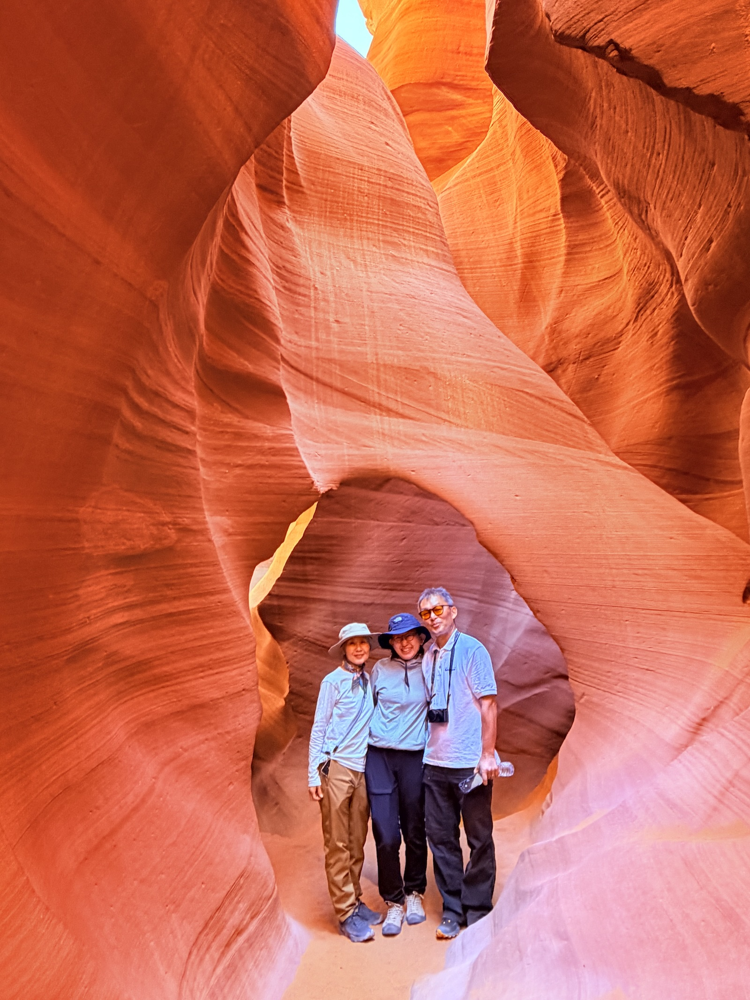
*Lower Antelope Canyon・3人で一緒に記念撮影* 
 

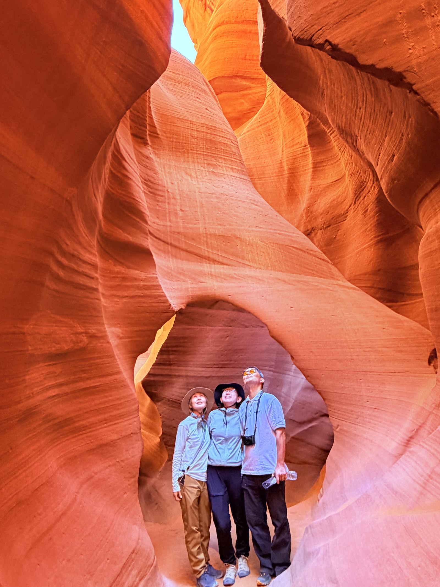
*Lower Antelope Canyon・「上を見て！」とガイドさんに言われる* 
 

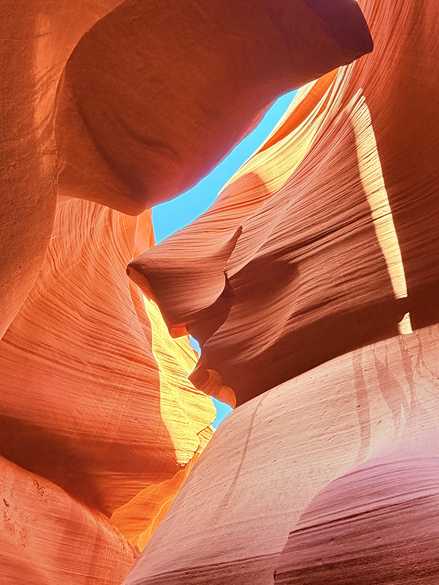
*Lower Antelope Canyon・何に見える？* 
 

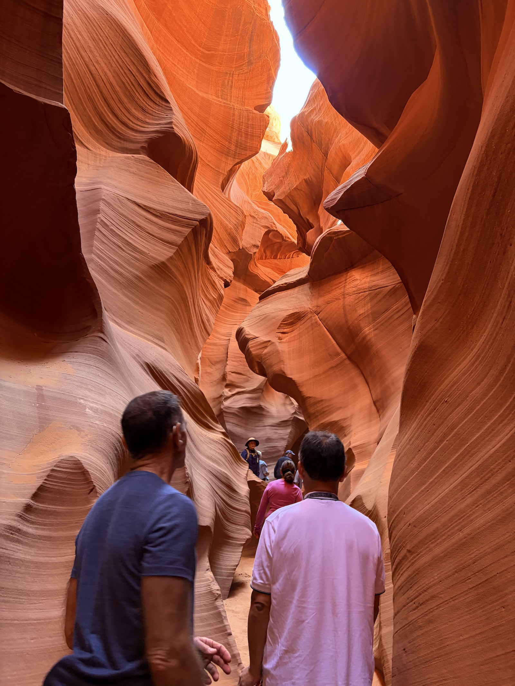
*Lower Antelope Canyon・まさに探検！* 
 

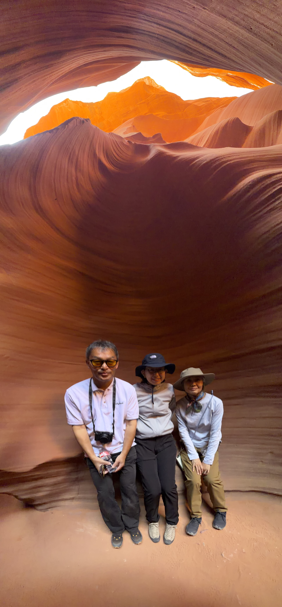
*Lower Antelope Canyon・また撮影ポイントで3人で* 
 

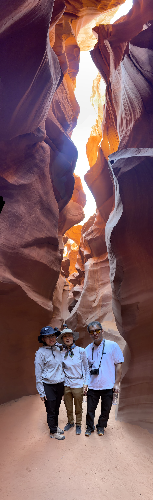
*Lower Antelope Canyon・パノラマで撮ってくれた！* 
 

ツアーコースの最後は岩の割れ目から出てくる感じで、外から見てると面白い（笑） 
 

*Lower Antelope Canyon・ツアーの出口、割れ目から出てくる* 
 

エントランスに戻る途中の岩に恐竜の足跡の化石があった。 
ガイドさんに言われないと、これは分からないなー。 
 

*Lower Antelope Canyon・恐竜の足跡* 
 

しかし、地表に出たら灼熱。 
ものすごい日差し。 
 

*Lower Antelope Canyon・受け付けのところまで戻ってくる* 
 

エントランスにあるショップで、菅野さんが3人お揃いのキーホルダーを買ってくれました。
とってもありがとう。 
 

*Lower Antelope Canyon・お揃いのキーホルダー* 
 

それにしてもアメリカに来てから、トレッキングしている女性の多くが、体のラインがバッチリ出るピチピチの全身タイツみたいなのを着てる。 
とても私は無理というレベルだけど、アメリカ人は、自分の体型にかかわらず、みんな自信を持って着てるのがすごい！ 
 

--- 

 

**📖 コラム｜スパンデックス（Spandex）**  
 
ぴちぴちの全身タイツみたいなスパンデックス は、伸縮性に優れた合成繊維で、ポリウレタン系弾性繊維の一種。 
アスレジャー（Athleisure）が定着していて、スポーツウェアを日常着として着こなすスタイルが2010年代から続いており、今も根強い。 
また、ボディポジティビティの影響で、体のラインを出す服への心理的ハードルが下がってきた。 
 

 

--- 

 
 

## 光と砂の饗宴 Upper Antelope Canyon
Lower Antelope Canyonから車で町まで帰ってきて、今度はお昼のUpper Antelope Canyonのツアーへ。 
 

<iframe src="https://www.google.com/maps/embed?pb=!1m18!1m12!1m3!1d1595.0007800208427!2d-111.46050165851648!3d36.914227094363795!2m3!1f0!2f0!3f0!3m2!1i1024!2i768!4f13.1!3m3!1m2!1s0x873414a49b6f048b%3A0x71e0575567dd45b9!2sAntelope%20Slot%20Canyon%20Tours!5e0!3m2!1sja!2sjp!4v1784530514777!5m2!1sja!2sjp" width="100%" height="450" style="border:0;" allowfullscreen="" loading="lazy" referrerpolicy="strict-origin-when-cross-origin"></iframe>
 
 
 
前回来た時のツアーオフィスの場所から変わっていて、車が停められるか分からないので、まずはSAFEWAYに車を停めて様子を見に行く。 
 

*Upper Antelope Canyon・SAFEWAYに車を停めて様子を見にいく* 
 

SAFEWAYからすぐのところにAntelope Canyon Toursのオフィスを見つけ、車が停められそうなことを確認したのでSAFEWAYから車を移動。 
 

*Upper Antelope Canyon・Antelope Canyon Toursのオフィス* 
 

12:25-13:55の光線的には最高の時間帯のツアーをスミーが予約してくれた。 
いつもありがとう。 
 
ツアーの受付けを済ませ、出発までに時間があるので、事務所の外の日陰にあるベンチで待つ。 
油断していたら、どんどん人が来てトイレが長蛇の列になってしまった。 
 
日本では、円安が進みすぎてしまったことから政府が為替介入、旭山動物園職員が妻を殺害し動物園焼却炉で焼く…などがニュースになっていた。 
 
前回はジープで砂漠地帯を走り、Upper Antelope Canyonの入り口まで行ったが、今回は冷房付きのステキなバスで移動。 
 
モデルと思われるステキなお姉さんが1人で参加していて、本当にキレイ。 
こんな風になりたい… 
私はどんなに努力しても、こんな風にはならないなぁ。 
 
現地に到着。 
いよいよUpper Antelope Canyonの入口から中へ。 
Antelope Canyonは、元々は女の子が見つけて遊んでいた場所だったらしい。 
それが今やナバホ族の大きな収入源となる観光地になった。 
 

<iframe src="https://www.google.com/maps/embed?pb=!1m17!1m12!1m3!1d1595.380383524067!2d-111.41079680160523!3d36.896071000000006!2m3!1f0!2f0!3f0!3m2!1i1024!2i768!4f13.1!3m2!1m1!2zMzbCsDUzJzQ1LjkiTiAxMTHCsDI0JzMwLjMiVw!5e0!3m2!1sja!2sjp!4v1784530563193!5m2!1sja!2sjp" width="100%" height="450" style="border:0;" allowfullscreen="" loading="lazy" referrerpolicy="strict-origin-when-cross-origin"></iframe>
 
 

*Upper Antelope Canyon・バスを降りてツアーの入り口まで歩く* 
 

*Upper Antelope Canyon・前回きた時は普通にジープの荷台に乗ってきたけど、今回は冷房付きの車* 
 

*Upper Antelope Canyon・ツアー入り口、インディージョーンズみたい* 
 

太陽光線が岩の割れ目からキャニオンに入り込む最適な時間のツアーのため、光の柱がいくつも見える。 
 

*Upper Antelope Canyon・光線の入り方は時間が勝負* 
 

Upperでもガイドさんが要所、要所でグループの写真を撮ってくれる。 
こちらでも3人でどれだけ仲がいいんだよ写真をたくさん撮る（笑） 
 

*Upper Antelope Canyon・3人の写真* 
 

*Upper Antelope Canyon・お昼のツアーで完璧な光線* 
 

*Upper Antelope Canyon・光と影の芸術が素晴らしい* 
 

Antelope Canyon は岩が作った光と影のアート。 
Lower Antelope Canyonもいいけど、やっぱりこの光の柱の見られるUpper Antelope Canyonがより素晴らしい。 
 

*Upper Antelope Canyon・この写真だけ見ているとディズニーランドのアトラクションの中にいるみたい* 
 

*Upper Antelope Canyon・そしてまた3人写真* 
 

*Upper Antelope Canyon・光の柱* 
 

*Upper Antelope Canyon・やっぱり光が勝負なんだよね* 
 

*Upper Antelope Canyon・光の柱をバックに3人で* 
 

*Upper Antelope Canyon・光のビームで* 
 

差し込む光が天使の羽のように見えるところで撮影してくれて、これってナバホ族の人たちの想像力のすごさだよな〜と思う。 
 

*Upper Antelope Canyon・天使の羽のように見える光の魔術* 
 

*Upper Antelope Canyon・これ有名な場所かも* 
 

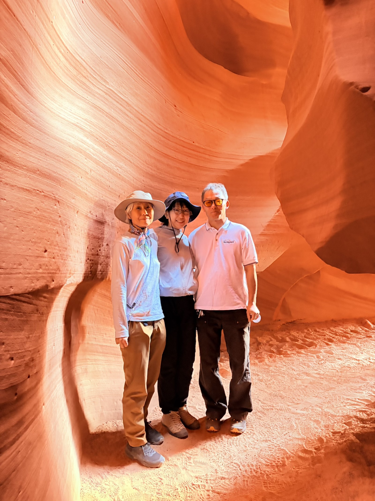
*Upper Antelope Canyon・最後に出口のところでまた3人で写真を撮ってくれた* 
 

出口のところでガイドさんがナバホ族に伝わっている？曲を笛で吹いてくれた。 
 

<iframe width="315" height="560" src="https://www.youtube.com/embed/RxDCC0ps_bM" frameborder="0" allowfullscreen> </iframe>
*Upper Antelope Canyon・ガイドさんの笛の演奏* 
 
 

前回は、キャニオンの中を行って、帰ってくるという往復のツアーだったけど、今は混乱を避けるために片道通行になった。 
車まで戻るのに、かなりな距離を歩いた。 
 

*Upper Antelope Canyon・出口からバスまで戻る* 
 

*Upper Antelope Canyon・モデルのお姉さんの後ろ姿* 
 

日陰がまったくない灼熱地獄。 
最後に長い階段を降りてバスへ。 
 

*Upper Antelope Canyon・長い階段を降りる* 
 

前に来た時は、こんなに整備されていなかったので、すごいな〜と思う。 
冷房の効いたバスに乗って事務所まで戻る。 
 

## Pageの町を後にして、一路Monument Valleyへ
Pageでガソリンを補給して、いざMonument Valleyへ！ 
このガソリンスタンドで前回も給油したな〜と思い出す。 
 

*Page・前回も寄ったガソリンスタンド* 
 

*Page・窓掃除もしっかり* 
 

<iframe src="https://www.google.com/maps/embed?pb=!1m18!1m12!1m3!1d204594.81569169502!2d-111.2848751176866!3d36.7515155503593!2m3!1f0!2f0!3f0!3m2!1i1024!2i768!4f13.1!3m3!1m2!1s0x87341342bf567c57%3A0x72ea05c66ea15290!2sConoco!5e0!3m2!1sja!2sjp!4v1784531162891!5m2!1sja!2sjp" width="100%" height="450" style="border:0;" allowfullscreen="" loading="lazy" referrerpolicy="strict-origin-when-cross-origin"></iframe>
 
 
 
ここからは、とにかくまっすぐの道。 
しばらく行くと、ビュートが現れ始める。 
 

*Page・まっすぐな道をひたすら走る* 
 

*Page・ビュートが現れ始める* 
 

*Monument Valley・近づいてきたMonument Valley* 
 
 

## まるで別の惑星のようなMonument Valley 
前回は広いMonument Valley内を車で見て回るツアーに参加したが、自分の車で中に入れるScenic Road Driveがあることが分かり、今回は自分の車でダート道を走ることにチャレンジ！
と思ったらScenic Road Driveの受付時間終了で入場できず。 
 

<iframe src="https://www.google.com/maps/embed?pb=!1m18!1m12!1m3!1d51030.327206613!2d-110.16168735494465!3d36.9287164376168!2m3!1f0!2f0!3f0!3m2!1i1024!2i768!4f13.1!3m3!1m2!1s0x87372e4373ea5e0f%3A0x9cef7d251e9ff829!2z44Oi44OL44Ol44Oh44Oz44OI44OQ44Os44O8IOODk-OCuOOCv-ODvOOCu-ODs-OCv-ODvA!5e0!3m2!1sja!2sjp!4v1784531381013!5m2!1sja!2sjp" width="100%" height="450" style="border:0;" allowfullscreen="" loading="lazy" referrerpolicy="strict-origin-when-cross-origin"></iframe>
 
 

--- 

 

**📖 コラム｜Monument Valley**  
 
Monument Valleyは映画の名作の舞台として有名。 
 

・ 「駅馬車」（1939年、ジョン・フォード監督）― モニュメントバレーを世界に知らしめた元祖 
・ 「フォレスト・ガンプ」（1994年）― 「フォレスト・ガンプ・ポイント」として今も人気の撮影地 
・ 「バック・トゥ・ザ・フューチャー PART3」 
・ 「ミッション：インポッシブル2」（トム・クルーズが登った岩山） 
・ 「トランスフォーマー／ロストエイジ」 
 
ジョン・フォード監督は生涯9回もここで撮影しており、地元には「ジョンフォードポイント」も残っている。 
 

 

--- 

 
 
Monument Valleyを見渡せるホテルThe View Hotelにチェックイン。 
 
ここでLower Antelope Canyon で会った日本人の家族連れと遭遇。 
ああ！と挨拶をする。 
 
フロント前のラウンジにはカチーナ人形がたくさん飾り付けられている。 
日の入りと日の出の時間をフロントでチェック。 
 

*Monument Valley・フロントに表示されていた気象情報* 
 

*Monument Valley・ロビーの窓からMonument Valleyのビュートが合成写真みたいに見える* 
 

*Monument Valley・ロビーにたくさん飾られたカチーナ人形* 
 

--- 

 

**📖 コラム｜Kachina**  
 
カチーナ（Kachina / Katsina）は、アメリカ南西部のプエブロ系先住民族、特にホピ族やズニ族の精神的・文化的な概念。 
 
自然界や祖先の霊的存在のことで、雨・豊穣・太陽・動物など、あらゆる自然現象を司る精霊とされている。数百種類が存在する。 
 
カチーナ人形 
ホピ族の職人が木（主にポプラの根）を彫って作る人形で、子どもたちに精霊の姿や意味を教えるための教育的な道具でもあった。 
 

 

--- 

 
 
荷物を部屋に運び込んで、ホテル周辺を散策。 
 

*Monument Valley・The View Hotelの外観* 
 

夕日が沈むMonument Valley を見る。 
 

*Monument Valley・The View Hotelの見晴台から見るMonument Valley* 
 

*Monument Valley・The View Hotelの見晴台から見るMonument Valley* 
 

まるで自分の庭のように部屋からMonument Valleyのビュートが見られる The View Hotelは本当にロケーションが最高！ 
 

*Monument Valley・自分のお部屋のバルコニーからMonument Valleyを見る* 
 

*Monument Valley・iPhoneのビビッドモードで撮ったら美しすぎる* 
 

夕食はスミーの部屋に集まって部屋飲み。 
 
自分の部屋に戻って、バルコニーから夜景のMonument Valleyを観ながら写真を撮ってみたら、星がうまく撮れた！ 
iPhoneのカメラの能力がすごい！ 
 

*Monument Valley・部屋から撮影した夜のMonument Valley* 
 

*Monument Valley・ちょっと月が明るすぎて星があまり見えない* 
 

ホテルのテラスへ出てMonument Valleyと星空の写真を撮る。 
月が出ていなかったら、もっとすごい星空だっただろう。 
後から写真を見てみたら、北斗七星が写ってた！ 
 

*Monument Valley・星空のMonument Valley* 
 

*Monument Valley・北斗七星！* 
 

いよいよ喉が痛くなって、菅野さんから風邪薬と飴をもらう。 
もう本当に足が痛い。 
 
 

## 今夜の宿・The View Hotel
菅野さんと相部屋 
 

*Monument Valley・The View Hotelの素敵なお部屋！* 
 

<iframe src="https://www.google.com/maps/embed?pb=!1m18!1m12!1m3!1d3184.896654003641!2d-110.3181874156159!3d37.03611039539687!2m3!1f0!2f0!3f0!3m2!1i1024!2i768!4f13.1!3m3!1m2!1s0x873728081cd65463%3A0x4a8e9f394d8a360e!2z44K244O744OT44Ol44O844Ob44OG44Or!5e0!3m2!1sja!2sjp!4v1784531990253!5m2!1sja!2sjp" width="100%" height="450" style="border:0;" allowfullscreen="" loading="lazy" referrerpolicy="strict-origin-when-cross-origin"></iframe>
 
 
 
📍 **本日の移動** 
Hampton Inn & Suites Page - Lake Powell → Lower Antelope Canyon → Upper Antelope Canyon → Monument Valley → The View Hotel
