#  【グランドサークル】 6日目　 Monument Valley 〜 Moabへ 
###### 2026年5月1日（金）晴れ

## 今日も朝日からスタート
朝日がMonument Valley に昇ってくるのを観にホテルの外へ。 
朝日がビュートに当たって赤くなり、西部劇のワンシーンのよう。 
 

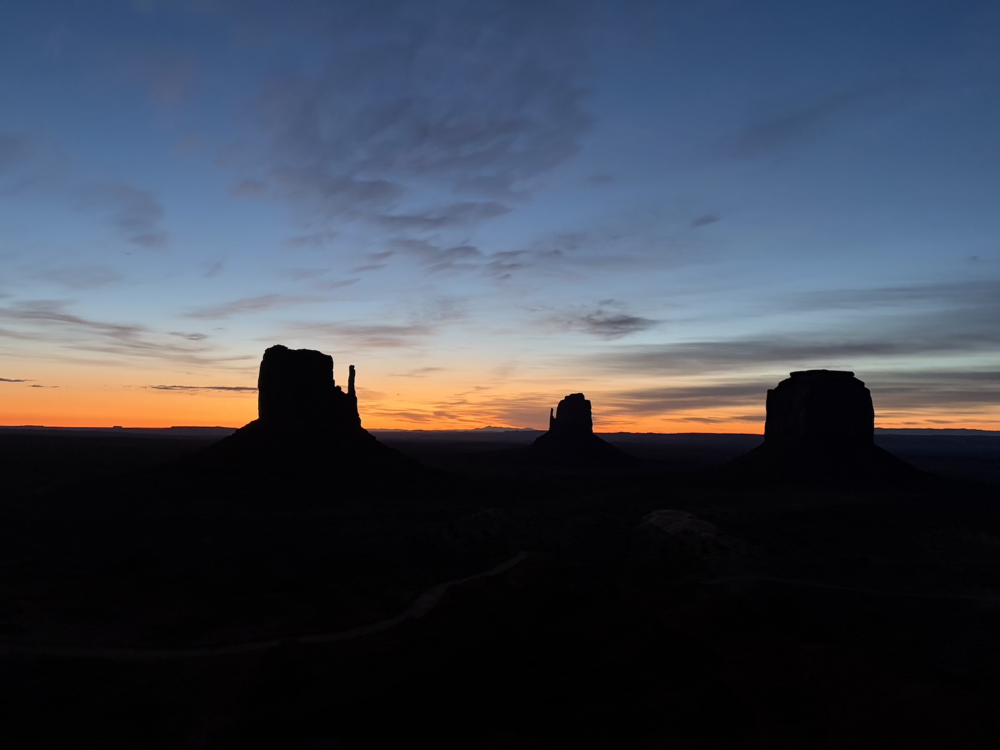
*Monument Valley・朝日が登ってくるのをホテルの展望テラスで待つ* 
 

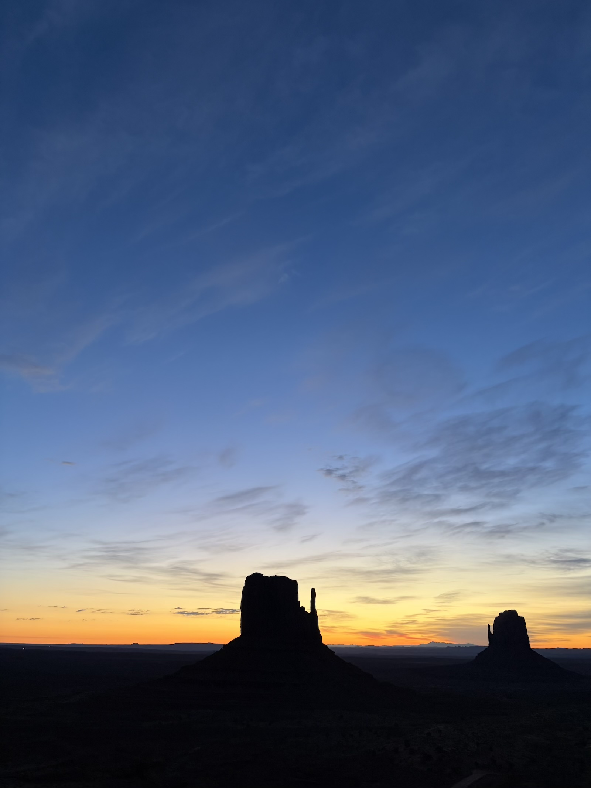
*Monument Valley・この空のグラデーションと広い空！* 
 

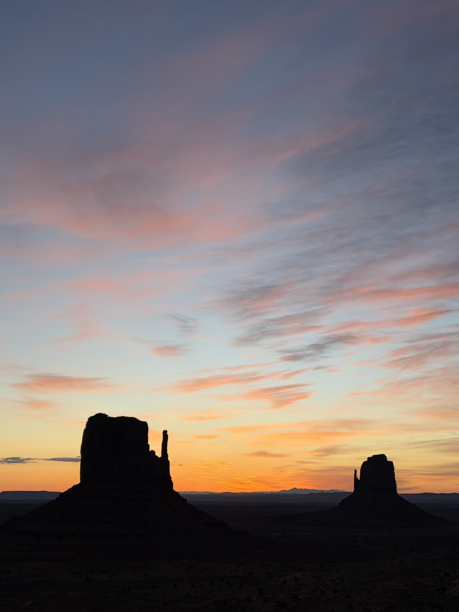
*Monument Valley・雲がピンク色になってくる* 
 

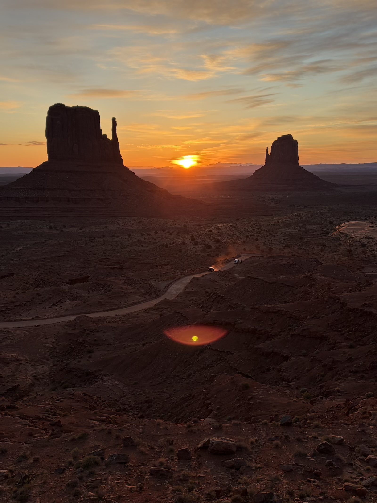
*Monument Valley・日の出* 
 

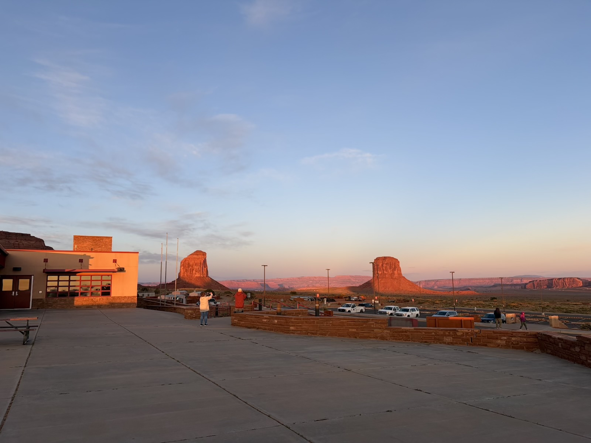
*Monument Valley・朝日で一帯が赤く染まる* 
 

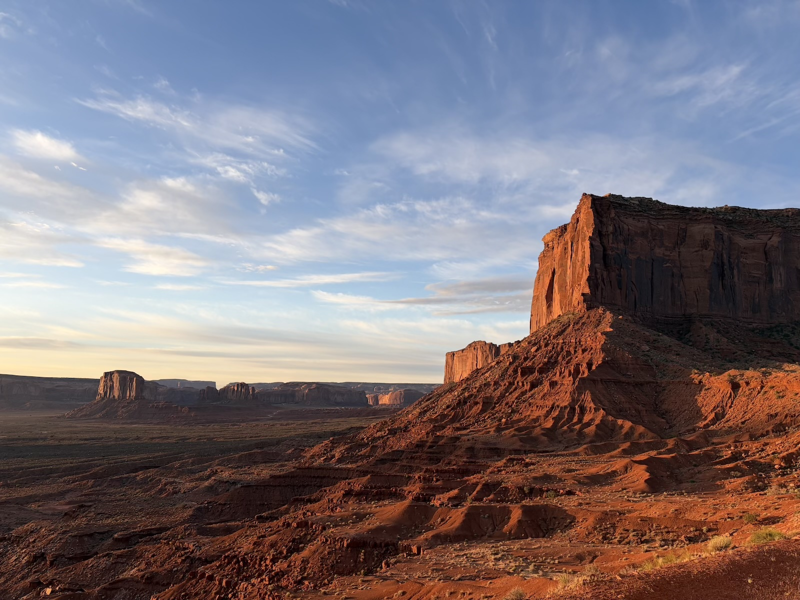
*Monument Valley・西部劇のワンシーンのよう* 
 

今日はホテルのレストランで朝食。 
バイキングには長蛇の列。 
今までの観光地ではあまり日本人に会わなかったけど、さすがにMonument Valleyには、日本人がたくさん来ている。 
 
レストランの入口に飴がたくさん置いてあったので、行列に並びながら飴をもらう。 
もう喉の痛みがヤバい。 
 
アメリカでは、日本のように飴が売ってないので、個包装の飴をもらえるのは、本当にありがたい。 
 
3人で少しゆっくり朝食を摂る。 
 
部屋に戻って荷造りをして、チェックアウト。 
ペニーコインで作る記念硬貨をやってみよう！と言っていたのだけど、前日まで動いていたのにマシンが壊れていてできなかった。 
残念。 
 
 

## Monument Valley Scenic Road Driveで荒野を走る
昨日、入ることのできなかったScenic Road Driveへ。 
Monument Valley 内のビュートの間を縫うようにダート道を自分で運転して走る。 
 
ダート道で車が揺れるので、後ろでスーツケースが動く。動く。 
私のセージが潰れて粉々になるのではないかと気が気ではなかった。 
 
撮影ポイントに止まりながら進む。 
今まで見ていた高い場所からではなく、ビュートの足元と同じ高さから見上げるビュートは、すごい迫力。 
 
West Mitten  
 

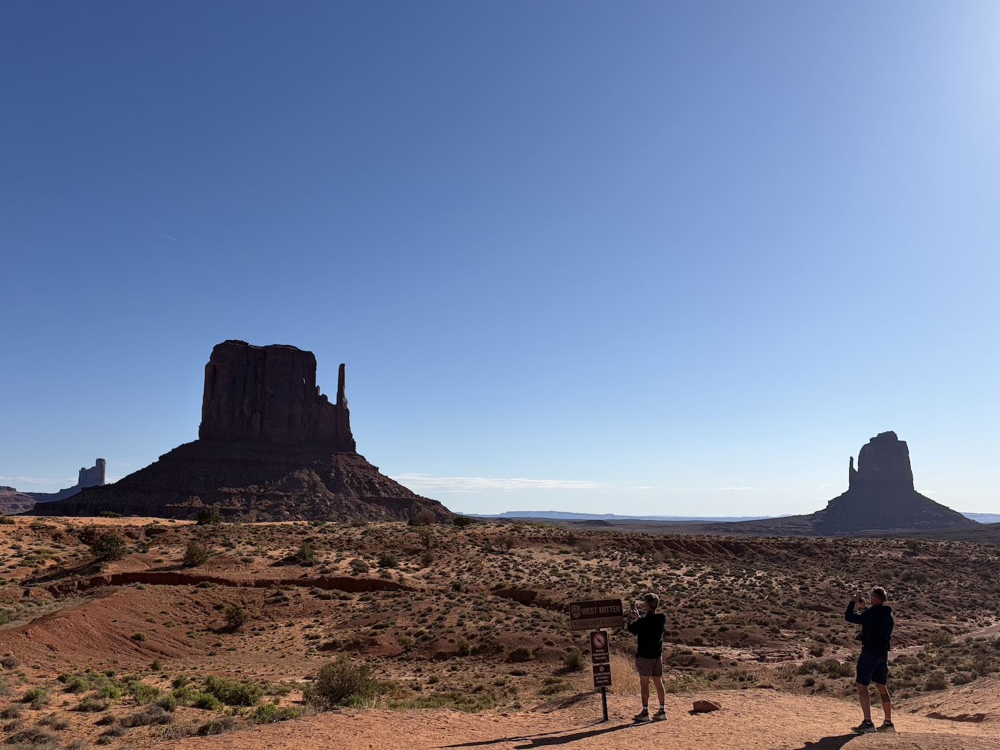
*Monument Valley Scenic Road Drive・West Mitten* 
 

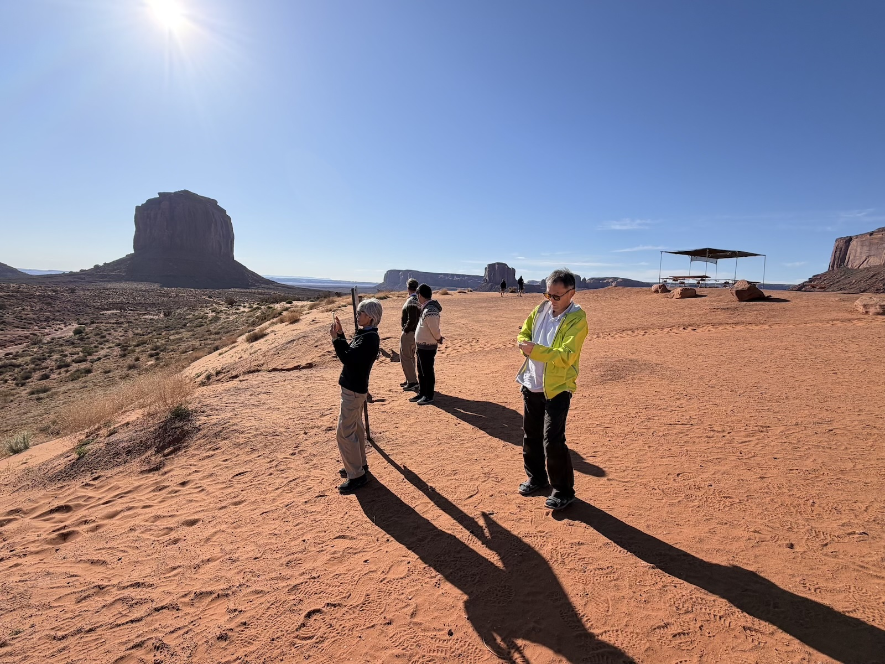
*Monument Valley Scenic Road Drive・West Mittenを撮影中のスミーと菅野さん* 
 

Elephant Butte  
 

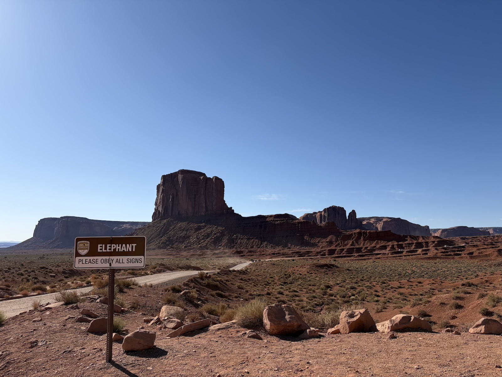
*Monument Valley Scenic Road Drive・Elephant Butte* 
 

Three Sisters  
 

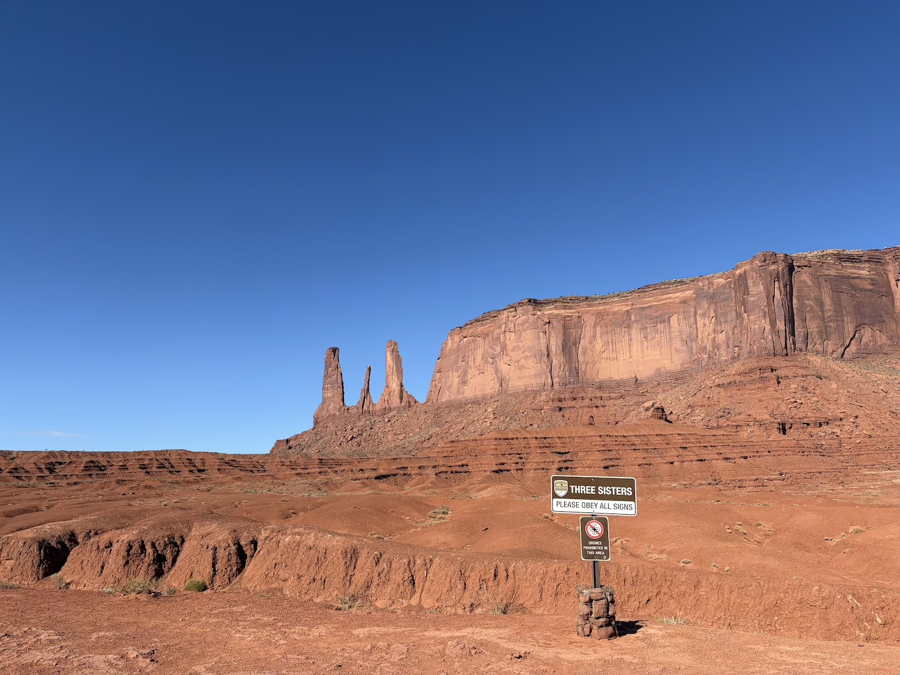
*Monument Valley Scenic Road Drive・Three Sisters* 
 

<iframe src="https://www.google.com/maps/embed?pb=!1m18!1m12!1m3!1d25507.99136744018!2d-110.10654000580232!3d36.95013947376329!2m3!1f0!2f0!3f0!3m2!1i1024!2i768!4f13.1!3m3!1m2!1s0x873732f8b5265abf%3A0x9049383094c0bb24!2sThree%20Sisters!5e0!3m2!1sja!2sjp!4v1784531560240!5m2!1sja!2sjp" width="100%" height="450" style="border:0;" allowfullscreen="" loading="lazy" referrerpolicy="strict-origin-when-cross-origin"></iframe>
 
 
 
John Ford Point  
 
John Ford Pointで、馬に乗って写真撮影している人の帽子が風に飛ばされる。 
大丈夫かな？と思って見ていたら、ちゃんと取りに行ってた。 
 
John Ford Pointは、お土産物屋さんなどがあり、とても賑やか。 
 

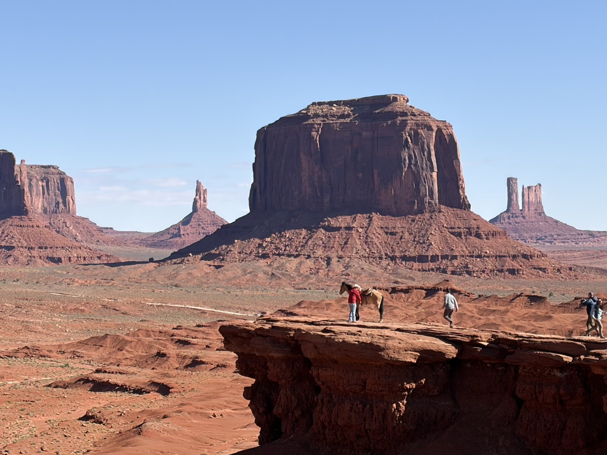
*Monument Valley Scenic Road Drive・John Ford Point* 
 

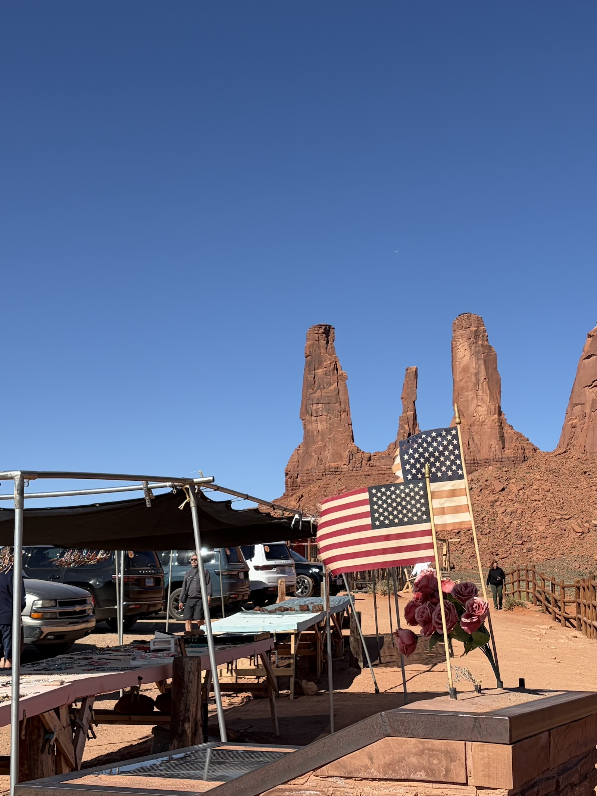
*Monument Valley Scenic Road Drive・John Ford Pointのお土産物屋さん* 
 

Rain God Mesaでは、ツアーの団体さんに囲まれて一緒に写真を撮る。 
 

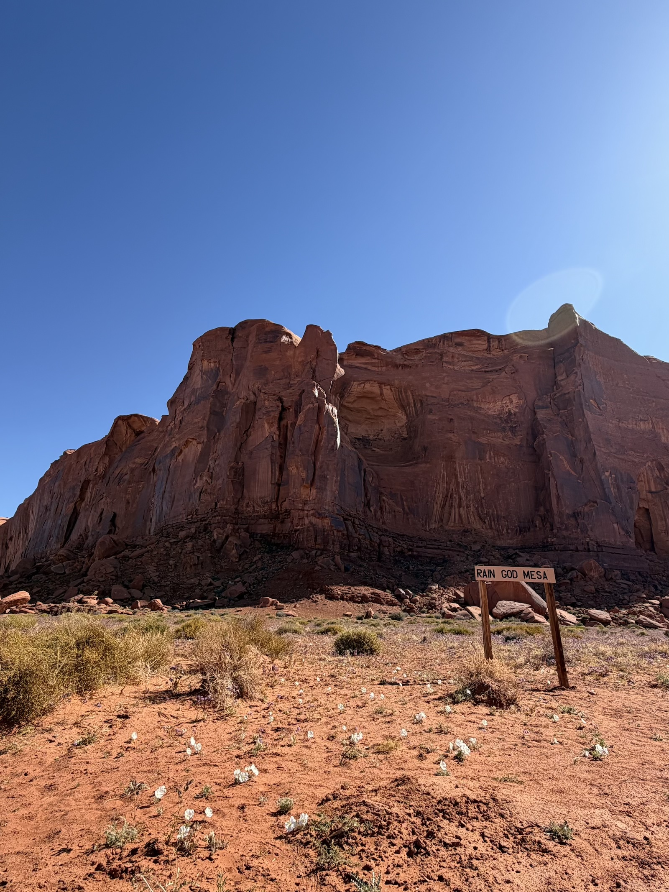
*Monument Valley Scenic Road Drive・Rain God Mesa* 
 

Totem Pole  
 

*Monument Valley Scenic Road Drive・Totem Pole* 
 

*Monument Valley Scenic Road Drive・Totem Poleでツアーの団体の車に囲まれる* 
 

<iframe src="https://www.google.com/maps/embed?pb=!1m18!1m12!1m3!1d25507.99136744018!2d-110.10654000580232!3d36.95013947376329!2m3!1f0!2f0!3f0!3m2!1i1024!2i768!4f13.1!3m3!1m2!1s0x87373357836f5349%3A0xf534f43ef0ce8130!2z44OI44O844K_44Og44O744Od44O844Or!5e0!3m2!1sja!2sjp!4v1784531657085!5m2!1sja!2sjp" width="100%" height="450" style="border:0;" allowfullscreen="" loading="lazy" referrerpolicy="strict-origin-when-cross-origin"></iframe>
 
 
 
Spearhead Mesa  
 

*Monument Valley Scenic Road Drive・Spearhead Mesa* 
 

<iframe src="https://www.google.com/maps/embed?pb=!1m18!1m12!1m3!1d25507.99136744018!2d-110.10654000580232!3d36.95013947376329!2m3!1f0!2f0!3f0!3m2!1i1024!2i768!4f13.1!3m3!1m2!1s0x8737330037beb44d%3A0xf7a1e076f9304f07!2sSpearhead%20Mesa!5e0!3m2!1sja!2sjp!4v1784531702509!5m2!1sja!2sjp" width="100%" height="450" style="border:0;" allowfullscreen="" loading="lazy" referrerpolicy="strict-origin-when-cross-origin"></iframe>
 
 
 
Spearhead Mesaは、Monument Valleyの奥の方に位置していて、Spearhead Mesaの見晴し台から見える景色は、どこまでも続く草原のよう。 
基本は砂漠だけど、小さい草花が逞しく生きて広がり、上から見ると草原に見える。 
 

*Monument Valley Scenic Road Drive・Spearhead Mesaの見晴らし台からの眺め* 
 

The Thumb  
 

*Monument Valley Scenic Road Drive・The Thumb* 
 

*Monument Valley Scenic Road Drive・The Thumbを撮影するスミー。The Thumbがいかに大きいかわかる* 
 

<iframe src="https://www.google.com/maps/embed?pb=!1m18!1m12!1m3!1d25507.99136744018!2d-110.10654000580232!3d36.95013947376329!2m3!1f0!2f0!3f0!3m2!1i1024!2i768!4f13.1!3m3!1m2!1s0x873733090b04cb59%3A0x3ec322fb345e6da1!2sThe%20Thumb!5e0!3m2!1sja!2sjp!4v1784531614286!5m2!1sja!2sjp" width="100%" height="450" style="border:0;" allowfullscreen="" loading="lazy" referrerpolicy="strict-origin-when-cross-origin"></iframe>
 
 
 
Scenic Road DriveでMonument Valley内を一周回ってホテルまで戻る。 
 
The View Hotel内にあるお土産物店内を見て回る。 
スミーがココペリのバッグを買うかどうするか、どの柄がいいか悩む。 
どうせ通勤に使うんでしょう？地味な方がいいよと私が言ったのを聞いて、菅野さんが驚く（笑） 
 
通勤で使ってるところの写真を撮って送ってと頼まれたけど、私はもう本社勤務じゃないから難しいなぁ〜。 
 
あいにく値引きサービスクーポンは使えなかったけど、スミーが、ココペリのバッグを買う。 
 
 

## 映画「Forrest Gump」のラストシーンはここ！
Monument Valleyを出発し、ところどころの撮影ポイントに止まりながらForrest Gump Pointへ。 
Monument Valleyともお別れ。 
 
Forrest Gump Pointに着いて驚いたのは、前回とは違って整備されていて、ちゃんとForrest Gump Pointという標識が出ていること。 
 

<iframe src="https://www.google.com/maps/embed?pb=!1m18!1m12!1m3!1d3182.0764357359744!2d-109.99071832333136!3d37.10329797216219!2m3!1f0!2f0!3f0!3m2!1i1024!2i768!4f13.1!3m3!1m2!1s0x873739d47a55ded7%3A0x43135fefc617f8d2!2z44OV44Kp44Os44K544OI44Ks44Oz44OX44O744Od44Kk44Oz44OI!5e0!3m2!1sja!2sjp!4v1784531915714!5m2!1sja!2sjp" width="100%" height="450" style="border:0;" allowfullscreen="" loading="lazy" referrerpolicy="strict-origin-when-cross-origin"></iframe>
 
 
 
前回来た時は、どこ？どこ？ここ？と言いながら車を停めて、人が集まっているところで、ここだ！と言って写真を撮ったけど、今はまったく迷うことがない。 
 
通る車に注意しながら、道の真ん中で写真撮影。 
映画「Forrest Gump」の最後のシーンで使われたのが、この場所だったと思う。 
 

*Forrest Gump Point・映画「Forrest Gump」の最後のシーンのように道の真ん中で* 
 

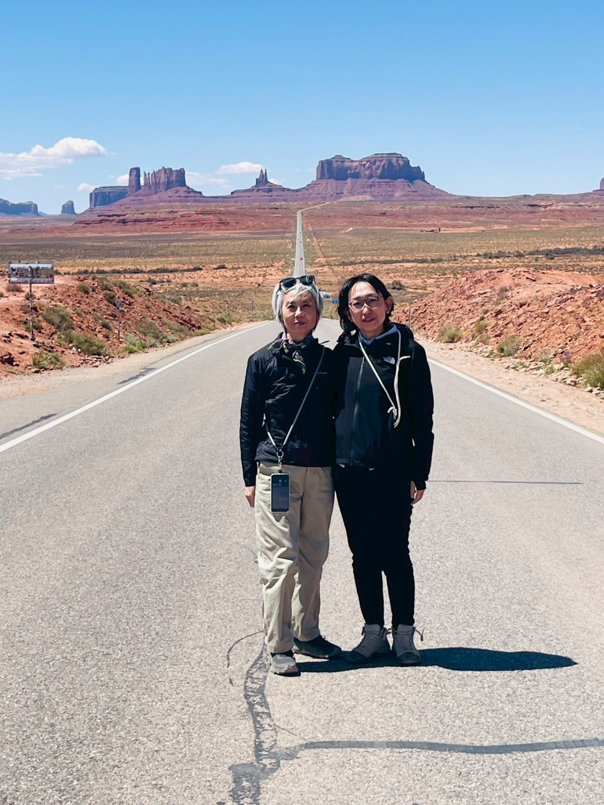
*Forrest Gump Point・菅野さんと一緒に* 
 

前回の時の方が交通量が多くて、写真を撮るのが大変だったような気がするけど、気のせいかしら？ 
 
 

## 断崖絶壁ドライブ
Forrest Gump Pointを出て、Moabへ向けて走る途中にもView Pointがたくさん。 
アメリカのスケールの大きさを感じる。 
これだけのスケールだと、細かいことはどうでもいいよね。 
日本はやっぱり島国で狭いから、細かいことにこだわるのかも。 
 
道中で、Mexican Hat Rockに立ち寄る。 
 

<iframe src="https://www.google.com/maps/embed?pb=!1m18!1m12!1m3!1d12716.466969647305!2d-109.85904712540622!3d37.17369650428554!2m3!1f0!2f0!3f0!3m2!1i1024!2i768!4f13.1!3m3!1m2!1s0x873744269e97a5fb%3A0xec156fecdce5b1c4!2z44Oh44Kt44K344Kr44Oz44O744OP44OD44OI44O744Ot44OD44Kv!5e0!3m2!1sja!2sjp!4v1784532193577!5m2!1sja!2sjp" width="100%" height="450" style="border:0;" allowfullscreen="" loading="lazy" referrerpolicy="strict-origin-when-cross-origin"></iframe>
 
 
 
すごくマイナーな雰囲気で、ほとんど来る人がいない。 
車を停める場所もなくて、道端に停めて写真を撮る。 
行き止まりがロータリーになっていて、そのまま引き返してくる。 
 

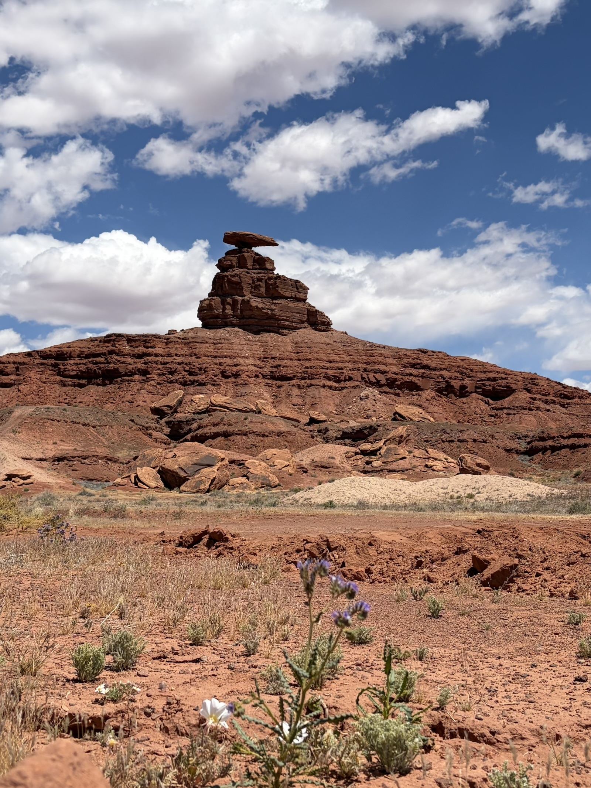
*Mexican Hat Rock・誰もいないMexican Hat Rock* 
 

Mexican Hat Rockからしばらく走ると、Moki Dugwayという断崖絶壁の崖道。 
 

<iframe src="https://www.google.com/maps/embed?pb=!1m17!1m12!1m3!1d406385.7436506024!2d-109.9393486796137!3d37.27406813768272!2m3!1f0!2f0!3f0!3m2!1i1024!2i768!4f13.1!3m2!1m1!2zMzfCsDE2JzI2LjciTiAxMDnCsDU2JzIxLjYiVw!5e0!3m2!1sja!2sjp!4v1784532323486!5m2!1sja!2sjp" width="100%" height="450" style="border:0;" allowfullscreen="" loading="lazy" referrerpolicy="strict-origin-when-cross-origin"></iframe>
 
 
 
ガードレールがないダート道で、すれ違えないほどの細い箇所もあり、坂道がとても急。 
 
坂道を登り切ったところで車を停めてみると、すごい高さを登ったことがわかる。 
Mexican Hat Rockの方まで、今まで走ってきたところ全体を見渡すことができる。 
とにかくスケールが違いすぎる。 
 

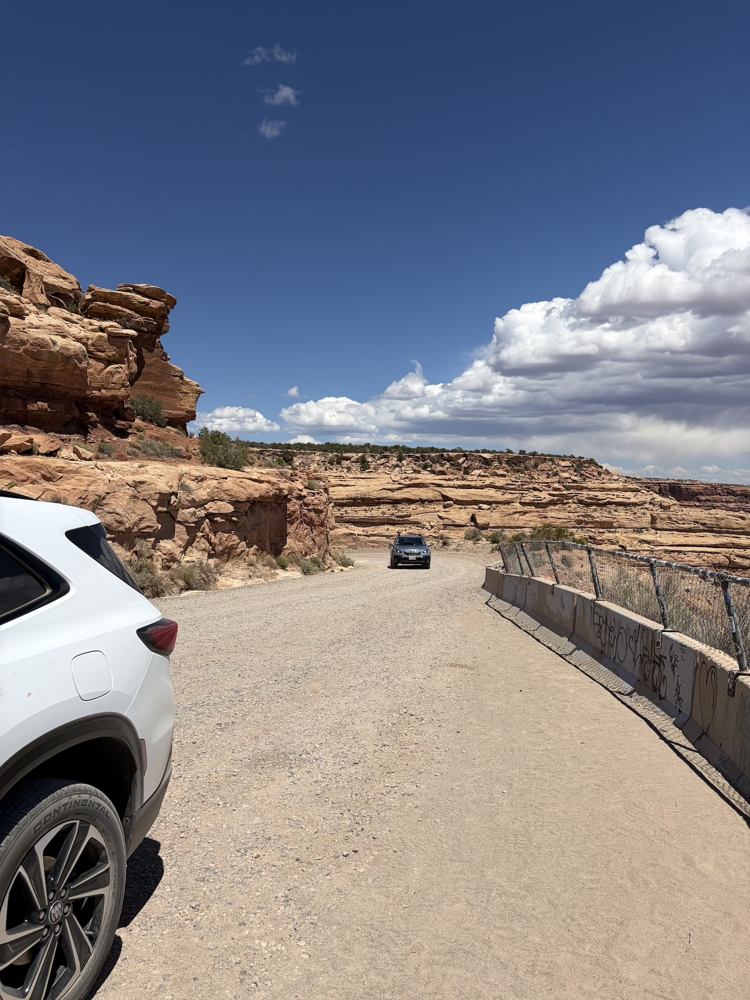
*Moki Dugway・断崖絶壁のガードレールもない道* 
 

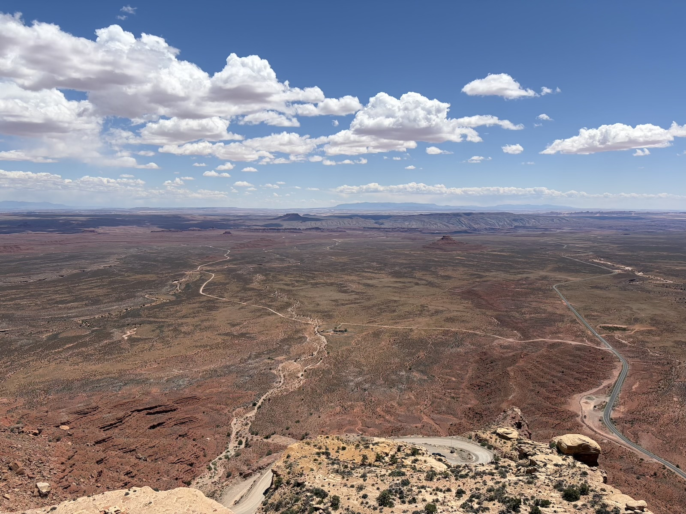
*Moki Dugway・Moki Dugwayを登ったところから見える景色* 
 

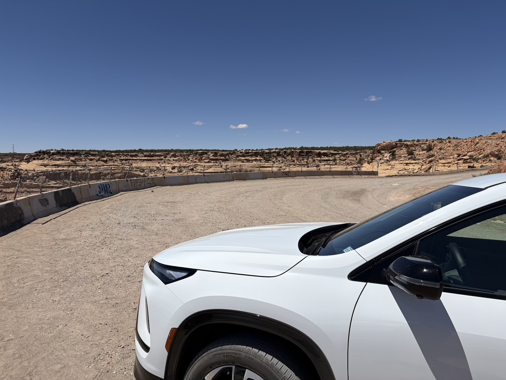
*Moki Dugway・登り切ったところに駐車スペースがある* 
 

--- 

 

**📖 コラム｜Moki Dugway**  
 
ユタ州南東部、ユタハイウェイ261号線沿いに位置するMoki Dugway （モキ・ダグウェイ）は、断崖絶壁を文字通り切り開いて作られた道路で、Cedar Mesaの上部からValley of the GodsやMonument Valleyを見下ろす圧倒的なパノラマが広がる。 
全長約3マイル（約5km）の未舗装路で、急なスイッチバック（ヘアピンカーブ）が続き、勾配は最大11%。Cedar Mesaの断崖面を削って作られており、標高差はおよそ360m（約1,200フィート）。 
制限速度は全体で時速15マイル（約24km）だが、カーブでは時速5マイル（約8km）が推奨されるほど慎重な運転が必要。 
 
1958年、テキサス亜鉛鉱山会社が、Fry Canyon付近の「Happy Jack」ウラン鉱山からMexican Hat近くの精製工場へ鉱石を運ぶために建設した。 
現在は観光客向けのドライブルートとして人気を集めている。 
 
「Moki」はスペイン人探検家がこの地域のプエブロ先住民を呼んだ「Moqui」という言葉の誤りから来ており、「Dugway」とは丘の斜面を削って作った道のことを指す。 
 
普通の乗用車でも通行可能だが、BLM（米国土地管理局）は全長28フィート（約8.5m）・重量10,000ポンド（約4.5トン）以下の車両を推奨しており、大型RVは避けるべき。 
雨天・積雪時は通行が非常に危険になる。 
 

 

--- 

 
 

## あっちもこっちもアーチだらけ
Moabへ行く最後の寄り道 Natural Bridges National Monument。 
Natural Bridges National Monument Visitor Centerに寄ると、ビジターセンターの入り口で望遠鏡を覗いているレンジャーがいて、私たちにも望遠鏡を覗かせてくれた。 
 

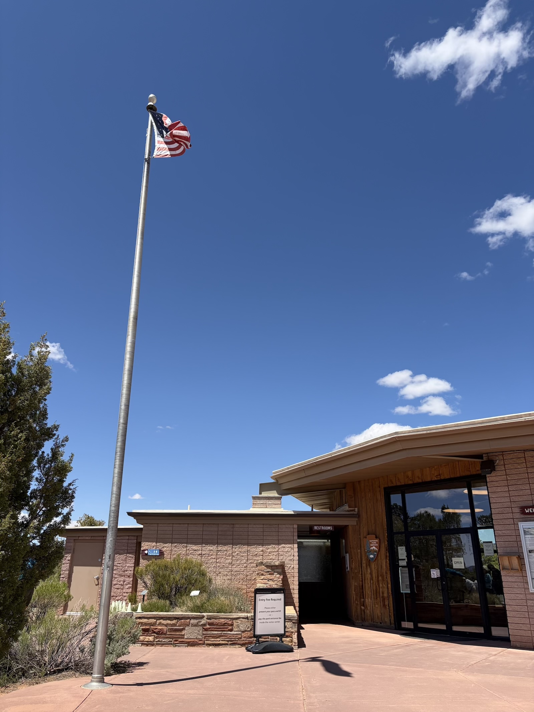
*Natural Bridges・Visitor Center* 
 

<iframe src="https://www.google.com/maps/embed?pb=!1m18!1m12!1m3!1d71781.53993755073!2d-110.04685073679772!3d37.59391038690785!2m3!1f0!2f0!3f0!3m2!1i1024!2i768!4f13.1!3m3!1m2!1s0x8737a06a7b031f93%3A0x702098020bd63ed!2z44OK44OB44Ol44Op44Or44OW44Oq44OD44K444O744OT44K444K_44O844K744Oz44K_44O8!5e0!3m2!1sja!2sjp!4v1784532522575!5m2!1sja!2sjp" width="100%" height="450" style="border:0;" allowfullscreen="" loading="lazy" referrerpolicy="strict-origin-when-cross-origin"></iframe>
 
 
 
太陽を見せてくれたみたいなんだけど、よく分からない。 
レンジャーに、夜は真っ暗で星が本当にキレイだから観においでと誘われるけど、Moabからは遠くて来られないなー。 
でもこの辺りは本当に真っ暗になりそうだから、ものすごく星がキレイなんだろうな〜と思う。 
 
ビジターセンターで、お土産を見て回ってからアーチを見にトレッキング。 
 

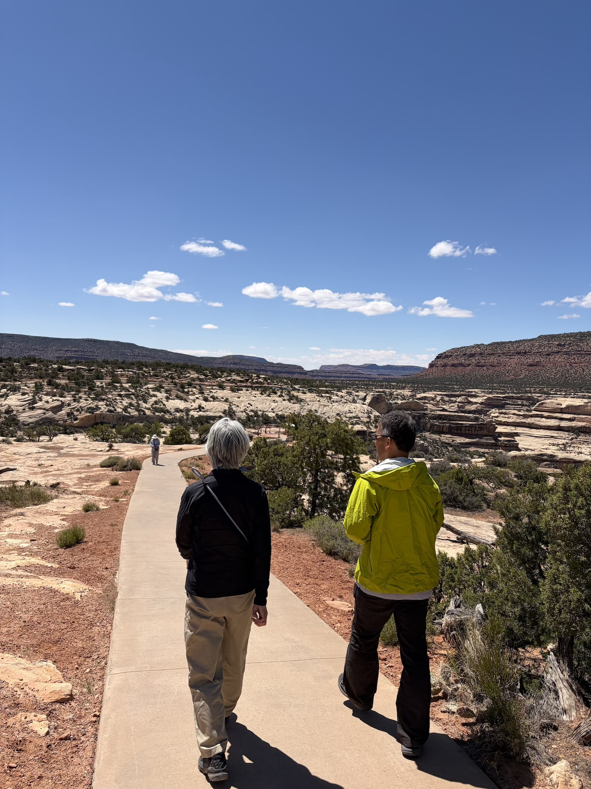
*Natural Bridges・アーチを見にいく* 
 

Sipapu Bridge を遠くから眺める。 
遠すぎてよく分からないけど、アーチになってる。 
Sipapu Bridge Trailを行くとアーチの下まで行けるらしい。 
 

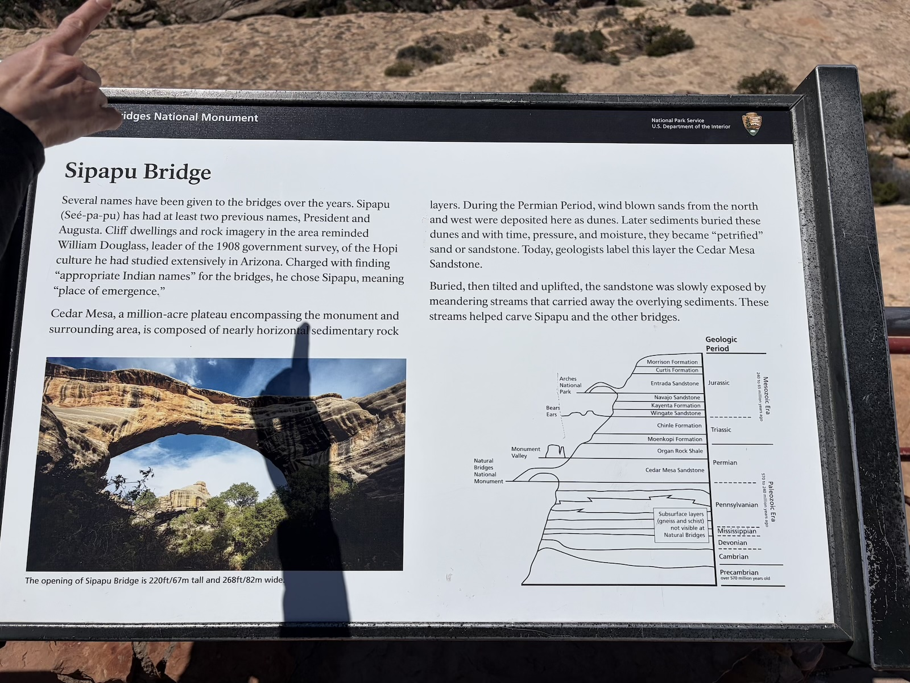
*Natural Bridges・Sipapu Bridgeの看板* 
 

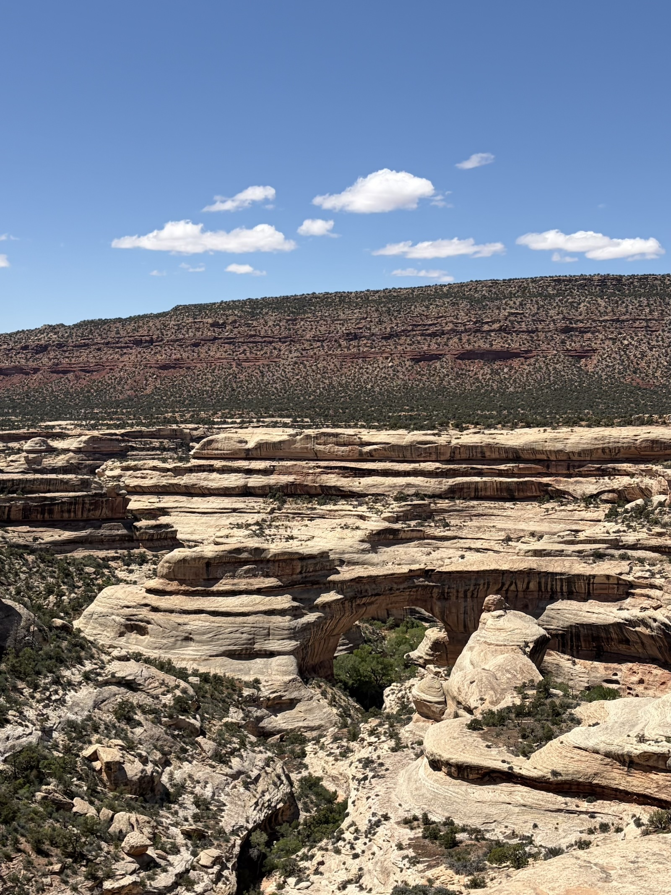
*Natural Bridges・遠くにSipapu Bridgeが見える* 
 

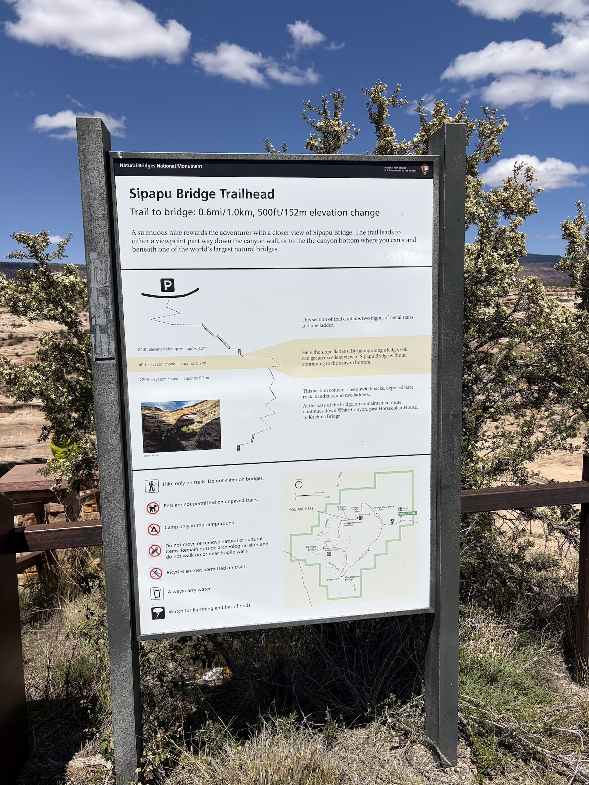
*Natural Bridges・Sipapu Bridge Trailの看板* 
 

<iframe src="https://www.google.com/maps/embed?pb=!1m18!1m12!1m3!1d17943.69758399674!2d-110.03521842639269!3d37.600907193229794!2m3!1f0!2f0!3f0!3m2!1i1024!2i768!4f13.1!3m3!1m2!1s0x8737a0e51a58d1e3%3A0xa78026558df7eedc!2sSipapu%20Bridge!5e0!3m2!1sja!2sjp!4v1784532607780!5m2!1sja!2sjp" width="100%" height="450" style="border:0;" allowfullscreen="" loading="lazy" referrerpolicy="strict-origin-when-cross-origin"></iframe>
 
 
 
Horsecollar House Overlookから見える岩の下のところに小さい穴がたくさんあって、昔の人が住んでいた家だったらしい。 
けど遠すぎてよく分からない。 
 

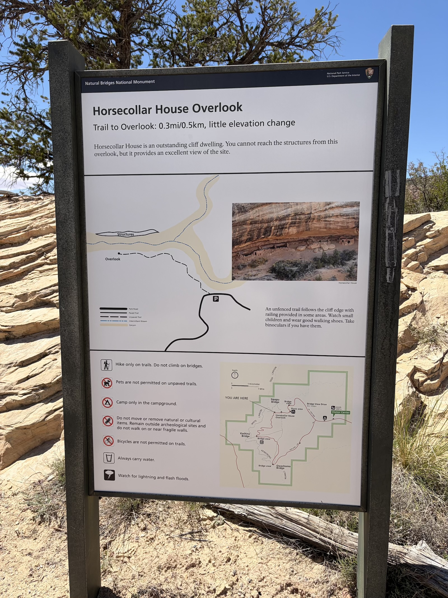
*Natural Bridges・Horsecollar House Overlookの看板* 
 

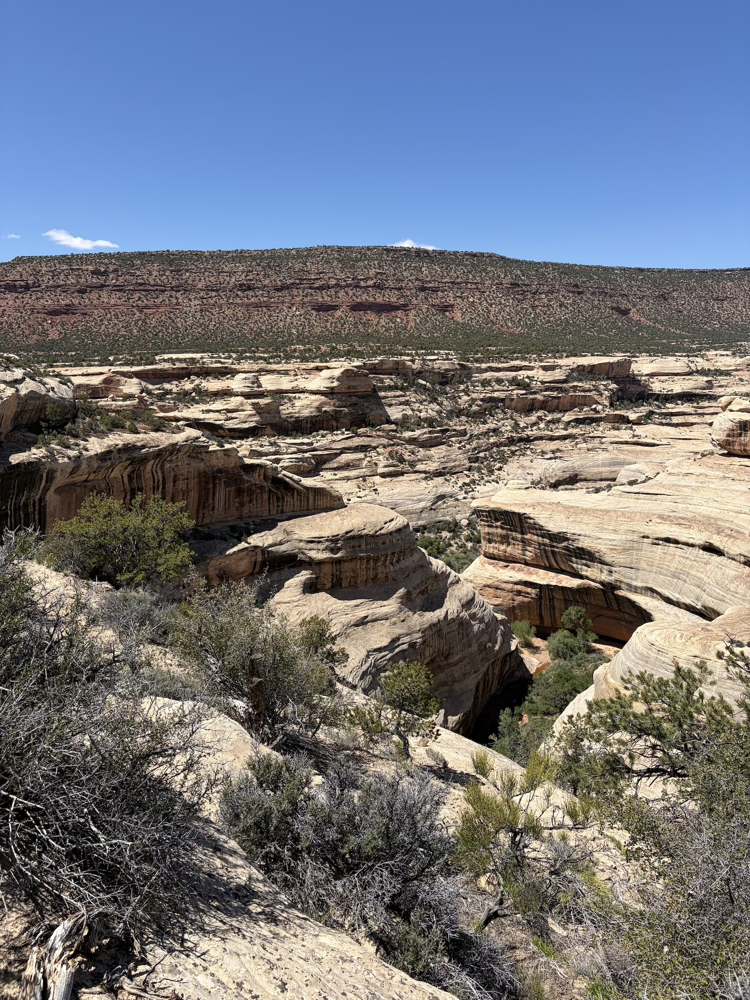
*Natural Bridges・Horsecollar Houseがどこにあるのかさっぱりわからない* 
 

Kachina Bridgeを遠くから見る。 
Kachinaは、ホピ族の精霊。 
長い時の流れとともに岩が侵食されて、こんなにもアーチがたくさんできるんだと驚く。 
 

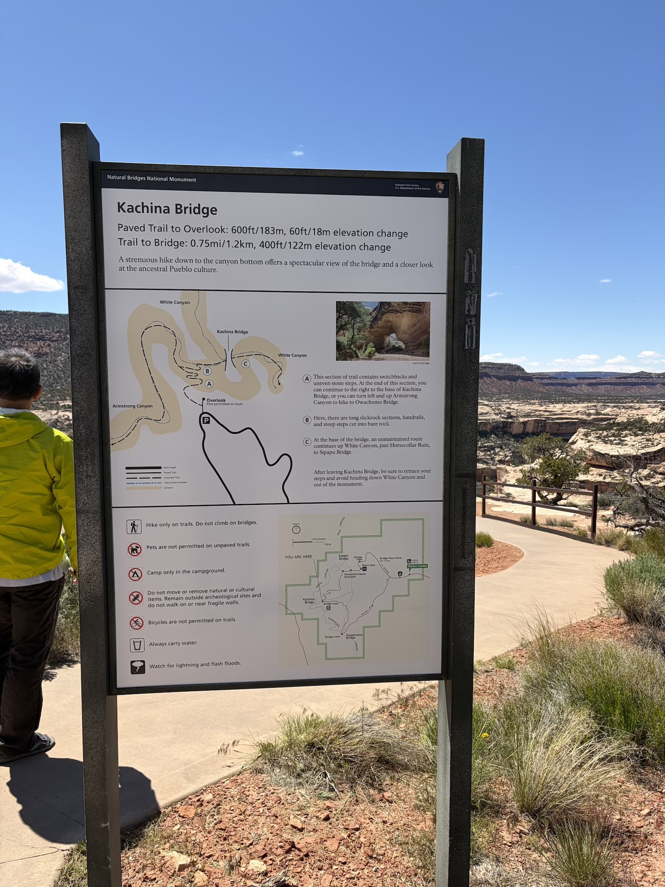
*Natural Bridges・Kachina Bridgeの看板* 
 

*Natural Bridges・Kachina Bridgeの看板* 
 

*Natural Bridges・Kachina Bridge* 
 

<iframe src="https://www.google.com/maps/embed?pb=!1m18!1m12!1m3!1d17943.69758399674!2d-110.03521842639269!3d37.600907193229794!2m3!1f0!2f0!3f0!3m2!1i1024!2i768!4f13.1!3m3!1m2!1s0x8737a0c6f457d65f%3A0xabff7eee595fad75!2z44Kr44OB44O844OK5qmL!5e0!3m2!1sja!2sjp!4v1784532645854!5m2!1sja!2sjp" width="100%" height="450" style="border:0;" allowfullscreen="" loading="lazy" referrerpolicy="strict-origin-when-cross-origin"></iframe>
 
 
 
Owachomo Bridgeは、かなり大きなブリッジ。 
 

*Natural Bridges・Owachomo Bridgeの看板* 
 

*Natural Bridges・Owachomo Bridgeの看板* 
 

岩の間から生えている木や草の生命力の強さに驚く。 
 

*Natural Bridges・Owachomo Bridgeのところまでどんどん降りていく* 
 

*Natural Bridges・どんどん降りる* 
 

ブリッジがかなり大きくて、近づくとすごい迫力。 
下からブリッジを見上げ、回り込んでブリッジの向こう側へ行く。 
かなりな日差しと灼熱。 
 

*Natural Bridges・思っていたよりもかなり大きいOwachomo Bridge* 
 

*Natural Bridges・Owachomo Bridgeをくぐって反対側へ* 
 

*Natural Bridges・Owachomo Bridgeの反対側には小さな池があった* 
 

<iframe src="https://www.google.com/maps/embed?pb=!1m18!1m12!1m3!1d17943.69758399674!2d-110.03521842639269!3d37.600907193229794!2m3!1f0!2f0!3f0!3m2!1i1024!2i768!4f13.1!3m3!1m2!1s0x8737a0833584bb95%3A0xd016c45a1cac9a7!2z44Kq44Ov44OB44On44Oi5qmL!5e0!3m2!1sja!2sjp!4v1784532686300!5m2!1sja!2sjp" width="100%" height="450" style="border:0;" allowfullscreen="" loading="lazy" referrerpolicy="strict-origin-when-cross-origin"></iframe>
 
 

## レンタカーをコイン洗車？
Natural Bridges National Monumentで、たくさんのアーチを見て、お腹いっぱいでMoabに向かう。 
 
Moabに向かう途中の町 Blandingにある洗車場で、Monument Valley Scenic Road Drive で汚れた車を洗車。 
ダート道走行が危険行為と思われないように痕跡を消す（笑） 
 

<iframe src="https://www.google.com/maps/embed?pb=!4v1784532911665!6m8!1m7!1sLn8-VTOdqHL5gBnqfGwvFw!2m2!1d37.61121968243541!2d-109.4788497702878!3f270!4f0!5f0.7820865974627469" width="100%" height="450" style="border:0;" allowfullscreen="" loading="lazy" referrerpolicy="strict-origin-when-cross-origin"></iframe>
 
 
 
コインを入れて洗車スタート。 
ものすごい水圧の洗剤入りの水が吹き出す。 
ものすごい水しぶきが四方八方へ飛び散る。 
そして、水で洗剤を落とす間もなく終了。 
 
どうやら洗剤から水への切り替えをせずに終わってしまったらしい。 
 

*Blanding・洗車コースのメニュー* 
 

*Blanding・洗車場でコースを選ぶスミー* 
 

*Blanding・コインを入れて洗車スタート* 
 

<iframe width="315" height="560" src="https://www.youtube.com/embed/9YkbzdosDNE" frameborder="0" allowfullscreen> </iframe>
*Blanding・ジェット水流で泥を落として、洗剤入りの水で洗う* 
 

洗車場の向かいにあるガソリンスタンドで給油。 
 

 
*Blanding・ガソリンスタンドとコンビニが一緒になっている* 
 

*Blanding・すぐにお腹を空かせる車に給油* 
 

ガソリンスタンドの脇にあるセブンイレブンへ。 
喉が痛いので飴が売ってないから探しに行ったけど、日本のように飴玉は売っておらず。 
 
大谷選手がひまわりの種を食べているので、どんなものか買ってみる。 
あとは、お土産になりそうなスニッカーズなどのお菓子も購入。 
このセブンイレブンでは、菅野さんのカードが使えなかった。 
 
 

## まさに地球の割れ目 Grand View Point
今日、最後の立ち寄り地 Grand View Pointへ。 
 

*Grand View Point・Grand View Pointへ歩く* 
 

*Grand View Point・Grand View Pointの看板* 
 

*Grand View Point・Grand View Pointの看板* 
 

<iframe src="https://www.google.com/maps/embed?pb=!1m18!1m12!1m3!1d399384.5683147934!2d-109.89805012293735!3d38.55239132954354!2m3!1f0!2f0!3f0!3m2!1i1024!2i768!4f13.1!3m3!1m2!1s0x87481e82f0acbc8b%3A0xb1c8dd0309e56859!2zR3JhbmQgVmlldyBQb2ludCBUcmFpbCwgVXRhaCA4NDUzMiDjgqLjg6Hjg6rjgqvlkIjooYblm70!5e0!3m2!1sja!2sjp!4v1784533025050!5m2!1sja!2sjp" width="100%" height="450" style="border:0;" allowfullscreen="" loading="lazy" referrerpolicy="strict-origin-when-cross-origin"></iframe>
 
 
 
夕陽が当たるGrand View Pointを眺める。 
もうスケールが違いすぎて、自分が小さすぎる（笑） 
自分の一生なんて、本当に一瞬だな。 
日差しがかなり傾いていて、陰の部分が見えなくて残念。 
 

*Grand View Point・夕刻のGrand View Point* 
 

*Grand View Point・地球の落とし穴みたいだ* 
 

*Grand View Point・地層の重なりと地球がどれだけ長く生きてるのかがわかる* 
 

Moabへ向かう途中で牛の放牧地帯を通過し、牛が道に出てくる！ 
 

*Grand View Point・牛の放牧に遭遇* 
 

*Grand View Point・牛〜！* 
 

Moabの街に到着し、Homewood Suites by Hilton Moabにチェックイン。 
急がないと夕食を食べるお店が閉まってしまう！ということで、荷物を置いて急いで部屋を出る。 
 

*Moab・Homewood Suites by Hilton Moabのロビー* 
 

*Moab・Homewood Suites by Hilton Moabの外観* 
 
 

## やっと温かい食事
タイ料理のお店 SINGHAは、大盛況ですごく混んでいた。 
 

*Moab・タイ料理のお店 SINGHA* 
 

<iframe src="https://www.google.com/maps/embed?pb=!4v1784533126006!6m8!1m7!1sKwcUQW747ZYFkjOrnmN5lw!2m2!1d38.5733704763213!2d-109.5492232622587!3f180!4f0!5f0.7820865974627469" width="100%" height="450" style="border:0;" allowfullscreen="" loading="lazy" referrerpolicy="strict-origin-when-cross-origin"></iframe>
 
 
 
まだお店が閉まる様子はなく、まずはお料理を注文。 
 
ものすごく久しぶりに温かいスープを飲んで、温かいお料理をいただく。 
パパイアのサラダ、えんどう豆の炒め物など、久しぶりの食事らしい食事に癒される。 
 

*Moab・温かいスープ* 
 

*Moab・パパイヤのサラダ* 
 

*Moab・えんどう豆の炒め物* 
 

*Moab・ニンニクの芽、パプリカ、マッシュルームなどが入った炒め物* 
 

ホテルに戻り、フロント前のソファのところに大きな瓶にたくさんのキャンディが入っていたので、手いっぱいにいただく。 
 
瓶の前を通るたびに、右のポケット、左のポケット…と、飴をたくさんもらってくる。 
アメリカ国旗の絵のついた個包装のキャンディで、意外に美味しい。 
お土産にもいいし、何よりも強烈に痛い喉を潤してくれる。 
 

*Moab・Homewood Suites by Hilton Moabでいただいたキャンディ* 
 

そして今日も部屋飲みで、一日が終了。 
 
 

## 今夜の宿・Homewood Suites by Hilton Moab
菅野さんと2人部屋 
キッチン付きのすごく広いお部屋 
 

<iframe src="https://www.google.com/maps/embed?pb=!1m18!1m12!1m3!1d3119.1856222262536!2d-109.55290672327847!3d38.57557307179461!2m3!1f0!2f0!3f0!3m2!1i1024!2i768!4f13.1!3m3!1m2!1s0x8747e1ebc4a2e20f%3A0x38dc6452b5f187dc!2sHomewood%20Suites%20by%20Hilton%20Moab!5e0!3m2!1sja!2sjp!4v1784533419009!5m2!1sja!2sjp" width="100%" height="450" style="border:0;" allowfullscreen="" loading="lazy" referrerpolicy="strict-origin-when-cross-origin"></iframe>
 
 
 
📍 **本日の移動** 
The View Hotel → Monument Valley Scenic Road Drive / Elephant Butte → Three Sisters → John Ford Point → Rain God Mesa → Totem Pole → Spearhead Mesa → The Thumb → Forrest Gump Point → Mexican Hat Rock → Moki Dugway → Natural Bridges National Monument Visitor Center → Natural Bridges National Monument / Sipapu Bridge → Horsecollar House Overlook → Kachina Bridge → Owachomo Bridge → Blandingにある洗車場 → セブンイレブン → Grand View Point → SINGHA → Homewood Suites by Hilton Moab

