#  【グランドサークル】 7日目　 Moab 〜 Arches National Park
###### 2026年5月2日（土）晴れ

## この旅2回目の山場！
今日も早めのスタートだけど、ホテルで朝食を食べる時間はある！ということで、菅野さんとふたりで朝食を食べに行く。 
ホテルの朝食に出たバナナ、オレンジ、りんごをトレッキングのお昼にしようともらってくる。 
 
今日はこの旅2回目の山場！ 
早速、車でスタート。 
Archesへ行く途中で豪華な列車が停まっているのを見る。 
日本でも今、流行っている観光列車かな？ 
 
 

--- 

 

**📖 コラム｜キャニオンスピリット（Canyon Spirit）**  
 
カナダの豪華観光列車「ロッキーマウンテニア」を運営するArmstrong Collectiveが手がける、アメリカ南西部の新しい高級観光列車。 
2026年から本格スタートしている。 
 
もともとは「ロッキーズ・トゥ・ザ・レッドロックス」というロッキーマウンテニアのアメリカ路線だったが、2026シーズンからキャニオンスピリットという新しい名前でリブランドされた。 
 
主な路線は2種類。 
・ デンバー → モアブ（ユタ州）：2日間の旅 
・ デンバー → ソルトレイクシティ：3日間の旅   
 
どちらも途中でグレンウッドスプリングスに停車し、ホテル宿泊が含まれている。 
 
ガラスドームの大きな窓が特徴で、パノラマビューを楽しめる設計になっている。 
座席は全席指定のリクライニングシート、地域の食材を使ったお食事やドリンクが含まれるオールインクルーシブスタイル。 
 
昼間のみ運行することにこだわっており、サンドストーンの断崖や古代の峡谷など、移り変わる景色を存分に楽しめる。 
 
4月〜11月の運行で、週1便のペースで出発。 
 
料金は2日間のシグネチャークラスが1人あたり約1,723ドルから。 
3日間コース（デンバー〜ソルトレイクシティ）は約2,123ドルからで、途中のホテル泊込み。 
 

 

--- 

 
 
Arches National Park のビジターセンターを通り越し、坂道をグングン登る。 
 
 

## まずは人気のDelicate Arch
車を停めてトレッキング開始。 
 

<iframe src="https://www.google.com/maps/embed?pb=!4v1784533761787!6m8!1m7!1sCAoSF0NJSE0wb2dLRUlDQWdJRFdwcHZBalFF!2m2!1d38.73573150781716!2d-109.5203161864834!3f270!4f0!5f0.7820865974627469" width="100%" height="450" style="border:0;" allowfullscreen="" loading="lazy" referrerpolicy="strict-origin-when-cross-origin"></iframe>
 
 

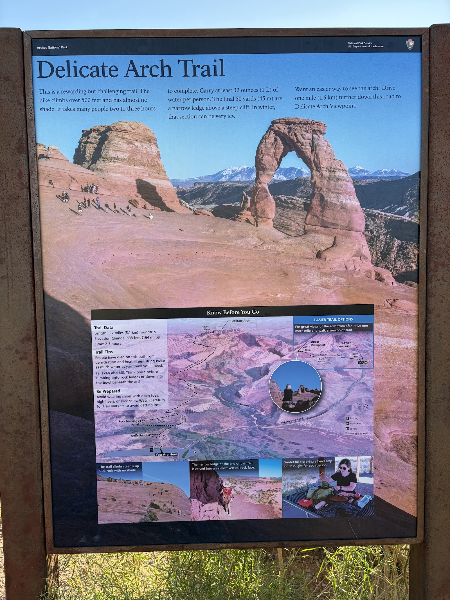
*Delicate Arch・Delicate Arch Trailの看板* 
 

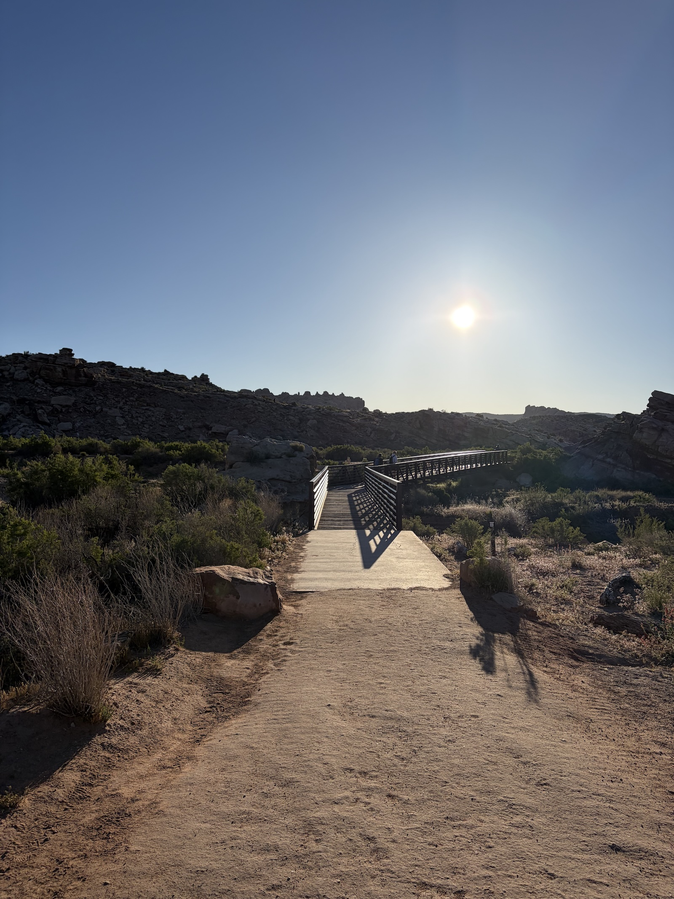
*Delicate Arch・トレッキングスタート* 
 

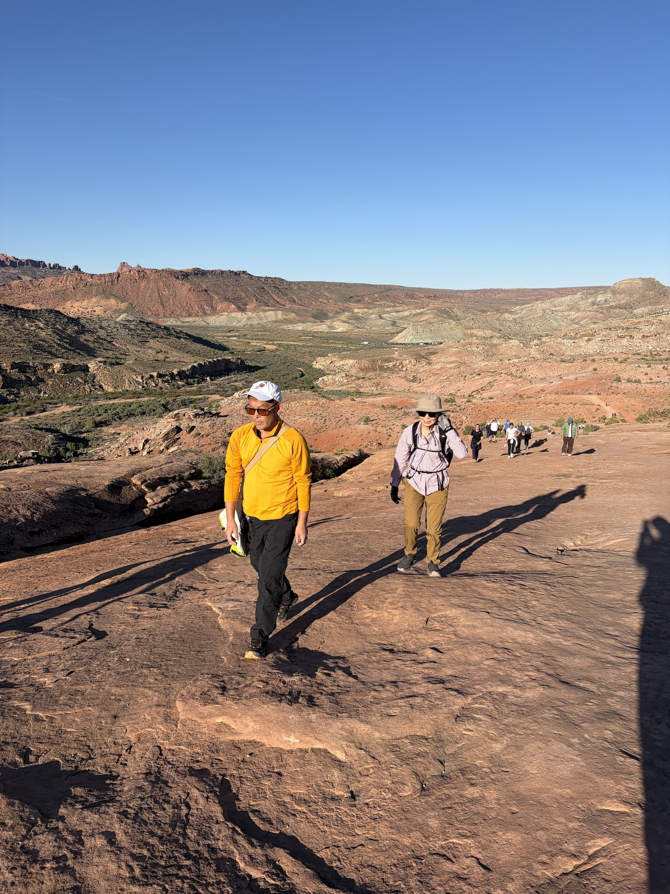
*Delicate Arch・ゆるい上り坂の岩盤を登る* 
 

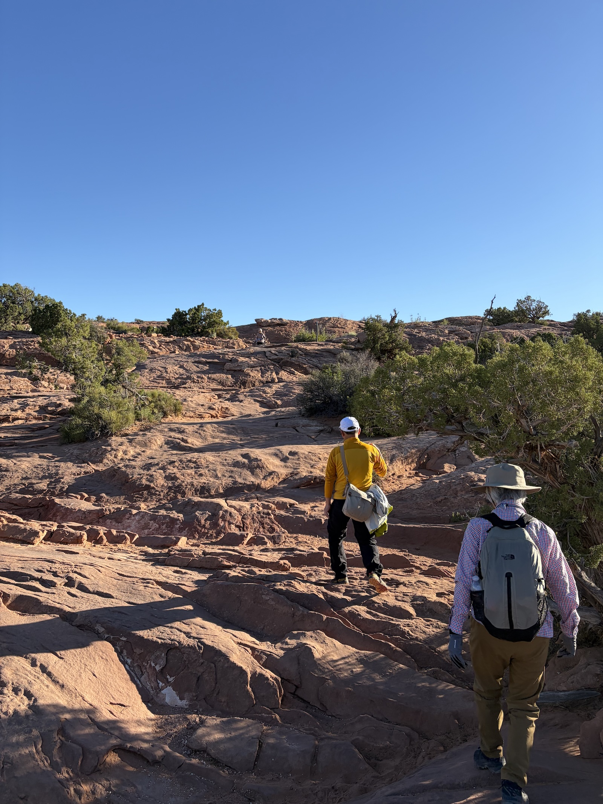
*Delicate Arch・どんどん登る* 
 

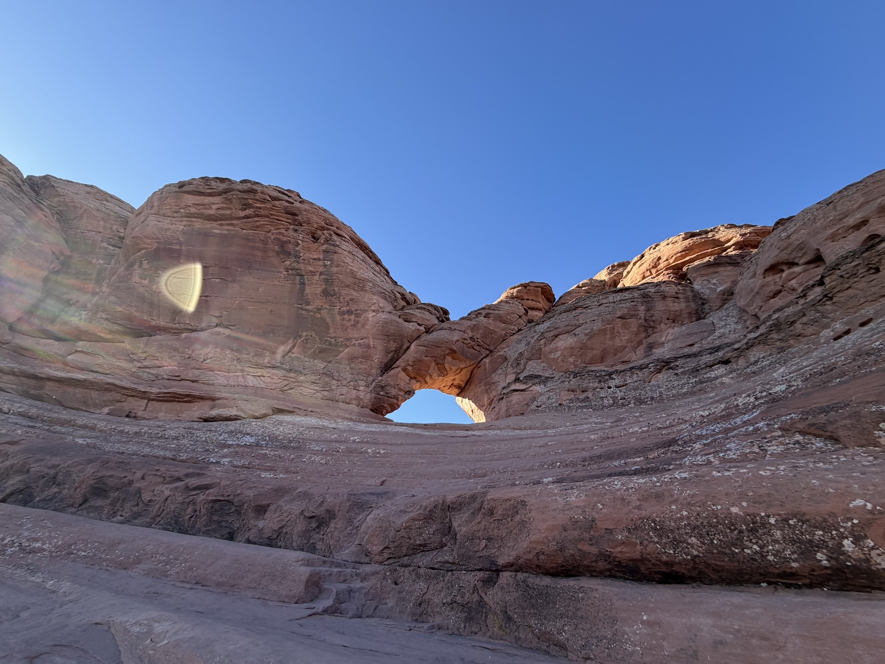
*Delicate Arch・Delicate Archへ行く途中の右手にあるアーチ* 
 

この旅の最初から菅野さんがずっとDelicate Archへ行く途中の細い崖道を恐れていたけど、行ってみたらそんなに大変ではなかった。 
意外と道幅がある。 
よっぽどSedonaのSubway Caveの方が崖（笑） 
 

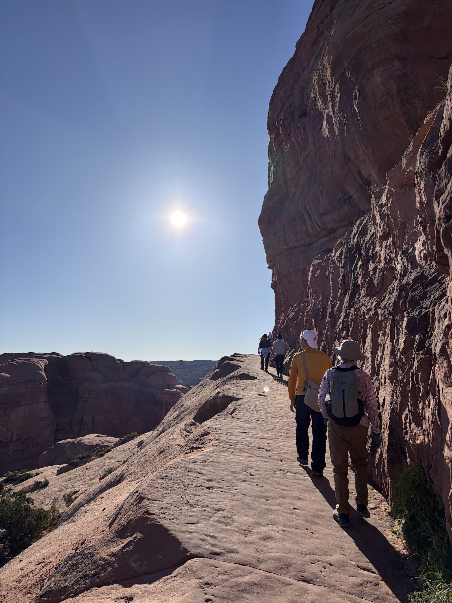
*Delicate Arch・Delicate Archへ行く途中の細い崖道* 
 

菅野さんは、Delicate Archに行った人のブログを読んでいて、怖くて行かれなかったというのを読んで、高所恐怖症の自分は無理だと思ったらしい。 
ブログを読むと怖そうに見えるけど、実際には道幅があって大丈夫だった。 
でも確かに写真に撮ると怖そうに見えるかも。 
 

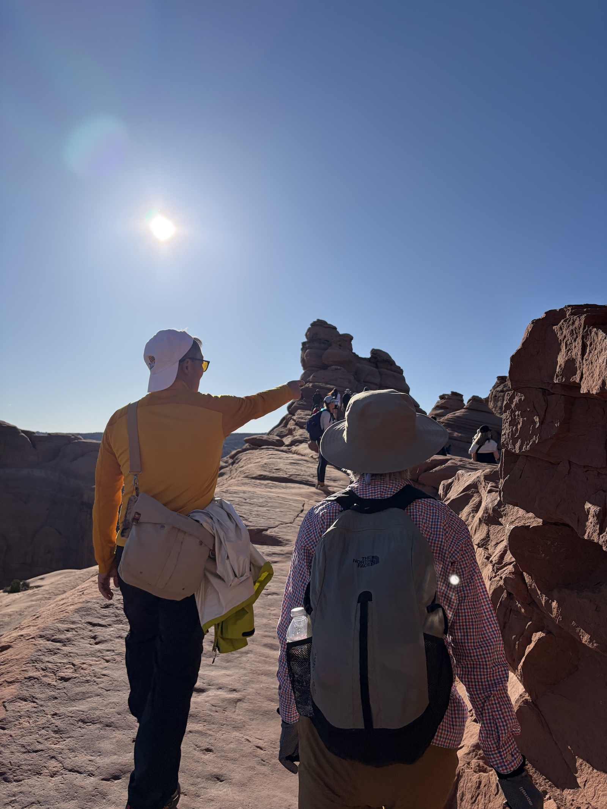
*Delicate Arch・Delicate Archが見えたよ！* 
 

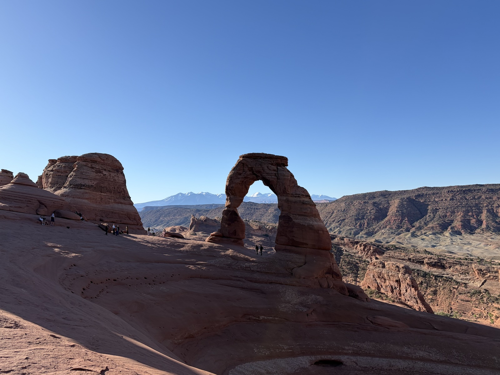
*Delicate Arch・Delicate Arch* 
 

<iframe src="https://www.google.com/maps/embed?pb=!1m17!1m12!1m3!1d23080.92763501451!2d-109.53819048950028!3d38.74304138553213!2m3!1f0!2f0!3f0!3m2!1i1024!2i768!4f13.1!3m2!1m1!2zMzjCsDQ0JzM4LjIiTiAxMDnCsDI5JzU1LjYiVw!5e0!3m2!1sja!2sjp!4v1784533666706!5m2!1sja!2sjp" width="100%" height="450" style="border:0;" allowfullscreen="" loading="lazy" referrerpolicy="strict-origin-when-cross-origin"></iframe>
 
 
 
Delicate Archの下で写真を撮る人の順番待ちの列に並ぶ。 
菅野さんと2人でスミーに写真を撮ってもらう。 
最近はどこも、みんなちゃんと並ぶのね。 
前回は誰も並んでなかったけど、これもSNSの発達と映えの重視がもたらした効果かな。 
 

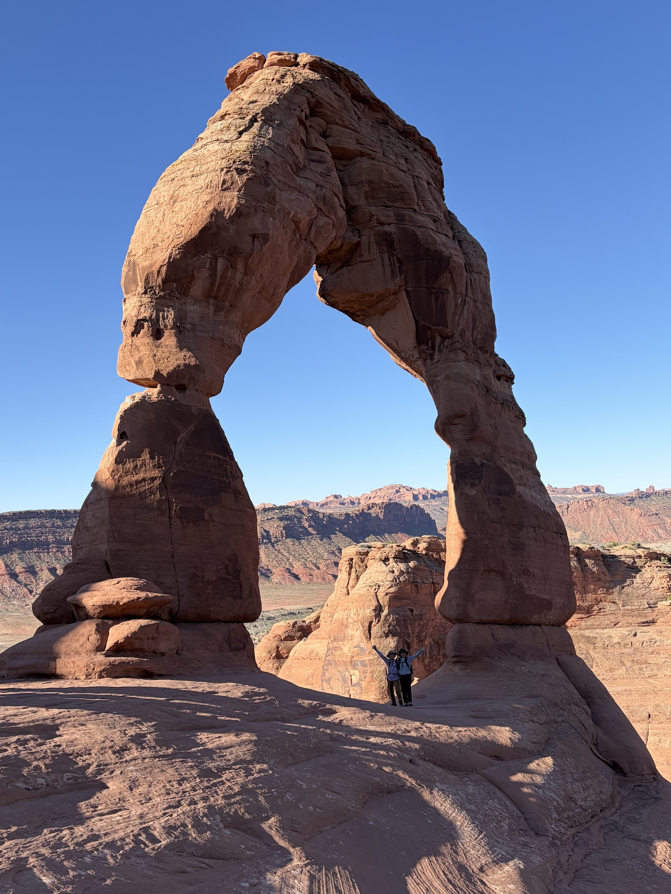
*Delicate Arch・Delicate Archの前で* 
 

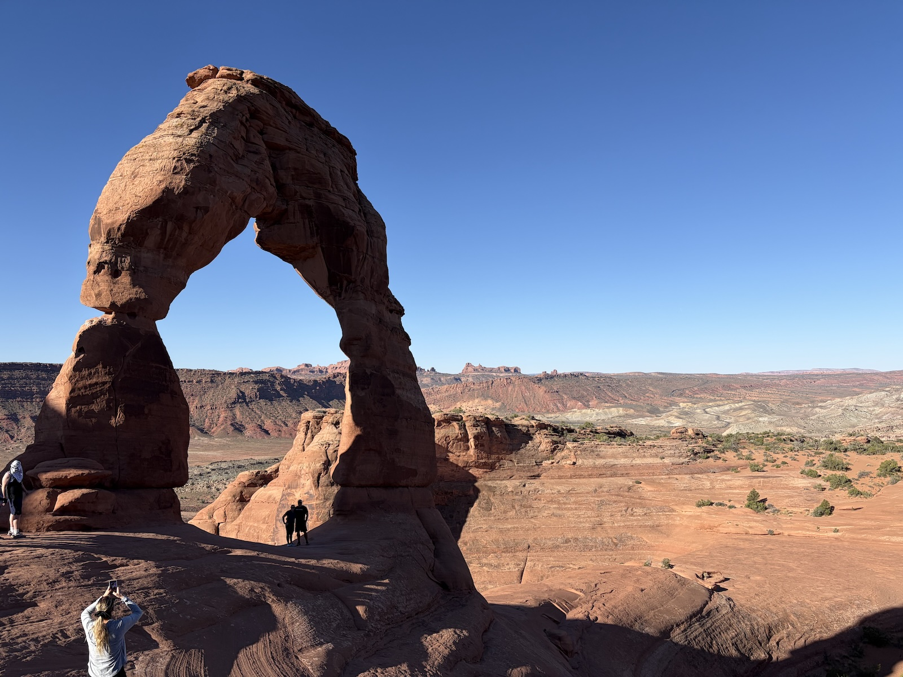
*Delicate Arch・ここだけアーチがのこるのがすごい。いつか崩れそうだ* 
 

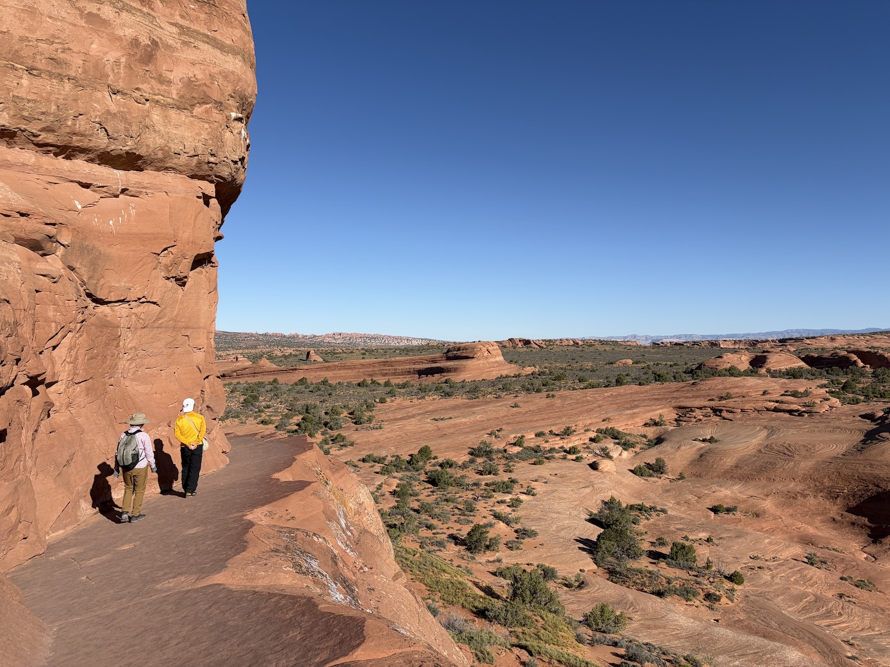
*Delicate Arch・帰りの崖道* 
 

Delicate Archの帰り道で、行く途中にあった崖を登ると、開いた穴からDelicate Archが見えて、そこでもみんな写真を撮っている。 
そういえば、行く途中でスミーが、あ…って言ってた気がする。 
 
ちょっと急な斜面で、菅野さんも誘ったが登らずに下で待っていた。 
スミーと私は2人で登って写真を撮る。 
 

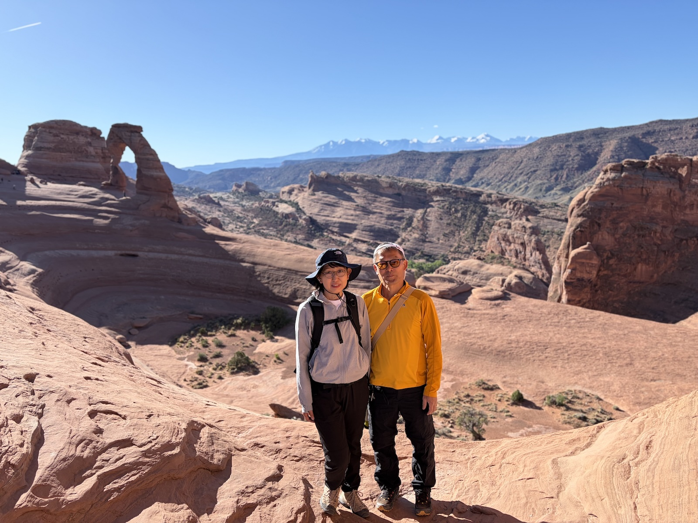
*Delicate Arch・Delicate Arch Trailを背景に* 
 

*Delicate Arch・この崖道は細い* 
 

駐車場まで降りてきてトイレに寄る。 
そういえば…なぜアメリカの国立公園内の汲み取り式トイレは臭くないし、虫もいないのだろうか？とスミーと話をする。 
 

--- 

 

**📖 コラム｜アメリカの国立公園のトイレ（Vault Toilet）の仕組み**  
 
定期的にバキュームトラックで吸引し、認可された廃棄処理施設（sewage treatment plant） に運ばれて処理される。 
頻度は利用者数や季節によって異なり、混雑するシーズンは週1回以上になることも。 
 
日本の汲み取り式との大きな違いはいくつかある。 
 
＜換気システムが優秀＞ 
便槽の上部に太いベントパイプ（排気管） が設置されており、臭気を外部に逃がす設計になっている。 
パイプの内部は暗く、外は明るいため、臭いに引き寄せられるハエがパイプ内に入り込んで外に出られなくなる（＝衛生的にも有効）という仕組み。 
 
＜酵素・微生物処理剤の投入＞ 
定期的に酵素や微生物製剤を投入し、分解を促進して臭いを抑えている。 
 
＜便槽の素材と断熱＞ 
現代のVault Toiletはガラス繊維強化プラスチック（FRP）製で、密閉性が高く、臭いが漏れにくい構造になっている。 
 
＜乾燥した気候＞ 
グランドサークル周辺（アンテロープキャニオンやモニュメントバレーなど）は特に乾燥しているため、発酵・腐敗が進みにくく、臭いが出にくい自然条件がある。 

 

--- 

 
 

## Devils Garden TrailでDouble Oに会いに
Delicate Archを見た後だったので、駐車場が厳しいかと思ったけど、意外と駐車場が広くて停められた。 
 

<iframe src="https://www.google.com/maps/embed?pb=!1m18!1m12!1m3!1d1492.5777738484082!2d-109.59719167377281!3d38.78375523719126!2m3!1f0!2f0!3f0!3m2!1i1024!2i768!4f13.1!3m3!1m2!1s0x8748779283c776e3%3A0x625dd8c690e9a6f5!2sDevils%20Garden%20Parking%20Lot!5e0!3m2!1sja!2sjp!4v1784534122416!5m2!1sja!2sjp" width="100%" height="450" style="border:0;" allowfullscreen="" loading="lazy" referrerpolicy="strict-origin-when-cross-origin"></iframe>
 
 
 
トレイルの一番奥のDouble O Archまで、そこそこ距離がある。 
ホテルでもらったオレンジ、バナナ、リンゴを背負って出発！ 
 

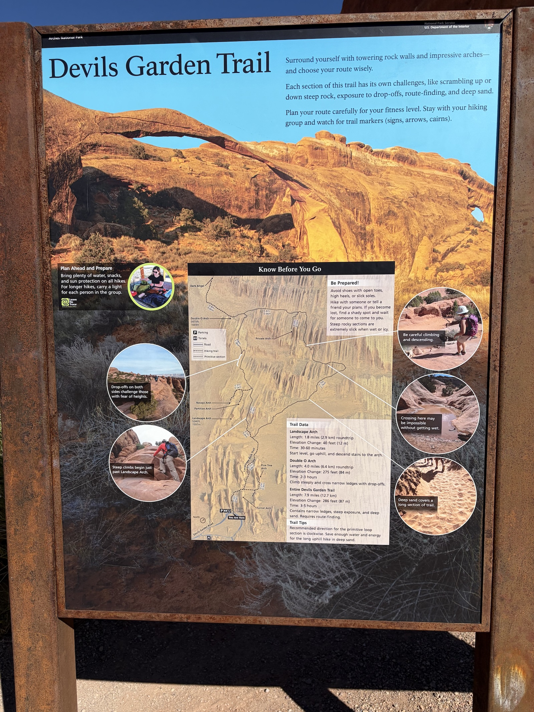
*Devils Garden Trail・Devils Garden Trailの看板* 
 

*Devils Garden Trail・Devils Gardenの壁がどうやってできたか* 
 

両側に聳え立つ大きな壁の間を通ってトレイルがスタート。 
すごい探検の始まりという雰囲気。 
 

*Devils Garden Trail・両側に聳え立つ壁を抜けてトレイルへ* 
 

Devils Garden Trailは、緑や花が多めのトレイルで歩くのが楽しい。 
日陰がまったくなく、日差しがとてもきつい。 
 

*Devils Garden Trail・緑が多めのトレイル* 
 

ここにもねじれている木が多い。 
そして映画「ウィキッド」に出てくるような枯れ木みたいな絵になる木が多い。 
 
もしかしてねじれてる木は、ボルテックスの影響ではなく、ただねじれる性質の木なんじゃないかと思い始める。 
 

*Devils Garden Trail・ここにもねじれた木* 
 

--- 

 

**📖 コラム｜ねじれる木**  
 
ねじれている木は、ユタ・ジュニパー（Utah Juniper）かピニョン・パイン（Piñon Pine）と思われる。 
どちらもアメリカ南西部の乾燥地帯に広く自生する木で、Sedona・Arches・Grand Canyonすべてに共通して分布している。 
 
＜ねじれの本当の理由＞ 
この独特な螺旋状のねじれは、樹木の遺伝的・生理的な特性によるもの。 
 
・ 螺旋木理（spiral grain） という現象で、細胞が成長する際に螺旋状に分裂する性質を持つ樹種がある 
・ 乾燥・強風・貧栄養な岩盤土壌という過酷な環境で、何百年もかけてゆっくり成長することで、ねじれがより顕著になる 
・ ジュニパーは特にこの螺旋木理が強い樹種として知られている 
 
＜ボルテックス説について＞ 
Sedonaのボルテックス（渦エネルギーの地）は1980年代以降に広まったニューエイジ的な概念で、科学的な根拠はない。 
ガイドブックが「ボルテックスでねじれる」と書くのは観光的な演出。 
 

 

--- 

 
 
魅力的なLandscape Archを横目に見ながら奥へ進む。 
 

*Devils Garden Trail・Landscape Arch* 
 

岩をよじ登る。 
馬の背のような両側が崖になってるところを歩く。 
こちらの道の方がDelicate Archへ行く途中の道よりよっぽど怖い（笑） 
 

*Devils Garden Trail・岩をよじ登る* 
 

*Devils Garden Trail・気がついたら壁の上* 
 

馬の背の壁の上から見渡す景色は、もう本当に景色のスケールが違う。 
馬の背みたいになってるところは、聳え立つ岩の壁の上辺部分を歩いているらしい。 
 

*Devils Garden Trail・壁の上は遮るものがなくて景色を見渡せる* 
 

*Devils Garden Trail・壁がいくつもある* 
 

途中でトカゲが横切る。 
 

*Devils Garden Trail・トカゲ* 
 
 

### Double O Arch
馬の背の壁を降りたところにDouble O Archが現れる。 
 

*Devils Garden Trail・Double O Arch* 
 

<iframe src="https://www.google.com/maps/embed?pb=!1m18!1m12!1m3!1d1492.2461395760306!2d-109.622585884615!3d38.79959524299077!2m3!1f0!2f0!3f0!3m2!1i1024!2i768!4f13.1!3m3!1m2!1s0x874879cd901fd43d%3A0xaccabb3a8d44edbf!2sDouble%20O%20Arch!5e0!3m2!1sja!2sjp!4v1784539642687!5m2!1sja!2sjp" width="100%" height="450" style="border:0;" allowfullscreen="" loading="lazy" referrerpolicy="strict-origin-when-cross-origin"></iframe>
 
 
 
Double O Archの下まで行ったら、Double O Arch の下のOの穴に登って向こう側に行かれることが分かった。 
この穴によじ登ったり、降りたりするのをNational Parkのレンジャーのおじさんが見守って、手助けをしてくれている。 
 

*Devils Garden Trail・わかりにくいけどアーチが２つ重なっていて、下のアーチの中を抜けられる* 
 

Double O Arch の穴を通り抜けて、反対側からDouble O Arch を見る。 
少し崖を登って、上からDouble O Arch を見ると、また違う印象のDouble O Arch が現れる。 
なぜDouble Oなのかがよくわかる。 
 

*Devils Garden Trail・反対側から見たDouble O Arch* 
 

かなり歩いて少し疲れたので、ここで休憩。 
みんなで座ってバナナを食べる。 
アメリカ人と思われる人が横で立ってリンゴをかじってるのが、すごい絵になってかっこいい。 
 

*Devils Garden Trail・Double O Archを眺めながらちょっと休憩* 
 

Double O Archの下のOの穴を通って元の道をひたすら戻る。 
馬の背を突き進んだ先の突端が、空に向かって伸びる道みたい。 
 

*Devils Garden Trail・この岩の上を登って帰る。下から見ると結構すごい* 
 

*Devils Garden Trail・ちょっと離れた壁の上から見たDouble O Arch* 
 

*Devils Garden Trail・壁がいくつも重なって立つ* 
 

*Devils Garden Trail・馬の背がずっと続く* 
 

*Devils Garden Trail・壁の上の道は天につながる道みたい* 
 

*Devils Garden Trail・壁の先端でみんなが写真を撮っている* 
 
 

### Navajo Arch
道を少しそれて入ったところにあるNavajo Arch。 
往路では、スルーして来たが、復路で立ち寄る。 
 

*Devils Garden Trail・Navajo Archへの道* 
 

*Devils Garden Trail・穴ぼこだらけの壁* 
 

*Devils Garden Trail・やっと日陰！* 
 

*Devils Garden Trail・Navajo Arch* 
 

<iframe src="https://www.google.com/maps/embed?pb=!1m18!1m12!1m3!1d1554.8998093118973!2d-109.61129640160523!3d38.79122780000001!2m3!1f0!2f0!3f0!3m2!1i1024!2i768!4f13.1!3m3!1m2!1s0x874878299532e44f%3A0xa29b1cb4fb461031!2z44OK44OQ44Ob44O744Ki44O844OB!5e0!3m2!1sja!2sjp!4v1784539815745!5m2!1sja!2sjp" width="100%" height="450" style="border:0;" allowfullscreen="" loading="lazy" referrerpolicy="strict-origin-when-cross-origin"></iframe>
 
 
 
かなり太陽が上がって暑くなってきた。 
もうギラギラ。 
日陰で水を飲んで一休み。 
ここでランチを兼ねてみんなでオレンジを食べる。 
外で食べる果物は本当に美味しい。 
 
 

### Partition Arch
Navajo Archの隣にあるPartition Arch。 
リスが何匹か走り回っていてかわいい。 
 

*Devils Garden Trail・Partition Arch* 
 

<iframe src="https://www.google.com/maps/embed?pb=!1m18!1m12!1m3!1d1554.8998093118973!2d-109.61129640160523!3d38.79122780000001!2m3!1f0!2f0!3f0!3m2!1i1024!2i768!4f13.1!3m3!1m2!1s0x87487829cba2a6f5%3A0x7735a0aab8992872!2sPartition%20Arch!5e0!3m2!1sja!2sjp!4v1784539850595!5m2!1sja!2sjp" width="100%" height="450" style="border:0;" allowfullscreen="" loading="lazy" referrerpolicy="strict-origin-when-cross-origin"></iframe>
 
 
 

*Devils Garden Trail・トレイルの帰り道。どうやって登ってきたんだっけ？* 
 

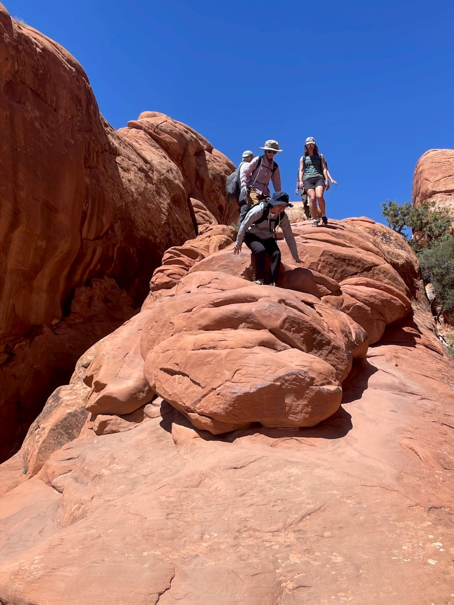
*Devils Garden Trail・下り道の方が怖い* 
 
 

### Landscape Arch
往路で見ないで通り過ぎたLandscape Archを見る。 
 
アーチの大きさがものすごく大きい。 
このアーチは、本当にかっこいい。 
横幅があって、アーチ自体が細身なんだよね。 
 
とにかくもう本当に日差しがものすごくて暑い。 
 

*Devils Garden Trail・美しい細身のLandscape Arch* 
 

<iframe src="https://www.google.com/maps/embed?pb=!1m18!1m12!1m3!1d3109.804221183829!2d-109.6069459390292!3d38.79112229837426!2m3!1f0!2f0!3f0!3m2!1i1024!2i768!4f13.1!3m3!1m2!1s0x87487787850ff8ad%3A0x8eb5eaa717606bab!2z44Op44Oz44OJ44K544Kx44O844OX44O744Ki44O844OB!5e0!3m2!1sja!2sjp!4v1784539944887!5m2!1sja!2sjp" width="100%" height="450" style="border:0;" allowfullscreen="" loading="lazy" referrerpolicy="strict-origin-when-cross-origin"></iframe>
 
 

### Pine Tree Arch
かなり駐車場側に戻ってきたところに分かれ道があってそこを入って行ったところにあるPine Tree Arch。 
すごく地味なアーチで、アーチをくぐって向こう側を見てみたけど、ただ広い草原が広がるだけだった。 
 

*Devils Garden Trail・Pine Tree Arch* 
 

*Devils Garden Trail・Pine Tree Archの下から* 
 

*Devils Garden Trail・Pine Tree Archの向こう側は草原だった* 
 

<iframe src="https://www.google.com/maps/embed?pb=!1m17!1m12!1m3!1d3109.9636836941495!2d-109.5988099770704!3d38.78746688900367!2m3!1f0!2f0!3f0!3m2!1i1024!2i768!4f13.1!3m2!1m1!2zMzjCsDQ3JzE1LjAiTiAxMDnCsDM1JzU1LjkiVw!5e0!3m2!1sja!2sjp!4v1784540039728!5m2!1sja!2sjp" width="100%" height="450" style="border:0;" allowfullscreen="" loading="lazy" referrerpolicy="strict-origin-when-cross-origin"></iframe>
 
 

### Tunnel Arch
こちらもかなり地味なアーチ。 
もしかしてみんなアーチに気が付かないんじゃないの？というくらい。 
 
会社の話をしながら歩いていたら
Tunnel Archの終点まで辿り着いて、どれ？あれ？となった。 
 

*Devils Garden Trail・Tunnel Arch* 
 

<iframe src="https://www.google.com/maps/embed?pb=!1m18!1m12!1m3!1d3110.0334050270158!2d-109.5966402503044!3d38.78586855374321!2m3!1f0!2f0!3f0!3m2!1i1024!2i768!4f13.1!3m3!1m2!1s0x8748778db434b951%3A0x11b22dfac783f495!2z44OI44Oz44ON44Or44O744Ki44O844OB!5e0!3m2!1sja!2sjp!4v1784540096168!5m2!1sja!2sjp" width="100%" height="450" style="border:0;" allowfullscreen="" loading="lazy" referrerpolicy="strict-origin-when-cross-origin"></iframe>
 
 

## Fiery Furnace Viewpoint Trail
車で移動してFiery Furnace Viewpointへ。 
聳え立つ砂岩の壁に挟まれた狭い通路が迷宮のように続く奇景を上から見渡す。 
この1本1本の柱の間の細い通路を歩けるようになっているとは、上から見ているとまったく分からない。 
 
もうアーチを見すぎて、何が何だか分からなくなる。 
 

*Fiery Furnace Viewpoint Trail・Fiery Furnace Viewpoint Trailの看板* 
 

*Fiery Furnace Viewpoint Trail・Fiery Furnace Viewpointからの景色* 
 

<iframe src="https://www.google.com/maps/embed?pb=!1m18!1m12!1m3!1d3111.93299380252!2d-109.564708296451!3d38.74229982408097!2m3!1f0!2f0!3f0!3m2!1i1024!2i768!4f13.1!3m3!1m2!1s0x8747d89be1ee5783%3A0x71c2302c53873daa!2sFiery%20Furnace!5e0!3m2!1sja!2sjp!4v1784540187808!5m2!1sja!2sjp" width="100%" height="450" style="border:0;" allowfullscreen="" loading="lazy" referrerpolicy="strict-origin-when-cross-origin"></iframe>
 
 
 

## Double Arch
The Windows Trailの駐車場に車を停めて、Double Arch Viewpoint and TrailでDouble Archを目指す。 
駐車場からDouble Archが見えているので、比較的近いらしい。 
 

<iframe src="https://www.google.com/maps/embed?pb=!1m18!1m12!1m3!1d4538.327923725148!2d-109.53813948602019!3d38.69193914600435!2m3!1f0!2f0!3f0!3m2!1i1024!2i768!4f13.1!3m3!1m2!1s0x8747df0e987b8773%3A0x60e215628b8d8752!2sDouble%20Arch%20Viewpoint%20and%20Trail!5e0!3m2!1sja!2sjp!4v1784540281223!5m2!1sja!2sjp" width="100%" height="450" style="border:0;" allowfullscreen="" loading="lazy" referrerpolicy="strict-origin-when-cross-origin"></iframe>
 
 

*Double Arch Viewpoint and Trail・駐車場からもDouble Archが見える* 
 

*Double Arch Viewpoint and Trail・Double Arch Trailの看板* 
 

*Double Arch Viewpoint and Trail・Double Archを目指して歩く歩く* 
 

ものすごい日差しの灼熱地獄。 
1本長いトレイルの後なので、さすがに体力を消耗する。 
水を飲みながら一生懸命歩いてDouble Archの下までくる。 
 
何がどうDouble Archなのかが分からなかったが、下に来てみてようやく分かった。 
 

*Double Arch Viewpoint and Trail・Double Arch* 
 

私はDouble Archの上のアーチまで登ってみる。 
結構、急かな？と思ったけど、意外と登れる。 
 

*Double Arch Viewpoint and Trail・Double Archの上まで登れる* 
 

風が吹き抜けて気持ちいい。 
素晴らしい眺め。 
 

*Double Arch Viewpoint and Trail・Double Archからの眺め* 
 

*Double Arch Viewpoint and Trail・Double Archの反対側の眺め* 
 

*Double Arch Viewpoint and Trail・あ、スミーがいた* 
 

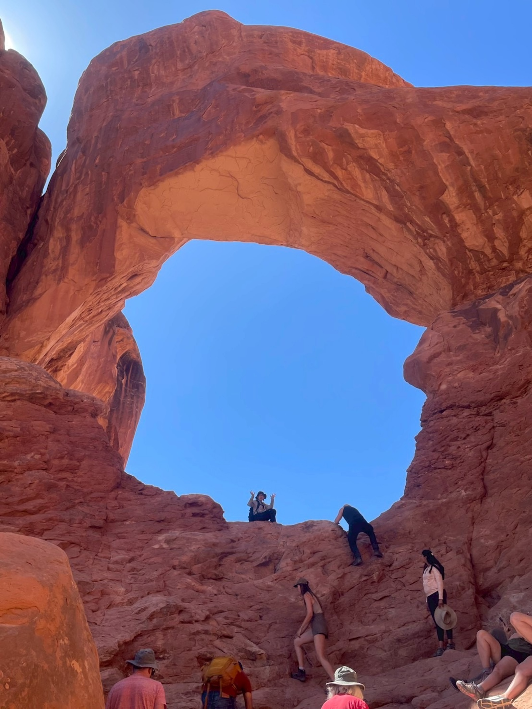
*Double Arch Viewpoint and Trail・スミーから見た私* 
 
 

## The Windows Trail
Double Arch Viewpoint and Trailと駐車場を挟んで反対側にあるThe Windows Trail。 
菅野さんは暑いし体力的に厳しいから駐車場で待っていると言い、スミーは行ったことあるから自分も行かないと言い出し、え？と固まる。 
菅野さんがそれならみんなで行こうとTrailを歩き出す。 
 

*The Windows Trail・The Windows Trailの看板* 
 
 

### North Window Arch
駐車場から一番近くて一番大きなNorth Window Arch。 
みなさんお疲れのご様子なのでNorth Window Archの上まで1人で登る。 
 

*The Windows Trail・North Window Arch* 
 

*The Windows Trail・North Window Archからの眺め* 
 

<iframe src="https://www.google.com/maps/embed?pb=!1m18!1m12!1m3!1d778.5993837233397!2d-109.5338310788794!3d38.68571180192462!2m3!1f0!2f0!3f0!3m2!1i1024!2i768!4f13.1!3m3!1m2!1s0x8747df0629940b41%3A0x1a668ec4c1b5f44c!2z5YyX56qT44Ki44O844OB!5e0!3m2!1sja!2sjp!4v1784540414306!5m2!1sja!2sjp" width="100%" height="450" style="border:0;" allowfullscreen="" loading="lazy" referrerpolicy="strict-origin-when-cross-origin"></iframe>
 
 
 
下に降りて、菅野さんに、私は一人でトレイルを回ってくるので、先に２人で駐車場に戻っていてと伝えて歩き出す。 
せっかく来たし、もう来られないかもしれないからね。 
見られるものは見ておこうと思う。 
 
 

### South Window Arch
North WindowのとなりにあるのがSouth Window。 
 

*The Windows Trail・South Window Arch* 
 

North WindowとSouth Windowが並んで眼鏡橋のよう。 
反対側を向くとTurret Archが見える。 
 

*The Windows Trail・North WindowとSouth Window* 
 

<iframe src="https://www.google.com/maps/embed?pb=!1m18!1m12!1m3!1d778.5993837233397!2d-109.5338310788794!3d38.68571180192462!2m3!1f0!2f0!3f0!3m2!1i1024!2i768!4f13.1!3m3!1m2!1s0x8747df07d101ebb7%3A0xcf571532610741d2!2z5Y2X56qT44Ki44O844OB!5e0!3m2!1sja!2sjp!4v1784540447853!5m2!1sja!2sjp" width="100%" height="450" style="border:0;" allowfullscreen="" loading="lazy" referrerpolicy="strict-origin-when-cross-origin"></iframe>
 
 

### Turret Arch
Turret ArchからDouble Archの方まで見渡せる。 
アーチの窓から見える景色の方角が違うので面白い。 
 

*The Windows Trail・Turret Arch* 
 

Turret Archをくぐって反対側に出て振り返ると、North WindowとSouth Windowが見える。 
アーチの中にアーチが見えるのが面白い。 
 

*The Windows Trail・Turret Archの窓から見たNorth WindowとSouth Window* 
 

*The Windows Trail・Turret Archからの眺め* 
 

<iframe src="https://www.google.com/maps/embed?pb=!1m18!1m12!1m3!1d778.6148585094109!2d-109.53608997166155!3d38.6842896450417!2m3!1f0!2f0!3f0!3m2!1i1024!2i768!4f13.1!3m3!1m2!1s0x8747df0845db4cd9%3A0x463683554183766e!2sTurret%20Arch!5e0!3m2!1sja!2sjp!4v1784540497825!5m2!1sja!2sjp" width="100%" height="450" style="border:0;" allowfullscreen="" loading="lazy" referrerpolicy="strict-origin-when-cross-origin"></iframe>
 
 
 
North Window Archに戻ったけど菅野さんが見つからず。 
Trail Headに戻ったら、トイレのところの日陰で菅野さんが待っていた。 
 
まず日陰がない。 
直射日光の下では、とてもいられない暑さ。 
早く車に乗って涼んで次に行こう！ 
 
 

## 絶対宇宙人がいる気がする Balanced Rock
Archの見過ぎで、どれがどれだかもすでに分からなくなってる・・・ 
そして体力の消耗が激しい・・・ 
 
車でBalanced Rockへ移動。 
 
Balanced Rockは、宇宙人が上から石を置いたとしか思えないような石の配置。 
どうやればこういうことになるのだろうか？と思ってしまう。 
 

*Balanced Rock・宇宙人のいたずらとしか思えない* 
 

*Balanced Rock・Balanced Rock Trailの看板* 
 

<iframe src="https://www.google.com/maps/embed?pb=!1m18!1m12!1m3!1d2137.792630304018!2d-109.56707196282657!3d38.70213512657379!2m3!1f0!2f0!3f0!3m2!1i1024!2i768!4f13.1!3m3!1m2!1s0x8747df5e8ad2193b%3A0xe8aefa887051bea8!2z44OQ44Op44Oz44K544O744Ot44OD44Kv!5e0!3m2!1sja!2sjp!4v1784540554818!5m2!1sja!2sjp" width="100%" height="450" style="border:0;" allowfullscreen="" loading="lazy" referrerpolicy="strict-origin-when-cross-origin"></iframe>
 
 
 
Balanced Rockの上に乗っている石が、見る角度によってぜんぜんイメージが違うのも面白い。 
上の方まで登って、上から景色を眺める。 
 

*Balanced Rock・見る角度で別のものに見えるBalanced Rock* 
 

*Balanced Rock・Balanced Rockの上から見た景色* 
 

帰り道にArches National Park Visitor Centerに寄ってお土産を見る。 
私はステッカーを買う。  
 

*Arches National Park・Visitor Center* 
 

<iframe src="https://www.google.com/maps/embed?pb=!1m18!1m12!1m3!1d5355.784290597076!2d-109.62055619556726!3d38.620598200647976!2m3!1f0!2f0!3f0!3m2!1i1024!2i768!4f13.1!3m3!1m2!1s0x87480b263e815631%3A0x98757620e932c562!2sArches%20National%20Park%20Visitor%20Center!5e0!3m2!1sja!2sjp!4v1784540628986!5m2!1sja!2sjp" width="100%" height="450" style="border:0;" allowfullscreen="" loading="lazy" referrerpolicy="strict-origin-when-cross-origin"></iframe>
 
 

## コロラド川の蛇行もあっちこっちに
Horseshoe Bendと同じようなコロラド川の蛇行（ひの字）が見られるDead Horse Pointへ。 
どこに行ってもコロラド川があるので、本当に長くて大きい川なんだなと思う。 
遥か昔は川からの恩恵を得るとともに、氾濫したらすごいことになっていたのだろうと思う。 
 

*Dead Horse Point・Dead Horse Point Trailの看板* 
 

岩と岩の間の割れ目から木や草花が生えているのを見つける。 
植物は、本当にすごい生命力だなと思う。 
私は簡単に諦めちゃうけど（笑） 
 

*Dead Horse Point・岩の割れ目から生えている木* 
 

Dead Horse Pointは、Grand CanyonとHorseshoe Bendを合わせたような景観。 
 

*Dead Horse Point・Dead Horse Pointから見えるコロラド川のひの字* 
 

<iframe src="https://www.google.com/maps/embed?pb=!1m18!1m12!1m3!1d11332.420115531435!2d-109.75692593331378!3d38.47341676219957!2m3!1f0!2f0!3f0!3m2!1i1024!2i768!4f13.1!3m3!1m2!1s0x87480fc14fce4e95%3A0xa94350cdfc8abbb8!2sDead%20Horse%20Point!5e0!3m2!1sja!2sjp!4v1784540715356!5m2!1sja!2sjp" width="100%" height="450" style="border:0;" allowfullscreen="" loading="lazy" referrerpolicy="strict-origin-when-cross-origin"></iframe>
 
 
 
すっかり日も傾き、街へ戻る。 
昨晩はタイ料理のお店で食べたので、今日はCity Marketで買い出しをして部屋飲み。 
部屋のキッチンに電子レンジなどもあるので、温めて飲むスープなどを買う。 
 
部屋に戻って来てから、菅野さんとふたりでMoabの街の中心地をウィンドウショッピング。 
お土産物屋さんなどを見て回る。 
ここにもココペリがたくさんいる。 
 

*Moab・Moabの町を歩く* 
 

ピザ屋さん、アイスクリーム屋さんなどがあって、ピザがものすごく美味しそうに見える。 
今日は少しホテルの周りを見て歩く時間の余裕があってよかった。 
 

*Moab・Moabのピザ屋さん* 
 

そして今晩もスミーの部屋で部屋のみ。 
部屋に戻って、菅野さんと夜遅くまでおしゃべり。 
いろんな話をしたな〜。 
菅野さん、ありがとう。 
 
この旅、２回目の山場を無事に乗り切る。 
 
 

## 今夜の宿・Homewood Suites by Hilton Moab
珍しく連泊 
菅野さんと2人部屋 
キッチン付きのすごく広いお部屋 
 

📍 **本日の移動** 
Homewood Suites by Hilton Moab → Delicate Arch → Devils Garden Trail → Double O Arch → Navajo Arch → Partition Arch → Landscape Arch → Pine Tree Arch → Tunnel Arch → Fiery Furnace Viewpoint Trail → Double Arch → The Windows Trail → North Window Arch → South Window Arch → Turret Arch → Balanced Rock → Arches National Park Visitor Center → Dead Horse Point → City Market → Moabの街歩き → Homewood Suites by Hilton Moab
