#  【グランドサークル】 8日目　 Moab 〜 Bryce Canyonへ 
###### 2026年5月3日（日）薄曇り／晴れ

## いよいよ旅も終盤
珍しく朝食を３人で食べる。 
いよいよ風邪の症状が出て体調が思わしくなくなってくる。 
喉が強烈に痛いので、ホテルでもらえる飴が本当に助かる。 
 
今日はチェックアウトなので、ここぞとばかりにたくさんの飴をもらってくる。 
 
ホテルをチェックアウトして、今日はBryce Canyonまでの長いドライブ。 
Hwy 128 Scenic Bywayでコロラド川沿いの道を走る。 
 
早速すごい崖が現れる。 
Sandy Beachで車を停めて川岸まで降りる。 
 

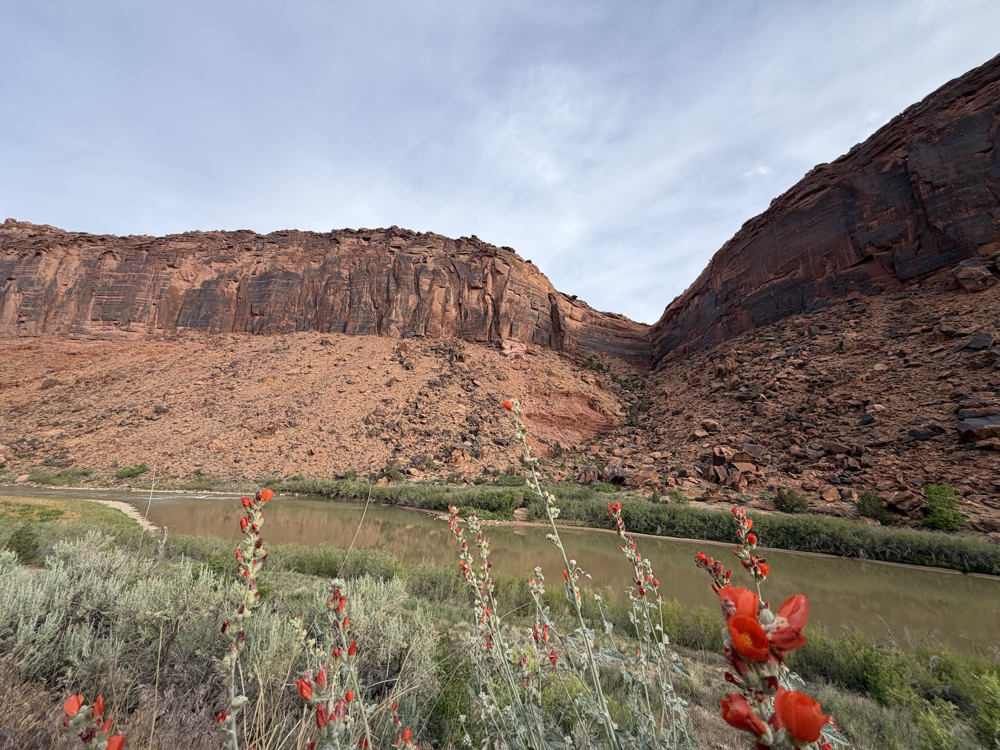
*Hwy 128 Scenic Byway・Sandy Beach 写真では伝わらないけどものすごい大きさ* 
 

<iframe src="https://www.google.com/maps/embed?pb=!4v1784540859890!6m8!1m7!1sCAoSF0NJSE0wb2dLRUlDQWdJREI5TUNTbGdF!2m2!1d38.68230145216866!2d-109.47683487097!3f0!4f0!5f0.7820865974627469" width="100%" height="450" style="border:0;" allowfullscreen="" loading="lazy" referrerpolicy="strict-origin-when-cross-origin"></iframe>
 
 
 
対岸に大きな岩の壁。 
その大きさがものすごい。 
 

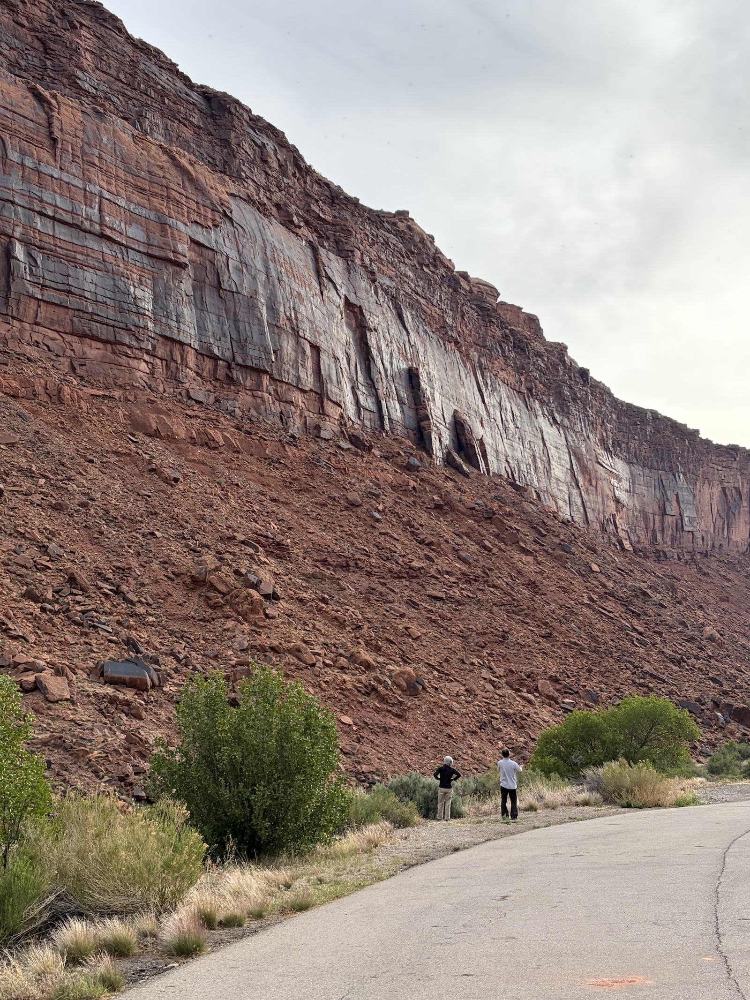
*Hwy 128 Scenic Byway・Sandy Beach スミーと菅野さんの小ささでスケールが分かる* 
 

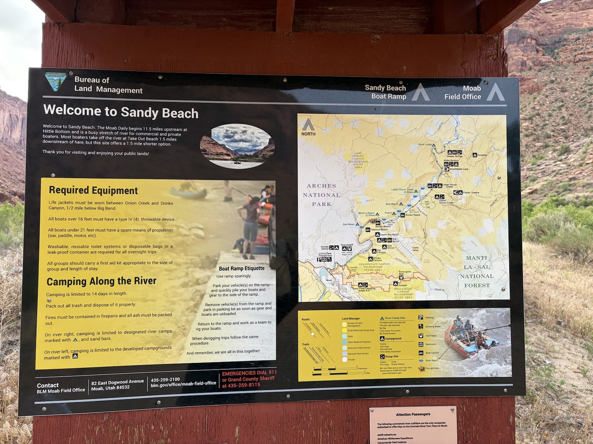
*Hwy 128 Scenic Byway・Sandy Beachの看板* 
 

今日は少し雲が出ていて日差しはキツくないけど、写真的に残念。 
 
しばらく車で走ると、Professor Valley Field Camp周辺の景色がまた素晴らしい。 
遠くに雪を被った山、手前にビュートと平原。 
 
道路脇に車を停めて写真を撮る。 
バイクに乗ったおじさんが、ドローンを飛ばして写真を撮っていた。 
 

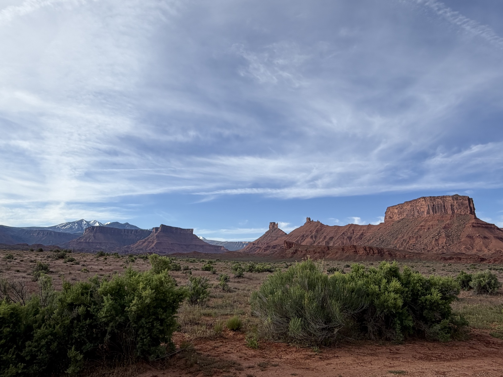
*Hwy 128 Scenic Byway・手前は赤土の乾燥地帯、奥には雪を被った山* 
 

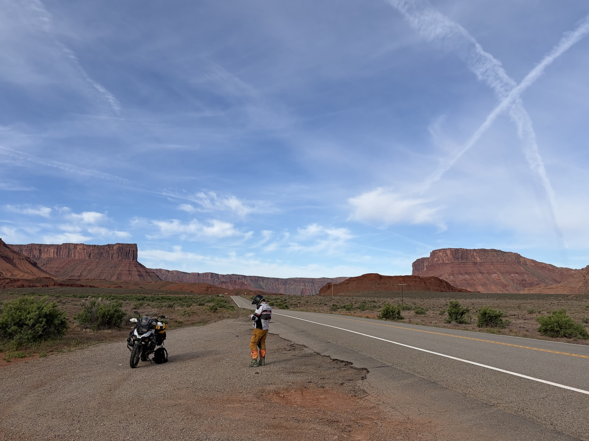
*Hwy 128 Scenic Byway・ドローンを飛ばして写真を撮影している人* 
 

<iframe src="https://www.google.com/maps/embed?pb=!4v1784540941974!6m8!1m7!1sCAoSF0NJSE0wb2dLRUlDQWdJREI5SVhZeFFF!2m2!1d38.71208461158632!2d-109.3744321958727!3f135.97598!4f0!5f0.7820865974627469" width="100%" height="450" style="border:0;" allowfullscreen="" loading="lazy" referrerpolicy="strict-origin-when-cross-origin"></iframe>
 
 
 
車の中でコロラド川から、産業用などにどんどん水を取っているという話になり、コロラド川の源流ってどこなんだろうか？という話になる。 
 

--- 

 

**📖 コラム｜コロラド川の源流**  
 
コロラド川の源流は、ラ・プードル峠湖（La Poudre Pass Lake） 。 
コロラド州北西部にあるロッキーマウンテン国立公園の中、クレムリングから約55マイル（約89km）の地点が源流域。 
 
川の水のほとんどは、ロッキー山脈の雪解け水が源となっている。 
 
＜源流から河口まで＞ 
- 始まり：ロッキー山脈の標高の高い地点で、山の雪が解けて小さな流れになる 
- コロラド州を流れながら、ガニソン川・グリーン川など多くの支流と合流して大きくなる 
- グランドキャニオン（アリゾナ州）を深く刻みながら流れ下る 
- ラスベガス近郊のフーバーダムでレイク・ミードを形成 
- メキシコのカリフォルニア湾（太平洋）へ注ぐ…はずが 
 
現在は農業・都市用水として取水されすぎているため、川の最後の流れはソノラ砂漠で蒸発し、カリフォルニア湾に届く前に消えてしまっている。 
 

 

--- 

 
 
コロラド川の水が消えてなくなって、海まで辿り着けない？！ 
すごいびっくり。 
 
しばらく走るとコロラド川を渡る古い吊り橋が出て来て、これはなんだろう？と車を停める。 
Dewey Suspension Bridgeで、さっきのバイク乗りのドローンを飛ばしていたおじさんも停まって写真を撮っていた。 
 

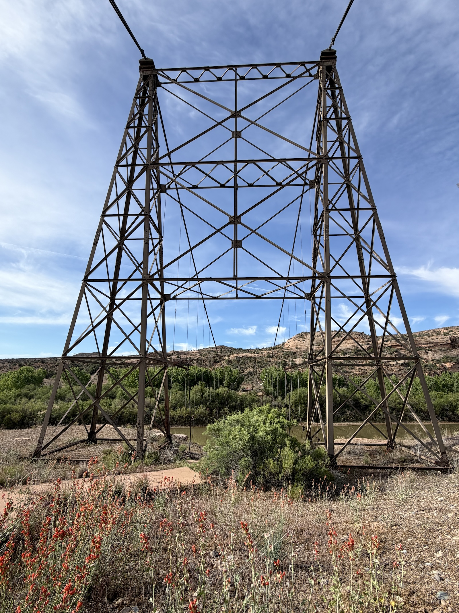
*Hwy 128 Scenic Byway・Dewey Suspension Bridge* 
 

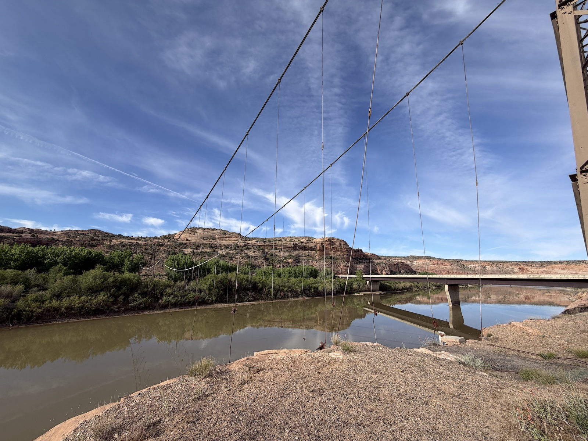
*Hwy 128 Scenic Byway・橋の基礎部分しか残っていないDewey Suspension Bridge* 
 

<iframe src="https://www.google.com/maps/embed?pb=!1m18!1m12!1m3!1d2169.3002587210444!2d-109.30430204419316!3d38.812230146462525!2m3!1f0!2f0!3f0!3m2!1i1024!2i768!4f13.1!3m3!1m2!1s0x8747c5c8e3310f8b%3A0x6042e305731e3997!2sDewey%20Suspension%20Bridge!5e0!3m2!1sja!2sjp!4v1784540999516!5m2!1sja!2sjp" width="100%" height="450" style="border:0;" allowfullscreen="" loading="lazy" referrerpolicy="strict-origin-when-cross-origin"></iframe>
 
 

--- 

 

**📖 コラム｜Dewey Bridge（デューイ橋）**  
 
Dewey Bridge（デューイ橋）は、アメリカ・ユタ州グランド郡にある歴史的な吊り橋。 
ユタ州のルート128沿いに位置し、コロラド川を渡る橋。 
 
20世紀初頭、Moabをはじめとするユタ州南東部の町々は、コロラド州西部の地域に日用品や農産物市場を依存していた。 
デューイ橋はコロラド川という大きな自然の障壁を越えた最初の直接連絡路となった。 
 
木製の橋桁を持ち、全長502フィート（約153m）、幅わずか8フィート（約2.4m）という一車線の吊り橋。 
建設当時、6頭の馬、3台の荷馬車、9,000ポンド（約4トン）の貨物を支えられるよう設計されており、ミシシッピ川以西で2番目に長い吊り橋だった。 
 
1915年に工費2万5,000ドルで建設され、1916年4月15日に開通。 
1984年には歴史的建造物として登録された。 
 
1986年に車道橋としての役割を終え、1990年代後半にグランド郡歴史保存委員会が10万ドル以上を集めて修復。 
歩行者・自転車専用橋としてココペリ・トレイルに組み込まれた。 
 
2008年、子どもがマッチで遊んだことが原因で火災が発生し、橋は焼失。 
ただし、吊りケーブルを支える2本のタワーや主ケーブル、アンカー、基礎部分は火災の影響を受けず残存している。 
 

 

--- 

 
 
オールド・シスコ・ハイウェイとぶつかるT字路の角にあるHwy 128 Scenic Bywayの看板の写真を撮る。 
ここでScenic Bywayも終わり。 
 

![Hwy 128 Scenic Byway・劣化しすぎて何もわからない看板(images/day08-08-hwy128-panel.jpeg)
*Hwy 128 Scenic Byway・劣化しすぎて何もわからない看板* 
 

<iframe src="https://www.google.com/maps/embed?pb=!1m18!1m12!1m3!1d7983.060668344921!2d-109.35854143763756!3d38.9495354692348!2m3!1f0!2f0!3f0!3m2!1i1024!2i768!4f13.1!3m3!1m2!1s0x8747cd921f2e5be3%3A0x660a259af5da80d8!2sHwy%20128%20Scenic%20Byway!5e0!3m2!1sja!2sjp!4v1784541072195!5m2!1sja!2sjp" width="100%" height="450" style="border:0;" allowfullscreen="" loading="lazy" referrerpolicy="strict-origin-when-cross-origin"></iframe>
 
 
 
Hwy 128を進むとたくさんのビュートや岩山が続く。 
この道の岩山を見ているとビュートがどうやってできていくかの過程がわかる。 
まるでビュート製造工場だねと言いながら眺める。 
 

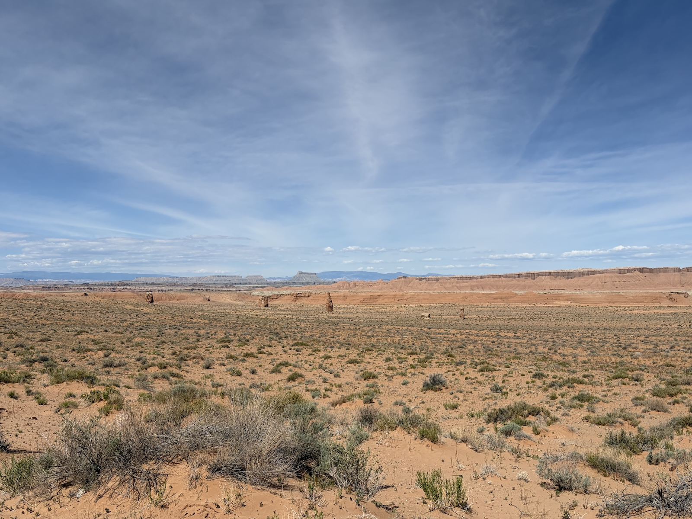
*Hwy 128・ビュート製造工場* 
 

これを見ていると昨日見たBalanced Rockも、決して宇宙人がのせて行った石じゃないんだなということがわかる。 
自然って本当にすごい。 
 
 

## 緑と水がキレイなCapitol Reef National Park
National Park入口のゲートに到着。 
 

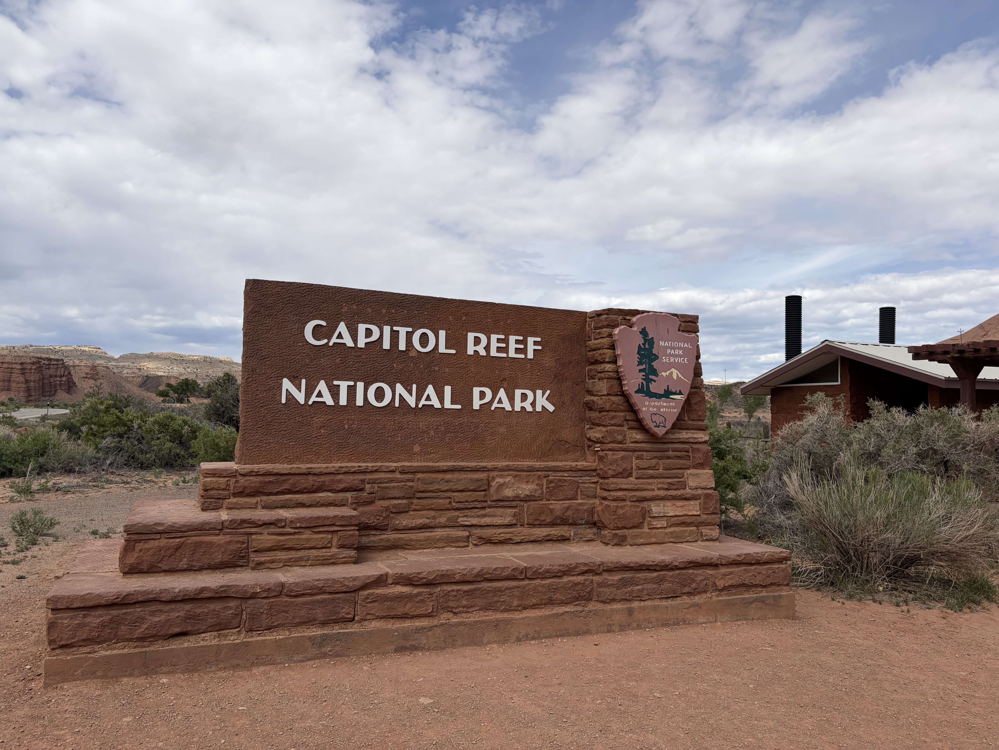
*Capitol Reef・Capitol Reefのゲート* 
 

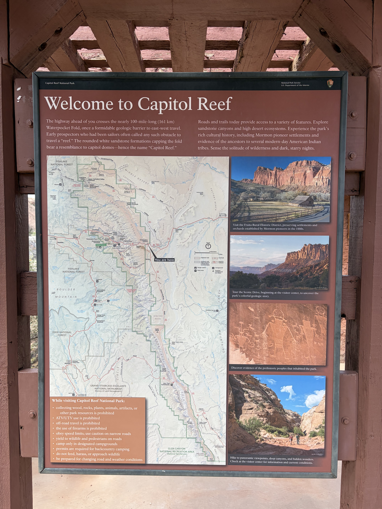
*Capitol Reef・Capitol Reefゲートにある案内板* 
 

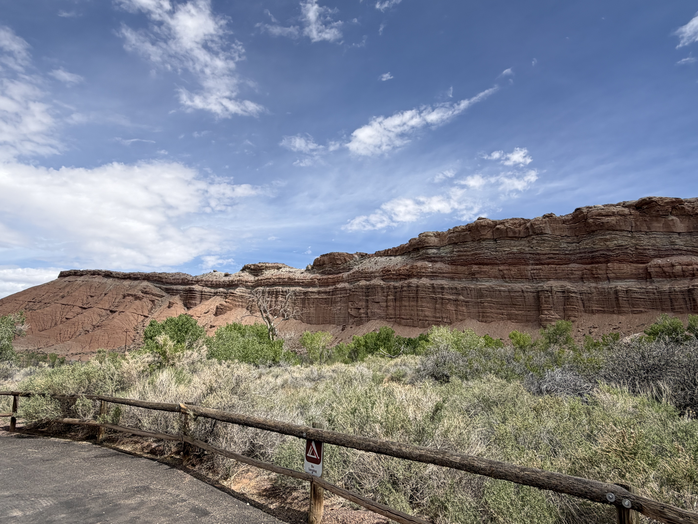
*Capitol Reef・ここでもビュート製造工場が近くで見られる* 
 

<iframe src="https://www.google.com/maps/embed?pb=!1m18!1m12!1m3!1d3771.9617417725976!2d-111.13071392169715!3d38.284649861334174!2m3!1f0!2f0!3f0!3m2!1i1024!2i768!4f13.1!3m3!1m2!1s0x874a1e6ffcfeaf6f%3A0x9200d87cdc74074f!2sCapitol%20Reef%20Sign%20%2F%20Orientation%20Pullout!5e0!3m2!1sja!2sjp!4v1784541215538!5m2!1sja!2sjp" width="100%" height="450" style="border:0;" allowfullscreen="" loading="lazy" referrerpolicy="strict-origin-when-cross-origin"></iframe>
 
 
 
砂漠地帯から、だんだん緑と水が増えて来て、景色を見るのも楽しいし癒される。 
オアシスな感じがする。 
 
車を停めてHickman Bridge Trailを進む。 
川の脇の道を登って、緑が多めのトレイルで気持ちいい。 
やっぱり水があるってすごいことなんだよね。 
 

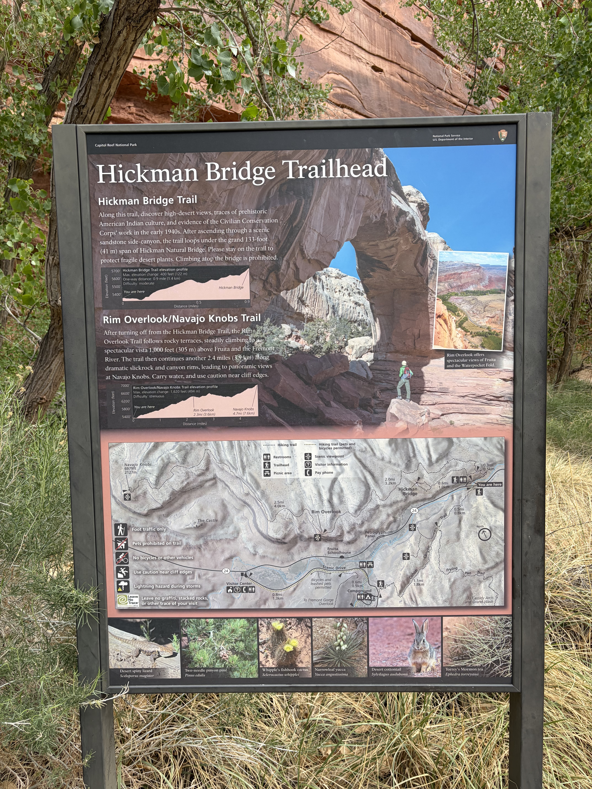
*Capitol Reef・Hickman Bridge Trailの案内板* 
 

<iframe src="https://www.google.com/maps/embed?pb=!1m18!1m12!1m3!1d898.7950168630537!2d-111.22914859664986!3d38.288892189758926!2m3!1f0!2f0!3f0!3m2!1i1024!2i768!4f13.1!3m3!1m2!1s0x874a1904f7209117%3A0x2c6384b908780ba!2sHickman%20Bridge%2C%20Rim%20Overlook%20and%20Navajo%20Knobs%20Trailhead!5e0!3m2!1sja!2sjp!4v1784541294295!5m2!1sja!2sjp" width="100%" height="450" style="border:0;" allowfullscreen="" loading="lazy" referrerpolicy="strict-origin-when-cross-origin"></iframe>
 
 
 
今日は天気が今ひとつで雲が多く、せっかくの水と緑のトレイルなのに写真が残念。 
 

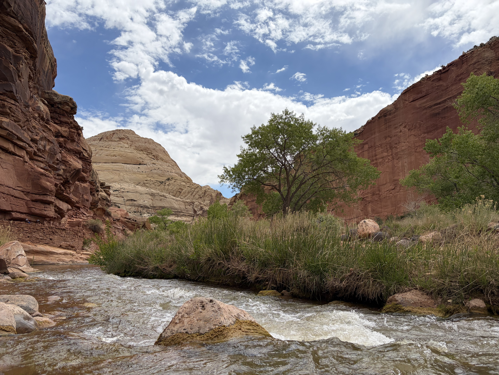
*Capitol Reef・Hickman Bridge Trailは緑と水で美しい* 
 

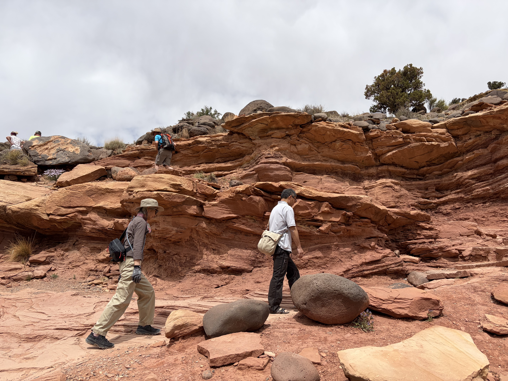
*Capitol Reef・Hickman Bridgeに向かって歩く* 
 

トレイルの途中でヘビが横切る。 
今までトカゲはいたけど、ヘビを見るのは初めて。 
スミーはサンダルで歩いていてビビる。 
 
Hickman Bridge Archの下を抜けて戻ってこられるトレイルだけど、Hickman Bridge Archまで行って引き返してくる。 
 

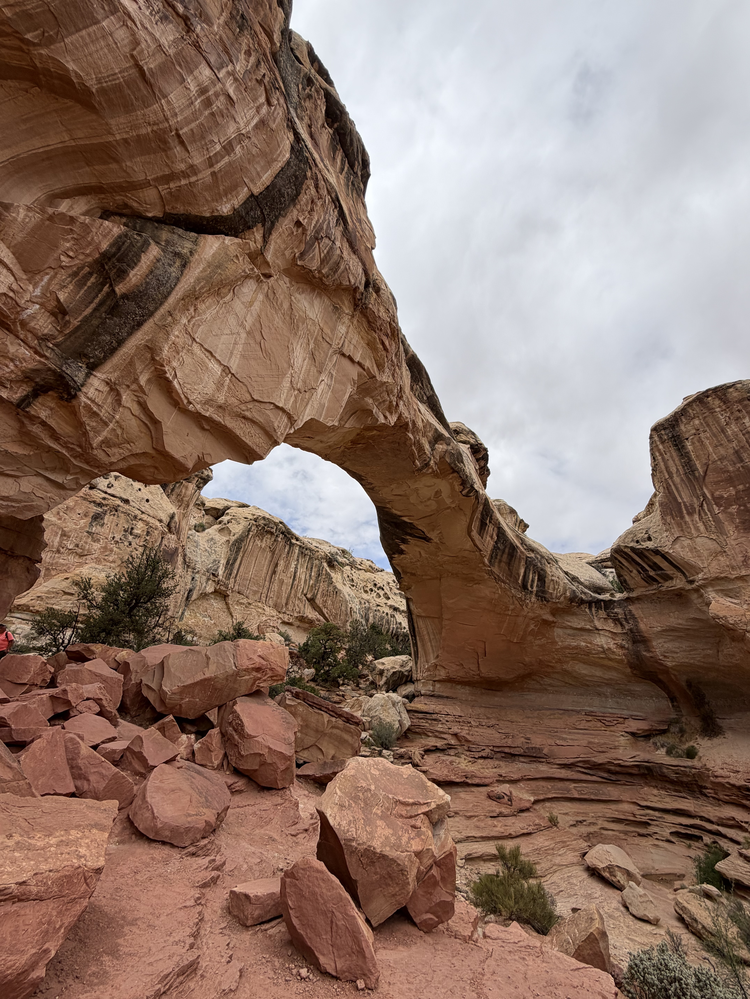
*Capitol Reef・Hickman Bridge* 
 

<iframe src="https://www.google.com/maps/embed?pb=!1m17!1m12!1m3!1d2125.353298854343!2d-111.23151088730062!3d38.290304976910136!2m3!1f0!2f0!3f0!3m2!1i1024!2i768!4f13.1!3m2!1m1!2zMzjCsDE3JzI1LjgiTiAxMTHCsDEzJzQ3LjkiVw!5e0!3m2!1sja!2sjp!4v1784541454015!5m2!1sja!2sjp" width="100%" height="450" style="border:0;" allowfullscreen="" loading="lazy" referrerpolicy="strict-origin-when-cross-origin"></iframe>
 
 
 
帰り道の途中で、インド人の集団？に写真を撮ってと頼まれる。 
雲が多くなってきて、たまにポツポツと雨が降ってくる。 
 
Capitol Reef National Park Visitor Center の駐車場でお手製のサンドイッチを作って、オレンジジュースとともにランチ。 
このスタイルの食事にもすっかり慣れた（笑） 
同じく駐車場に停めたピックアップの荷台で若いアメリカ人の女の子2人がサンドを作って食べている。 
やっぱりアメリカ人ってみんなこういう感じなんだな。 
 

*Capitol Reef・Visitor Center の駐車場で昼食* 
 

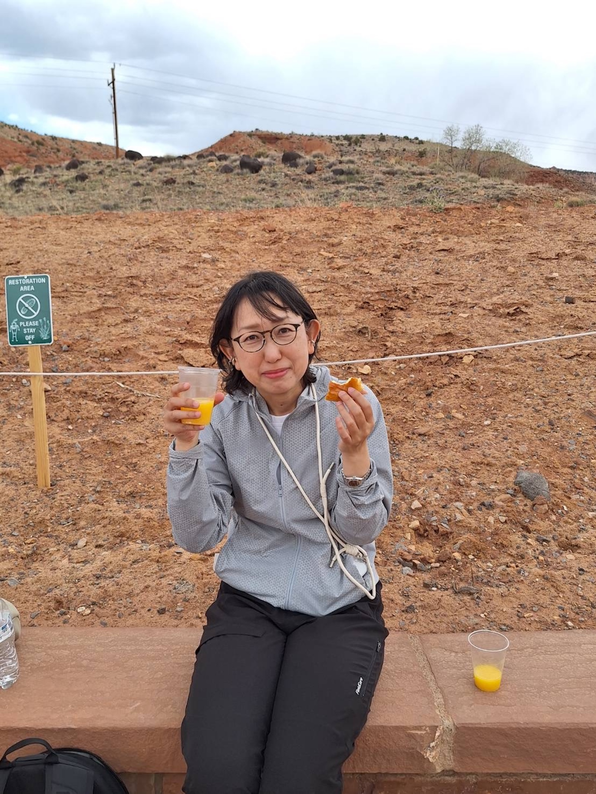
*Capitol Reef・Visitor Center の駐車場で昼* 
 

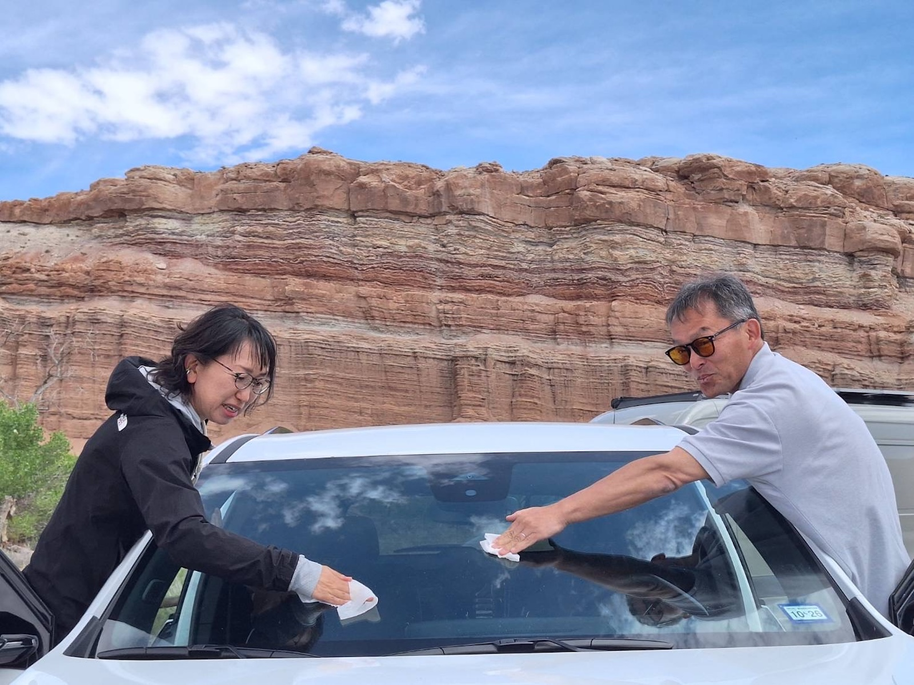
*Capitol Reef・Visitor Center の駐車場で車の窓掃除* 
 

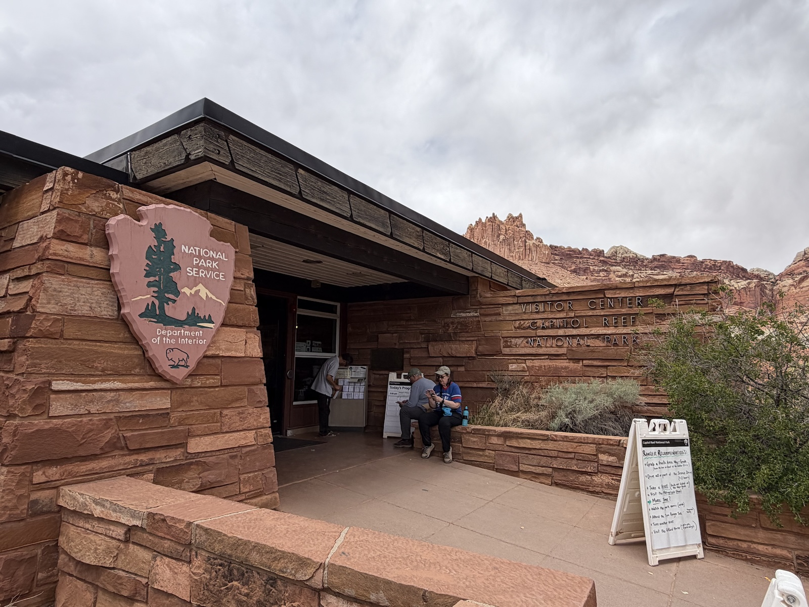
*Capitol Reef・Visitor Center* 
 

<iframe src="https://www.google.com/maps/embed?pb=!1m18!1m12!1m3!1d724.9810715132176!2d-111.26252174910438!3d38.291348327377165!2m3!1f0!2f0!3f0!3m2!1i1024!2i768!4f13.1!3m3!1m2!1s0x874a190985810f23%3A0x952c0c461b16c29d!2z44Kt44Oj44OU44K_44Or44Oq44O844OV5Zu956uL5YWs5ZyS44OT44K444K_44O844K744Oz44K_44O8!5e0!3m2!1sja!2sjp!4v1784541511751!5m2!1sja!2sjp" width="100%" height="450" style="border:0;" allowfullscreen="" loading="lazy" referrerpolicy="strict-origin-when-cross-origin"></iframe>
 
 
 
ビジターセンターでお土産を見て、ここでもステッカーを買う。 
 
Goosenecks Pointで、Dead Horse PointやHorseshoe Bendのような、サルファークリーク（Sulphur Creek）の蛇行のひの字を見る。 
すごいものを見ているはずなんだけど、たくさん見すぎて麻痺して、すごいこともよく分からなくなっている。 
 

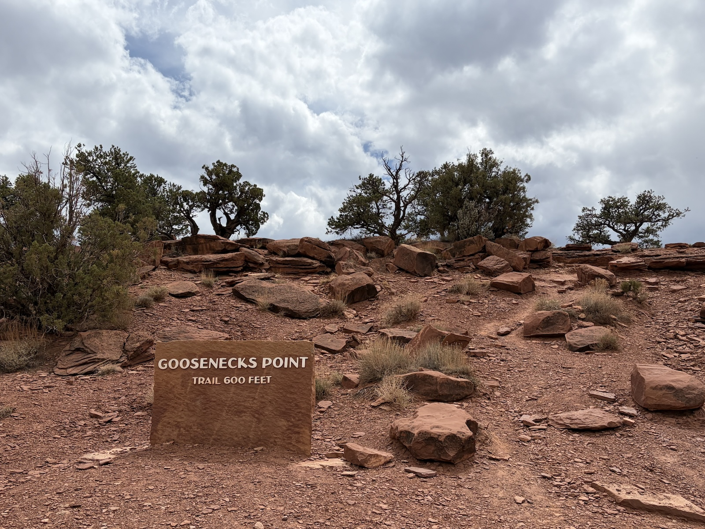
*Goosenecks Point・Goosenecks PointのTrail Head* 
 

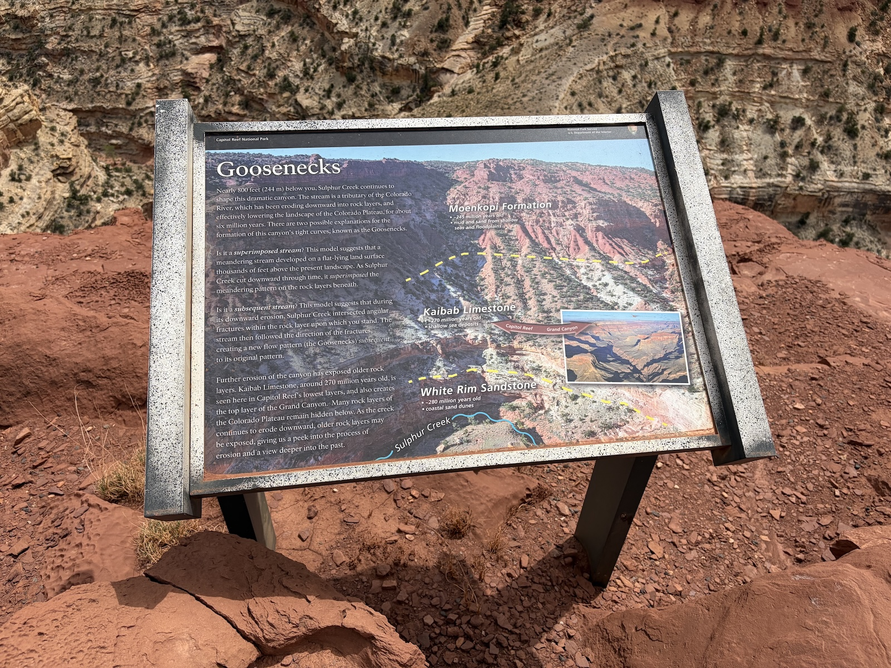
*Goosenecks Point・Goosenecksの案内板* 
 

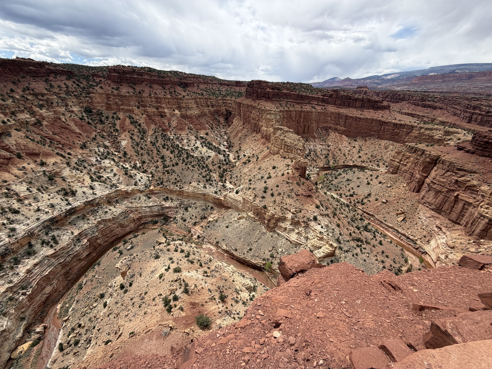
*Goosenecks Point・ひの字* 
 

<iframe src="https://www.google.com/maps/embed?pb=!1m18!1m12!1m3!1d782.7909080518644!2d-111.29894776073843!3d38.29887641670169!2m3!1f0!2f0!3f0!3m2!1i1024!2i768!4f13.1!3m3!1m2!1s0x874a179241f156e9%3A0x7b7ab9a567702af9!2sGoosenecks%20Overlook!5e0!3m2!1sja!2sjp!4v1784541580082!5m2!1sja!2sjp" width="100%" height="450" style="border:0;" allowfullscreen="" loading="lazy" referrerpolicy="strict-origin-when-cross-origin"></iframe>
 
 
 
Goosenecks Pointを出たところにあるChimney Rock。 
View Pointが多すぎて大変。 
 

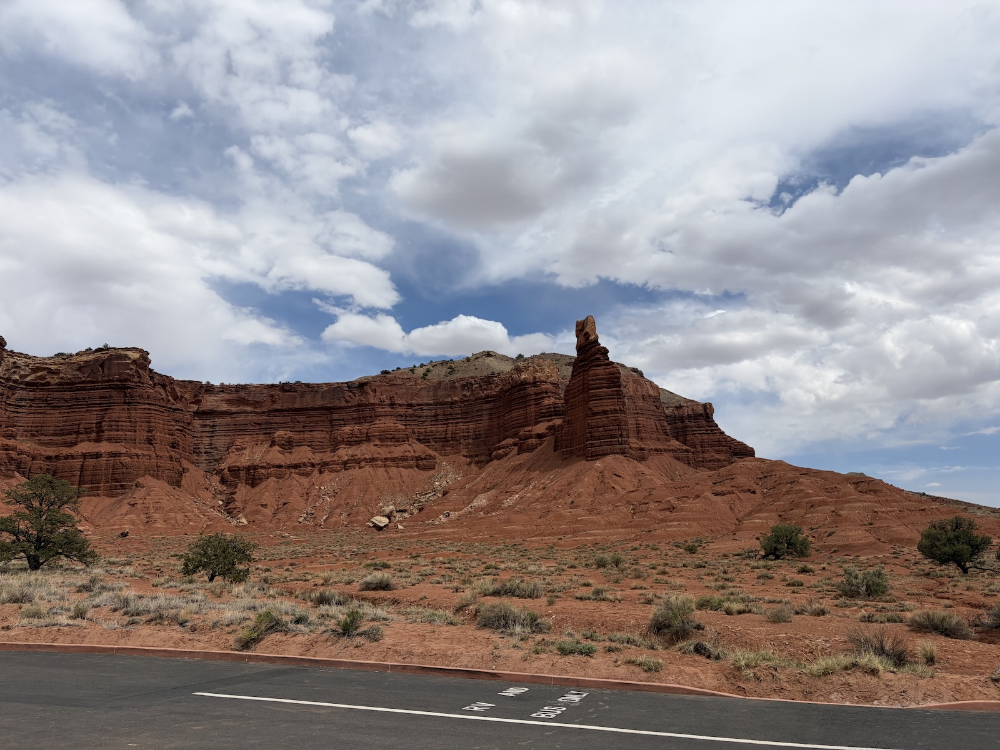
*Chimney Rock・Chimney Rock* 
 

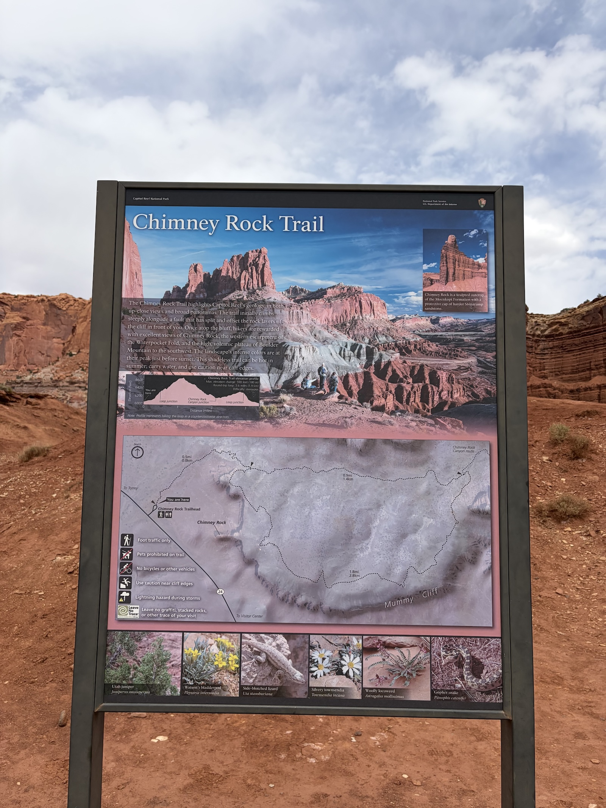
*Chimney Rock・Chimney Rockの案内板* 
 

<iframe src="https://www.google.com/maps/embed?pb=!1m18!1m12!1m3!1d891.2284256851693!2d-111.30414766445696!3d38.315554932866135!2m3!1f0!2f0!3f0!3m2!1i1024!2i768!4f13.1!3m3!1m2!1s0x874a17e6c6506215%3A0xff2d8e7b7b917029!2zMTk3MCBVVC0yNCwgVG9ycmV5LCBVVCA4NDc3NSDjgqLjg6Hjg6rjgqvlkIjooYblm70!5e0!3m2!1sja!2sjp!4v1784541634634!5m2!1sja!2sjp" width="100%" height="450" style="border:0;" allowfullscreen="" loading="lazy" referrerpolicy="strict-origin-when-cross-origin"></iframe>
 
 

## ここからはロングドライブでBryce Canyonへ
Scenic Byway 12を走りながら、いくつかのView Pointに停まる。 
 

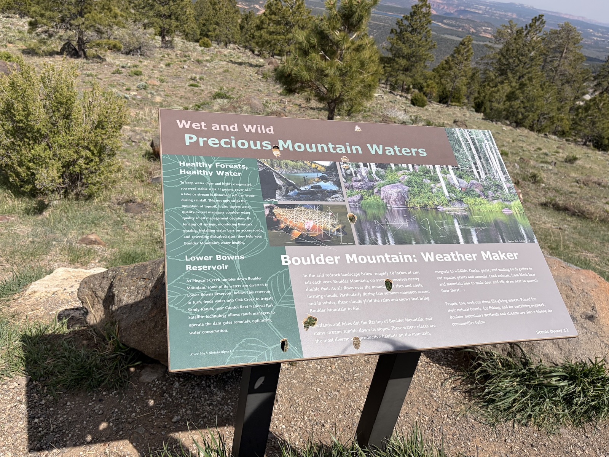
*Scenic Byway 12・View Pointの案内板* 
 

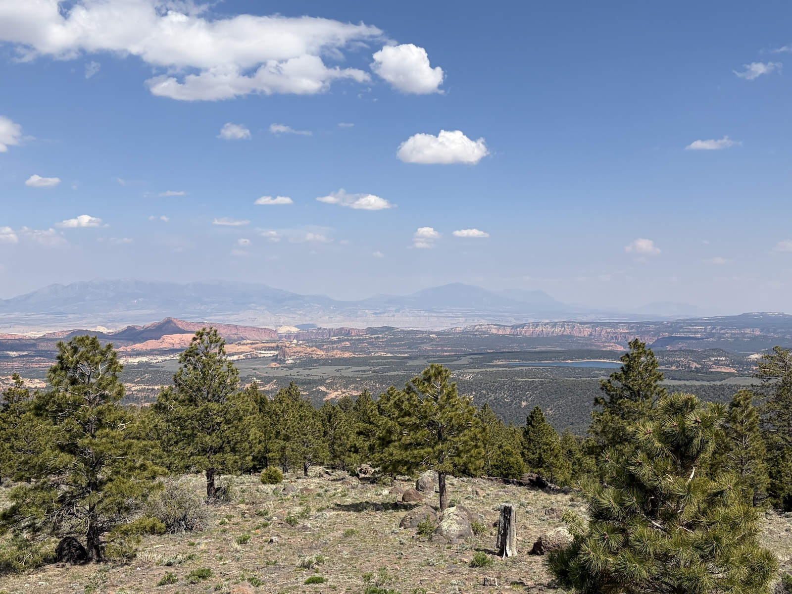
*Scenic Byway 12・だんだん木が増えてきた* 
 

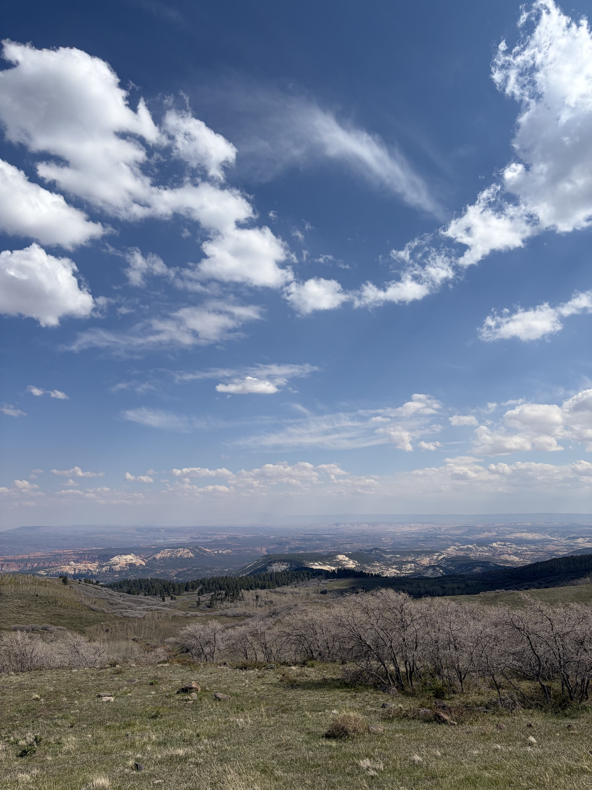
*Scenic Byway 12・View Pointに停まるたびに少しずつ景色が変わる* 
 

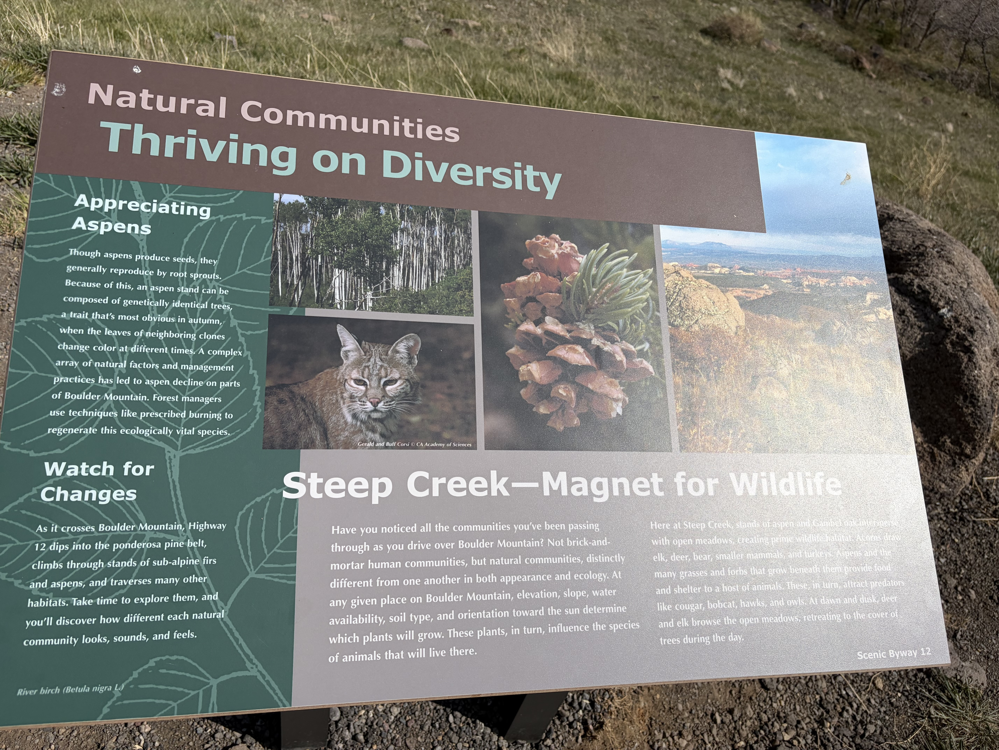
*Scenic Byway 12・View Pointの案内板* 
 

Larb Hollow Overlookを少し過ぎたところに白樺の森が現れる。 
 

<iframe src="https://www.google.com/maps/embed?pb=!1m18!1m12!1m3!1d1913.0081951430323!2d-111.32729093501263!3d38.13187682149291!2m3!1f0!2f0!3f0!3m2!1i1024!2i768!4f13.1!3m3!1m2!1s0x874a0fb69c4664b7%3A0x2d1eb86d027e342e!2z44Op44O844OX44O744Ob44Ot44O844O744Kq44O844OQ44O844Or44OD44Kv!5e0!3m2!1sja!2sjp!4v1784541755552!5m2!1sja!2sjp" width="100%" height="450" style="border:0;" allowfullscreen="" loading="lazy" referrerpolicy="strict-origin-when-cross-origin"></iframe>
 
 
 
白樺だと思っていたら、アスペンの森で、ものすごくキレイな木々。 
 

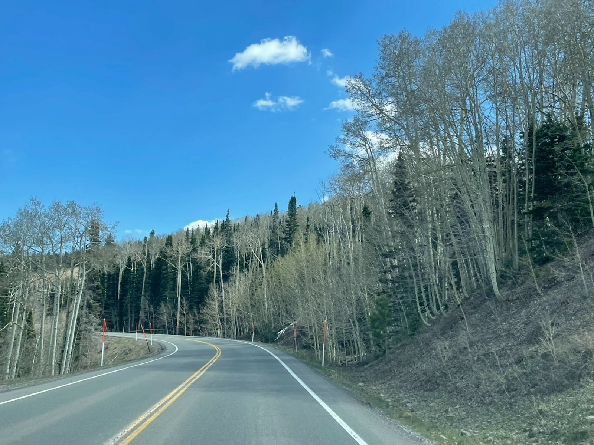
*Scenic Byway 12・アスペンの森* 
 

<iframe src="https://www.google.com/maps/embed?pb=!4v1784541808968!6m8!1m7!1szpVg8d6rB2IdN5QNHR92rQ!2m2!1d38.01834036271205!2d-111.3549015678286!3f323.89893!4f0!5f0.7820865974627469" width="100%" height="450" style="border:0;" allowfullscreen="" loading="lazy" referrerpolicy="strict-origin-when-cross-origin"></iframe>
 
 

--- 

 

**📖 コラム｜アスペン**  
 
アスペン（Aspen）は、ヤマナラシ属（Populus）に属する落葉広葉樹で、北米・ヨーロッパ・アジアの寒冷地に広く分布している。 
 
葉は丸みを帯びたハート形で、細い葉柄がひらひらと風に揺れやすい構造になっている。 
そのため、わずかな風でも葉がざわざわと音を立てることで有名。 
秋には鮮やかな黄金色に紅葉し、特にコロラド州などのロッキー山脈では絶景として知られている。 
 
樹皮は若い木では白〜緑白色でなめらか、老木になると灰色がかってくる。 
白樺に似た雰囲気があるが、別の種。 
 
アスペンの最大の特徴はクローン繁殖すること。 
一本の木が地下の根でつながった巨大なクローン群落を形成する。 
ユタ州の「パンド（Pando）」と呼ばれるアスペン群落は、推定6万本以上が一つの根系でつながっており、地球上で最も重い生物とも言われている（推定約600万kg）。 
 

 

--- 

 
 
アスペンの森を抜けてしばらく行くと、両脇が崖になっていてガードレールが一切ないすごい道が現れる。 
両脇が崖になっていて馬の背みたいな道路だと思っていたら、後から調べたら「The Hogback」というところらしく、馬の背じゃなくて「豚の背」だった（笑） 
なんであれが豚の背なんだろう？ 
 

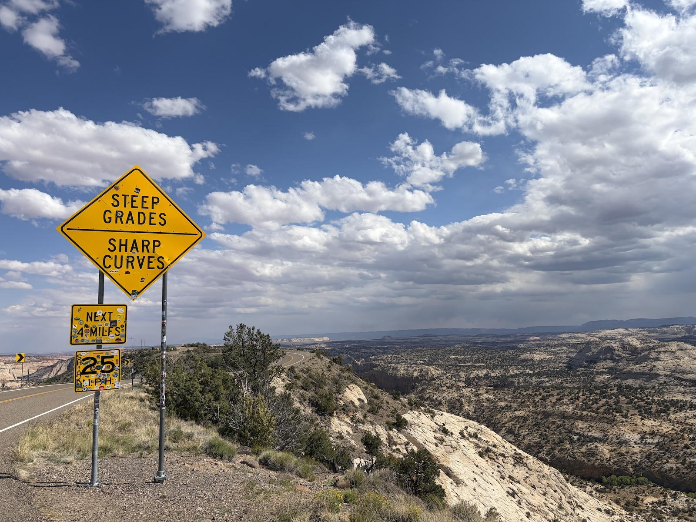
*Scenic Byway 12・The Hogbackの入り口* 
 

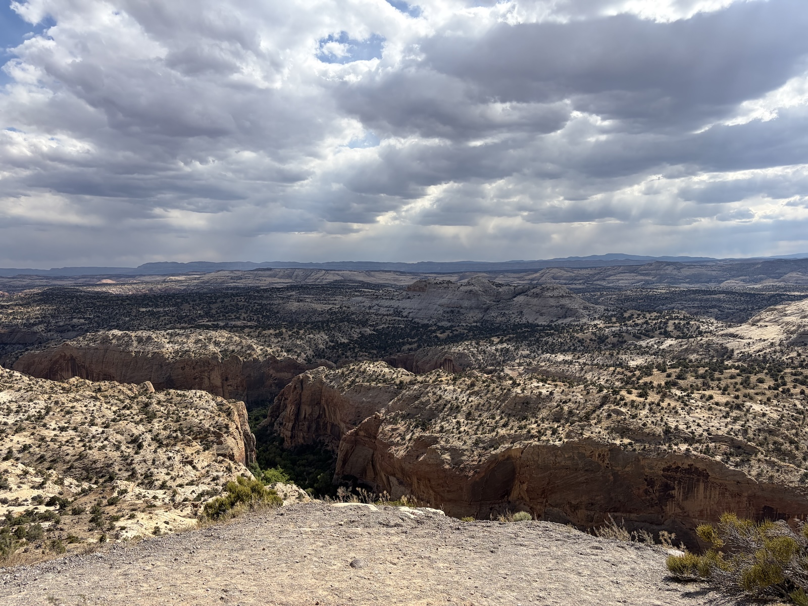
*Scenic Byway 12・The Hogbackとは知らずに手前の駐車場で景色を楽しむ* 
 

*Scenic Byway 12・The Hogbackは両脇が崖！* 
 

<iframe src="https://www.google.com/maps/embed?pb=!1m18!1m12!1m3!1d3629.8516048556876!2d-111.42200477991845!3d37.84025346358345!2m3!1f0!2f0!3f0!3m2!1i1024!2i768!4f13.1!3m3!1m2!1s0x8735f2595fcfbcb9%3A0x7173b6d157248914!2sThe%20Hogback!5e0!3m2!1sja!2sjp!4v1784541863726!5m2!1sja!2sjp" width="100%" height="450" style="border:0;" allowfullscreen="" loading="lazy" referrerpolicy="strict-origin-when-cross-origin"></iframe>
 
 
 
面白くて１往復半して動画を撮影。 
 

<iframe width="315" height="560" src="https://www.youtube.com/embed?v=zZ_uUisgjxA" frameborder="0" allowfullscreen> </iframe>
*Scenic Byway 12・The Hogbackをスミーが動画撮影* 
 

この場所はまったく知らなかったけど、知られたViewPointだったらしい。 
 

--- 

 

**📖 コラム｜The Hogback**  
 
ユタ州のシーニック・バイウェイ12号線（Scenic Byway 12）の中に約4マイル（約6km）にわたる区間があり、「The Hogback」と呼ばれている。 
崖の上を走る道路で、両側が急峻な谷になっており、ガードレールが一切ないまま刃のような稜線の上を走り抜けるという、スリル満点かつ絶景の道。  
 
運転に恐怖を感じる人もいる一方で、スピード制限を守れば問題なく、次々と変わる風景を楽しめる絶景ルートだという声も多くある。 
 
「Hogback（ホグバック）」という名前は、ブタの背中に似た細長い尾根地形に由来する地質学用語で、アメリカ西部の地形にはこの名前がついた場所が各地にある。 
 

 

--- 

 
 
Bryce CanyonのBest Western Plus Ruby’s Innに到着してチェックイン。 
 

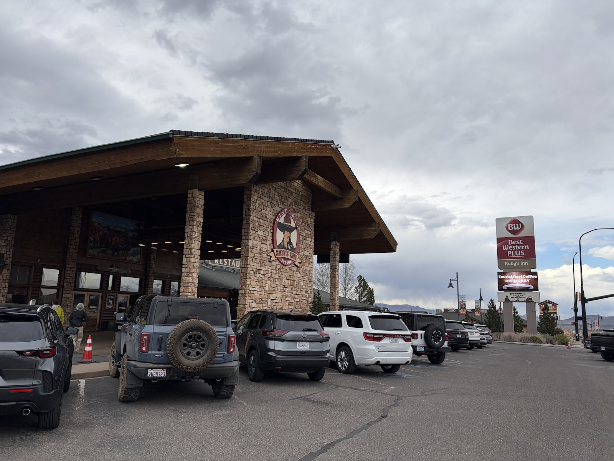
*Bryce Canyon・Best Western Plus Ruby’s Inn* 
 

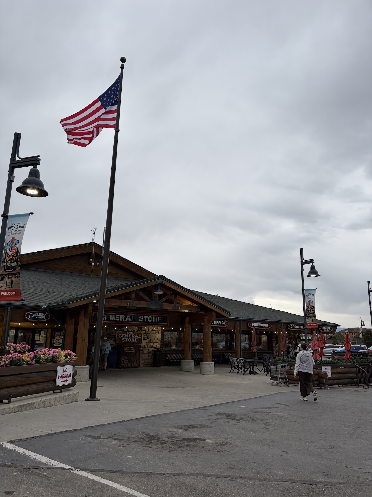
*Bryce Canyon・Best Western Plus Ruby’s Innのジェネラルストア* 
 

ホテルの入口のところに、靴の隙間に入った土や砂をかき出すブラシがあってかなり優秀。 
靴の土や砂を落としたら、本当に結構キレイになる。 
 
コルベットの集団が泊まりにきているようで、敷地内の駐車場には信じられない数のコルベットが停められている。 
 

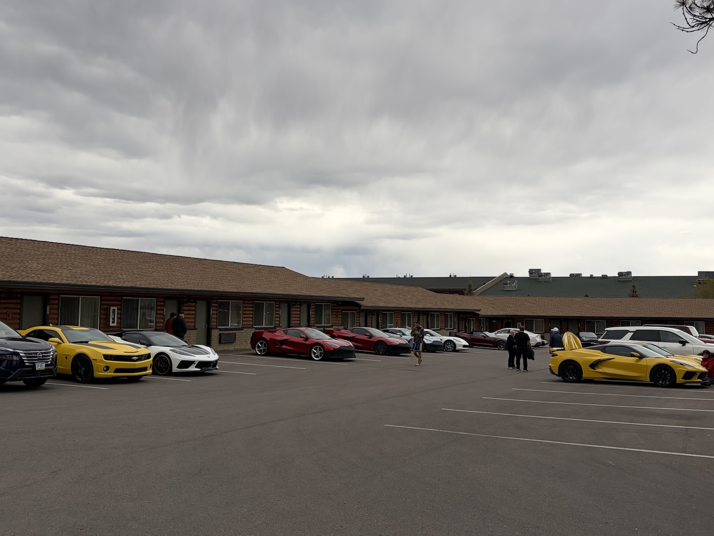
*Bryce Canyon・たくさん停まっているコルベット* 
 

せっかくアメリカに来たのだからステーキは食べよう！ということで、ホテル内のCowboy’s Buffetでステーキを食べる。 
日本人のツアー客がとても多い。 
 
菅野さんと私はテンダーローインステーキのミディアムをいただく。 
とても美味しかったけど、やっぱり高い！ 
 

*Bryce Canyon・Ruby’s Innのホテル内のCowboy’s Buffet* 
 

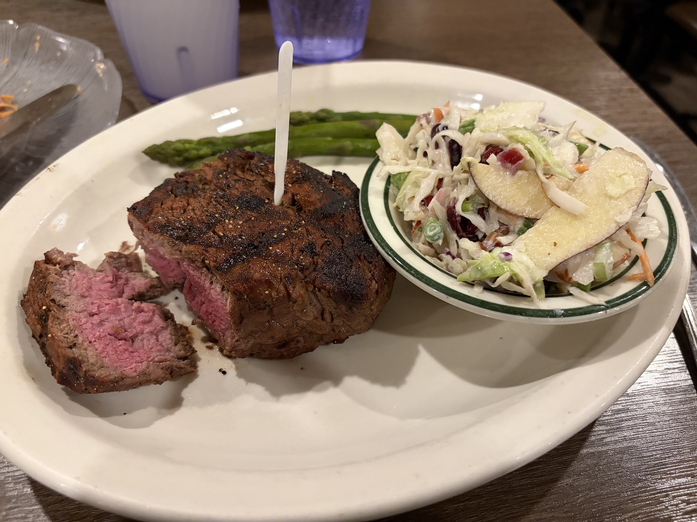
*Bryce Canyon・Cowboy’s Buffetで食べたステーキ* 
 

食事後にホテル内のジェネラルストアで買い物。 
気がついたら外は土砂降り。 
アメリカで雨降らないって言ってたのに。 
 
もう喉が痛くて飴が欠かせない。 
Moabのホテルでもらった飴と似ている飴を探して購入。 
 
菅野さんがAntelope Canyonで買ってくれたキーホルダーと同じキーホルダーが売っていた。 
同じキーホルダーを何カ所かで目にしたけど、Antelope Canyonが一番安かった。 
 
同じキーホルダーのココペリのデザインとオブシディアンの矢尻を買う。 
あとクリスタルのキーホルダーも。 
Sedonaで買うよりも安くていいものがたくさんある。 
 
アメリカに来てからウェットティッシュが必需品で、かなりな枚数のものを日本から持ってきたけど、足りなくなりそうなのでウェットティッシュを買う。 
ものすごい金額でのけぞる。 
数千円（$15.19)！！ 
ウェットティッシュに！ 
 
それでもトイレとか、ないと困るので購入。 
やっぱり日本って安いんだなー。 
Cheap Japan  
住んでいる分には助かるけど、世界目線で見たら日本はやばい。 
日本はとてもいい国だけど、世界の物価から取り残されつつある。 
 
ジェネラルストアを出たら、先ほどの土砂降りよりはマシになってて、傘を持って来てないので、部屋まで走って帰る。 
 
そして今夜も部屋飲み。 
 
少し風邪の症状が悪化。 
上の前歯の間に何かが挟まっているような違和感、実際には何も挟まってないんだけど、なんだろうか…。 
さすがに寝不足と疲労蓄積、さらに風邪症状で辛くなってきた。 
 
 

## 今夜の宿・Best Western Plus Ruby’s Inn
菅野さんと2人部屋 
ロッジ風の２階のお部屋 
前回来た時は池の近くの部屋だったけど、今回は道路側 
 
前回は星がすごくきれいだったのに、今回は土砂降りで残念。 
前回は田角さんが、部屋の鍵を部屋に置いたままロックをかけてしまったと大騒ぎになったな…。 
 
 

<iframe src="https://www.google.com/maps/embed?pb=!1m18!1m12!1m3!1d1778.5130717168443!2d-112.16096293597485!3d37.67302900583598!2m3!1f0!2f0!3f0!3m2!1i1024!2i768!4f13.1!3m3!1m2!1s0x8735661ce9d8cae5%3A0xfa0a23fbc27efcde!2z44OZ44K544OIIOOCpuOCqOOCueOCv-ODsyDjg6vjg5Pjg7zjgrog44Kk44Oz!5e0!3m2!1sja!2sjp!4v1784541983389!5m2!1sja!2sjp" width="100%" height="450" style="border:0;" allowfullscreen="" loading="lazy" referrerpolicy="strict-origin-when-cross-origin"></iframe>
 
 
 
📍 **本日の移動** 
Homewood Suites by Hilton Moab → Hwy 128 Scenic Byway → Sandy Beach → Professor Valley Field Camp周辺 → Dewey Suspension Bridge → Capitol Reef National Park → Hickman Bridge Arch → Capitol Reef National Park Visitor Center → Goosenecks Point → Chimney Rock → Scenic Byway 12 → Larb Hollow Overlook → アスペンの森 → The Hogback → Best Western Plus Ruby's Inn → Cowboy’s Buffet → ジェネラルストア
