#  【グランドサークル】 10日目　 Las Vegas 〜 羽田へ 
###### 2026年5月5日（火）晴れ

## 長かった旅も終わり日本へ
Moabのホテルでもらってきたりんごを部屋で朝食に食べる。 
チェックアウトして、ホテルから目と鼻の先のLas Vegas Car Rental Centerへ。 
 

<iframe src="https://www.google.com/maps/embed?pb=!1m18!1m12!1m3!1d3839.9447120844684!2d-115.16713741509736!3d36.06257607638975!2m3!1f0!2f0!3f0!3m2!1i1024!2i768!4f13.1!3m3!1m2!1s0x80c8cf003bb8784f%3A0x22a04adc9ffb185a!2sLas%20Vegas%20Car%20Rental%20Center!5e0!3m2!1sja!2sjp!4v1784552868383!5m2!1sja!2sjp" width="100%" height="450" style="border:0;" allowfullscreen="" loading="lazy" referrerpolicy="strict-origin-when-cross-origin"></iframe>
 
 
 
車を返却してからシャトルバスでラスベガスの空港へ移動。 
 

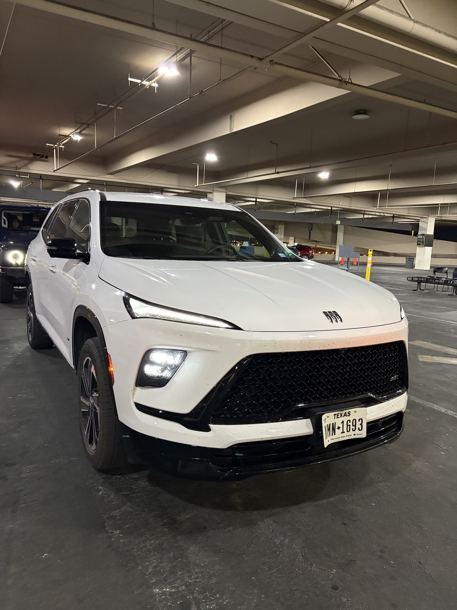
*Las Vegas・この旅を共に過ごした車ともお別れ* 
 

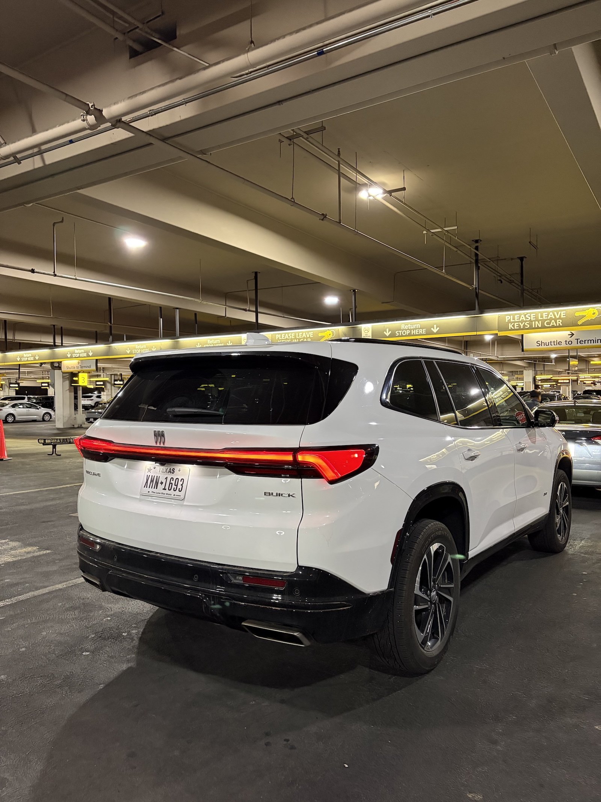
*Las Vegas・旅の友の後ろ姿* 
 

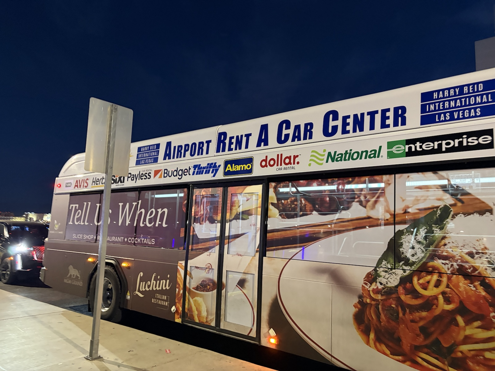
*Las Vegas・レンタカーセンターから送迎バスで空港へ* 
 

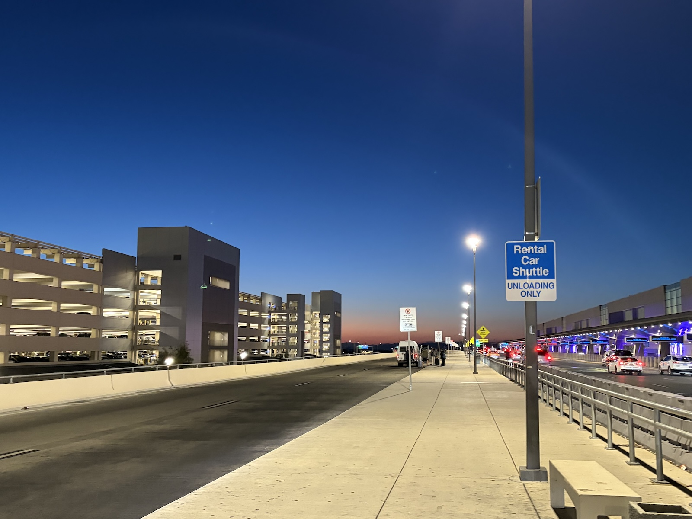
*Las Vegas・空港の夜明けの空が美しい* 
 

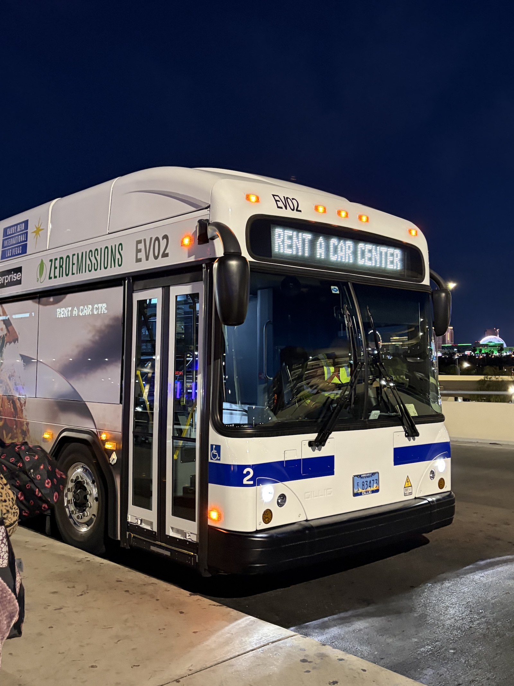
*Las Vegas・送迎バス* 
 

ハリーリード国際空港（Las Vegas）のラウンジで出発までゆっくりする。 
 

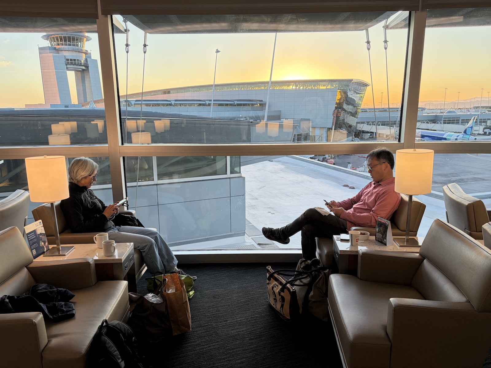
*Las Vegas・ラウンジで* 
 

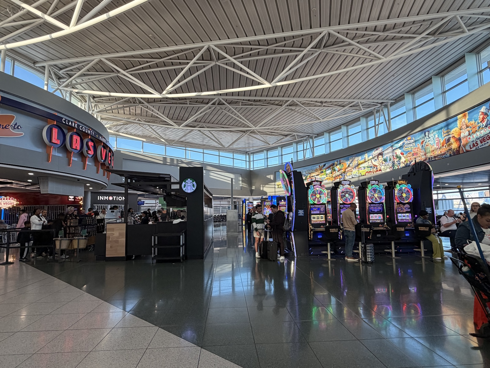
*Las Vegas・Las Vegasともお別れ* 
 

国内線 UA2039で、ロサンゼルス空港へ。 
 
ロサンゼルス国際空港で羽田行きにトランジット。 
こちらもラウンジで出発までゆっくりする。 
 

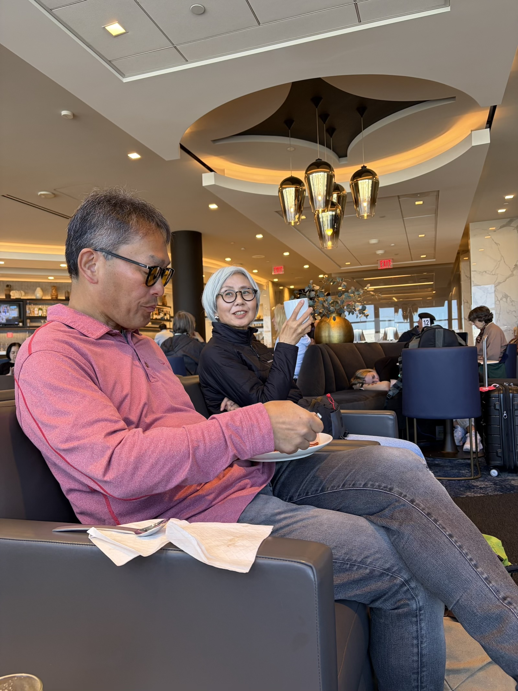
*Los Angeles・Los Angelesの空港ラウンジで軽い朝食* 
 

風邪のせいだと思うけど、とにかく寒い。 
ラウンジ内も空調がしっかり効いてるんだと思うけど、それにしても寒い。 
熱が出てきたかなー。 
 
UA39 羽田行きは、スミーがビジネスクラスを取ってくれた。 
 
セージの葉が粉々にならないように手持ちで入って、コンパートメントにも入れずに、大切に足元に置く。 
 

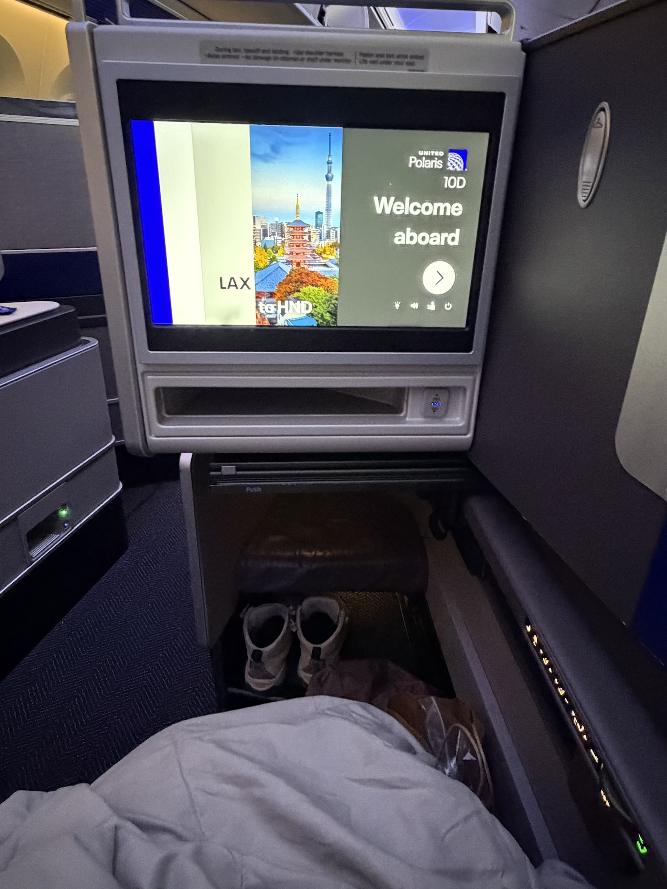
*ビジネスクラス・足が伸ばせるって素敵* 
 

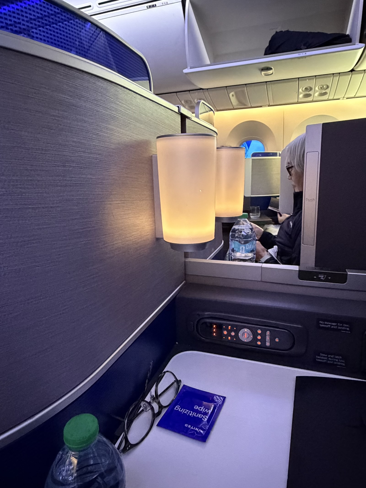
*ビジネスクラス・隣の席は菅野さん* 
 

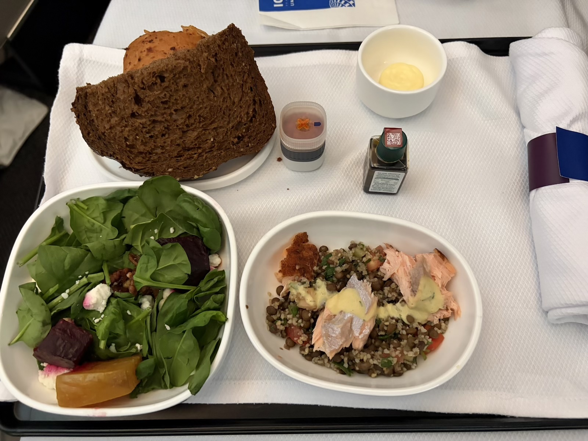
*ビジネスクラス・食事も素敵* 
 

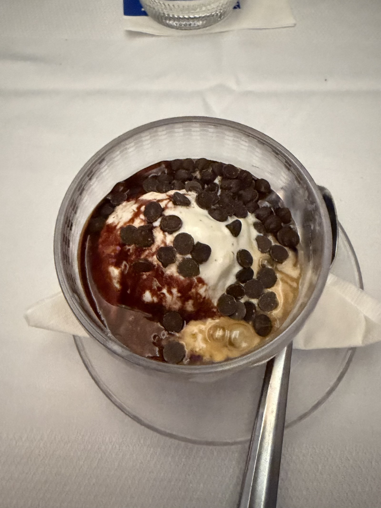
*ビジネスクラス・デザートがちゃんとデザート！* 
 

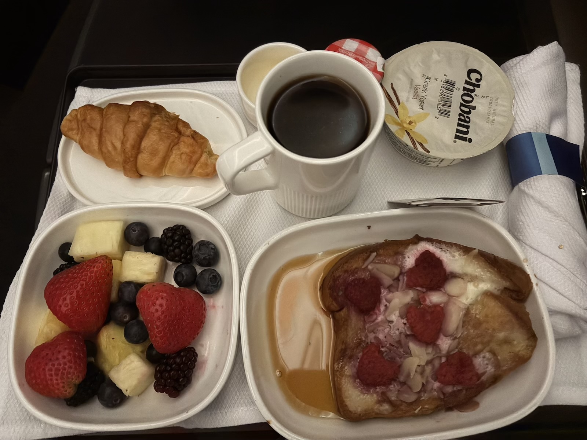
*ビジネスクラス・そして朝食* 
 

風邪の状態が悪化して、とにかく寒い。 
そしてすごく咳が出る。 
周りの皆さんにご迷惑をおかけしてしまった・・・・ 
 
せっかくのビジネスクラスだったのに、あまりの体調の悪さで楽しめずとっても残念。 
 
 

###### 2026年5月6日（水）晴れ

## 無事に帰って来ました
15:05 羽田空港到着。 
セージの葉も問題なく日本国内へ持ち込み。 
 

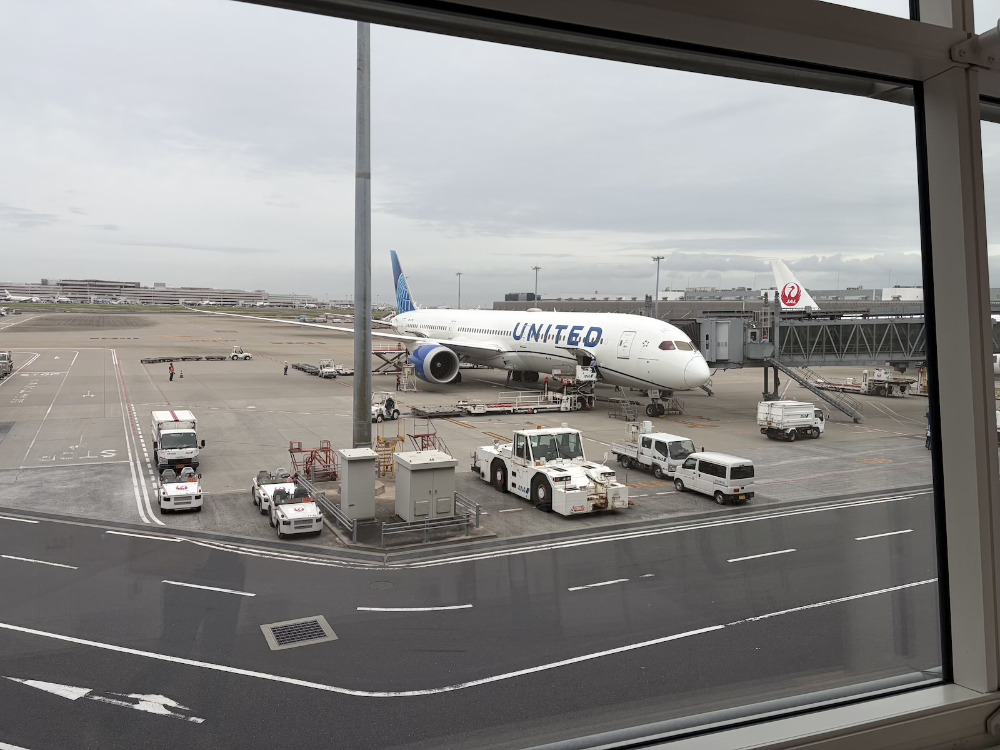
*羽田空港・帰ってきました日本* 
 

とても長いけどあっという間の10日が終わりました。 
 
到底自力では行かれない旅に連れて行ってくれて、スミー本当にありがとう。 
そして一緒に行ってくれた菅野さんもとってもありがとう。 
最後の最後で、ものすごく体調を崩してしまってごめんなさい。 
 
みんな別れを惜しむ間もなく、あっという間に速やかに解散。 
大人だな（笑） 
 
Special Thanks！ スミー＆菅野さん 
 
 
📍 **本日の移動** 
Tru by Hilton Las Vegas Airport → Las Vegas Car Rental Center → ラスベガス → ロサンゼルス → 羽田

