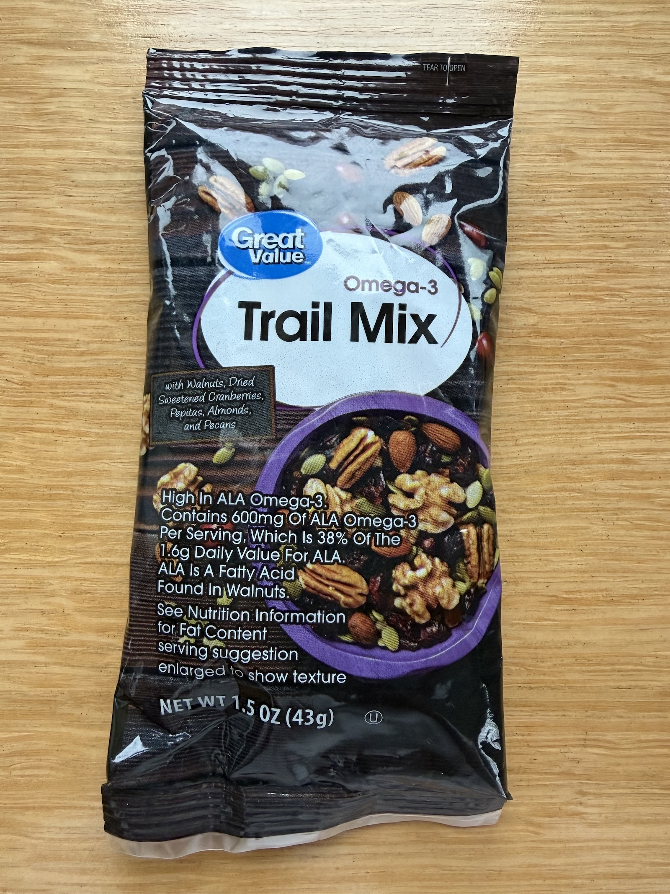
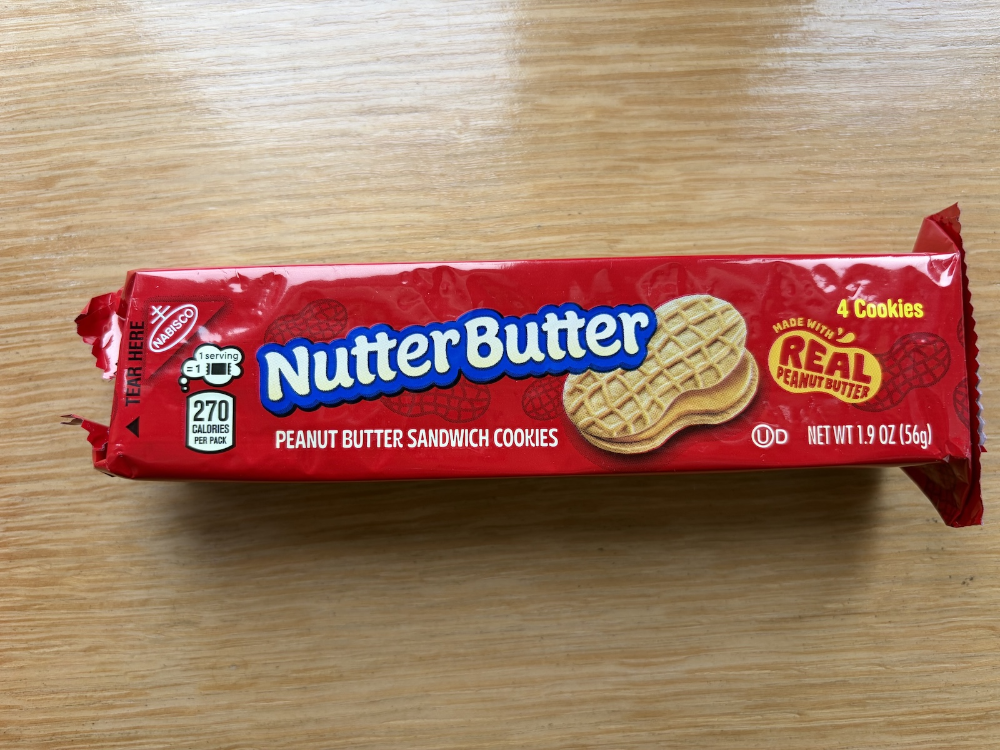
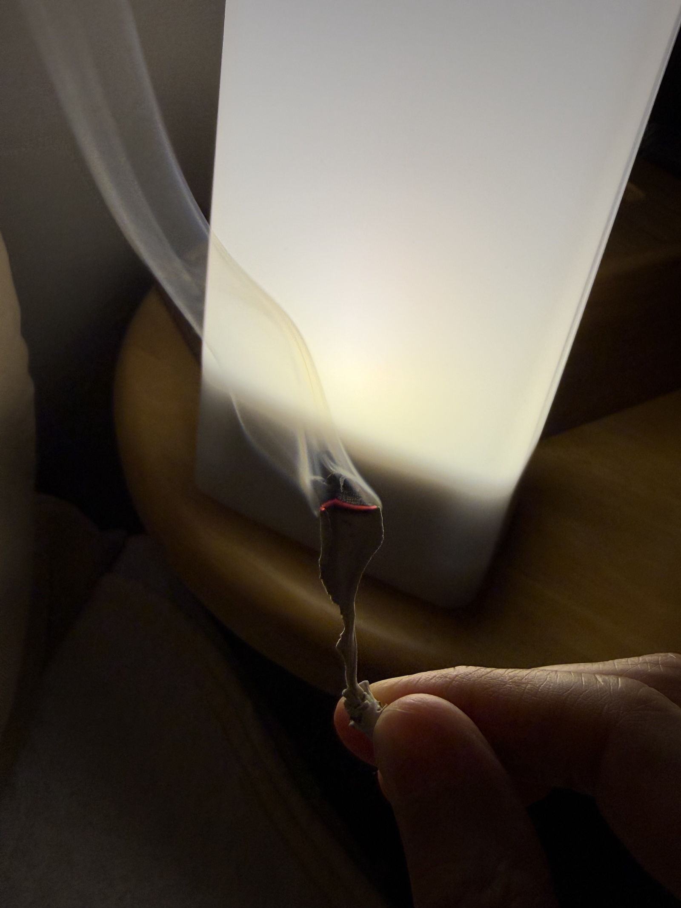
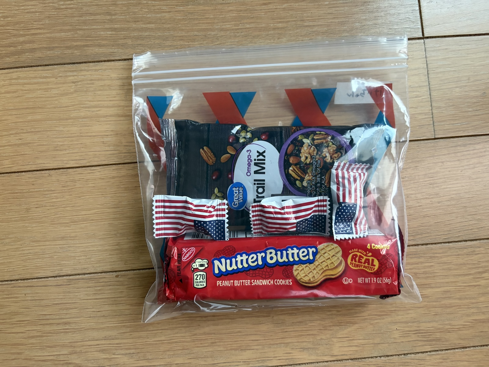
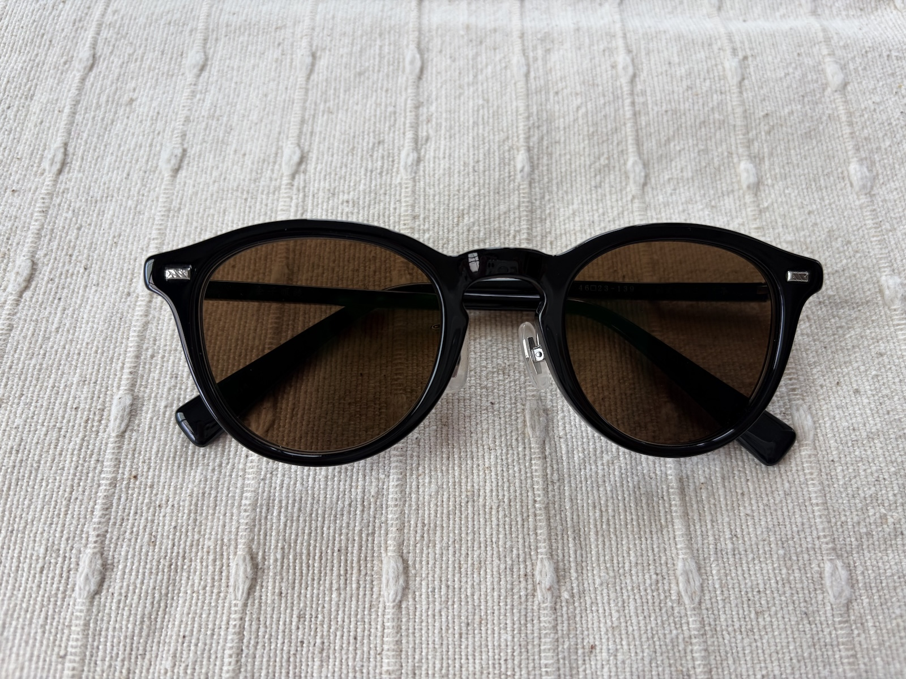

# 【グランドサークル】 旅を終えて　〜後日談

## 咳が悪化
咳がどんどんひどくなり3週間くらい止まらなかった。 
夜も咳で何度も目が覚める。 
後半でいよいよダメだと思って病院へ行ったら、こんな終わりかけで何しに来たの？と言われた。 
 
 

## Claude Codeで経費一覧作成
スミーから預かったレシートを全部写真に撮って、Claude Codeに投げたら、経費一覧をあっという間に作ってくれた。 
 
 

## レンタカー
スミーから連絡があり、レンタカーの請求が来ないと。 
利用履歴も消えてる・・・まさかねぇ。 
もしかしたら請求が来ないかも？ 
そんなことある？ 
神様のプレゼントとしか思えない。 
で、本当に請求来なかったの？ 
後日談の後日談があるかも？ 
 
 

## Trail Mix
あんなに探し回って、重たい思いをして持って帰ったナッツのお土産。 
会社で配ったら、これはコストコで売ってますよね？と言われた… 
後日、コストコへ行って探したけど、見つからず。 
本当にコストコで売ってるの？？？ 
 

*Trail Mix・小分けになったナッツ＆ドライフルーツ* 
 
 

## ピーナッツのお菓子
Walmartで買ったピーナッツのお菓子を友達にあげたら、アメリカでしか売ってないお菓子で、大好き！嬉しい！と、ものすごく喜ばれた。 
それならもっと買ってくればよかった。 
 

*Nutter Butter・ピーナッツバターサンドクッキー* 
 

## アメリカナイズドされた私
アメリカから戻ってきた翌週末、以前に広報で担当していた湘南ベルマーレの関係で、浦和レッズの試合を高橋さんと一緒に埼玉スタジアムまで観に行くことになった。 
 
埼玉スタジアムでは、スタジアムグルメが楽しめるということで、少し早めに集合してスタジアム飯を食べてから試合観戦しようということになり、お昼頃に浦和美園駅集合となった。 
 
とはいえ、たいしたものはないだろうし、食べたいものもないだろうな…とフッと思ったところに、駅ナカにあるパン屋さんを発見。 
これは何か買って、その辺のベンチとかででも食べればいいやと思い立ち、早速、めんたいフランスとサンドイッチを購入。 
 
改札を出て、高橋さんが来る前に食べちゃおう🎵と思っていたら…どこにもベンチはない。 
さて、どうしようか？と思ったけど、改札から出たところの少し広い場所で立ち食い（笑） 
 
だいたいパンを買って、その辺で食べようという発想になった自分に驚く（笑） 
そして、その辺で立ち食いしちゃう自分にも驚く。 
こんなところの感覚だけは、10日間のアメリカ旅行で、しっかり身についてアメリカナイズドされた私。 
 
 

## 歯が割れた
旅行中に歯の違和感を感じて、帰ってきてから歯茎にボコッとしこりの様なものができて腫れて痛くて。 
でも咳が出るから歯医者さんにずっと行かれなくて。 
やっと少し咳がおさまってきたところで歯医者さんに行った。 
 
そしたら歯の、歯茎に埋まってる根元のところが縦に亀裂が入ってて、そこから細菌が入って根元が化膿してると。 
この歯は諦めてください・・・と言われた。 
歯を抜くしかない・・・ 
マジか・・・ 
 
この旅行に、マウスピースを持っていかなかった私が悪い。 
どんだけ食いしばってたんだよ。 
あの歯の違和感はこれだったのか・・・ 
 
そして6月29日に歯を抜いた。 
鼻腔のギリギリ手前まで頭蓋骨もゴリゴリガリガリ削った・・・ 
 
その後は・・・・入れ歯？ ブリッジ？ インプラント？ 
インプラントだと1本 50〜60万円。 
もう１回 アメリカ旅行に行かれる・・・ 
 
 

## セージの葉
アメリカで格安でゲットして、大切に持ち帰ってきた乾燥セージ。 
 
毎晩、寝る前に1枚ずつ、セージを焚いて寝る。
この香りが本当に好き。 
すごくリラックスできる。 
私の前世はアメリカの儀式をやる原住民だったんじゃないかと思う（笑） 
 

*セージの葉・夜寝る前にセージを炊く* 
 

## お土産を配る
お土産の石とお菓子をパッキングしてみんなに配った。 
 

*お菓子セット・小分けにしたお菓子をパックにして配った* 
 

## サングラス
菅野さんに激推しされたので、度付きレンズのサングラスを作った。 
ぜんぜん予備知識もないままにサングラスを作ってしまったので、レンズの色が一番濃い色にしてしまって、サングラスをかける度に母から、ヤクザの姐御と言われ… 
 
通勤にも使いたかったけど、とても怪しすぎて使えず。 
 
友だちが調光レンズのサングラスがいいよとおススメしてくれたので、結局、調光レンズのサングラスを作り直した。 
 

*サングラス・かけると姐御になる* 
 
 
 
 

### [【グランドサークル】　旅の初めに](prologue.html)
### [【グランドサークル】　お土産　〜こんなのを買ってきました](souvenir.html)
