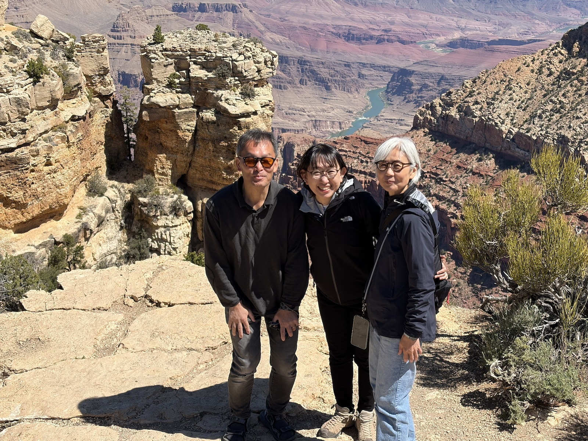

# 【グランドサークル】　旅の初めに

## さぁ、旅に出よう！
毎日の忙しさに追われてあっという間に時間が過ぎ去っていく。 
気がつけば菅野さんは65歳で退職し、スミーも還暦が目の前。 
私も55歳を過ぎて、いろいろ体に不具合が出始めてきている。 
 
そんな時に、グランドサークル完結の旅に出よう！となった。 
前回の9年前は、グランドサークルをすべて回ることなく、半分くらい回ったところで帰ってきた。 
それを今回は全部回ろうという企画。 
 
メンバー全員が歳を重ねて、いつ旅行に行かれなくなるか分からない。 
今できることを、やろうと思った時にやる！
これが鉄則だよね。 
 
菅野さんはGrand Canyonは行ったことがあるけど、Monument Valley には行かれてなくて、行ってみたい。 
そして、70歳を越えたら今みたいに動けなくなるかもしれないということで、このタイミングで行こう！となった。 
 
2025年秋から、スミーがプランを練って、宿やツアーを予約してくれた。 
いつもありがとう。 
 
旅はゴールデンウィークを利用して、2026年4月26日〜2026年5月6日。 
時差があるからわからなくなっちゃうけど、実に11日間！ 
 
出発の約１カ月前、3月30日に、みんなで西新宿のビストロサンクに集まって旅程の読み合わせと注意事項を確認。 
 
さぁ、旅の始まり！ 
 

### [【グランドサークル】　1日目　羽田 〜 Sedonaへ](day01.html)

アズビルノースアメリカ 
Desert Vista 
 

### [【グランドサークル】　2日目　Sedona 〜 Vortex](day02.html)

Devil’s Bridge 
Subway Cave 
Boynton Canyon 
Bell Rock / Courthouse Butte 
Clear Creek Trading Company（儀式屋） 
Chapel of the Holy Cross 
Sedona Airport Scenic Lookout 
Airport Mesa 
 

### [【グランドサークル】　3日目　Sedona 〜 Grand Canyon へ](day03.html)

Cathedral Rock 
Seligman 
Flagstaff 
Grand Canyon / Pima Point 
 

### [【グランドサークル】　4日目　Grand Canyon 〜 Page へ](day04.html)

Grand Canyon / Mather Point 
Yavapai Point 
Duck on a Rock 
Moran Point 
Lipan Point 
Navajo Point 
Desert View Watchtower 
Cameron Trading Post 
Historic Navajo Bridge 
Horseshoe Bend 
 

### [【グランドサークル】　5日目　Page 〜 Monument Valley へ](day05.html)

Lower Antelope Canyon 
Upper Antelope Canyon 
Monument Valley 
 

### [【グランドサークル】　6日目　Monument Valley 〜 Moabへ](day06.html)

Monument Valley Scenic Road Drive 
Forrest Gump Point 
Mexican Hat Rock 
Moki Dugway 
Natural Bridges National Monument 
Blandingにある洗車場 
Grand View Point 
 

### [【グランドサークル】　7日目　Moab 〜 Arches National Park](day07.html) 

Delicate Arch 
Double O Arch 
Navajo Arch 
Partition Arch 
Landscape Arch 
Pine Tree Arch 
Tunnel Arch 
Fiery Furnace Viewpoint Trail 
Double Arch 
The Windows Trail 
North Window Arch 
South Window Arch 
Turret Arch 
Balanced Rock 
Arches National Park Visitor Center 
Dead Horse Point 
City Market 
Moabの街歩き 
Homewood Suites by Hilton Moab 
 

### [【グランドサークル】　8日目　Moab 〜 Bryce Canyon へ](day08.html) 

Homewood Suites by Hilton Moab 
Hwy 128 Scenic Byway 
Sandy Beach 
Professor Valley Field Camp周辺 
Dewey Suspension Bridge 
Capitol Reef National Park 
Hickman Bridge Arch 
Capitol Reef National Park Visitor Center 
Goosenecks Point 
Chimney Rock 
Scenic Byway 12 
Larb Hollow Overlook 
アスペンの森 
The Hogback 
Best Western Plus Ruby's Inn 
Cowboy’s Buffet 
ジェネラルストア 
 

### [【グランドサークル】　9日目　Bryce Canyon 〜 Las Vegas へ](day09.html)

Best Western Plus Ruby’s Inn 
Bryce Canyon Inspiration Point 
Sunset Point Rim Trail 
Navajo Loop Trail 
Bryce Canyon National Park Visitor Center 
Hwy 15 Kanarraville South Rest Area 
Kolob Canyons Visitor Center 
Kolob Canyons 
Taylor Creek Trail 
Fife Cabin 
Larson Cabin 
Las Vegas 
In-n-Out Burger 
Tru by Hilton Las Vegas Airport 
 

### [【グランドサークル】　10日目　Las Vegas 〜 羽田へ](day10.html)

Tru by Hilton Las Vegas Airport 
Las Vegas Car Rental Center 
ラスベガス 
ロサンゼルス 
羽田 
 

### [【グランドサークル】　旅を終えて　〜後日談](souvenior.html)

### [【グランドサークル】　お土産リスト](epilogue.html)

 
 

## 参加メンバー
菅野裕子　67歳 
住友俊保　59歳 
川口敦子　56歳 
 
 

*Grandcircle・参加メンバー* 
 

## これがThe Trail合宿の全容！
Sedona → Route 66 の町 Seligman → Flagstaff → Grand Canyon → Cameron → Historic Navajo Bridge → Horseshoe Bend → Lower Antelope Canyon → Upper Antelope Canyon → Monument Valley → Forrest Gump Point → Mexican Hat Rock → Moki Dugway → Natural Bridges → Blandingで洗車 → Grand View Point → Delicate Arch → Double O Arch → Double Arch → The Windows Trail → Balanced Rock → Dead Horse Point → Hwy 128 Scenic Byway → Dewey Suspension Bridge → Capitol Reef → Goosenecks Point → Chimney Rock → Scenic Byway 12 → アスペンの森 → The Hogback → Bryce Canyon → Hwy 15 Kanarraville South Rest Area → Kolob Canyons → Las Vegas  
 
