# 【グランドサークル】 お土産　〜こんなのを買ってきました

## Trail Mix
お土産に配るのに最適！と思って買い、会社で配ったところ、とても好評。 
ドライフルーツとナッツの組み合わせは、嫌いな人はあまりいないかな？ 
 
あっちこっちのお店を見て回ったけど、Walmartでしか売っていなかった。 
SAFEWAYでは売ってない。 
難点は、重いこと。 
 
現地で箱から出して、小袋の状態で持って帰ってきた。 
 
やっと会社に持って行って配ったら
「これコストコで売ってますよね？」と言われてガックリ。 
後日、コストコへ行って探して見たけど見つからず。 
 

*Trail Mix・小分け版* 
 
 

## Trail Mix その2
ドライフルーツとナッツに加えてM&Mのチョコ入り。 
かなりなボリュームパック。 
美味しいけど、かなりなカロリーな気がする。 
 
こちらも強烈に重たいので、お土産には不向き。 
これもWalmartで購入。 
 

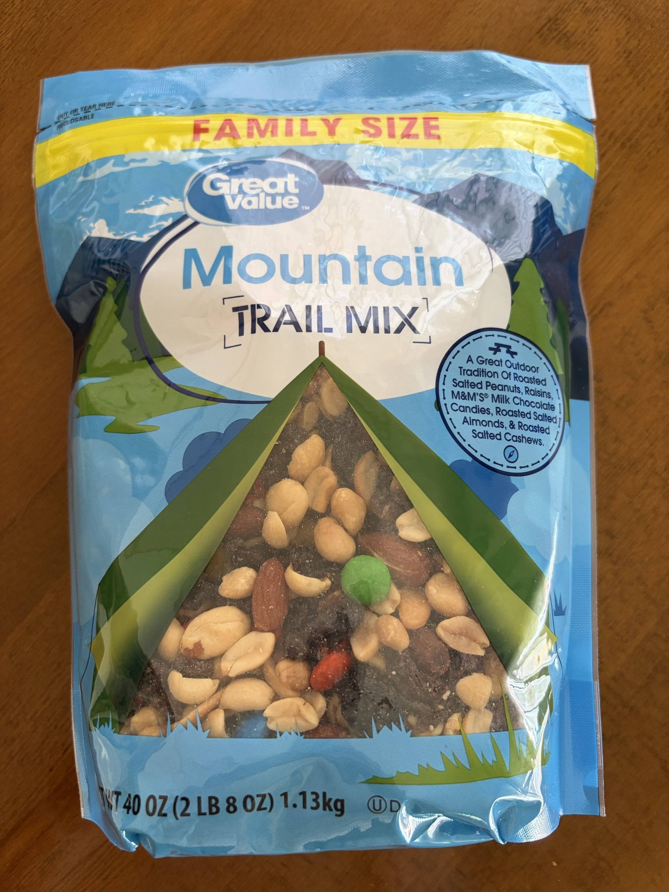
*Trail Mix・巨大パックで激重い* 
 
 

## ピーナッツバターサンドクッキー
こちらも配るのに最適と思ってWalmartで購入。 
ピーナッツバターが、甘いだけじゃなくて、塩っ気があるのがまたいい感じ。 
 
友だちに配ったら、これは大好きなお菓子なんだけど、アメリカでしか手に入らないの！ 
アメリカに行ったら、必ず買ってくる！ 
と大喜びされた。 
 
そうなの？そうなの？ 
これなら軽いし、知っていたらもっとたくさん買ってきたのにー！ 
残念。 
 

*Nutter Butter・ピーナッツバターサンドクッキー* 
 

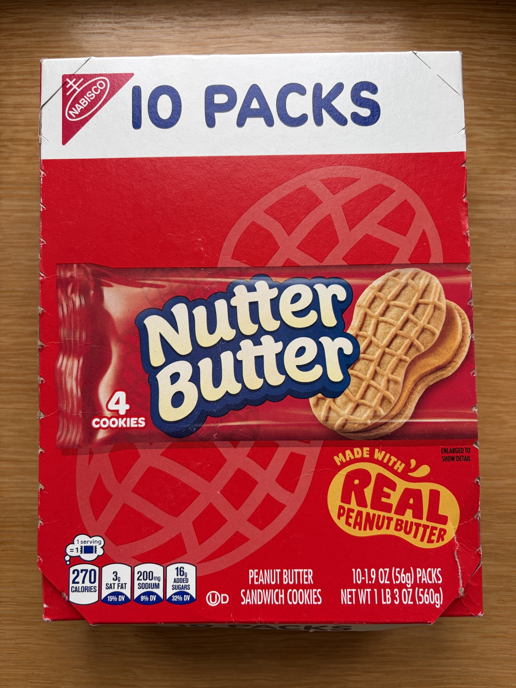
*Nutter Butter・今回はお土産用に箱買い* 
 
 

## スニッカーズ
スニッカーズなんて日本でもいくらでも買えるけど、やっぱり本場のスニッカーズよ。 
甘い〜。 
大きいのは自分用（笑） 
 

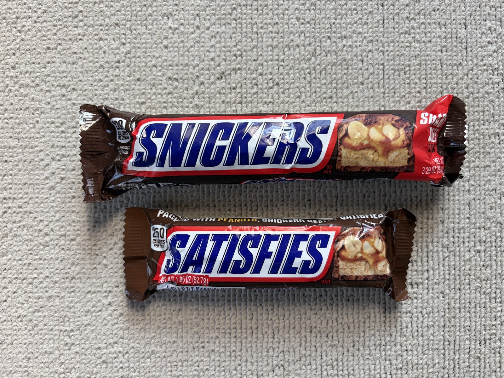
*SNICKERS・大きいのと小さいの* 
 
 

## Nutella
私は食べたことがなかったのだけど、菅野さんが美味しいというので買って見た。 
こちらも軽いので箱買いで、みんなに配ろうと思う。 
こちらも甘い〜。 
 
近所のイトーヨーカドーに売ってた（笑）
 

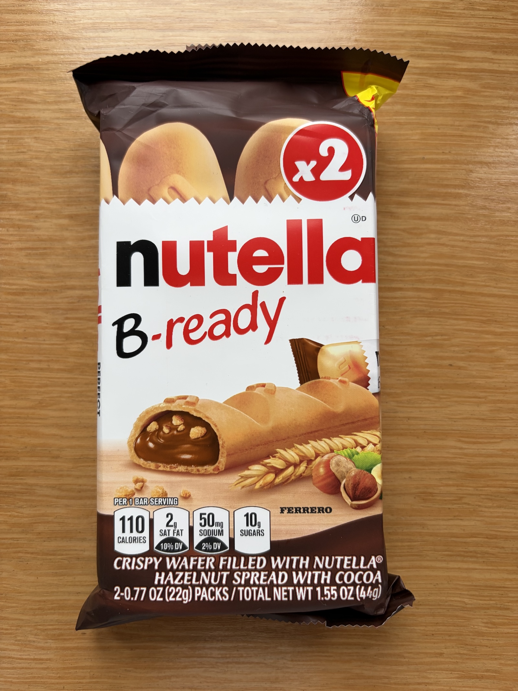
*Nutella・中身はチョコとナッツ* 
 
 

## いかにもアメリカな飴
Moabでの宿泊先 Homewood Suites by Hilton Moabのフロント前に置かれた大きな瓶にたくさん詰め込まれていた飴。 
 
宿泊者は、無料でもらえる。 
喉が痛くて、飴が売ってなかったので、本当にこの飴に助けられた。 
 
このパッケージが、いかにも「The America」な感じで、お土産にも使える！と思って、たくさんいただいてきた！ 
 

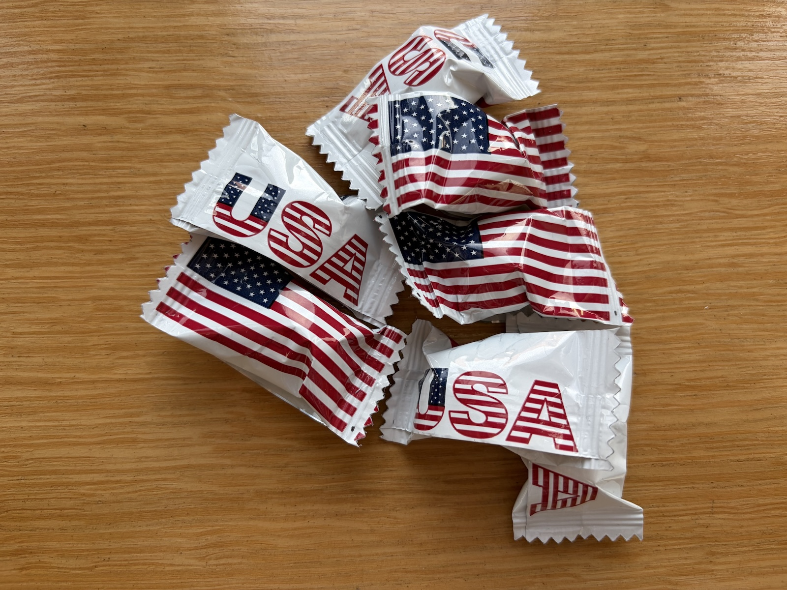
*アメリカンな飴・原価ゼロ* 
 
 

## ホテルでもらったポップコーン
旅行最後の夜、Las Vegas で泊まったTru by Hilton Las Vegas Airportにチェックインした際に、1人1個ずつもらったポップコーン。 
 
In-n-Out Burgerで食べたバーガーセットで、かなりお腹いっぱいで食べられない。 
 
お土産でぎゅうぎゅう詰めのスーツケースの中で潰れないように配置して持って帰る。 
 

*Smartfood・チーズ味のポップコーン* 
 
 

## パワーストーンたち
Sedonaといえば、やっぱり石でしょう！！
ということで、友だちにどんなこと叶えたい？と聞きまくって、お土産のパワーストーンをどれにしようか散々考えた末に購入したのがこちら。 
 
Sedonaは、スピリチュアルな町、石もたくさん採れてパワーストーンの聖地的な印象があるけど、とにかくお土産用の高い、そしてあまり品質の良くない石しか売ってなかったのが本当に残念。 
 
9年前に来た時の方が、まだあった気がする。 
石といえば、SedonaかTucsonと思っていたけど、Tucsonの方があるのかな？ 
それとも私が知らないだけで、通が調達するお店がどこかにあるのかな？ 
 
Sedonaでの石の購入を諦めて、どうしようかな〜と思っていたところにFlagstaffで、いい石屋さんを発見した。 
意味でに見たことのないストロベリーオブシディアンという石も見つけたのでGetして帰ってきた。 
 
今回の戦利品 
- シトリン 
- クリスタル 
- タイガーアイ 
- ストロベリーオブシディアン 
- フローライト 
- ルチルクォーツ 
 

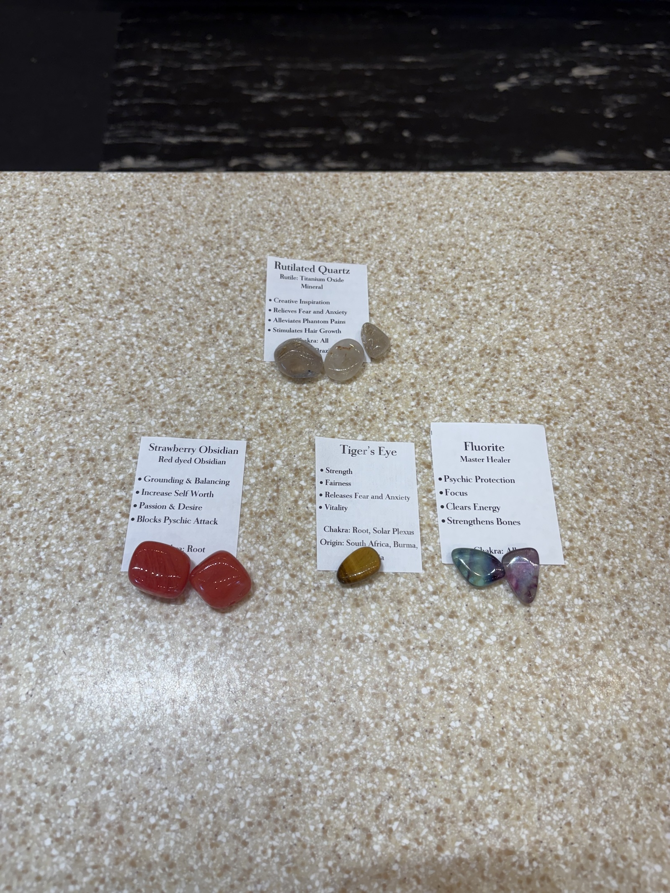
*パワーストーン・石の意味の説明書もつけてくれた* 
 

Bryce CanyonのBest Western Plus Ruby’s Innの中にあるゼネラルストアが意外に穴場。 
お手頃価格の石がたくさん売っている。 
 
9年前にはSedonaの儀式屋でものすごく安くたくさん売っていたオブシディアンの矢尻も、ここにはたくさん売っていた。 
 
オブシディアンの効果は鏡面効果で悪いものを跳ね返して寄せ付けないという魔除けの作用があって、それを矢尻に使うってすごい理にかなってる！さすが儀式！と9年前にすごく感心したのよね。 
 
Bryce CanyonのBest Western Plus Ruby’s Innの中にあるゼネラルストアでは、こちらをゲット。 
 

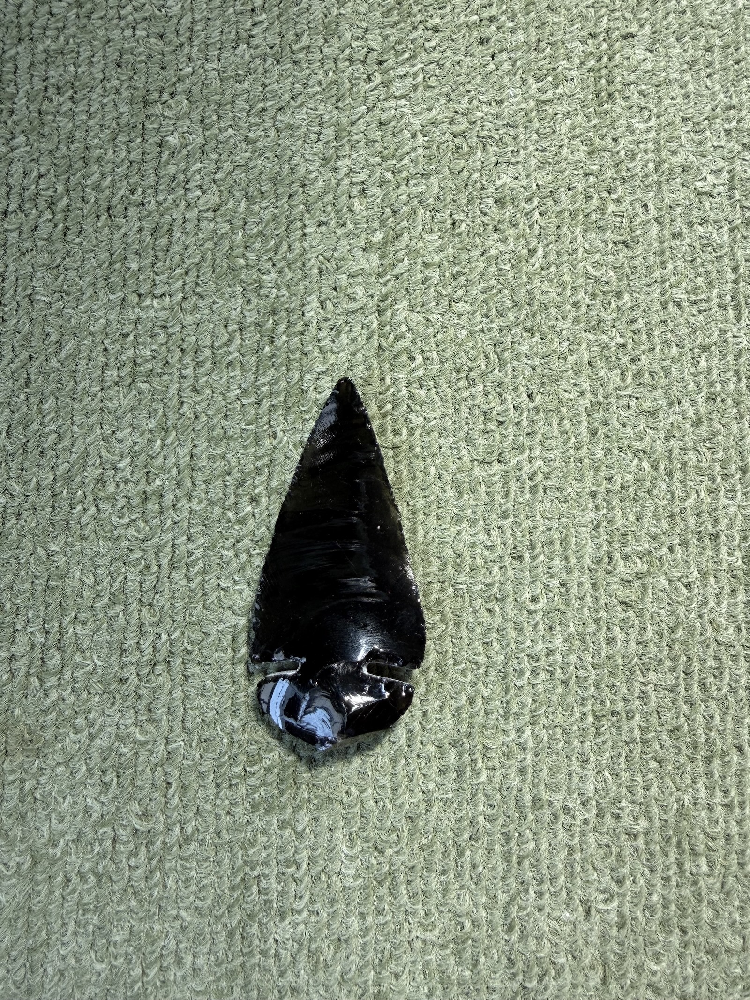
*パワーストーン・オブシディアンの矢尻* 
 

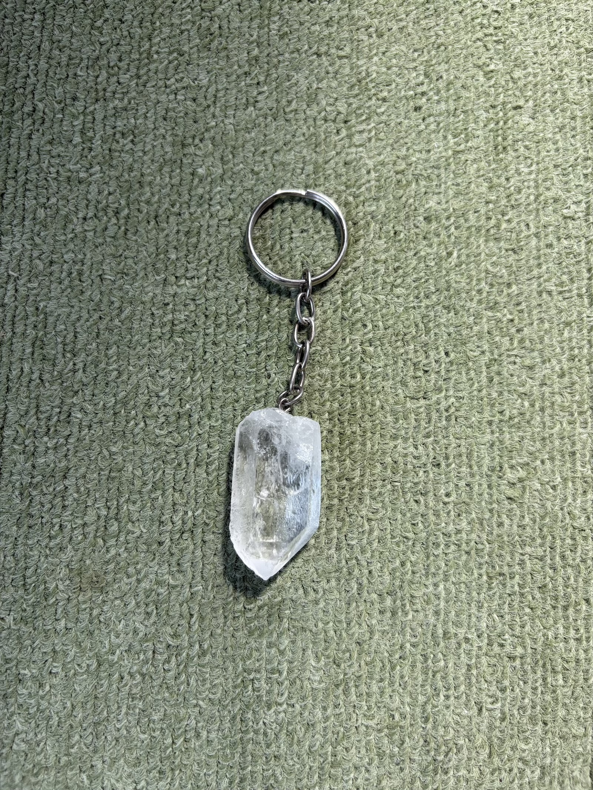
*パワーストーン・クリスタルのキーホルダー* 
 
 

## キーホルダー
菅野さんが、Lower Antelope Canyon で買ってくれたキーホルダー。 
トカゲがなんともかわいい。 
 
このキーホルダーは、ビジターセンターとか、いろんなお店で売っていて、たまに絵柄が違うものも売っている。 
 
Bryce CanyonのBest Western Plus Ruby’s Innの中にあるゼネラルストアでも売っていて、ここにはココペリの絵柄があったので買ってみる。 
でも、Lower Antelope Canyonのお土産物屋さんが一番安かった。 
 
とにかくBryce CanyonのBest Western Plus Ruby’s Innの中にあるゼネラルストアが、品物も豊富で素晴らしい！！ 
 

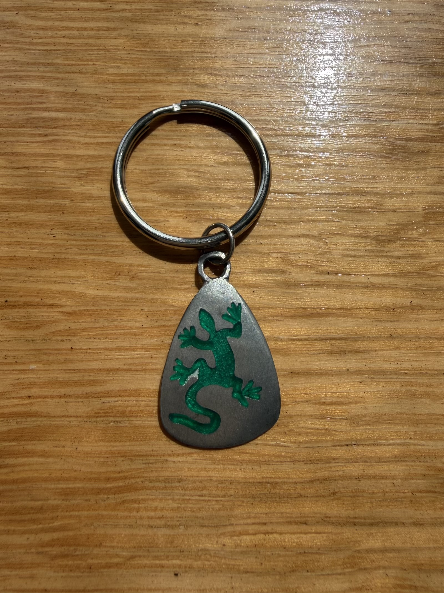
*キーホルダー・菅野さんが買ってくれたトカゲ* 
 

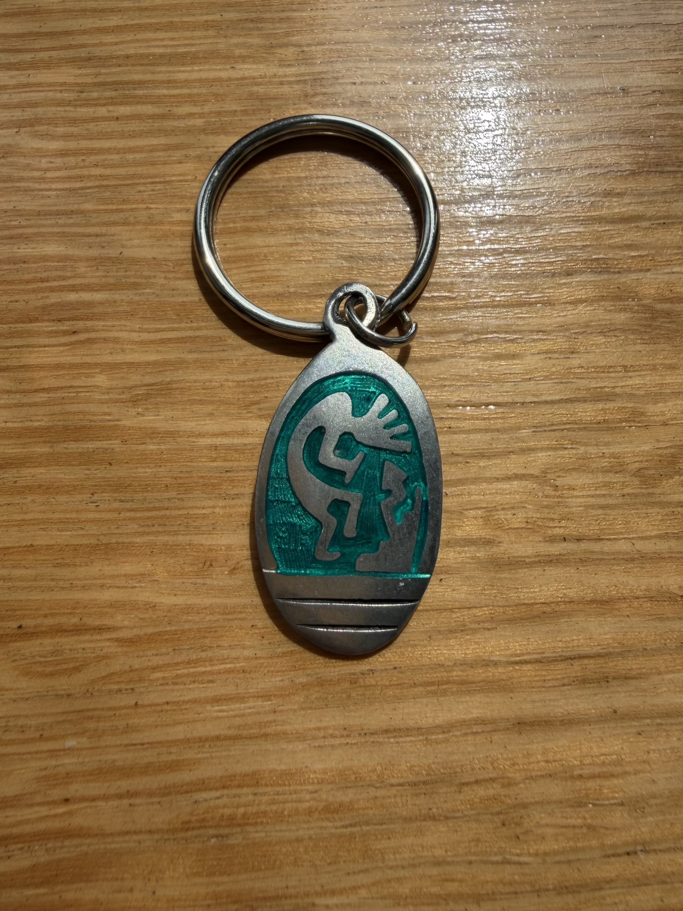
*キーホルダー・自分で買ったココペリ* 
 

Capitol Reefで買った木のキーホルダー。 
 

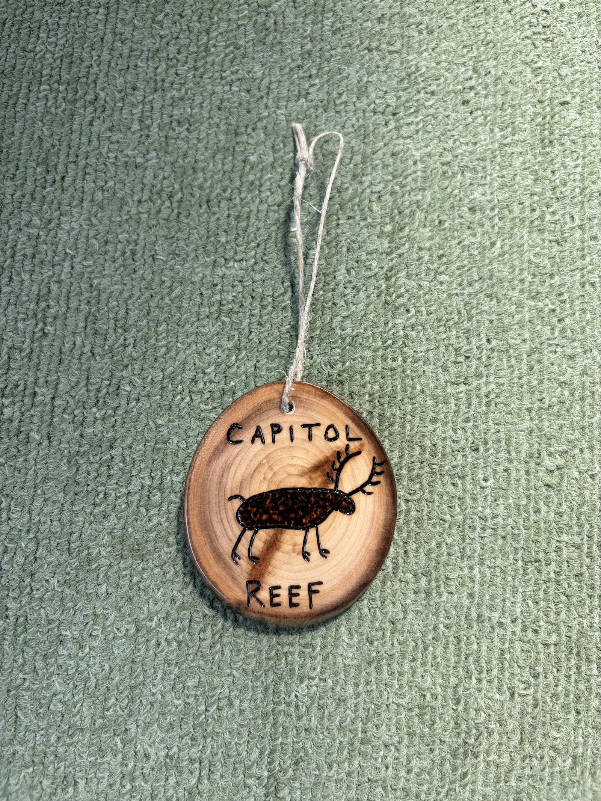
*キーホルダー・Capitol Reefの木のキーホルダー* 
 
 

## 乾燥セージ
Sedonaの儀式屋でディスカウントで買ってきた乾燥セージ。 
 
小さい方は日本で買ったもので、１袋3,000円くらいした。 
大きい方はSedonaの儀式屋で買ったもので、$30（日本円 当時のレートで4,800円くらい）。 
持ち運び代はかかってるけど、さすがに安い！！ 
苦労して持って帰ってきた甲斐があった。 
 

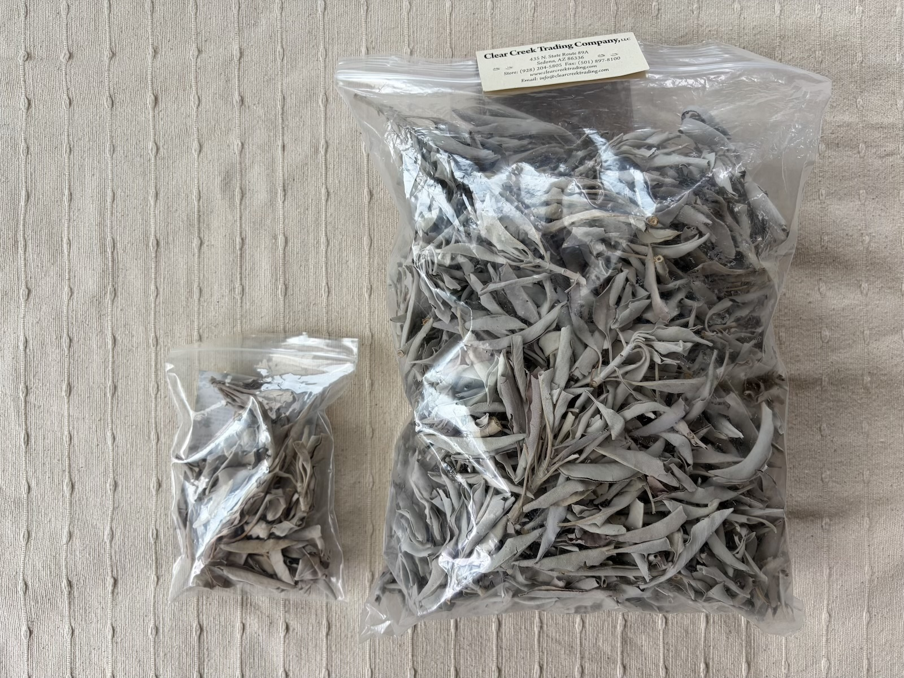
*乾燥セージ・日本で買ったもの（小）とアメリカで買ったもの（大）* 
 
 

## ステッカー
各National Parkで買ったステッカーたち。 
 

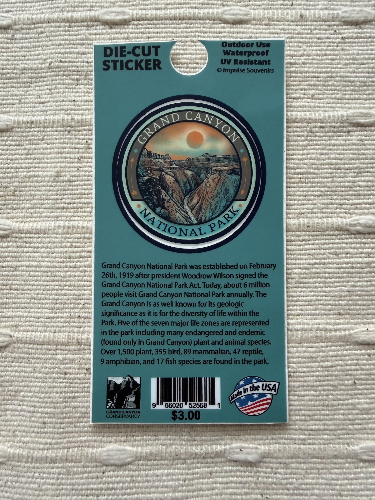
*ステッカー・Grand Canyon* 
 

*ステッカー・Arches* 
 

*ステッカー・Capitol Reef* 
 

*ステッカー・Bryce Canyon* 
 

*ステッカー・Bryce Canyon* 
 

*ステッカー・Zion* 
 
 
 
 

### [【グランドサークル】　旅の初めに](prologue.html)
### [【グランドサークル】　旅を終えて　〜後日談](epilogue.html)
